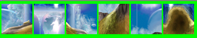
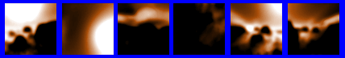
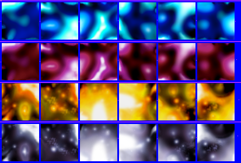
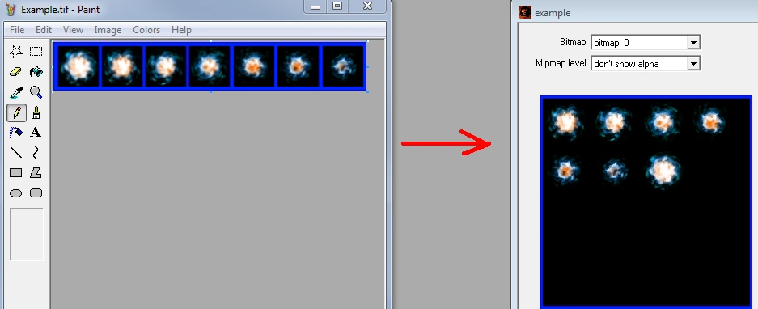
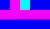
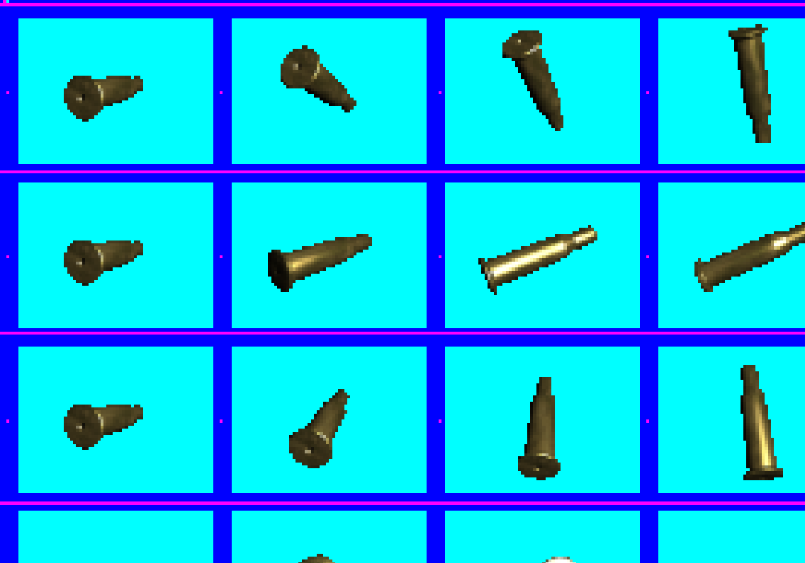
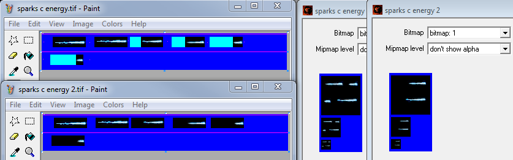

Bitmaps are used for visuals that need textures or sprites like environments, objects, effects, menus, etc.

# Basics
To store textures and images in maps we use bitmap tags. Bitmap tags on their simplest are compiled from a `.tif` file in your data directory.

## Tool Commands
```
tool bitmap <source-file>
```
This command is to import a single `.tif` file from your data folder and convert it into a bitmap the respective tags folder.

Example: You have a file named `bar.tif` in your data folder under `data\foo\bitmaps`

The tool command you would use would be:
```
tool bitmap "foo\bar\bitmaps\bar"
```
That would output the file `tags\foo\bitmaps\bar.bitmap`

```
tool bitmaps <source-folder>
```
This command is to import all `.tif` files in a data folder into the respective tags folder.

Example: You have `foo.tif` and `bar.tif` under `data\example\bitmaps`

The tool command you would use would be:
```
tool bitmaps "example\bitmaps"
```
That would output `.bitmap` versions of these files in the respective tags folder under `example\bitmaps`

# Type
The bitmap type drop down box is used to tell tool how to process the image and what rules to apply.
- **2D Textures**: A flat 2D texture. Mainly used for environments, objects. Also used for huds and effects.
- **3D Textures**: A set of texture slices that when combined forms a texture cube. Used in the shader_transparent_plasma tag type.
- **Cube maps**: A set of 6 textures that combines into a cube. Used for simulating reflections in shaders.
- **Sprites**: A set of textures that have multiple sprites fitted on them. Used for effects and huds.
- **Interface bitmaps**: Textures that don't have to follow the rule of needing to be power-of-two. Should only be used for menus.

# Format
The format of the bitmap determines what way it will be stored, how big the bitmap file ends up being in a map file and how it ends up looking.

## Compressed with color-key transparency
The smallest format the game supports, it's about 12.5% of the size in memory as a 32-bit bitmap. It uses DXT1 as an internal compression format. This means that for every 4x4 grid of pixels it picks two colors to store and at runtime these two colors are interpolated with two more colors. This works well for most textures, except normal maps which can end up making shaders look blocky because of the delicacy of the data stored in them.

This format does not support alphas and transparency very well. The alpha for each pixel can only be either 100% (white) or 0% (black). It also makes the colors on the texture black when the alpha is 0%.

## Compressed with explicit alpha
At 25% the size of an equally sized 32-bit bitmap this format is mostly the same as color-key, with the only difference being that the image can now store an alpha. The internal format is DXT3 which means that the alpha uses 4-bit color, allowing for 16 different shades of brightness (Compared to the 256 levels for 32-bit).

The fact that this format stores the alpha in explicit values means it is good for noisy alphas with greatly differing brightness values for each pixel.

## Compressed with interpolated alpha
Also at 25% of the size of a 32-bit bitmap this format provides an alternative way to store the alpha from explicit. The internal format is DXT5, which means the alpha is stored in a similar way to how the colors are stored. When compiling the bitmap tool finds the highest and lowest values in a 4x4 pixel grid, stores those and then at runtime the game interpolates it with two more values.

The alpha can have great color depth in terms of shades, which is really useful for situations where alpha brightness matters, but in situations where there is great varying brightness between pixels block artifacts can show up.

## 16-bit color
This format is 50% the size of a 32-bit bitmap. This format has a few different internal formats which can greatly affect the outcome of how the texture looks. The internal formats are r5g6g5, a1b5g5b5, and a4b4g4b4. Each of these formats is named after how many bits per pixel is allocated for each channel. For the depth of the channel you can do shades=2^bits.

## 32-bit color
As the biggest size for bitmap formats 32-bit (Also referred to as true color) bitmaps store their colors at the same settings as most consumer monitors. The internal formats are a8r8g8b8 and x8r8g8b8, the only difference between these is that in x8r8g8b8 the 8 bits that would store the alpha in a8r8g8b8 are ignored.

## Monochrome
using 25% of the size of a 32-bit bitmap this format was mainly used for huds in the xbox version of the game. Sadly this format does not function properly anymore on the PC version and Custom Edition of the game.

## Notes
When importing TIF file using tool with the format set to a compressed one tool might make the bitmap it outputs more noisy than it needs to be. It is speculated that this is because of a broken DXT toolkit being used in tool. Using other programs like Mozzarilla you can import DXT1,2,3 at higher qualities without increasing memory footprint.

# Usage
The usage fields are used to enable special processing onto the bitmap.

## Default
A default bitmap with normal mipmaps

## Alpha Blend
This makes pixels that have 0 alpha turn black in the smaller (mipmap) versions of the texture. This is to prevent color bleeding on transparent images.

## Height map
This will try to convert your source image into a normal map based on the brightness of the pixels. For this setting you need to set a height to get a proper output. This setting also converts the bitmap to a special 8-bit palletized format specifically designed for normal maps. Sadly this format does not render properly in the PC and Custom Edition versions of the game, only on Xbox. To be able to use this format you need to enable the flag "disable height map compression", which turns it into a normal 32-bit bitmap, but still with the lower color detail.

Using this is not recommended as generating your own normal map from a height map in a program like Photoshop will get you much better results.

## Detail map
When setting the usage to detail map, tool will fade the bitmap to grey in every mipmap, this is so that when you are further away things that use the detail map won't look as noisy. The alpha fades to white.

You can modify how quickly the mipmaps fade to grey by editing "detail fade factor" under "post-processing". 0 means that it will slowly fade to grey until the last mipmap, and 1 means that the first and every subsequent mipmap is grey.

This format is meant to be used with the shader setting "double/biased multiply" which functions like overlay in Photoshop.

## Light map
This is the setting used when tool or sapien generates a lightmap, you should not use this when importing normal bitmaps.

## Vector map
Used mostly for special effects this setting stores the rgb channels as directional XYZ vectors, the alpha is left unmodified

# 2D Textures
2D textures are flat textures used in 3D environments, on objects, huds and effects. Bitmaps can hold one or more 2D textures either as permutations or animated textures.

## Importing
2D textures can be imported from source images without extra borders around them, but when compiling multiple into one bitmap you will need to add them following the same rules as for [sprites](#sprites). 2D textures are required to be power-of-two.

# 3D Textures
3D textures are sets of textures (slices) that make up a solid 3D cube. They are only used in shader_transparent_plasma tags, which are used for the energy shield effect for instance.

## Importing
3D textures need to be imported the same way as you import a [sprite](#sprites) sheet, all slices should be put next to each other horizontally. Preferably you want to have the same amount of slices as the height and width of each slice. So if each slice is 64x64, you want 64 slices to make it into a 64x64x64 cube.

# Cube maps
Cube maps are a combination of 6 textures that form one cube. It is used for reflections in shaders.

## Importing
Cube maps are imported either as folded out cubes or [sprite](#sprites) sheets. All faces should have the same resolution, power-of-two and square. Just like [sprites](#sprites), cube map bitmaps can contain multiple sequences/cube maps for use with forced permutations.

_NOTE: Having multiple cube maps in one bitmap does not randomize them._

## Examples of acceptable source images for cube map import:

|Unfolded|Sprite Sequence|Multiple in one tag|
|--------|------------|-------------------|
|<br><br>||

# Sprites



The sprite type allows a bitmap to contain a non-power-of-two texture, with support for animations with multiple permutations (sequences). Sprites are typically used for particles.

## Color Plate

|Scaled 10x | Original Size |
|-----------|---------------|
||


The color plate is the first 3 top-left pixels of the source file. It tells tool which colors are being used for the sprite borders (background), sequence dividers, and dummy space, respectively. Any colors may be used, as long as they aren't used in the sprites themselves.

If no color plate is defined, AKA: there is nothing in the left top. You have to use the default color for sprite borders (pure blue #0000FF), sequence dividers cannot be clearly defined, and you cannot use dummy space.

_NOTE: The plate is not allowed to touch the sprites, but is allowed to touch sequence dividers._

## Sprite borders
Sprites must be surrounded by a rectangular border of solid color. Any color may be used for the border as long as it isn't used in any of the sprites. This color should be the exact same as the first pixel of the color plate, or pure blue (#0000FF) if there is no color plate.

Any amount of padding may be used as long as the sprite is isolated by at least a one pixel border. Individual sprites also don't need to be perfectly lined up.

## Budget


Budget size determines how big each texture page is (and thus how many sprites will appear on each page). Budget count sets how many texture pages there will be. Both of these values should be set for sprites.

When compiling a bitmap, tool will output how many pages were generated and the percentage of space filled by the sprites. Budget size and count should be tweaked to get this percentage as high as possible, as unused space is wasted memory.

Budget sizes are limited to "square" dimensions like 256x256 and 512x512. Because of this, it is sometimes more memory efficient to split the sprites up across several pages. For example, putting a sprite sheet with seven 56x56 sprites on a single page would require a 512x512 budget size, because 512x512 is the smallest size that can fit all of the sprites. However, If that same sprite sheet was split up across two pages, each page would only need to be  256x256, cutting memory usage in half.

_NOTE: Tool automatically uses at least 4 pixels of padding between each sprite. (This is so that there will always be at least one pixel of space between different sprites in all mipmaps, as tool also uses a default mipmap count of 2 for these. 4 -> 2 -> 1.) This means four 32x32 sprites will for instance not fit on a 64x64 page. Make sure to take this into account when choosing a budget size!_

## Sequences


A sprite sheet with multiple sequences. Frames are lined up horizontally, and permutations are stacked vertically. Note the magenta line separating each sequence. A sequence is an animated sprite. Each sprite in a sequence represents a "frame" of the sprite's animation. A bitmap may contain multiple sequences, which allows for random and forced permutations. Each frame of a sequence is lined up left-to-right. Each sequence permutation is stacked vertically, top-to-bottom.

If the source file has more than one sequence, each sequence should also have a sequence divider above it. A sequence divider is a straight line of solid color (using the color plate's second pixel's color) at least one pixel wide that spans the entire width of the image. The divider must be a different color than the sprite border. The sequence divider may be left out if the file only has one sequence or if it has no color plate.

_TIP: Mozzarilla is a good tool for viewing sequences._

_NOTE: All sprites in a sequence must be the same size._

_NOTE: Tool will sometimes split a sequence across several pages. This does not affect functionality._

_QUIRK: Only the start of a sequence divider needs to be the color defined on the color plate. After that it can be any color, or could even just end prematurely._

## Dummy Space


Space usage on a sprite with dummy space vs without

Dummy space is space that is counted toward the size and position of your sprite, but not included in the data of the sprite in the bitmap. This is useful for two reasons: It allows a sprite that's smaller than other sprites in a sequence, and it tells tool how to center the smaller sprite without bulking up the file size with padding. Dummy space must be a solid color that is different from the sprite border and sequence separator colors.

## Sprite Usage
Under "... more sprite processing" there is a drop down box that controls the background color of the texture page. This is used to avoid color bleeding in from outside the sprite boundaries at runtime and creating outline-like artifacts.
- **blend/add/subtract/max**: Makes the background black.
- **multiply/min**: Makes the background white.
- **double multiply**: Makes the background grey (50% grey).

# Interface bitmaps
Interface bitmaps are textures that do not need to follow the power-of-two rule. They are used for menus (Not huds) and should never be used for anything else. They also generate without mipmaps and need to be 32-bit.

# Mipmap count
Under "miscellaneous" there is a setting for how many mipmaps you want in your bitmap. This is useful if you wish to limit the mipmap levels, or remove them entirely.

0 defaults to all mipmaps, 1 is only the biggest mipmap, etc.

# Tool Errors and Warnings
Errors that are known and suggestions on how to fix them.
## --> !!WARNING!! failed to open TIFF: file does not exist <--

- Cause<sup>1</sup>: The file is not where you told tool it is
- Fix<sup>1</sup>: Make sure the file is somewhere in data or a subfolder and check your spelling of the path.
- Cause<sup>2</sup>: The file is a TIFF file and not a TIF file
- Fix<sup>2</sup>: save as a .TIF file
- Info<sup>2</sup>: Tool doesn't understand .TIFF for some reason, but it does understand TIF.

## Unknown data compression algoritm # (0x#). --> !!WARNING!! failed to open TIFF: not a TIFF file <--
- Cause: Your TIF file might be using a new algoritm that is not supported by tool
- Fix: try saving it with a different program or with different settings.
- Info: (Tool uses a version of libtiff from 2002/07/30, so it will not understand a lot of the new tiff specifications.

## skipping bitmap with non-power-of-two dimensions
- Cause: Your source tif does not follow the power of two rule.
- Fix: Make sure your source image has a resolution that can be divided by 2 without ending in a decimal. 2x2, 4x4, 8x8, 16x16, 32x32, 64x64, 128x128, 256x256, 512x512, 1024x1024, 2048x2048.
- Alternative fix: If you are intending to make a sprite sheet or an interface bitmap, ignore this and set the type to the correct value in the .bitmap file, save, and put in the tool command again.

## ### ERROR can't extract sprites without a valid plate
- Cause:<sup>1</sup> You didn't add the three color plate pixels in the top-left corner of the source file.
- Fix<sup>1</sup>: Add the color plate
- Cause<sup>2</sup>: You have bitmaps of different size in a sequence.
- Fix<sup>2</sup>: Use dummy space to pad the smaller sprites to match the bigger ones.
- Cause<sup>3</sup>: One of your sprites is touching the plate.
- Fix<sup>3</sup>: Move the sprite away from the plate by at least one pixel.

## ### ERROR one or more sprites do not fit in the requested page size
- Cause<sup>1</sup>: The sprite page is too small to contain the sprite sheet.
- Effect<sup>1</sup>: Not all bitmaps are processed if any.
- Fix<sup>1</sup>: Set a bigger page size in the bitmap tag.
- Cause<sup>2</sup>: A sequence divider has been interpreted as a sprite.
- Fix<sup>2</sup>: Make sure your plate pixel that indicates the color of the dividers has the exact same color as the dividers.

 _Reminder: Every sprite is padded with 4 pixels on each border, so while your sprites may fit in theory, they may not in practice._

## sprite budget met (  0%)
- Cause: Tool is reading your source file, but not actually finding any textures.
- Fix: Verify your color plate is set up correctly, and each sprite is properly isolated with border color.

## ==> !!WARNING!! bitmap with greater than 1-bit alpha being compressed as DXT1 <==
- Cause: You're compiling a source file that has a detailed alpha map into a bitmap with color key transparency.
- Fix: You could ignore this, but chances are the alpha was important. Use interpolated or explicit alpha instead.

## ### WARNING no sprite budget set
- Cause: "sprite budget count" is not set in the bitmap tag
- Effect: Tool picks a size for you, and you're probably not going to like it.
- Fix: set the sprite budget count
