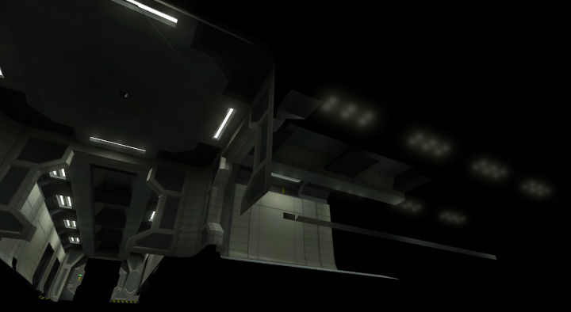

Commonly referred to as the **BSP**, this tag contains level geometry, weather data, material assignments, AI pathfinding information, lightmaps, and other data structures. The name "BSP" is commonly used to refer to non-[object][] level geometry in general. Aside from sounds and [bitmaps][bitmap], the BSP tends to be one of the largest tags in a map.

While a [scenario][] can reference multiple BSPs, Halo can only have a single BSP loaded at a time. Transitions between BSPs can be scripted (`switch_bsp`), e.g. using trigger volumes. Objects in unloaded BSPs are not simulated.

# Binary space partitioning
BSP stands for **[Binary Space Partitioning](bsp)**, a technique where space within a sealed static mesh is recursively subdivided by planes into [convex][] _leaf nodes_. The resulting **BSP tree** can be used to efficiently answer geometric queries, such as which surfaces should be collision-tested for physics objects.

# Clusters and cluster data
Clusters are sealed volumes of a BSP defined by portal planes. Clusters can independently reference the [weather_particle_system][], [wind][], [sound_environment][], and [sound_looping][] tags to define the atmospheric and ambience qualities of sections of the map.

Note that it may still be desirable to reference weather for indoor clusters if there are outdoor areas visible from them, otherwise snow and rain particles will abruptly disappear. To mask weather in such clusters, use weather polyhedra.

# Fog planes
Areas of a map which need a fog layer can be marked using _fog planes_. These are 2D surfaces which reference [fog tags][fog], not to be confused with atmospheric fog which is part of the [sky tag][sky].

# Weather polyhedra

<figure>
  
  <figcaption>
    
Weather polys extracted from AotCR.

  </figcaption>
</figure>

Weather polyhedra are simple convex volumes where weather particles will not render. They can be used to mask rain or snow from under overhangs, doorways, and indoor spaces when the cluster has weather.

When a JMS is compiled to BSP by [tool], connected convex faces with the material name `+weatherpoly` will generate _weather polyhedra_. Within the tag, the polyhedra are represented as a center point, bounding radius, and up to 16 planes which enclose a volume.

# Lightmaps

<figure>
  
  <figcaption>
    
Timberland's diffuse textures disabled by running <code>rasterizer_environment_diffuse_textures 0</code>,
    showing just lightmap and specular components of the BSP

  </figcaption>
</figure>

Lightmaps are a special type of [bitmap][] referenced by the BSP which represents static lighting information. It is created using [Tool][] or [Sapien][] by the **[radiosity][]** process. A second set of UV coordinates is generated for the entire renderable BSP and a texture is rendered to apply levels of light to those surfaces.

[Skies][sky], emissive [environment shaders][shader], [scenery][] with lights, and [light fixtures][device_light_fixture] can all be used as light sources to illuminate the BSP. Additionally, static objects like [scenery][] will cast shadows. Therefore you must to re-run radiosity any time these light sources change to see a change.

Beyond just affecting the surface colour, the lightmap also encodes(how?) the primary light direction for each vertex which determines the shadow directions for dynamic objects like [vehicles][vehicle] and [bipeds][biped].

# Lens flare markers

<figure>
  
  <figcaption>
    
In a10, lens flare markers were generated for fluorescent lights

  </figcaption>
</figure>

When a [shader_environment][] references a [lens_flare][], _lens flare markers_ are automatically created and stored in the BSP tag during [structure compilation][tool#structure-compilation]. These are used to give lights a "glowy" appearance. If the shader has a _lens flare spacing_ of `0`, a single lens flare is placed on the surface(how?). Otherwise, the lens flares are evenly spaced within the surface according to the spacing value (world units).

A BSP can contain up to 65535 lens flare markers, and up to 256 types of lens flares. However, there is a much lower limit to how many the game will draw at a given time, exactly how many is unknown.

[bsp]: https://en.wikipedia.org/wiki/Binary_space_partitioning
[convex]: https://en.wikipedia.org/wiki/Convex_set
[radiosity]: https://en.wikipedia.org/wiki/Radiosity_(computer_graphics)
