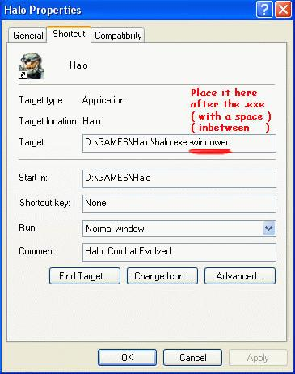

Halo accepts [command line/shortcut arguments][about-args] to customize how the game launches and what features are enabled. From a terminal or Windows command prompt, such arguments are provided after the executable name, e.g. `haloce.exe -screenshot` to run the game with screenshot mode enabled. These arguments can also be added in Windows by editing a shortcut to the Halo executable.

Many of these settings can be configured in-game, so it is not usually necessary to provide them as arguments.

# How to add arguments to a shortcut (Windows)

Windows users looking to avoid having to use the [command prompt][about-cmd] can create a shortcut to `halo.exe`, `haloce.exe`, or `haloceded.exe` and edit it's **target** to provide these arguments. Be sure to place them **after the EXE**, and **separate each argument with spaces**:

<a href="windows-shortcut.jpg">
  
</a>

# Arguments list
The following is a comprehensive list of arguments. Not all are not documented in Halo's `Readme.rtf` or `-help` output.

## Graphics options
| Argument                      | Description
|-------------------------------|----------------
|`-adapter x`                   | Forces the game to run fullscreen on a multi-monitor adaptor.
|`-refresh r`                   | Sets the refresh rate.
|`-use00`                       | An even simpler graphics mode than `-useff`, disabling shader detail maps.
|`-use11`                       | Forces the game to run as a shader 1.1 card. Additionally degrades visual quality by disabling model self-illumination, "animated lightmaps" (dynamic lights?), per-pixel fog, and specular lighting.
|`-use14`                       | Forces the game to run as a shader 1.4 card. Disables bumped mirrored surfaces and some video effects become two-pass.
|`-use20`                       | Forces the game to run as a shader 2.0 card. This is the intended shader version with all graphical features enabled. You probably won't need to specify this manually unless the game is having difficulty detecting your graphics card type.
|`-use2a`                       | Similar to `-use20`
|`-useff`                       | Forces the game to run as a fixed function card. This is the most basic feature set, further disabling shadows, refractive camouflage, and lens flares, with very basic fog, water, and lighting. This may improve performance on resource-constrained systems, but at great cost to visual quality.
|`-vidmode w,h,r`               | Forces the game to run at a given width, height, refresh rate.
|`-width640`                    | Forces the game to run at 640x480.
|`-window` or `-windowed`       | Runs the game in a window.

## Connection options
| Argument                      | Description
|-------------------------------|----------------
|`-connect ip:port`             | The game will automatically connect to the given server after loading.
|`-cport x`                     | Client port address used when joining games. Defaults to **2303**. See the Network Setup settings under the In-Game Settings section.
|`-ip x.x.x.x`                  | Server IP address used when you have multiple IP addresses (e.g. multiple network interfaces in your machine). Behind [NAT][about-nat], this should refer to the [private IP][about-ips] configured for port forwarding.
|`-password`                    | The password for the server we're trying to connect to. Not to be confused with the `sv_password` command for dedicated servers, which goes in the file executed by the `-exec` argument.
|`-port x`                      | Server port address used when hosting games. Defaults to **2302**. See the Network Setup settings under the In-Game Settings section.

## Other
| Argument                      | Description
|-------------------------------|----------------
|`-?` or `-help`                | Displays a list of _most_ arguments. Will fail if using a modified `strings.dll`, e.g. with the Chimera mod
|`-console`                     | Enables the debugging console, which can be opened with the `~` (tilde) key. This console can be used to enter Halo script commands and is similar to Sapien's console, though many Sapien-related commands have no effect. Note that most client mods like HAC2 and Chimera enable this automatically.
|`-devmode`                     | Enables developer mode commands ([Custom Edition][h1] only). In pre-1.10 versions, this also prevented Internet gameplay. Note that most client mods like HAC2 and Chimera enable this automatically.
|`-exec example.txt`            | Causes the game or dedicated server to run the file of console commands on startup.
|`-name <name>`                 | Sets the name of the player profile.
|`-nogamma`                     | Disables adjustment of gamma. The in-game gamma slider will not affect the brightness of the game if this switch is used.
|`-nojoystick`                  | Disables joystick/gamepads.
|`-nonetwork`                   | Disables the Multiplayer menu item in the main menu. With a modified `ui.map` which adds a Campaign menu, this setting will actually disable that menu item instead.
|`-nosound`                     | Disables all sound.
|`-novideo`                     | Disables the videos which play at game startup (retail).
|`-nowindowskey` or `-nowinkey` | Prevents the Windows key from opening the start menu and minimizing the game.
|`-path <path>`                 | Sets the path for which Halo looks for profiles and gametypes. Normally `%USERPROFILE%\Documents\My Games\Halo[ CE]`
|`-safemode`                    | Disables as much as possible from the game in case you're experiencing crashes.
|`-screenshot` or `-screenshots`| Enables the "Print Screen" key to generate [TGA format][about-tga] screenshots in Halo's `screenshots` directory.
|`-timedemo`                    | A benchmarking mode which runs sped-up intro cinematics of several campaign levels (a30, b30, c10, d20) and writes out [timedemo.txt](#appendix%3A-timedemo-output). May crash or cause black screens with modified maps.

## Vestigal and unknown arguments
These additional arguments are found in game executable, but seem to have no effect. They were likely used during the game's development but were removed for its final release.

| Argument                      | Description
|-------------------------------|----------------
|`-checkfpu`                    | Was possibly used to debug the machine's floating point unit (FPU).
|`-noSSE`                       | May have been used to disable certain branches of code with [SIMD instructions][about-sse]. Unknown if this has any effect now.
|`-testcrash`                   | Bring up a crash dialog? No effect.
|`-usefxfile`                   | Load shaders from DirectX .fx files. Does not work.
|`-useref`                      | Unknown purpose.


# Appendix: timedemo output
The `-timedemo` argument produces a file `timedemo.txt` in Halo's root directory. An example can be seen below:

```txt
Date / Time: 4/15/2020 12:00:35 AM (84994718ms)
2700MHz, 1024MB, 512M ATI Unknown (DeviceID=0x9874) Driver=22.19.180.513 Shader=3.0
C:\Program Files (x86)\Microsoft Games\Halo Custom Edition\haloce.exe -timedemo   (Version=1.0.10.621)
Frames=4700
Total Time=114.21s
Average frame rate=41.15fps
Below  5fps= 15% (time)  0% (frames) (17.200s spent in 15 frames)
Below 10fps= 15% (time)  0% (frames)
Below 15fps= 16% (time)  0% (frames)
Below 20fps= 20% (time)  2% (frames)
Below 25fps= 28% (time)  6% (frames)
Below 30fps= 30% (time)  7% (frames)
Below 40fps= 34% (time)  12% (frames)
Below 50fps= 49% (time)  27% (frames)
Below 60fps= 82% (time)  71% (frames)
###Sound Options###
Hardware Acceleration= No
Sound Quality= Normal
Environmental Sound= No
Sound Variety= High
###Video Options###
Resolution= 1280 x 720
Refresh rate= 60 Hz
Framerate throttle= No Vsync
Specular= Yes
Shadows= Yes
Decals= Yes
Particles= Off
Texture Quality= High

For further information, please visit the timedemo FAQ at: http://halo.bungie.net/site/halo/features/hpcperformancefaq.html
```

Note that it says `Particles= Off` even if your particles setting is otherwise High, suggesting some of these options are hardcoded. The Bungie FAQ link is now a 404 page.

[about-args]: https://en.wikipedia.org/wiki/Command-line_interface#Arguments
[about-tga]: https://en.wikipedia.org/wiki/Truevision_TGA
[about-ips]: https://en.wikipedia.org/wiki/IP_address#Private_addresses
[about-nat]: https://en.wikipedia.org/wiki/Network_address_translation
[about-cmd]: https://en.wikipedia.org/wiki/Cmd.exe
[about-sse]: https://en.wikipedia.org/wiki/Streaming_SIMD_Extensions
