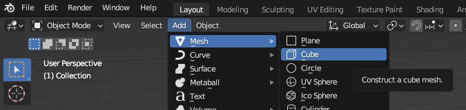
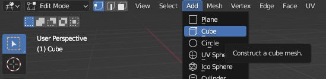
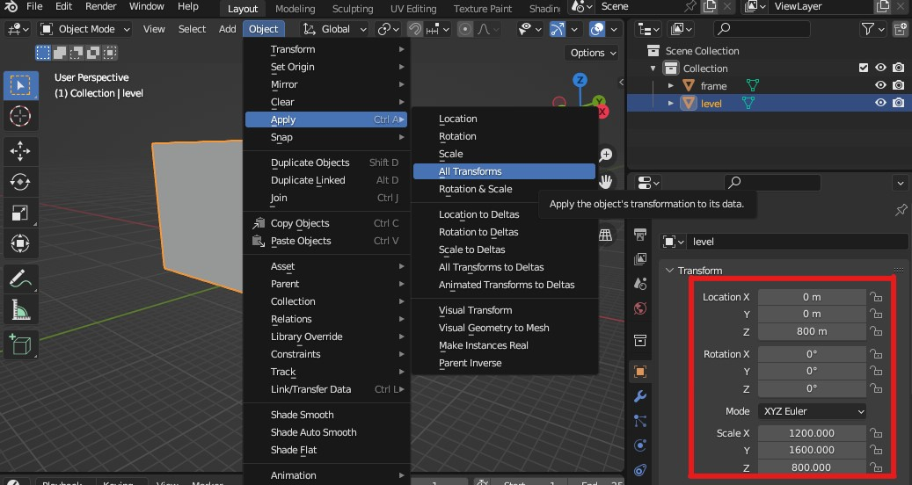
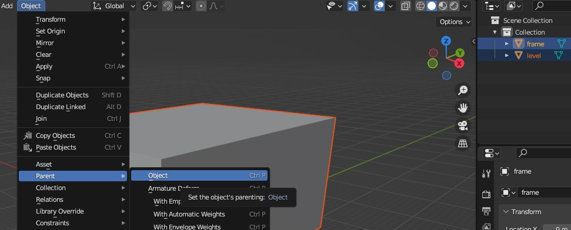
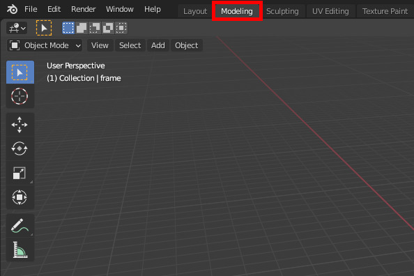
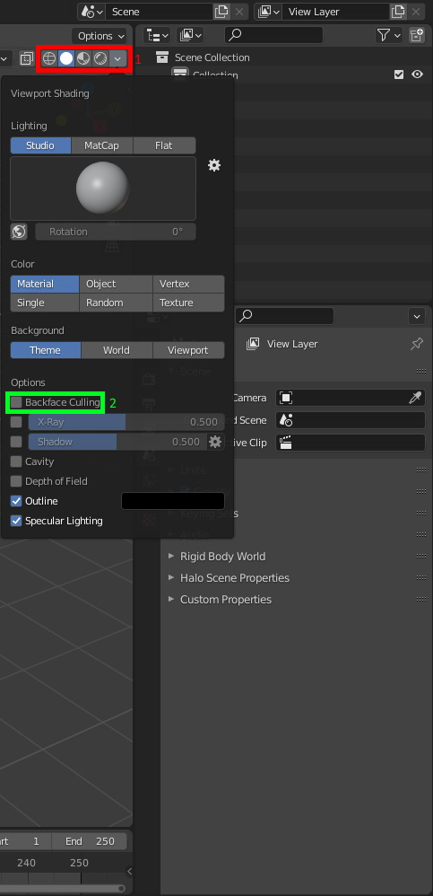
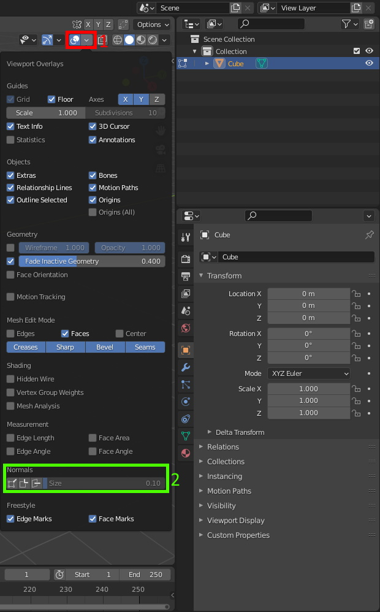

**Blender** is a free and open-source 3D modeling, animating, and rendering toolset. It's now widely used for Halo modding workflows, which traditionally relied on [3ds Max](~3dsmax). With community-made plugins like [Halo Asset Blender Development Toolset](~halo-asset-blender-development-toolset) and [Foundry](~) you can export the [source data](~) formats needed to create tags.

Note that older pre-2.8 versions of Blender are completely unsupported. Community plugins are regularly updated and track modern versions of Blender. Be sure to regularly update Blender and your plugins to get new features and bug fixes.

# Learning resources
Blender has far more capabilities than we need for just Halo modding. You will mostly just need to learn polygon modeling, basic materials, UV unwrapping, rigging, or animation depending on your goals.

* [Official reference manual](https://docs.blender.org/manual/en/latest/)
* [Official tutorials](https://www.blender.org/support/tutorials/)
* [Blender communities](https://www.blender.org/community/)

# Usage basics

## Modes
In the upper-left of the viewport you'll see a drop-down menu labeled "Object Mode". This is the [mode selector][modes]. In different interaction modes, the actions and operations you can perform in the viewport change or have different effects. The two main modes you'll use are:

* **Object Mode**: Allows for the selection of whole objects, adding new objects, and changing their transforms (moving, scaling, rotating).
* **Edit Mode**: Used to edit the geometry within a selected object, like adding new faces, moving vertices, and UV unwrapping.

You can quickly toggle back and forth between these modes using .

## Moving the camera
By default, Blender's camera rotates around an invisible central "focus point", which is ideal for working on 3D models which need to be rotated and looked at from different angles. In this mode, you can use the following controls:

* Rotating: Hold  and move the mouse
* Panning: Hold  +  and move the mouse
* Move in/out:  or  +  +  while moving the mouse forward/back
* Move focus point to selection: 

To move the focus point, rotate the camera to an angle perpendicular to the direction of travel then use panning to center over the desired area. You can also press the  key to center on a selection. If you are finding this mode of camera travel difficult to get used to, you may prefer the temporary flying camera mode by pressing  +  (tilde) then using , , ,  keys, then clicking to finish.

Axis-aligned orthographic views can be viewed by pressing  (tilde) then clicking the desired direction. Return to the perspective camera by simply rotating the view with  again.

## Adding geometry
How geometry is added depends on your [mode](#modes).

In object mode, you can use _Add > Mesh_ and select an object type. This creates a new object in your scene.

If you've selected an object and switch to edit mode, you can also use the _Add_ menu to add new meshes to the current object. This is different from the above because the new mesh will not be its own object, but rather the faces are included in the currently edited object.

## Applying transforms
For levels it's recommended to apply any transforms present on your level geometry object and frame. Users have reported issues with level size when the object itself has been scaled rather than the vertices within it. Applying transforms will ensure the object is located at the origin and scaled to `1` in each axis.

## Parenting objects
Hold  and click objects in the viewport or outliner to multi-select. The last object you selected is considered the active object (highlighted yellow) and will be the parent of all other objects you have selected (highlighted orange) when parenting to object.

## Workspace
The workspace presets along the top of the window customize Blender's arrangement of [editors][blender-editors] for typical tasks like modeling, UV editing, and animation. For example, choosing the _Modeling_ workspace will hide the timeline which would simplify the experience if you're just making a level. You're not limited to the layouts and available editors of the built-in workspaces; any workspace's [areas][blender-areas] can be customized and set to different editor types.

[blender-editors]: https://docs.blender.org/manual/en/latest/editors/index.html
[blender-areas]: https://docs.blender.org/manual/en/latest/interface/window_system/areas.html

# Settings
## Clip start and end
Most 3D renderers have a minimum and maximum viewing distance, called the [clipping range][wiki-clipping]. Anything outside this range will be clipped (not visible). This is done to avoid [Z-fighting][] since the depth buffer only has limited precision. As an example, [H1's default range](~h1/scripting#external-globals-rasterizer-far-clip-distance) is `0.0625` to `1024` world units.

Blender's viewport is no different and has a configurable clipping range. However, [JMS units are 100x world units](~scale) so the scale at which Halo levels are modeled is quite large -- outdoor spaces like Bloodgulch are upwards of 10,000 Blender meters across. By default Blender scenes only have a viewport clipping range of `0.01 m` to `1000 m` so parts of your model may be cut off when zooming out to large scales.

Blender's clipping distances can be adjusted in the View settings pane (press  and select the View tab). A x100 range of `1 m` to `100 000 m` in Blender is roughly equivalent to Halo's. Remember, the greater the _range_ between the start and end clipping distances, the more Z-fighting you'll get in the viewport, so don't just set the end distance to some huge number. The exception is when working on H1 skybox models, which are modeled at very large scales and need [higher start and end distances](~skyboxes#blender-scene-setup).


For level modeling it's important to configure clip distances instead of just using using _world units_ export scale in the [Halo Asset Blender Development Toolset](~halo-asset-blender-development-toolset). Scaling vertex coordinates during export can amplify [floating point imprecisions](https://en.wikipedia.org/wiki/Floating-point_arithmetic#Accuracy_problems) and increase the likelihood of "nearly coplanar face" warnings from [Tool](~h1-tool) and potentially cause [phantom BSP](~h1/tags/scenario_structure_bsp#phantom-bsp).


## Backface culling
This option will render the geometry transparent when viewed from the opposite side of the face normal. It only applies to _Solid_ viewport shading. When using _Rendered_ or _Material Preview_ you need to enable backface culling in each material's properties as desired.

## Normals overlay
This option will render lines coming out the center of the face to indicate the direction it's pointing. It will only be available to you if you are in edit mode for the object you wish to examine. It's recommended to set the size about 100 to make it easier to see.

## Undo count
Consider increasing the number of edits you can undo in Blender by changing the setting in _Edit > Preferences_. Be aware that increasing this setting will use up more of your system RAM, so keep the value reasonable.

## Startup file
Did you know you can change the default Blender scene? Make changes like setting the [clipping range](#clip-start-and-end), deleting any unwanted objects, creating materials, or other common steps for your typical workflow then use _File > Defaults > Save Startup File_. All new scenes will start in this state.

## Unit measurement
All units given in this site's guides expect that your Blender instance is set to use metric units, which is the default, so if you haven't changed this then it's likely already set to metric. For Halo's purposes we will not be taking this unit literally; a length of "70m" is just _70 JMS units_ (the height of the player when standing) which you can [convert to real-world units here](~scale).

# External tutorials
If you prefer video tutorials for some of the above operations, see the series by General_101:

* [Set context/mode](https://youtu.be/SVLAYHJSXYA)
* [Changing selection mode](https://youtu.be/C_X7muZP3XA)
* [Editing normals](https://youtu.be/zog43sqj0Qc)
* [Normal overlay](https://youtu.be/zog43sqj0Qc)
* [Backface culling](https://youtu.be/FAiMN1Zohps)
* [UV editing](https://youtu.be/dR_TCHUTEw0)
* [Window management](https://youtu.be/5wcfi3o2-ks)
* [Creating and assigning materials](https://youtu.be/2yOOzN0zJfQ)
* [Set smooth shading](https://youtu.be/vsYkRKV-Gn8)
* [Set sharp edges](https://youtu.be/Zlu5pT1WPJY)
* [Modifiers](https://youtu.be/dZtNCIHLOkg)

[wiki-clipping]: https://en.wikipedia.org/wiki/Clipping_(computer_graphics)#Clipping_in_3D_graphics
[z-fighting]: https://en.wikipedia.org/wiki/Z-fighting
[modes]: https://docs.blender.org/manual/en/latest/editors/3dview/modes.html
[normals]: https://en.wikipedia.org/wiki/Normal_(geometry)