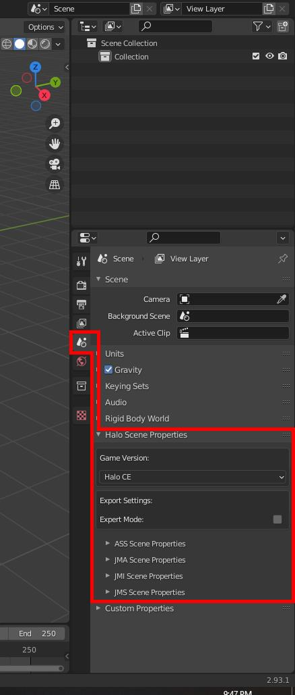
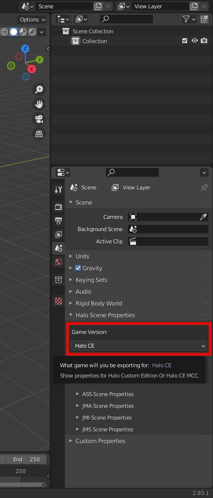
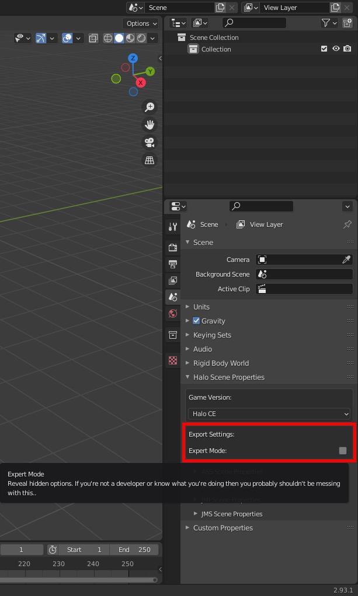
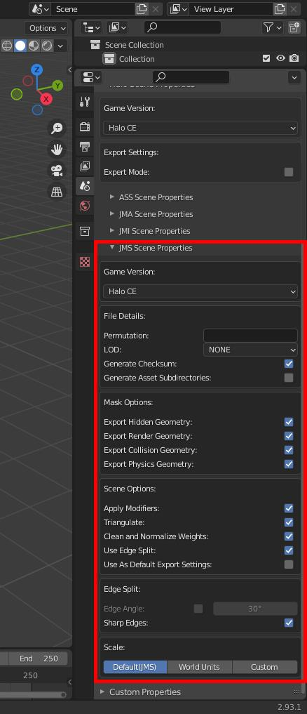
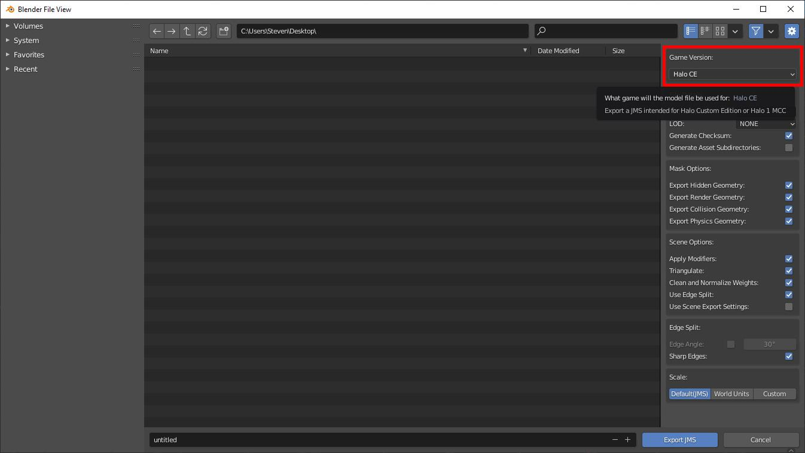
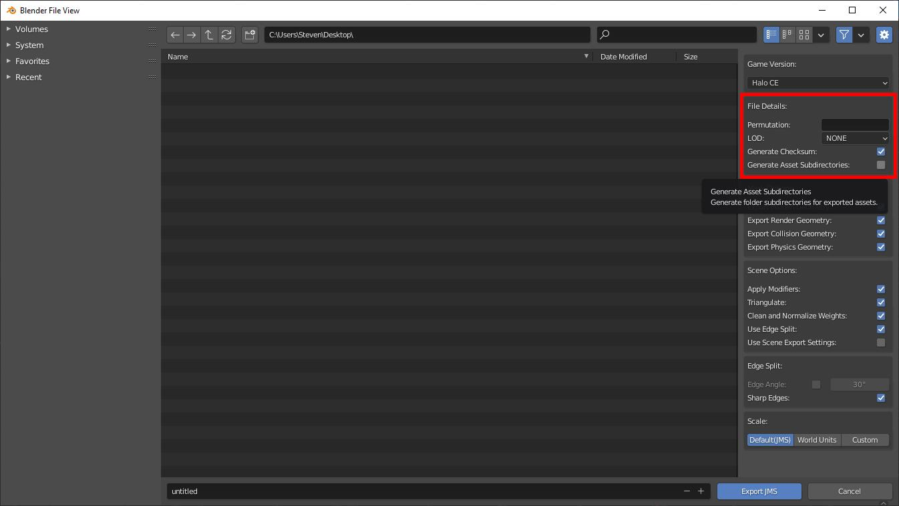
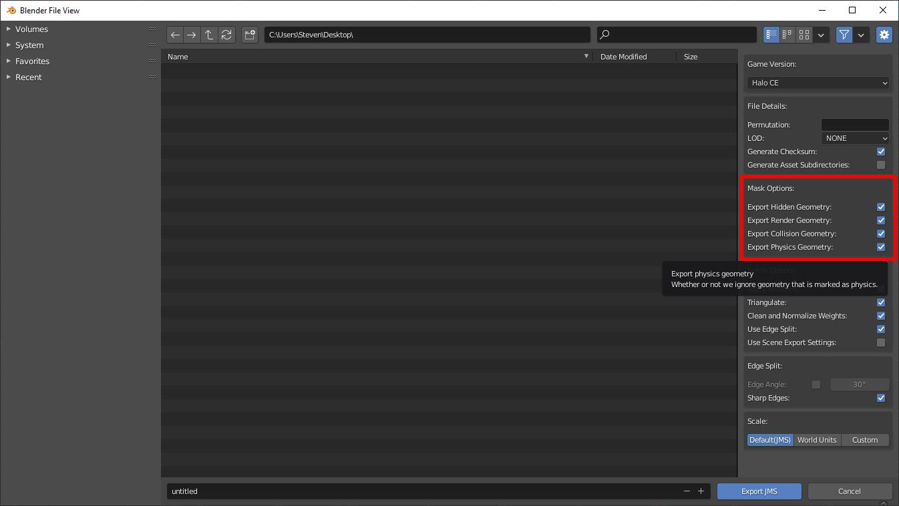
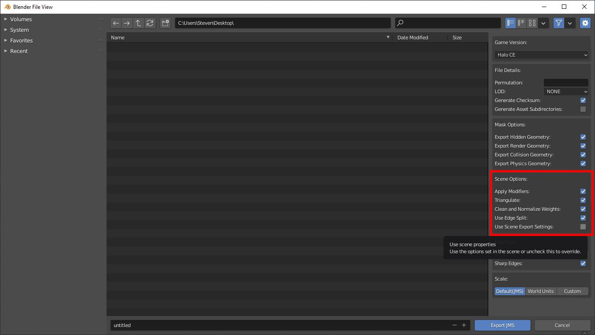
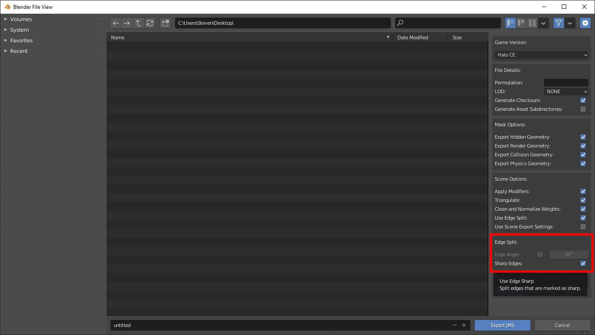
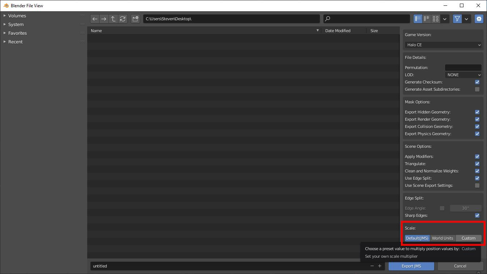

The **Halo Asset Blender Development Toolset** is an addon for [Blender](~) which allows the import and export of [JMS](~), [animation data](~animation-data) (e.g. JMA), [ASS](~), and JMI for [Halo 1](~h1), [Halo 2](~h2), [Halo 3](~h3) and Halo 3: ODST.

# Installation
To download the add-on from GitHub, go to its [releases page](https://github.com/General-101/Halo-Asset-Blender-Development-Toolset/releases) and download the latest version. The zip you want will be in the panel labeled _Assets_ and will start with the name _halo-asset-blender-toolset_. **Do not** click "Download ZIP" from the "Code" drop-down.

The addon comes in both _lite_ and _full_ versions, where full versions include typical Halo models for scale reference purposes.

Once downloaded, there are two ways to install this addon:

## Preferences menu
1. From within Blender, select _Edit > Preferences_.
2. In the window that appears, select the _Add-ons_ menu and click the _Community_ button.
3. There now be an _Install..._ button visible, which you should use to choose the `.zip` containing the downloaded add-on.
4. Finally, ensure that the new add-on is **checked** in the add-ons list.

## Manual installation
Firstly, you will need to find Blender's `addons` directory.

* On Windows (Standalone Version), this can be found at `%appdata%\Blender Foundation\Blender\<Blender Version>\scripts\addons`.  
* On Windows (Steam Version), this can be found by right clicking Blender in Steam -> Manage -> Browse Local Files -> `<Blender Version>\scripts\addons`.  
* Linux users will find it at `~/.config/blender/<blender version>/scripts/addons`.

Simply extract the downloaded `.zip` to this location so that the `io_scene_halo` directory is contained in `addons`.

# Scene settings
Under Blender's scene properties tab you'll find _Halo Scene Properties_. You can use this to configure the toolset and save its settings in your scene, like default export settings or your target game version.

## Scene game version
While the options in the export menus and the filetype setting menus controls what game the file is written for, this option controls what settings you see throughout `Blender`. The toolset adds some features to certain places in `Blender` to aid with exporting for certain titles such as a hinge type for `Halo 2` physics constraints. The _Game Version_ will hide features of the addon which don't apply to the game version you're targeting.

## Scene export settings
This box only has a single option. 

* Expert Mode - bool: The export mode bool here controls whether or not you see advanced settings in the toolset. Currently this only affects whether or not you see version control for exported files. If this is left disabled then files use latest version for the target engine by default.

You shouldn't have to bother with this unless you're developing the toolset, so leave it disabled.

## Scene JMS settings
Now lets open the JMS settings dropdown to reveal the settings used for the exporter. Set any settings you want used each time you export and make sure to have `Use as Default Export Settings`. You can turn this off or on in the export menu as well by checking `Use Scene Export Settings`. Any settings you have in your scene settings will be saved to the blend file.

# JMS export settings
## Game version
The `Game Version` option lets us choose our target game:

## File details
A CE-specific box that will let us set the filename for our `JMS` from the menu easily without having to rename the file manually. Using either of these options will overwrite whatever the user inputs as the filename:

* Permutation - String: Type in a name for the model permutation here. This string will default to `unnamed` if LOD is used but permutation is not filled in. See the [GBXmodel permutations section](~gbxmodel#permutations) for details on permutations' purpose in Halo.
* LOD - Dropdown: Select a [level of detail](~gbxmodel#level-of-detail) to use for the file here. If the LOD is set to none but permutation is filled in then LOD will default to `Super High`.
* Generate Checksum - bool: Whether or not we generate a checksum based on the order of the JMS skeleton. Checksum will be written as zero if disabled.
* Generate Asset Subdirectories - bool: Whether or not we generate the relevant subdirectories wherever we export our file. If this option is checked then the output will become `Output directory + blend filename(folder) + model type models/physics(folder) + filename.JMS`. If it is exported to an already existing valid folder setup then it will reuse that directory by replacing the existing JMS no matter what level it is written to. All that matters is that the parent folder name matches the blend filename and that it contains a valid subdirectory such as `models` or `physics`. If this is unchecked then it will just write the JMS to as is to wherever the user sets the output to without generating folders.

## Mask options
These options will allow you to exclude or include specific geometry types from your scene in the final export. Let's go over the options now:

* Export Hidden Geometry - bool: Whether or not we export geometry that is hidden from the viewport. Nodes are exported regardless of visibility but any other geo in the scene will be excluded from the final JMS if hidden and this box is unchecked.
* Export Render Geometry - bool: Whether or not we export render geometry. Any geometry that is not a node and does not use the collision geometry prefix(@) is considered render geometry. If there is no render geometry then no JMS will be written
* Export Collision Geometry - bool: Whether or not we export collision geometry. Any geometry that is not a node and does use the collision geometry prefix(@) is considered collision geometry. Collision geometry is exported to a separate JMS file and `_collision` is added to the filename unless the settings in file details have been filled in. If there is no collision geometry then no collision JMS will be written.
* Export Physics Geometry - bool: Whether or not we export physics geometry. Any geometry that is not a node and does use the physics geometry prefix($) is considered physics geometry. Physics geometry is exported to a separate JMS file and `_physics` is added to the filename unless the settings in file details have been filled in. If there is no physics geometry then no physics JMS will be written. In CE this is only used for markers since that is all that is used for physics.

## Scene options
These options are mostly intended to help you automate how you want to handle geometry on export and the resulting files:

* Apply Modifiers - bool: Whether or not we apply modifiers that exist on the object on export. This option does not affect the geometry in the scene permanently so it's a great way to add a mirror modifier to your scene and exporting it without permanently applying it to your object.
* Triangulate - bool: Whether or not we triangulate faces in our geometry on export. This option does not affect the geometry in your scene permanently.
* Clean and Normalize Weights - bool: Whether or not we remove vertex groups that have a weight value of 0.0 and ensure that all vertex groups add up to 1.0.
* Use Edge Split - bool: Whether or not we automatically add an edge split modifier to all objects in the scene before export. While the modifier addition is permanent, the results from the modifier aren't and only affect the exported JMS.	
* Use Scene Export Settings - bool: Use the saved settings from the Blend file scene menu instead of the defaults for the export menu. Handy if you have a specific set of settings you don't want to have to apply each time you export.	

## Edge split
This box will only appear if the user has enabled `Edge Split` in `Scene Options`. See the following link to get documentation on what the settings here do:

[Edge Split Blender Docs](https://docs.blender.org/manual/en/latest/modeling/modifiers/generate/edge_split.html)

## Scale
This box will let you scale your geometry on export. This setting does not permanently affect your scene. Your choices are as follows:

* Default(JMS) - int: Export position values for object are 1:1 with Blender. No modifications here.
* World Units - int: Export position values are multiplied by 100 units.
* Custom - int: Export position values are multiplied by a custom value.

