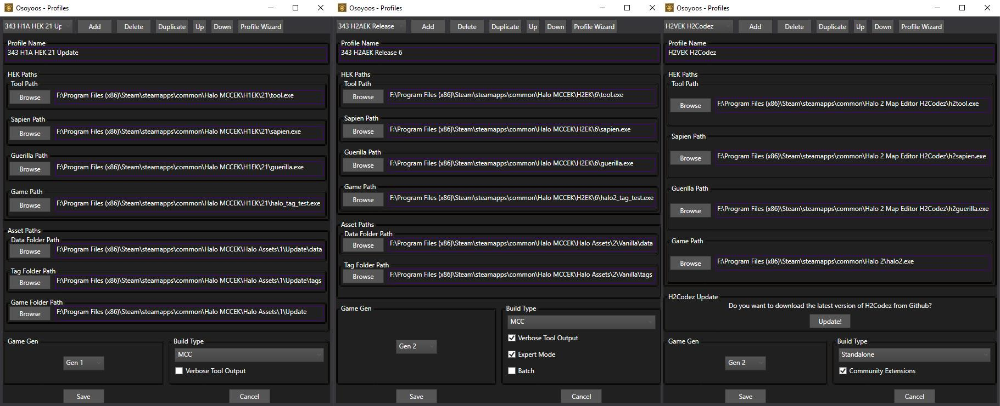
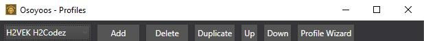
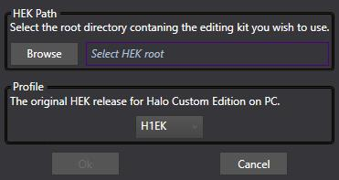

This group lets you configure aspects of the launcher such as the current profile being used or themes. You can find it at the bottom of the launcher window.

| Setting          | Description
|----------------- | -------------------------------------------------------------------------------------------------------------------
| Toolkit Dropdown | Set the current profile you will be using. Create profiles from the **Toolkit Profiles** button mentioned below.
| Theme            | Set the theme used by the launcher UI. Light or dark?
| Toolkit Profiles | Create and configure profiles from the menu this button opens. See the **Profile Window** section for more details.
| About            | See the credits and update the launcher version from the menu this button opens.

# Profile window
Lets go over the settings in the profile window. Profile changes are stashed whenever you edit a setting. They are then saved to your PC once **Save** is pressed. If cancel is used instead then your changes will be thrown out.

## HEK paths
The launcher and the tools expect all tools defined here to be in the same location.

| Setting       | Description
|-------------- | ----------------------------------------------------------------------------------------------------------------------------------------------
| Profile Name  | The set name for our profile. This is what we will see when we view the contents of the profile dropdown.
| Tool Path     | A path to our tool executable. Select browse and navigate to your tool.exe file.
| Sapien Path   | A path to our Sapien executable. Select browse and navigate to your sapien.exe file.
| Guerilla Path | A path to our Guerilla executable. Select browse and navigate to your guerilla.exe file.
| Game Path     | A path to our game executable. Select browse and navigate to your game executable. In MCC this would be the halo_tag_test.exe(AKA: Standalone)

## Asset paths
This section deals with setting directories for reading Halo assets. These options are only for MCC toolsets and may only apply to certain toolsets in MCC.

| Setting          | Description                                                                                                                                    | Notes
|----------------- | ---------------------------------------------------------------------------------------------------------------------------------------------- | ------------------------------------------------------------------------
| Data Folder Path | A path to a folder where we will store our source files for import. Select the browse button and select a folder.                              | This option does not apply to the Halo 3 toolset at the time of writing.
| Tag Folder Path  | A path to a folder where we will read our imported tag files from. Select the browse button and select a folder.                               | This option does not apply to the Halo 3 toolset at the time of writing.
| Game Folder Path | A path to a folder where we will export game ready files such as compiled shaders and map files. Select the browse button and select a folder. | This option only applies to Halo 1 at the time of writing.

## H2Codez update
This section will allow the user to update their H2Codez DLL from the launcher directly.

| Setting | Description                                                   | Notes
|-------- | ------------------------------------------------------------- | ------------------------------------------------------------------------
| Update! | Exactly what it says. Press this button to check for updates. | This option only applies to Halo 2 Vista profiles using community extensions.

## Game gen
This dropdown sets the generation our game belongs to.

| Setting       | Description
|-------------- | --------------------------------------------------------------------------------------------------------
| Game Gen Type | Sets the generation this game belongs to. See the **Game Gen Settings** table for a description on each setting.

| Game Gen Settings | Description
|------------------ | --------------------------------------------------
| Gen 1             | This option means the profile is a Halo 1 profile.
| Gen 2             | This option means the profile is a Halo 2 profile.
| Gen 3             | This option means the profile is a Halo 3 profile.

## Build type
This section sets some specifics for the toolset along with some flags if they are applicable

| Setting             | Description                                                                        | Notes
|-------------------- | ---------------------------------------------------------------------------------- | ------------------------------------------------------------------------------------------
| Build Type          | Sets the built type for the profile.See **Build Type Settings** table for details. |
| Community Tools     | Set a flag for mentioning whether or not the profile supports community tools.     | This option only applies to standalone builds and only enables H2Codez support for Halo 2.
| Verbose Tool Output | Set a flag to enable verbose output from tool commands.                            | This option only applies to MCC builds and Halo 1 or Halo 2.
| Expert Mode         | Set a flag to disable safety checks for certain tool commands.                     | This option only applies to MCC builds and Halo 2.
| Batch               | Set a flag to disable some output during lightmapping and build-cache-file.        | This option only applies to MCC builds and Halo 2.

| Build Type Settings | Description
|-------------------- | ----------------------------------------------------------------------------------------------
| MCC                 | This option means the profile is an MCC release.
| Standalone          | This option means the profile is not an MCC release. I.E. Halo Custom Edition or Halo 2 Vista.

## Profile tools
Lets go over the tools in the profile window.

| Tools            | Description
|----------------- | -------------------------------------------------------------------------------------------------------------------------------------
| Profile Dropdown | Switch the current profile you are viewing to configure it.
| Add              | Adds a new empty profile at the end of the list.
| Delete           | Deletes the profile currently being viewed.
| Duplicate        | Duplicates the profile currently being viewed and adds it to the end of the list.
| Up               | Moves the profile up in the list by one
| Down             | Moves the profile down in the list by one
| Profile Wizard   | Opens a menu to configure the currently viewed profile automatically based on a template. See **Profile Wizard** section for details.

### Profile wizard
This window will help you automatically set profile settings based on a directory and a chosen template.

| Settings | Description
|--------- | ----------------------------------------------------------------------------------------------------------------------------
| HEK Path | The directory that contains the toolset we want to create a profile for. Select the browse button and select a folder.
| Profile  | This option will set the template we will be using to create our profile. See **Profile Wizard Settings** table for details.

| Profile Wizard Settings | Description
|------------------------ | --------------------------------------------------------------------------------------
| H1EK                    | This option creates a profile meant for Halo Custom Edition.
| H1EK OS                 | This option creates a profile meant for Halo Custom Edition with Open Sauce installed.
| H1AEK                   | This option creates a profile meant for the Halo 1 MCC toolset.
| H2VEK                   | This option creates a profile meant for Halo 2 Vista
| H2VEK H2Codez           | This option creates a profile meant for Halo 2 Vista with H2Codez installed.
| H2AEK                   | This option creates a profile meant for the Halo 2 MCC toolset.
| H3EK                    | This option creates a profile meant for the Halo 3 MCC toolset.
