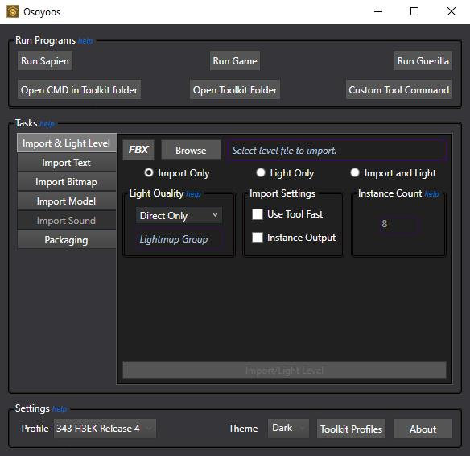
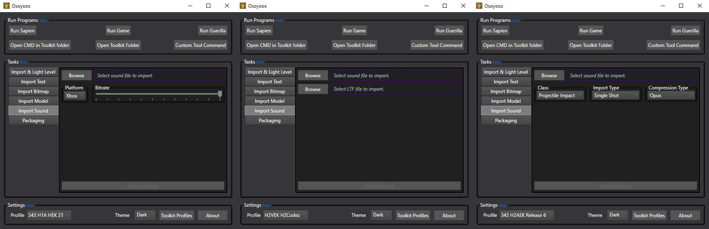
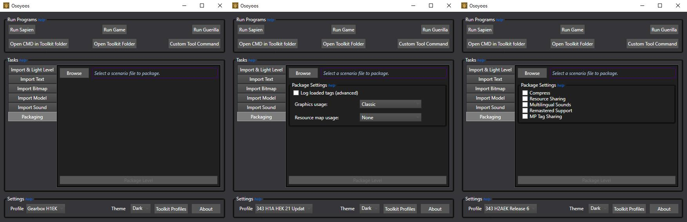

This group lets you run various commands for your selected profile directly from the UI. You can find this at the middle of the UI window.

# Import & light level
This section will cover the various settings found in the **Import & Light Level** tab. 

## Halo 1 level settings

| Halo 1 Settings    | Description                                                                                                                                                               | Notes
|------------------- | ------------------------------------------------------------------------------------------------------------------------------------------------------------------------- | --------------------------------------------------------------------------------
| FBX                | Converts an FBX file to a JMS file that Tool can then read to convert to a level.                                                                                         | This option only applies to an MCC profile
| Browse             | Pressing this button will ask the user to browse for a JMS to import with tool. The user can also select a scenario tag to light a level without the need for a JMS file. | If a scenario is selected then the only option for the user will be to light it.
| Import Only        | This is one option in a set of 3. If this option is set then only the level importing process will be started.                                                            |
| Light Only         | This is one option in a set of 3. If this option is set then only the level lighting process will be started.                                                             |
| Import and Light   | This is one option in a set of 3. If this option is set then the JMS will first be imported and then lit.                                                                 |
| Light Threshold    | A slider that sets how long the lightmapper should go for because it calls the job done. Values on the right take longer than values on the left.                         |
| Draft              | The lightmapper will run in draft mode. Takes less total time to complete than final.                                                                                     |
| Light              | The lightmapper will run in final mode. Takes more total time to complete than draft.                                                                                     |
| Apply Phantom Fix  | This will set the phantom fix arg to true during level importing. This will attempt to fix any possible invisible walls generated during import at the cost of tag space. | This option only applies to an MCC profile
| Disable Asserts    | This will set the -NoAssert arg during level lighting. Should grant some additional speed ups by disabling error checking. Only use if you know the tag has no issues.    | This option only applies to an MCC profile
| Import/Light level | Pressing this will run either level import and lighting commands with the settings set above.                                                                             |

## Halo 2 level settings

| Halo 2 Settings    | Description                                                                                                                                                                              | Notes
|------------------- | ---------------------------------------------------------------------------------------------------------------------------------------------------------------------------------------- | --------------------------------------------------------------------------------
| FBX                | Converts an FBX file to an ASS file that Tool can then read to convert to a level.                                                                                                       | This option only applies to an MCC profile
| Browse             | Pressing this button will ask the user to browse for a ASS or JMS to import with tool. The user can also select a scenario tag to light a level without the need for an ASS or JMS file. | If a scenario is selected then the only option for the user will be to light it.
| Import Only        | This is one option in a set of 3. If this option is set then only the level importing process will be started.                                                                           |
| Light Only         | This is one option in a set of 3. If this option is set then only the level lighting process will be started.                                                                            |
| Import and Light   | This is one option in a set of 3. If this option is set then the ASS or JMS will first be imported and then lit.                                                                         |
| Light Quality      | A dropdown the sets the quality to run the lightmapper at. First value takes the least amount of time while the last value takes the most time.                                          | See the **Halo 2 Light Quality Settings** table for more details.
| Light Config       | Sets some settings for the lightmapper                                                                                                                                                   | This option only applies to Halo 2 Vista profiles using community extensions.
| Use Tool Fast      | Run importing and lighting on tool_fast.exe for speedups                                                                                                                                 | This option only applies to an MCC profile
| Instance Output    | Enabling this option will keep instance windows open for debugging purposes.                                                                                                             | This option only applies to Halo 2 Vista profiles using community extensions.
| Instance Count     | Set the number of instances to run in a multi farm setup. Faster than running a single instance of Tool for lightmapping                                                                 | This option only applies to Halo 2 Vista profiles using community extensions.
| Import/Light level | Pressing this will run either level import and lighting commands with the settings set above.                                                                                            |

| Halo 2 Light Quality Settings | Notes                                                                                                                                                                              
|------------------------------ | ---------------------------------------------------------------------------------------------------------------------------------------------------
| Checkerboard                  |                                                                        
| Cuban                         | This option only applies to an MCC profile. Named after a Halo 2 dev who worked on lightmapping. Slightly better than checkerboard but not by much. 
| Draft Low                     |                                                                       
| Draft Medium                  |                                                                          
| Draft High                    |                                                      
| Draft Super                   |                                           
| Direct Only                   |                                                                                                                                           
| Low                           |                                                                                                                          
| Medium                        |                                                                               
| High                          |                                                                 
| Super                         | 
| Custom                        | This option only applies to Halo 2 Vista profiles using community extensions. Uses options set by the user to customize how the lightmapper runs.

## Halo 3 level settings

| Halo 3 Settings    | Description                                                                                                                                                                              | Notes
|------------------- | ---------------------------------------------------------------------------------------------------------------------------------------------------------------------------------------- | --------------------------------------------------------------------------------
| FBX                | Converts an FBX file to an ASS file that Tool can then read to convert to a level.                                                                                                       |
| Browse             | Pressing this button will ask the user to browse for a ASS or JMS to import with tool. The user can also select a scenario tag to light a level without the need for an ASS or JMS file. | If a scenario is selected then the only option for the user will be to light it.
| Import Only        | This is one option in a set of 3. If this option is set then only the level importing process will be started.                                                                           |
| Light Only         | This is one option in a set of 3. If this option is set then only the level lighting process will be started.                                                                            |
| Import and Light   | This is one option in a set of 3. If this option is set then the ASS or JMS will first be imported and then lit.                                                                         |
| Light Quality      | A dropdown the sets the quality to run the lightmapper at. First value takes the least amount of time while the last value takes the most time.                                          | See the **Halo 3 Light Quality Settings** table for more details.
| Light Group        | A name for a region in a level. The lightmapper will only run on this section.                                                                                                           |
| Use Tool Fast      | Run importing and lighting on tool_fast.exe for speedups                                                                                                                                 |
| Instance Output    | Enabling this option will keep instance windows open for debugging purposes.                                                                                                             |
| Instance Count     | Set the number of instances to run in a multi farm setup. Faster than running a single instance of Tool for lightmapping                                                                 |
| Import/Light level | Pressing this will run either level import and lighting commands with the settings set above.                                                                                            |

| Halo 3 Light Quality Settings | Notes                                                                                                                                                                              
|------------------------------ | -----------------------------------------------
| Checkerboard                  | This option does not work in multi farm setups.
| Direct Only                   |    
| Draft                         |     
| Debug                         |                                                                                                                                       
| Low                           |                                                                                                                          
| Medium                        |                                                                               
| High                          |                                                                 
| Super                         | 

# Import text
This section will cover the various settings found in the **Import Text** tab. 

| Settings  | Description                                                                                                                                                                              | Notes
|---------- | ---------------------------------------------------------------------------------------------------------------------------------------------------------------------------------------- | --------------------------------------------------------------------------------
| Browse    | Pressing this button will ask the user to browse for a folder containing files with either a .txt or .hmt extension.                                                                     | The .hmt extension is only used in Halo 1
| Text Type | A dropdown to set the type of text files we will be working with.                                                                                                                        | This option only applies to a Halo 1 profile. See the **Text Type Settings** for more details

## Text type settings

| Settings        | Description                                                                                                                                                                             
|---------------- | --------------------------------------------------------------------------------------
| HUD Messages    | Having this as your active selection will set the text importer to look for .hmt files                                                                     
| Unicode Strings | Having this as your active selection will set the text importer to look for .txt files      

# Import bitmaps
This section will cover the various settings found in the **Import Text** tab. 

| Settings    | Description                                                                           | Notes
|------------ | ------------------------------------------------------------------------------------- | --------------------------------------------------------------------------------
| Browse      | Pressing this button will ask the user to browse for a folder containing image files. | See **Inage extensions** for details on accepted file formats.
| Bitmap Type | A dropdown to set the type of bitmap to create. Only works with first imports.        | This option only applies to an MCC profile or a Halo 2 Vista profile with community extensions. See **Bitmap Type Settings** for details.
| Debug Plate | A dropdown to set the type of text files we will be working with.                     | This option only applies to an MCC profile.

## Image extensions

| Extensions | Description                                                                                                                                                                             
|----------- | --------------------------------------------------------------------------------------
| .tif       | This extension is supported in all toolkits                                                                
| .tiff      | Standalone Halo 1 profiles do not support this extension 
| .tga       | Only Standalone Halo 2 profiles support this extension                                                                   
| .jpg       | Only Standalone Halo 2 profiles support this extension     
| .bmp       | Only Standalone Halo 2 profiles support this extension                                                                      
| .png       | Only Standalone Halo 2 profiles with community extensions support this extension                                                                                                             

## Bitmap type settings

| Settings  | Description                                                                                                                                                                             
|---------- | --------------------------------------------------------------------------------------
| 2D        | Sets a newly created bitmap to 2D on import. A bit pointless since this is the default.                                                               
| 3D        | Sets a newly created bitmap to 3D on import.
| Cubemaps  | Sets a newly created bitmap to a cubemap on import.                                                                 
| Sprites   | Sets a newly created bitmap to a sprite on import.
| Interface | Sets a newly created bitmap to an interface on import. 

# Import model
This section will cover the various settings found in the **Import Model** tab.
This tab is disabled in a standalone Halo 2 Vista profile due to no model support.

## Halo 1 model settings

| Halo 1 Settings              | Description                                                                                                                                                                                                 | Notes
|----------------------------- | ----------------------------------------------------------------------------------------------------------------------------------------------------------------------------------------------------------- | --------------------------------------------------------------------------------
| FBX                          | Converts an FBX file to a JMS or JMA file that Tool can then read to convert to a model or animation.                                                                                                       | This option only applies to an MCC profile
| Browse                       | Pressing this button will ask the user to browse for a source directory. This means selecting the folder that contains the models, collision, physics, or animations folder.                                |
| GBXModel                     | This is one option in a set of 5. If this option is set then only the models directory will be imported.                                                                                                    |
| Collision                    | This is one option in a set of 5. If this option is set then only the physics directory will be imported.                                                                                                   |
| Physics                      | This is one option in a set of 5. If this option is set then only the physics directory will be imported.                                                                                                   |
| Animations                   | This is one option in a set of 5. If this option is set then only the animations directory will be imported.                                                                                                |
| All                          | This is one option in a set of 5. If this option is set then every previous option mentioned above will run.                                                                                                |
| Apply Phantom Fix            | This will set the phantom fix arg to true during collision importing. This will attempt to fix any possible invisible walls generated during import at the cost of tag space.                               | This option only applies to an MCC profile
| Halo 2 LOD Permutation Logic | This will set the LOD arg to true during GBXModel importing. Permutations will only use LOD indices used by their permutation instead of always using the indices of the first permutation when undefined.  | This option only applies to an MCC profile

## Halo 2 model settings

| Halo 2 Settings        | Description                                                                                                                                                                                                                                   | Notes
|----------------------- | --------------------------------------------------------------------------------------------------------------------------------------------------------------------------------------------------------------------------------------------- | --------------------------------------------------------------------------------
| FBX                    | Converts an FBX file to a JMS or JMA file that Tool can then read to convert to a model or animation.                                                                                                                                         | This option only applies to an MCC profile
| Browse(Model)          | Pressing this button will ask the user to browse for a source directory. This means selecting the folder that contains the render, collision, physics, or animations folder.                                                                  | This option does not apply to a standalone Halo 2 Vista profile
| Browse(Character FP)   | Pressing this button will ask the user to browse for a source directory containing a characters first person model. First person model referenced needs to be the same one used by the first person animation being imported.                 | This option only applies to an MCC profile
| Browse(Weapon FP)      | Pressing this button will ask the user to browse for a source directory containing a weapons first person model. The weapons first person model that's referenced needs to be the same one used by the first person animation being imported. | This option only applies to an MCC profile
| Render                 | This is one option in a set of 5. If this option is set then only the render directory will be imported.                                                                                                                                      | This option does not apply to a standalone Halo 2 Vista profile
| Collision              | This is one option in a set of 5. If this option is set then only the collision directory will be imported.                                                                                                                                   | This option does not apply to a standalone Halo 2 Vista profile
| Physics                | This is one option in a set of 5. If this option is set then only the physics directory will be imported.                                                                                                                                     | This option does not apply to a standalone Halo 2 Vista profile
| Animations             | This is one option in a set of 5. If this option is set then only the animations directory will be imported.                                                                                                                                  | This option does not apply to a standalone Halo 2 Vista profile
| All                    | This is one option in a set of 5. If this option is set then every previous option mentioned above will run.                                                                                                                                  | This option does not apply to a standalone Halo 2 Vista profile
| Accurate Render        | This will set the accurate render arg to true during render importing. Disables the plane builder                                                                                                                                             | This option only applies to an MCC profile
| PRT Render             | This will set the PRT arg to true during render importing. This will run the PRT simulation on the render geo being imported.                                                                                                                 | This option only applies to an MCC profile. Does not work at launch. No skinned geometry is allowed.                                                                              
| First Person Animation | This will switch the animation importer to use FP animation commands. Will also reveal FP specific options                                                                                                                                    | This option only applies to an MCC profile
| Verbose Animation      | This will set the verbose arg to true during animation importing. The user should see more output than regular runs.                                                                                                                          | This option only applies to an MCC profile   
| Uncompressed Animation | This will set the uncompressed arg to true during animation importing.                                                                                                                                                                        | This option only applies to an MCC profile
| Reset Compression      | This will set the reset compression arg to true during animation importing.                                                                                                                                                                   | This option only applies to an MCC profile   

## Halo 3 level settings

| Halo 3 Settings        | Description                                                                                                                                                                                                                                   
|----------------------- | ---------------------------------------------------------------------------------------------------------------------------------------------------------------------------------------------------------------------------------------------
| FBX                    | Converts an FBX file to a JMS or JMA file that Tool can then read to convert to a model or animation.                                                                                                                                         
| Browse(Model)          | Pressing this button will ask the user to browse for a source directory. This means selecting the folder that contains the render, collision, physics, or animations folder.                                                                  
| Browse(Character FP)   | Pressing this button will ask the user to browse for a source directory containing a characters first person model. First person model referenced needs to be the same one used by the first person animation being imported.                 
| Browse(Weapon FP)      | Pressing this button will ask the user to browse for a source directory containing a weapons first person model. The weapons first person model that's referenced needs to be the same one used by the first person animation being imported. 
| Render                 | This is one option in a set of 5. If this option is set then only the render directory will be imported.                                                                                                                                     
| Collision              | This is one option in a set of 5. If this option is set then only the collision directory will be imported.                                                                                                                                  
| Physics                | This is one option in a set of 5. If this option is set then only the physics directory will be imported.                                                                                                                                     
| Animations             | This is one option in a set of 5. If this option is set then only the animations directory will be imported.                                                                                                                                  
| All                    | This is one option in a set of 5. If this option is set then every previous option mentioned above will run.                                                                                                                                  
| Accurate Render        | This will switch the render importer to use the accurate command. Disables the plane builder                                                                                                                                             
| PRT Render             | This will set the PRT arg to final during render importing. This will run the PRT simulation on the render geo being imported.
| Sky Render             | This will switch the render importer to use the sky command. Enables sorting on region names for depth order.
| First Person Animation | This will switch the animation importer to use FP animation commands. Will also reveal FP specific options                                                                                                                                    
| Verbose Animation      | This will switch the animation importer to use the verbose version of the animation command. The user should see more output than regular runs.                                                                                                                           
| Uncompressed Animation | This will switch the animation importer to use the uncompressed of the animation command.                                                                                                                                                                        
| Reset Compression      | This will switch the animation importer to use the reset compression version of the animation command.

# Import sound
This section will cover the various settings found in the **Import Sound** tab. 
This tab is disabled in a standalone Halo 2 Vista profile and an MCC Halo 3 profile due to no sound support.

| Settings                | Description                                                                                                                                                                                                                                                                                   | Notes
|------------------------ | --------------------------------------------------------------------------------------------------------------------------------------------------------------------------------------------------------------------------------------------------------------------------------------------- | --------------------------------------------------------------------------------
| Browse(Sound Directory) | Pressing this button in any toolkit that isn't Halo 2 Vista with community extensions will ask the user to browse for a source directory. This means selecting the folder that contains valid sound files. A Halo 2 Vista with community extensions profile will instead ask for a sound tag. | This option does not apply to a standalone Halo 2 Vista profile. See the **Halo 1 Sound Extensions** and **Halo 2 Sound Extensions** table for more details.
| Browse(LTF File)        | Pressing this button will ask the user to browse for an LTF file for lipsync data to be generated                                                                                                                                                                                             | This option only applies to a standalone Halo 2 Vista profile with community extensions. LTF files are generated by the application known as **Impersonator**.
| Platform                | Sets the type of codec to use during sound importing.                                                                                                                                                                                                                                         | This option only applies to a Halo 1 profile.
| Bitrate                 | Bitrate option for OGG sound imports.                                                                                                                                                                                                                                                         | This option only applies to a Halo 1 profile.
| Class Type              | Set the class on first sound imports                                                                                                                                                                                                                                                          | This option only applies to an MCC Halo 2 or Halo 3 profile.   
| Import Type             | Sets the type of sound command to run. Each option treats the source directory differently.                                                                                                                                                                                                   | This option only applies to an MCC Halo 2 or Halo 3 profile. See the **Halo 1 Sound Extensions** and **Halo 2 Sound Extensions** table for more details.
| Compression Type        | Set the compression type to use for sound imports.                                                                                                                                                                                                                                            | This option only applies to an MCC Halo 2 profile.   

## Halo 1 sound extensions

| Extensions | Description                                                                                                                                                                             
|----------- | --------------------------------------------------------------------------------------
| .wav       | All sound source files in CE must be WAV 16 bit PCM. It does not matter if your platform is set to OGG or Xbox. Tool will convert the WAV file on import when it needs to.                                                                   

## Halo 2 sound extensions

| Extensions | Description                                                                                                                                                                             
|----------- | --------------------------------------------------------------------------------------
| .WAV       | Must be saved as a 16 bit PCM file.                                                                
| .AIF       | 
| .AIFF      |                                                                   
| .WMA       | 

## Import type settings

| Settings     | Description                                                                                                                                                                             
|------------- | --------------------------------------------------------------------------------------
| Single Shot  | Each individual sound file is compiled into its own sound tag.                                                          
| Single Layer | Each directory containing sound files is compiled into a sound tag.
| Multi Layer  | All directories are merged into one sound file.                                                                 

# Packaging
This section will cover the various settings found in the **Packaging** tab. 

| Settings            | Description                                                                                                                                                                                                                                                                                   | Notes
|-------------------- | --------------------------------------------------------------------------------------------------------------------------------------------------------------------------------------------------------------------------------------------------------------------------------------------- | --------------------------------------------------------------------------------
| Browse              | Pressing this button will ask the user to select a scenario tag they wish to compile a map for.
| Log Loaded Tags     | Generates a .txt file with the tag paths that were loaded during packaging                                                                                                                                                                                                                                | This option only applies to a Halo 1 profile.
| Graphics Usage      | Sets whether or not Saber3D is supported.                                                                                                                                                                                                                                                | This option only applies to a Halo 1 profile.
| Resource Map Usage  | Sets how to use resource maps during packaging.                                                                                                                                                                                                                                                     | This option only applies to an MCC Halo 2 or Halo 3 profile.   
| Compress            | This will set the compress arg during packaging. The file size should go down slightly. | This option only applies to an MCC Halo 2 or Halo 3 profile. See the **Halo 1 Sound Extensions** and **Halo 2 Sound Extensions** table for more details.
| Resource Sharing    | This will set the resource_sharing arg during packaging. This will determine if the map file is reading raw tag data from resource maps.              
| Multilingual Sounds | This will set the multilingual_sounds arg during packaging. This will allow for more than one language in the map file.                                                                                                                                                                                                   | This option only applies to an MCC Halo 2 or Halo 3 profile. See the **Halo 1 Sound Extensions** and **Halo 2 Sound Extensions** table for more details.
| Remastered Support  | This will set the remastered_support arg during packaging. This will enable Saber3D support.     
| MP Tag Support      | This will set the mp_tag_sharing arg during packaging. This will determine if the map file is using entire tags from resource maps.                                                                                                                                                                                                                                       | This option only applies to an MCC Halo 2 profile.   
