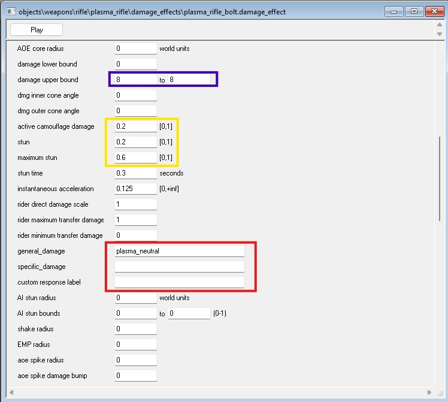
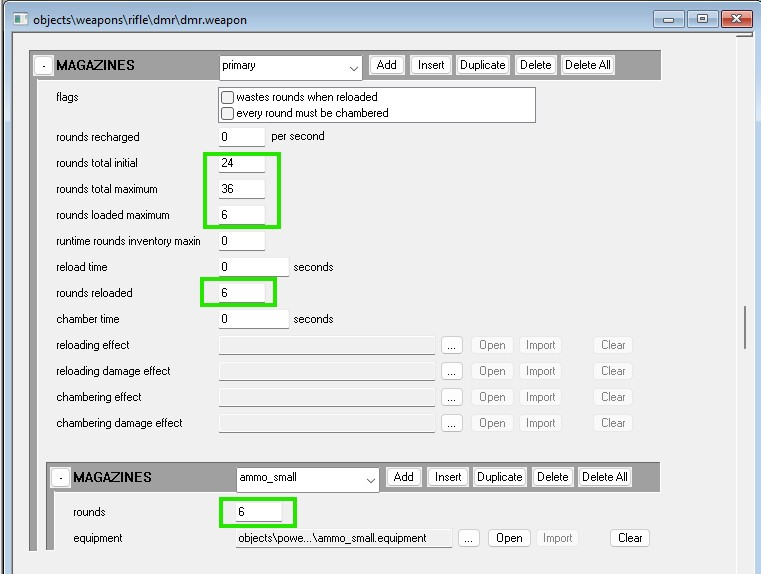

This guide provides general info on data types commonly used in tag editing and [scripting](~general/scripting) within the halo mod tools, intended to serve as an introduction and explain the logic behind each type.

# Real

This catch-all is a common type used for many fields, it represents real numbers such as 2, 0.4 or 3.6, essentially any number you could ever think of to measure a defined property (such as length, temperature or time).

## Float

The issue with reals is that computers cannot count infinitely precise, because of this computers interpret real as float, with this we get precision loss (better known as floating-point error) as the computer can only represent the *closest* calculated number to the anticipated real number. You likely won't need to worry about this in most modding situations.

## Fraction

Sometimes a field will ask for a fractional value, in such cases we use real to define a percentage. An example would be weapon heat fields which define heat in relation to **0** (no heat) and **1** (full heat), so a value of 0.44 will mean 44%

# Integer (int)

Integers represent **whole** numbers and whole numbers only, **no** decimals, integer range is determined by platform. Typically normal integer size is defined by the presence of shorts or longs, if longs are present then normal integers will be smaller than them, and vice versa with shorts.

## Unsigned Integer (uint)

Same as above but **without** the ability to use negative numbers (unsigned), thus doubling it's max value. 

# Short (integer)

A version of the integer data type scaled back for a smaller range of values compared to a normal integer. Typically assumed range is `-32,768` to `32,767`, For the purposes of Halo modding, shorts are 16 bit (same as assumed range).

## Unsigned Short

Same as above but unsigned, thus it's typically assumed max range is `0` to `65,535`

# Long (integer)

A version of the integer data type that compared to normal integers has a larger range, typically assumed range is `-2,147,483,648` to `2,147,483,647`

## Unsigned Long

Same as above but unsigned, typical range is `0` to `4,294,967,295`

# Boolean

In scripting you may often find yourself setting up a script that needs to wait for a condition, in such cases you may often use a boolean, which means `TRUE` **or** `FALSE`, though haloscript also allows true and false to also be represented by numbers: 1 = `TRUE` and 0 = `FALSE`.

# String

Some fields will ask for a string entry, this is where you can type normal words and letters, usually in reference to some other block that defines what these words mean. An example would be damage types (as found in H2-H4) where damage effect tags reference a string that the globals tag defines for a damage type and it's properties.

# Void

When declaring a script you may be asked for a return type upon script completion, in some cases `short` or `real` may be used, or you may choose to have no return type, in the case of the last option this is done by declaring a `void` return.