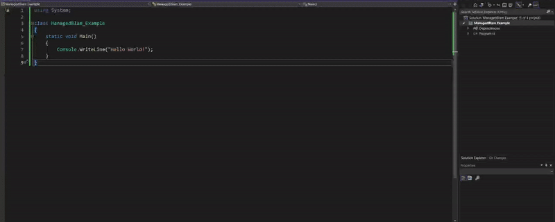
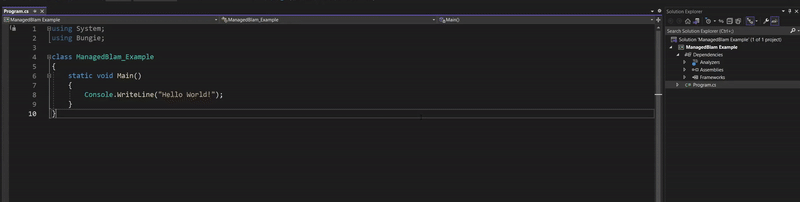

# Introduction
The ManagedBlam.dll is a wrapper that allows for direct in-code access to engine functions and tag data, examples being - reading tag data, manipulating tag fields, creating tag entries or tags from scratch and much more. It is available for all engines post-H2 (it was backported to H3 and ODST with the July 2023 update).

Of course this is an extremely powerful tool with practically endless possibilities and greatly increases the potential and speed of external helper programs. On this page, we will provide some basic information on getting ManagedBlam up and running in your dev environment, and some simple(ish!) code examples for doing things such as reading and writing tag field data.

Most information on this page applies across all engine versions - where there are known differences, such as the initialization code, it will be pointed out.

# Development environment
ManagedBlam is primarily used with the [C#](https://learn.microsoft.com/en-us/dotnet/csharp/) programming language. ManagedBlam also specifically requires `.NET 4.8`  - if you do not have the developer pack, you can get it [here](https://dotnet.microsoft.com/en-us/download/dotnet-framework/net48). You *will* get runtime errors if you are on a different version.

The IDE you use is of course your personal choice, but it is recommended to use [Visual Studio](https://visualstudio.microsoft.com/downloads/). At the most basic, you can start with a blank console application, as ManagedBlam has no special requirements beyond `.NET 4.8`. If you are unfamiliar with using external libraries (.dll) files, you can add the H3 ManagedBlam.dll to your VS project like so:
1. Create or load your solution in Visual Studio
2. In the `Solution Explorer` panel on the right, right-click your solution (should have a symbol like a small green C# inside a box).
3.  Hover over `Add`, then click `Project Reference` in the sub-menu to open the `Reference Manager`.
4. Click the `Browse` button in the bottom right.
5. Navigate to `H3EK\bin`, and open the `ManagedBlam.dll` file.
6. Back in the `Reference Manager` window, make sure the checkbox next to `ManagedBlam.dll` is ticked, the click `OK`.
7. ManagedBlam is now usable within your project! Add `using Bungie;` to the top of your C# program to import the library and get started.



# Settings in the .csproj file
There is a property we need to set in the .csproj file to avoid issues at runtime:
1. Open your .csproj file. You can do this either by opening the file in a text editor, or by double clicking the solution name in Visual Studio's `Solution Explorer` to open it there.
2. Inside the first `<PropertyGroup>` section, add this line: `<HighEntropyVA>false</HighEntropyVA>`
This section should now read similarly to this:
```
<PropertyGroup>
    <OutputType>Exe</OutputType>
    <TargetFramework>net4.8</TargetFramework>
    <HighEntropyVA>false</HighEntropyVA>
</PropertyGroup>
```
If you accidentally created the project using the wrong .NET version, or otherwise need to make sure that it is running `.NET 4.8`, this is also where you set that.
After updating and saving the .csproj file, *you will need to unload and reload the project in Visual Studio, or close and reopen Visual Studio for the changes to take effect*.



# Initialising ManagedBlam for Halo 3
This process differs slightly from the Reach+ ManagedBlam version exemplified on this page https://c20.reclaimers.net/hr/API/. ManagedBlam *must* be running in order for code to be able to open and edit tag files.
The line required to start ManagedBlam is `ManagedBlamSystem.InitializeProject()` - this must be run before any tag reading/manipulation code, with a reference to your H3EK root folder as the second argument:
```cs
string h3ek = "C:\\Program Files (x86)\\Steam\\steamapps\\common\\H3EK"
ManagedBlamSystem.InitializeProject(InitializationType.TagsOnly, h3ek);
```
Unlike in the Reach version where `ManagedBlam.Stop()` can be used to gracefully stop the ManagedBlam process, this function does not exist in the H3 version, and so you should not worry about tryint to close it properly.

# Loading a tag file into memory
This part is fairly straightforward - all manipulation of a tag file in memory is done after opening the tag by setting it to a variable. One common method is to use a `using` block that opens the relevant tag file, but getting the filepath in the right format can be a little tricky at first.
`Bungie.Tags.Tagfile()` doesn't take a simple filepath as its parameter, but rather a `Bungie.Tags.TagPath` variable.
You need two variables to generate this, the relative tag path and the short file extension. For example, the following will get you a `Bungie.Tags.TagPath` variable for the this scenario tag `"H3EK\tags\levels\solo\010_jungle\010_jungle.scenario"`:
```cs
var tag_path = Bungie.Tags.TagPath.FromPathAndType(@"levels\solo\010_jungle\010_jungle", "scnr*");
```
If you wish to convert a full filepath (e.g. from the drive letter to the file and extension) to a relative path that this function will accept, you can use the following:
```cs
scen_path = "C:\\Program Files (x86)\\Steam\\steamapps\\common\\H3EK\\tags\\levels\\solo\\010_jungle\\010_jungle.scenario";
var tag_path = Bungie.Tags.TagPath.FromPathAndType(Path.ChangeExtension(scen_path.Split(new[] { "\\tags\\" }, StringSplitOptions.None).Last(), null).Replace('\\', Path.DirectorySeparatorChar), "scnr*");
```
The short file extension is the 3 or 4 letter version of the file extension. If you aren't sure what this might be for a specific tag type, you can use the cache file reader/editor [Assembly](https://ci.appveyor.com/project/ThunderWaffle/assembly/build/artifacts) to check. Examples include:
* `scnr` - .scenario
* `hsc` - .scenario_hs_source_file
* `hlmt` - .model
* `mode` - .render_model
* `phmo` - .physics_model
* `sbsp` - .scenario_structure_bsp

Now you can use the `tag_path` variable to get the tag into memory:
```cs
using (var tagFile = new Bungie.Tags.TagFile(tag_path))
{
    // Tag manipulation code goes here
}
```

# Saving changes to a tag
Only one function required here - `.Save()`

Example:
```cs
using (var tagFile = new Bungie.Tags.TagFile(tag_path))
{
    // Tag manipulation code goes here
    //...
    //...
    tagFile.Save();
}
```
The `tagFile.Save()` line will save the current tag data in memory back to the original tag. This includes any and all changes you have made since opening the tag - this means that *it is not necessary to save after every tag data change*, only when you have finished making your changes. If you save repeatedly for no good reason, this will significantly slow down your program as each save takes about a second or so.

# Reading tag data, and adding new block entries
Want to read tag data into code? Need to add new entries to blocks with code? Accessing specific blocks/elements/fields within a tag can be done in at least two different ways:
1. Using the block, element and field indices (if they are known).
2. Using the `.SelectField()` function to access elements based on their names

It doesn't particularly matter which method you use, but option 2 will usually result in code that is easier to read. The first few examples that follow will use option 1, but and example of option 2 will be shown later.

See this example, which will add an extra zone to the `Zones` block of a scenario tag, and then adds a new area entry to the `Areas` block. As this requires knowing the amount of pre-existing zones, the first line is an example of reading data:
```cs
using (var tagFile = new Bungie.Tags.TagFile(tag_path))
{
    // Get the amount of zones already present in the scenario
    int zones_max_index = ((Bungie.Tags.TagFieldBlock)tagFile.Fields[83]).Elements.Count() - 1; // 83 is the zones block in a scenario

    // Add a new element to the zones block
    ((Bungie.Tags.TagFieldBlock)tagFile.Fields[83]).AddElement();
    
    // Add a new area, using the zones_max_index to know which zone to add it to
    ((Bungie.Tags.TagFieldBlock)((Bungie.Tags.TagFieldBlock)tagFile.Fields[83]).Elements[zones_max_index + 1].Fields[4]).AddElement();
    // The zones are the 84th field, we use the max index + 1 to locate the newly added zone, and the `Areas` block is the 5th field inside the zones block (indexes are 0-based)

    // Save the changes to the tag file
    tagFile.Save();
}
```

# Changing tag data
Let's continue with the previous example, but add some extra lines to set the name and flags of the new zone and area:
```cs
using (var tagFile = new Bungie.Tags.TagFile(tag_path))
{
    // Get the amount of zones already present in the scenario
    int zones_max_index = ((Bungie.Tags.TagFieldBlock)tagFile.Fields[83]).Elements.Count() - 1; // 83 is the zones block in a scenario

    // Add a new element to the zones block
    ((Bungie.Tags.TagFieldBlock)tagFile.Fields[83]).AddElement();
    
    // Add a new area, using the zones_max_index to know which zone to add it to
    ((Bungie.Tags.TagFieldBlock)((Bungie.Tags.TagFieldBlock)tagFile.Fields[83]).Elements[zones_max_index + 1].Fields[4]).AddElement();
    // The zones are the 84th field, we use the max index + 1 to locate the newly added zone, and the `Areas` block is the 5th field inside the zones block (indexes are 0-based)

    // Set the zone name, the name is the first field in the zones block
    var zone_name = (Bungie.Tags.TagFieldElementString)((Bungie.Tags.TagFieldBlock)tagFile.Fields[83]).Elements[zones_max_indes + 1].Fields[0];
    zone_name.Data = "our_new_zone_name";

    // Set the name of the new area
    var area_name = (Bungie.Tags.TagFieldElementString)((Bungie.Tags.TagFieldBlock)((Bungie.Tags.TagFieldBlock)tagFile.Fields[83]).Elements[zones_max_index + 1].Fields[4]).Elements[0].Fields[0];
    area_name.Data = "area_name_69420"

    // Set the flags of the new area
    var area_flags = (Bungie.Tags.TagFieldFlags)((Bungie.Tags.TagFieldBlock)((Bungie.Tags.TagFieldBlock)tagFile.Fields[83]).Elements[zones_max_index + 1].Fields[4]).Elements[0].Fields[1];
    area_flags.RawValue = uint.Parse("1");

    // Save the changes to the tag file
    tagFile.Save();
}
```

# Determining field indices
Should you be using the previously demonstrated method to access tag data, you will need to know the indices of the blocks/elements/fields that are relevant to what you want to edit. This can be a little tricky, as tag blocks often have hidden data (that doesn't even show up in Expert Mode).
Let's take the `Scenery` block within a `.scenario` tag as an example:
Looking at the block, the first two fields we can see are `type` and `name`. However if you try to access these with field indices of `0` and `1` respectively, you will get type casting errors. This is because there are hidden data fields padding the block. So how can we figure out the correct field indices without using a lengthy trial and error process? The Visual Studio debugger! By hitting a breakpoint on a line where field data is accessed within the block we want to introspect, we can press `View` on the `Value` section in the variables window to open the `IEnumerable Visualizer`, which shows us a table with all the block data!

Using this example line, where `20` is the block index of the `Scenery` block, `0` is to simple access the first scenery element, and 0 is to access the first field (but you could pick any):
```cs
var x = ((Bungie.Tags.TagFieldBlock)tagFile.Fields[20]).Elements[0].Fields[0].FieldName;
```
Setting a breakpoint on this line, and then stepping over it, allows us to view the returns in the variables window. Look for the last return that returns a `Bungie.Tags.TagField[]` type (`Bungie.Tags.TagElement.Fields.get`).
Click `View` next to the `Value` section of this line to open the `IEnumerable Visualizer` window.
Looking at this window, we can see that there are hidden fields with a custom type - we do not really need to worry about *what* they are, but rather that they exist and therefore offset the expected index of other fields.
From here, it is a simple job of counting the fields (remembering to start at zero) to determine the correct index for a given field. For the example we started with, we can count up and determine that the `type` field is actually index `1`, not `0`, and that the `name` field is actually index `3`, not `1`.

# Miscellaneous examples
## Setting a function value in a Reach shader tag
```cs
var tag = new Bungie.Tags.TagFile();
var tag_path = Bungie.Tags.TagPath.FromPathAndExtension(@"levels\solo\m10\shaders\040_garage_wall", "shader");
try
{
    tag.Load(tag_path);
    TagFieldCustomFunctionEditor func = (TagFieldCustomFunctionEditor)tag.SelectField("Struct:render_method[0]/Block:parameters[0]/Block:animated parameters[2]/Custom:animation function");
    func.Value.ClampRangeMin = 25;
    tag.Save();
}

finally
{
    tag.Dispose();
}
```

This code showcases a slightly different method for loading a tag into memory, and provides an example of using the `.SelectField()` method to select a tag field.


## Running ManagedBlam with Python
```py
# Requires the pythonnet module to be installed -> pip install pythonnet

import clr
import os

ek_path = r"path-to-ek"
mb_path = os.path.join(ek_path, 'bin', 'managedblam')
clr.AddReference(mb_path)
import Bungie

def main():
    startup_parameters = Bungie.ManagedBlamStartupParameters()
    Bungie.ManagedBlamSystem.Start(ek_path, callback(), startup_parameters)
    load_tag_and_print_some_fields(r"globals\ai_globals.ai_globals")

def load_tag_and_print_some_fields(relative_tag_path):
    tag, tag_path = get_tag_and_path(relative_tag_path)
    tag.Load(tag_path)
    block_data = tag.SelectField("Block:data")
    first_element = block_data.Elements[0]
    for field in first_element.Fields:
        print(field)

def get_tag_and_path(user_path):
    """Return the tag and bungie tag path for tag creation"""
    relative_path, tag_ext = get_path_and_ext(user_path)
    tag = Bungie.Tags.TagFile()
    tag_path = Bungie.Tags.TagPath.FromPathAndExtension(relative_path, tag_ext)

    return tag, tag_path

def get_path_and_ext(user_path):
    """Splits a file path into path and extension"""
    return user_path.rpartition(".")[0], user_path.rpartition(".")[2]

def callback():
    pass

if __name__ == '__main__':
    main()
```

This example, courtesy of `Crisp`, exemplifies using ManagedBlam via the [Python](https://www.python.org/) programming language instead of `C#`. This is particularly useful when developing ManagedBlam programs that interact with [Blender](https://www.blender.org/), as it's API uses `Python`. *This is only confirmed to work with Reach+ ManagedBlam*.


## Using helper functions
```py
def Element_set_field_value(self, element, field_name: str, value):
    """Sets the value of the given field by name. Requires the tag element to be specified as the first arg. Returns the field"""
    field = element.SelectField(field_name)
    field_type_str = str(field.FieldType)
    match field_type_str:
        case "StringId":
            field.SetStringData(value)
        case "ShortInteger":
            field.SetStringData(value)
        case "LongEnum":
            field.SetValue(value)
        case "Reference":
            field.Path = self.TagPath_from_string(value)
        case "WordInteger":
            field.SetStringData(value)
    return field
```

Another Python example provided by `Crisp`, this is a helper function that makes setting field values much easier to read in large sections of code. *This is only confirmed to work with Reach+ ManagedBlam*. See the following code for the use case:

```py
# Set up shader parameters
block_parameters = struct_render_method.SelectField("parameters")
 for m in maps:
      element = self.Element_from_field_value(
           block_parameters, "parameter name", m['parameter name'])
       if element is None:
            element = block_parameters.AddElement()
            self.Element_set_field_value(
                element, "bitmap flags", "1")  # sets override
            # sets anisotropic (4) EXPENSIVE
            self.Element_set_field_value(element, "bitmap filter mode", "6")

        self.Element_set_field_value(element, "parameter type", "bitmap")
        self.Element_set_field_values(element, m)
```

## Tool for transferring H2 zones/areas/firingpositions to a H3 scenario
[Tool's Github page](https://github.com/Pepper-Man/h2_h3_zones_patcher_mb)

## Additional examples
If you have experience with ManagedBlam and wish to provide more examples for this page, either make a pull request with the code, or contact `pepperman` on `Discord`!