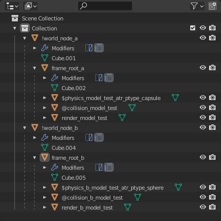

**FBX** is a geometry file format which can be exported by most major [3D software](~art-tools#modeling). Bungie originally relied on in-house or proprietary exporters to create ASS, JMS, JMA, JMI, and GR2. Modern versions of Tool re-released by 343i now support converting FBX to these formats to bridge the gap. Note that [community-made addons](~halo-asset-blender-development-toolset) can shorten this process by exporting directly to ASS, JMS, and JMA.

This page will go over how to setup your scene to export FBX files for users who use 3D editing software with no available intermediate source file exporters. All rules of standard [JMS](~jms), [animation source files](~animation-data), and [ASS](~ass) workflow in Blender or 3DS Max apply so be sure to read up on that.

# Missing file format features
FBX covers enough ground to be a decent format to use for multiple 3D software solutions. Unfortunately, there are a few things the converter can't do because of FBX limitations or incomplete implementation.

## Halo 1
The FBX command fully supports all of the features in the JMS and JMA file formats. You should have no issues converting files here.

## Halo 2
FBX supports converting to JMS, JMA, ASS, and JMI and covers most of the features these files have. There are a few exceptions however. This includes:
* JMS
	* Instance XREF - A feature that allowed designers to link other files to the 3DS Max scene and then leave a file path in the JMS file. Tool would then read this path and compile the file along with placing it at the location it was in your 3DS scene.
	* Constraints - This includes ragdolls, hinges, car wheels, point to point, prismatic. These items were used to set how physics models interacted with the game world.
	* Bounding Sphere - Set the bounding radius for bulk objects automatically.
	* Marker Groups - More of a limitation with Blender but since it does not allow for duplicate object names this means that marker groups are unsupported for now.
* ASS
	* Material Effect String - Unused string item in ASS file. 
	* Instance XREF - A feature that allowed designers to link other files to the 3DS Max scene and then leave a file path in the JMS file. Tool would then read this path and compile the file along with placing it at the location it was in your 3DS scene.
	* Primitive shapes - Only supported mesh type is "MESH". This shouldn't be an issue as primitives go unused in ASS.
* JMA
	* Biped Controller - A way to set the transform of the biped skeleton itself instead of the nodes in the skeleton. 
	
## Halo 3
FBX supports converting to JMS, JMA, ASS, and JMI and covers most of the features these files have. There are a few exceptions however. This includes:
* JMS
	* Instance XREF - A feature that allowed designers to link other files to the 3DS Max scene and then leave a file path in the JMS file. Tool would then read this path and compile the file along with placing it at the location it was in your 3DS scene.
	* Constraints - This includes ragdolls, hinges, car wheels, point to point, prismatic. These items were used to set how physics models interacted with the game world.
	* Bounding Sphere - Set the bounding radius for bulk objects automatically.
	* Marker Groups - More of a limitation with Blender but since it does not allow for duplicate object names this means that marker groups are unsupported for now.
* ASS
	* Material Effect String - Unused string item in ASS files. 
	* Instance XREF - A feature that allowed designers to link other files to the 3DS Max scene and then leave a file path in the JMS file. Tool would then read this path and compile the file along with placing it at the location it was in your 3DS scene.
	* Primitive shapes - Only supported mesh type is "MESH". This shouldn't be an issue as primitives go unused in ASS and are basically treated like an empty object.
	* Light Objects - Not all features used by light objects are supported. They should still be written though.
	* UVW - The W coordinate is not supported. This may have been used for water.
	* Material Strings - A set of parameters to set behaviors for materials such as two sided or lightmap settings. Standard material symbols should still work but some features may not be available.
* JMA
	* Biped Controller - A way to set the transform of the biped skeleton itself instead of the nodes in the skeleton. 
* QUA
	* No support for this file format at the time of writing. QUA was a file format exported by the Ubercam plugin for the 3D animating software known as Maya. It was used to animate many of the cutscenes in the game from how the camera moved around to the focus and depth of field.
* Skies - Halo 3 had a plugin built into 3DS that allowed designers to generate skies with various parameters. There is currently no way for users to do this.
	
Some of the above features may get support with future updates. Others may require different solutions such as community exporters.

# JMS
This section will cover how to prepare an FBX file for JMS conversion in tool.

## Region assignment
3DS Max uses named selection sets and Blender uses face maps to assign regions to a set of faces. The FBX file format doesn't store this kind of info so it instead uses the materials to assign regions through a special set of characters. To start get a material and append the following to the end like so:


The string `_atr_lpr_` will be used as a separator between the material name and the material properties. Set the material properties in the name like so:

## Halo 1 Material Format
```sh
# (MATERIAL_NAME)_atr_lpr_(REGION_NAME)
masterchief_atr_lpr_arms
masterchief_atr_lpr_body
masterchief_atr_lpr_legs
```

* MATERIAL_NAME - The name of our material
* REGION_NAME - The name of our region

You can create multiple materials with the same name but different regions to add multiple regions. The above example will give you one material named "masterchief" but 3 regions named "arms", "body", and "legs" that different parts of the model will use depending on what material they had assigned.

## Halo 2/3 Material Format
```sh
# (MATERIAL_NAME)_atr_lpr_(LEVEL_OF_DETAIL) (PERMUTATION_NAME) (REGION_NAME)
masterchief_atr_lpr_L5 base arms
masterchief_atr_lpr_L5 base body
masterchief_atr_lpr_L5 base legs
```

* MATERIAL_NAME - The name of our material
* LEVEL_OF_DETAIL - Set the level of detail for our mesh. The valid options are as follows.
    * L1 - Super low quality
    * L2 - Low quality
    * L3 - Medium quality
    * L4 - High quality
    * L5 - Super high quality.
    * L6 - Cinematic quality. Only used when forced through scripts.
* PERMUTATION_NAME - The name of our permutation
* REGION_NAME - The name of our region

In the example above will create a single material named `masterchief` with three different regions each having one permutation. All of these meshes belong to super high quality LOD. The combination a face uses will depend on the material it has assigned.

## Halo 2/3 Object Format
```sh
# (OBJECT_SYMBOL)(OBJECT_NAME)_atr_ptype_(OBJECT_TYPE)
$box_atr_ptype_box
$soccer_ball_atr_ptype_sphere
$canister_atr_ptype_capsule
$teapot_atr_ptype_mesh
```

* OBJECT_SYMBOL - The type of object this mesh is. Should always be "$".
* OBJECT_NAME - The name of our object.
* OBJECT_TYPE - The physics mesh type. The list is as follows.
	* box
	* sphere
	* capsule
	* mesh

## Blender armature support
The FBX converter will not take your armature unless it uses the Halo node prefix setup. All bones in an armature should start with the prefix "bip01_". The underscore can be a space if you rather have it like that. Rename the armature to "bip01" both on the object and object data name to ensure that it can find the skeleton properly.


# JMI

This section will cover how to prepare an FBX file for JMI conversion in tool. JMI files are a bulk export format that allows you to export multiple root nodes from one scene. Bulk commands can then be used on Tool's side to generate multiple crate or scenery objects at once. It can also be used to generate decorator_set tags and particle modes in Halo 2 and Halo 3



## World nodes
The start of any good JMI scene is our world nodes. World nodes are objects in our scene defined by the `!` object symbol. These objects define the start of a set of models for the exporter or converter to processed separately from the rest. You can refer to the example image above to see how a JMI node is defined.

Once the node is set you can define any nodes and objects you normally would for exporting your mesh and set the world node as the parent of these objects.

The end result of the example in the image above would be a JMI file along with two folders containing the model data linked to the world node.

# JMA
This section will cover how to prepare an FBX file for JMA conversion in tool.

## Blender armature support
The FBX converter will not take your armature unless it uses the Halo node prefix setup. All bones in an armature should start with the prefix "bip01_". The underscore can be a space if you rather have it like that. Rename the armature to "bip01" both on the object and object data name to ensure that it can find the skeleton properly.


## Starting and ending frames
The FBX converter will also let you set the starting and ending frame for the file you are converting. These are optional args and do not need to be defined.

# ASS

This section will cover how to prepare an FBX file for ASS conversion in tool.

## Instance support
You only have two requirements for instance geometry to work properly. You must link the object data and the object name should start with a `%` symbol. Refer to documentation for your 3D software on how to link object data.

# Blender FBX export options
If you're exporting an FBX from Blender then there are a few options you should set before exporting to ensure you're getting what you're expecting. The options to set are as follows:


* Add Leaf Bones - Find this option under Armature and disable it. This option will add new bones to the end of branches to terminate them. Bit of a problem since it changes your skeleton and the converter isn't going to fix it for you.
* Apply Scalings - Change this option from the default(All Local) to FBX Units Scale. This will prevent your exported models from being around 100x larger once converted than they were in your scene.

With this you are finally ready to export models from your scene to FBX so that you can convert them for ingame use. If you have any issues make sure you blame anyone but me.