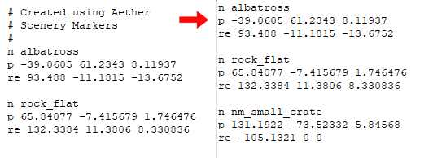

Aether is a tool which supports externally baking [lightmaps](~) within 3D software like [3ds Max](~3dsmax) rather than with the editing kit's built-in [radiosity](~h1-tool#lightmaps) process. This allows for much higher resolution lightmaps and shorter baking times since external software is much better optimized for lighting.

# Overview
Aether is an intermediary program to simplify the process of creating lightmaps for [Halo CE](~h1) in an external modelling application such as 3ds Max. It provides a simplified workflow to get the lightmap mesh and textured mesh into your modelling application, as well as all lighting significant map objects in their correct place and rotation. It also provides an easy way to get your custom lightmaps into the bitmap format that Halo uses.

As all of your lighting is being done externally, you can set all of your shaders' radiosity power values to zero and use a copy of your sky that has no lights when running debug lightmaps. This will make it go alot quicker on bigger maps.

3d programs are able to render blown out whites and colors without overexposing them. However, Halo's lightmaps turn an ugly yellow-white color if they approach full white as part of a color gradient. It is generally better to avoid "inverse" falloff settings for omni lights and instead using the near and far attenuation settings. This will keep brightness levels under control and will prevent hotspots right near the lights themselves. Halo's lightmaps are more sensitive to brightness than 3ds Max renders are. What looks like a dimly-lit room in 3ds Max will be a well-lit one in Halo. You may require experimenting to get the balance right.

Sometimes, an import of a perfectly fixed lightmap will result in bizarrely skewed UVs in some places. In rare cases, this is caused by a disconnect between 3ds Max and Halo. If this happens, you will not be able to fix the lightmaps in 3ds Max. You must reimport them from Halo. This will show the related errors, and let you fix them.

# Process
In order to externally light a [BSP](~scenario_structure_bsp), all information about shadow-casting surfaces must be present. Aether supports extracting the BSP itself (crucially including its lightmap UVs), [bitmaps](~bitmap) with transparency, and instanced shadow-casting fixed objects like [scenery](~).

The extracted assets can then be exported for [3ds Max](~3dsmax) or Maya using Aether's interactive GUI. Though Aether does not support [Blender](~), it should be possible to transfer assets using a 3D interchange format like _collada_ if the supported software is also available.

Within the 3D software, the artist can place lights and bake lighting to a texture using the BSP's lightmap UVs. Aether can then compile the texture back to [bitmap](~) format and optionally [dither][dithering] the texture to avoid banding, since lightmaps are 16-bit.

# Aether tutorial for 3ds Max
## Aether - loading and exporting a BSP

Open up Aether and you'll see the main window.


Aether's Main Window


Go to File>New Project, or press the lightbulb button, and select the scenario file you are making lightmaps for. Then, save the Aether project file somewhere easy to remember. Aether will tick over for a bit depending on your computers speed and then load your project.

Aether copies the information it needs into the project file so no alterations are made to your scenario or BSP files. This is the safest option, but does have the disadvantage that if you change something in your scenario (object placement for example) or recompile your BSP, your changes will *not* be reflected in your Aether project file. You will need to create a new Aether project to adjust for your changes.

Depending on what you have in your map, the objects on the left will list all of your object types. Removing a type from the list will remove all instances of that type from the exported files. This can be handy if you have object types that do not cast a shadow or emit any light, and you don't want them in your exported files.


Aether loaded with a file


The BSP list selects which BSP you want to perfrom your actions on. With a BSP selected you have the option to Edit that BSPs' lightmap bitmap or export the data you need in 3ds Max.

If the Edit button is unavailable then your BSP has no lightmap bitmap associated with it, meaning you probably haven't debug lightmapped it yet.

Hit the export button now.

The options here should be pretty self explanatory, but you'll need at least the BSP and Lightmaps options selected for this tutorial. If you don't have all of your bitmaps exported already hit either All for all the bitmaps in all of the BSPs' shaders, or Diffuse only for just the diffuse textures. If you have objects in your map that you want to cast shadows or emit light then you need the Marker Export options checked too. Overwrite should be checked unless you've edited bitmaps for example, but you'll definately need it if you've recompiled your BSP as the lightmap UV's will be different. Hit export and Aether will output all of the info you need into your scenarios relative data directory.

## Importing BSP
Next you need to import your BSP into 3ds Max. Import the textured mesh .obj file using the settings provided on this page. Aether does export a material (.mtl) file with the BSP, which should also be imported by putting the filename into the material box. So now you should have your BSP imported, but it probably looks completely grey at the moment. You could go through each material and set them to show in viewport but the MaxScript supplied with Aether does this for you. Select the "MaxScript" tab and hit the "MaxScript button". If you don't have the script set to load on startup, hit Run Script and select it. To actually show the script interface you will need to reselect it in the Utilities drop down list, even if it is already shown.

With your BSP mesh selected, press the Fix Materials button. This will set all of its materials to show in viewport and will set all of the diffuse bitmaps' Alpha Source value to None (Opaque), which stops the material from being rendered too white. You should be left with a correctly rendered BSP.

## Importing objects

To import your objects, you are going to need TheGhost's [gbxmodel importer](http://hce.halomaps.org/index.cfm?fid=1972), so install that first. In the Aether script utility there is a _Marker Tools_ button. Press it and a window will pop up which is what we are going to use to place all of our objects. Hit the _Open Marker File_ button and select one of the `.aemk` files you exported from Aether earlier. Once you have done so, the Markers list will be populated with the object types used in the map. Look at the first object in the scenery list. It's handy to have your scenario open in [Guerilla](~h1-guerilla) at this point so that you can easily find out what gbxmodel you need to open, as well as what bitmaps you need to extract.


If importing markers causes the script utility to hang/freeze, try deleting any comment lines (beginning with "#") at the start of the marker file. For example:




Fix materials aftermath


For beavercreek the object is "mp_pine_tree_small" so go ahead and open that objects gbxmodel using the GBXModel importer and import it into the scene. If you want to, now is a good time to set up the imported objects material. So put the appropriate bitmaps into the diffuse and opacity channels of the objects material(s). Now, to place it into the scene, it's as simple as selecting the object and hitting Create Instances.


Lights can be linked to geometry before instancing


For scenarios with multiple BSPs' the objects from other BSPs' will also be included in the marker file so you will have to manually remove unnecessary objects from the scene. When multiple objects are selected the script will use the topmost object of your selections hierarchy as the pivot when translating the instances. This tends to be the frame node. When placing objects with multiple permutations you can use the "Random Perm" option to place a randomly selected object in your selection in each postion. However, this has the drawback of only working with single objects, so objects with a hierarchy won't work.

When placing something such as teleporter shields, set them to be non-renderable before you instance them so you don't have to do it later. The reason for putting non renderable meshes in the scene is that if such an object emits light you can put the light(s) in place and link them to the object before you instance it so that the lights get instanced as well; and having the model there means you can put them in the right orientation.

TIP: The script can also use Xref'ed objects so if you already have your object saved in a max file somewhere you don't need to import and set it up every time, and can have a library of preset objects with materials and lights set up ready to use.

Repeat this process with all of the objects used in your map and you should end up with your BSP populated and ready for lighting.


Beavercreek with all scenery imported


## Lighting
The first step to creating your lighting solution should be to set up your skys lights. So open up your scenarios sky tag if it has one. When adding lights that are in the sky, use directional lights as these emit parallel light rays, which is why they are most suitable as suns and other big light sources. To get your light in the right orientation, the Y and P angles correspond to Z and Y respectively. The actual position of your lights isn't important as they are emitting parallel rays, however you should make sure that they encompass the entire map.

A consideration that needs to be made is that light will pass through backfaces, which in most cases can be easily resolved by surrounding the level with a blocking mesh. Your blocking mesh should either have no smoothing group applied, or a completely different smoothing group to what it connects to.


A blocking mesh will prevent unwanted lighting


With your sky's lights now in the correct place you can start putting the rest of your lights in. This bit is largely down to user preference but just putting omni lights where light emitting surfaces are is generally the easiest method. To do this you first get the material ID's of the light emitting surfaces in the BSP. In beavercreek these are 14-16; not including the "greenlight" material, as the teleporter lights were placed earlier with the teleporter shield. Next, go into the BSPs face selection mode and make sure you have no faces selected. Go to the Surface Materials->Material box and turn off Clear Selection. Then put the material ID's into the Select ID box one by one and hit the Select ID button each time. This will select all of your light emitting faces. Invert your selection and hit the Hide button in the selection section.


Omni lights added to light emitting faces


Now only your light emitting faces are visible. Create an omni light and set it up however you want. To place your lights, it is easiest to use 3D snaps, snapping to edge midpoints to get the light in the centre of a quad, but you can move them manually if you want. Once a light is in the right position make sure it is pushed out a little bit from the face so that the face itself is lit.

You can move the pivot of the light before snapping them to faces so that you don't have to offset them individually. Make sure that for duplicate lights, you instance them rather than copy them so that should you want to make changes you can do so by only changing one.

Now you should have your level filled with lights.

Shadows are, again, largely down to use preference but it's easiest to turn on raytracing for all small lights with default settings, while using area shadows on the sky lights as they can produce nice soft shadows. Setting the area shadows length and width to ~200.0 works well for beavercreek.

If you render your level now you'll probably notice that there's a lot of dark areas which isn't what you want, but those black areas will be handled by global illumination, using the Light Tracer. Open up the render dialog and go to the "Advanced Lighting tab. Select "Light Tracer" from the drop down list. There are a number of options that will affect your resulting lightmaps, but Rays Per Sample, Filter Size and Bounces are the important ones. A high rays per sample will create very accurate lighting, however this will increase your render time and since we are rendering to (relatively) small lightmaps, about 4 rays should be plenty. Filter size determines how much a ray should be scaled in order to merge together and produce a smooth result. If your light tracing looks blotchy, increase the filter size until it smooths out, or increase the ray count. The filter size was set at 8.0 for this tutorial. Bounces defines how many times a ray should reflect off of surfaces in the scene before stopping. This can seriously damage your render time so keep it small. Around 3 tends to be sufficient.

These settings should be ample for lightmap usage as any more accuracy probably won't be noticable in the finished lightmap. If you're still getting black areas, some ambient light added in the Light Tracer settings can lift the really dark areas that might still occur.

## Importing lightmap
Before we get into importing the lightmap, there's some cleanup we need to do on the BSP first. If you're lighting a stock Halo BSP, there may well be non-renderable lighting blocks used to put light into areas that have no other light-emitting faces. These need to be removed. Any decal faces, including lights that are just above a surface, also need to go as the lightmap mesh will have no UVs for them and they'll just get in the way. You'll also need to remove water planes. Basically get rid of any faces that aren't affected by lighting. It's easy enough to select such faces by material ID and detach them to a non-renderable object. You should also check that any transparent surfaces, such as ladders or trees, have their transparency correctly set up.

Once all that's out of the way, you can import your lightmap obj using the same settings as before, but making sure you are not importing it as one mesh. The reason for this will be explained later in the tutorial. Once imported, you first want to select all of the lightmap meshes and go to their properties, through the right click menu. In the "General" tab you need to untick "Receive Shadows and Cast Shadows" so that the lightmap meshes don't interfere with shadow casting, and then in the "Adv. Lighting" tab tick the "Exclude from Adv. Lighting Calculations" box so that they don't interfere with the light tracer.

We are going to be using the Projection modifier to bake our lighting out, which is basically the same technique used to create normal maps. It works by projecting a ray down from the UV mesh onto the lit BSP mesh and storing the lighting value that is there into a bitmap. So to start, select all of your lightmap meshes and add a Projection modifier. You can turn off the cage as we aren't going to be using it. You then need to select the textured BSP using the "Pick" button. That's it for the Projection modifier.

Before rendering, it can be helpful to use [Photoshop](~) or [other 2D software](~gimp) to smooth out some lighting glitches, or to create layers of artificial light by blending multiple renders. It's best to do this near the end of the lightmpapping process, as redoing the same changes with each render can become very frustrating.

Never import lightmap geometry from Halo one lightmap at a time. Usertool's import process relies on the lightmaps being in order from 0 to whatever, and 3ds Max will mess that order up if a lightmap is imported later. It's all or nothing.

## 3ds Max - rendering lightmaps
You now need to select all of your lightmap meshes and open the Render to Texture dialog. You can open it by either going Rendering->Render to Texture, or by hitting 0. Once opened, go about half way down the dialog box and there will be three options for "Individual", "All Selected" and "All Prepared". For now you want "All Selected" checked so that the changes you make will be duplicated to all the meshes selected.

There are a number of options that need to be set in this dialog. Set Path to where you want your bitmaps to be saved to. Set your padding to about 4 which will prevent black bits occuring on UV edges. Then tick the Enable projection box and make sure your projection modifier is selected in the list next to it. Hit the options button. The "Projection Options" dialog box will pop up with some settings we need to check. But first click the "Setup.." button, which will bring up your renderer options. Uncheck "Antialiasing", "Filter Maps" and "Enable Global Supersampler". This will make your render time faster.
Completed render to texture dialog

TIP: If you want a smoother result turn on antialiasing and supersampling, but do not turn on filter maps as this will normally cover your lightmaps with black/red dots.

With that done close the renderer options dialog so you are back to the "Projection Options" dialog. Set the method to raytrace, turn off "Use Cage" and set the offset to 1.0 or above. The cage is used when you are having to fit a low poly object around a high poly object but since we are using meshes that are exactly the same we don't need it. If you set the offset below 1.0 it tends to miss out random pixels and is generally bad, whereas making it too high can make it hit the wrong geometry if your mesh is quite complex. Finally set "Resolve Hit" to "Closest". Thats it for "Projection Options" so close it. Back in the Render to Texture dialog, set the Mapping Coordinates to Use Existing Channel so that the lightmap UV's created by Tool are used rather than overriding them with automatic unwrap UVs.


Completed render to texture dialogue


The Output area is where you set up what bitmaps you want to create and how big you want them to be. Hit Add and select Lighting Map. You can leave everything default.

Earlier, the reason you didn't import the lightmap meshes as a single object is because the bitmaps that are applied to them are of varying sizes and you can't set individual sizes for sub objects in the Render to Texture dialog. So, open up Aether again and open your bitmap for editing. This is just so we can see the current bitmap sizes being used for each lightmap. Next, in the Render to Texture dialog change the "All Selected" option to "Individual" so that we can change each individual object in our selection rather than editing them all at once. Near the top of the dialog there is a list with all of the currently selected meshes in it. Select the object at the top of the list. This is lightmap 0, so go to lightmap 0 in Aether and look at its size. For beavercreek the size is 256x128, but we want higher resolution bitmaps so quadrupling the bitmap size means we are creating a bitmap that is 1024x512. Therefore in Max set the width and height of lightmap 0 to 1024 by 512. You will need to do this for all of the lightmap meshes.

There is a limit to how much bitmap data a bitmap tag is permitted to hold so if your BSP has alot of lightmaps you may need to reduce your bitmap sizes to only double the original size to make them fit. If you are using an earlier version of 3ds Max, you might only have a width value, so set that to the larger of the width or height values, as Aether can scale your bitmap when you import it. It's advised to use a minimum bitmap size of 128x128, because if you have a lot of bitmaps that are small you can set their size to 128x128 when "All Selected" is used and only have to manually change those that end up being bigger than 128x128.

Finally set "Individual" back to "All Selected". Now you are all set up and ready to render your lightmaps. So hit render. Even if you set rectangular bitmap resolutions such as 1024x512, they will still render as a square but will be scaled before being saved. You will notice that the render preview will show it rendering with diffuse maps and such, but the output bitmaps will only have the lighting information.

## Aether - importing lightmap bitmaps
While your lightmaps are being rendered (Which could take some time depending on your lighting complexity and computer speed) you can set up your bitmaps in Aether ready to import your new lightmaps. So open Aether and open your bitmap for editing. Check the "Resize on Import" check box on all lightmaps. Now, because Max will save each bitmap it completes before starting the next one, you can start importing your new lightmaps while the next ones are being rendered. So, find out which bitmaps are done and hit Import on the corresponding lightmap in Aether. Open the new bitmap and change the import width and height to your intended size. Hit continue and your bitmap will be imported. Once all lightmaps are imported close the bitmap and say yes to save changes. Then close Aether.

Aether doesn't release the lightmap bitmap until you close the program. So if you get file in use errors when compiling your map, make sure Aether is closed.

Thats it! lightmap done! Now that you have everything set up you can create quick iterations of your lighting without having to wait a day for lightmaps to run.

## Custom lightmap UVs
Custom Lightmap UVs
Example of poor UVs by Tool

When viewing your custom lightmaps you may find that there are areas that aren't correctly lit, or where the shadows dont line up, etc. This is because Tool wasn't designed to make lightmap UVs suited to high resolution lightmaps, which results in small overlaps and lack of consideration for lightmap UV alignment, which would otherwise be unnoticable with Halos default lightmaps. To tackle this problem a custom lightmap UV importer has been developed for UserTool so that designers have complete control over their lightmaps UVs and can now remove such problems.

The recommended workflow for creating completely custom lightmap UVs:


Example of poor UVs by Tool


1. Finalise your BSP.
    It would be unwise to make custom lightmaps for each BSP iteration as it does take time to Re-UV a BSP so you don't want to be doing it over and over again.
2. Import your current lightmap UVs into your modelling program.
    Export your current lightmaps with Aether and import them into your modelling program. As with the custom lightmap tutorial you should import them as seperate objects.
3. Re UV the lightmap meshes.
     You can UV your meshes as you would UV any other mesh, however, DO NOT change the mesh in any other way as this could change the surface indicies of the mesh and it would not match those that are in the BSP.
     Your UVs also have to be in the range of 0.0 - 1.0 on both axes.
4. Export your lightmap meshes to an obj file.
     The OBJ file needs to at least have vertex position and texture coordinates to be valid. Normals is unnecessary but adding them shouldn't cause problems.
6. Import your new lightmap UVs into the BSP using the import-lightmap-uv command in UserTool.
     The command requires two arguments. <bsp-file> which is the target BSP relative to the tags directory and <obj-file> which is the source OBJ relative to your data directory.
7. Do your custom lighting as normal, either using the tutorials method or your own.

If you only want to fix the problem areas created by Tool then you would do a quick custom lighting solution to highlight the problem areas and then do the above but only fixing those areas.

[dithering]: https://en.wikipedia.org/wiki/Dither
