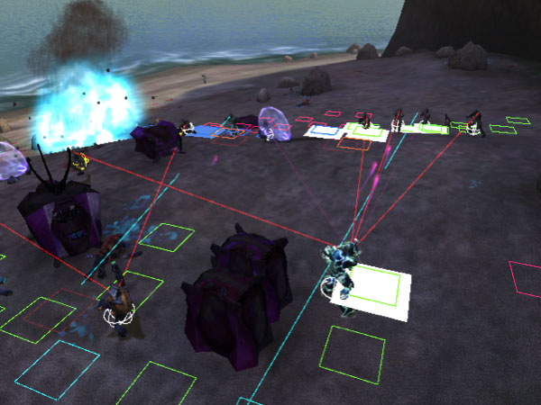

<figure>
  
  <figcaption>
    
AI firing positions and sight lines are shown for the b30 beach assault.

  </figcaption>
</figure>

design goals
limited knowledge
react to the player
breaking point, fleeing, berserking, retreating, defensive states
transparent through process
predictable reactions -- cause-effect stimuli with no "fuzzy" emotions
no hidden state -- inform the player of their state via language, posutre, gesutre, focus of attention

# Knowledge model
AI have an _individual knowledge model_ with "real" perception. They do not have complete knowledge of the battlefield but rather remember key objects and rely on cues like visibility and sound to track their enemy. This allows the AI to be fooled and act more believably.

# Behaviour
According to quotes from Halo's AI programmer _Chris Butcher_, certain AI behaviours are triggered by hard-coded conditions. For example, the Grunt behaviour of fleeing when their Elite is killed is hard-coded, likely based on the [actor type][actor#tag-field-type]. Marines have an individual behaviour to stand close, but not too close, to other Marines, giving the illusion of them working in groups.

# Encounters and squads
In Halo1, AIs were grouped into encounters, which also contained a set of firing positions. Various subsets of this set were made available to the AI depending on the state of their encounter (have many of their allies been killed? Are they winning? Are they losing? This was a mapping that was created by a designer).

# Firing positions
_Firing positions_ are discrete locations stored in the [scenario's][scenario] encounters where the AI can stand when trying to perform a spatial behaviour. They are _not_ pathfinding nodes, but rather a pathfinding _destination_. The AI will weigh and select firing positions based on a few factors:

* Line of sight
* Distance to target
* Proximity of cover
* Proximity of friends and enemies
* Obstructions and hazards like vehicles, grenades, etc.

For example, the AI may move to a firing position if it has a clear line of sight to an enemy's _presumed_ location (remember, AI have an incomplete knowledge model) and is in [the actor's desired range][actor_variant#tag-field-desired-combat-range].

# Pathfinding
Pathfinding is the system which allows AI to navigate between locations. It relies in part on precomputed [BSP pathfinding data][scenario_structure_bsp#pathfinding-data] and [object pathfinding spheres][model_collision_geometry#pathfinding-spheres] to know available paths and possible obstacles.

When the AI wishes to navigate, this data and static obstructions like scenery are considered to create a "smoothed" path of nodes between source and destination, which the AI then follows. It is believed that the [A* pathfinding algorithm][a-star-wiki] is used at this phase. While following the path, dynamic obstructions like [units][unit] may force the AI to make detours to continue to its next node but it does not need to recalculate the entire path.

On a more technical level, pathfinding spheres are projected to the AI's ground-plane at pathfinding time to become pathfinding _discs_.

The maximum pathfinding distance that Halo's engine permits is 3276.7 world units, an _extremely_ long distance. For reference, the distance between bases in Timberland is approximately 100 units. Halo 1 does not support pathfinding in moveable reference frames, unlike [Halo 2][h2] for Scarabs.

[a-star-wiki]: https://en.wikipedia.org/wiki/A*_search_algorithm
