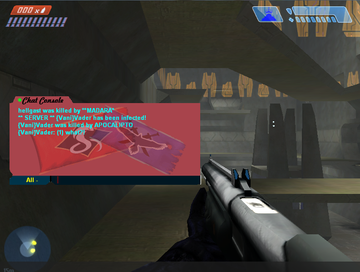

This page documents the function and format of some of Halo's installation and profile files, excluding [maps][map].

# haloce.exe
This is the main game executable containing the bulk of the game's code.

By default, Halo is only permitted to use [2 GB][2gb] of virtual memory. By applying value `0x2F` at offset `0x136` in the 1.0.10 executable, Halo can be made "Large Address Aware" and capable of using up to 4GB of virtual memory. The same upgrade can be made to [Sapien][sapien#limits]. The increased limit can be useful for client mods like Chimera which run in the game's address space and allocate more memory to speed up map loading.

# strings.dll
The library `strings.dll` is required to run the game or dedicated server. It serves multiple purposes:

* Contains the loading screen image seen before the main menu (all other loading screens are contained in maps).
* Displays crash messages in a window.
* Prior to the 1.10 patch, it contained the `executable_is_valid` checksum.

This DLL is often replaced with a modified version for mods like SAPP and Chimera 1.0+.

# Watson
The `Watson` directory and the files within it (`dw15.exe`, various `dwintl.dll`) are a defunct crash reporting system. The server to which crash reports would be sent is no longer running. The mod Chimera disables this to allow the game to crash faster without waiting for a network timeout.

# Multiplayer chat: Keystone, controls, and content

<figure>
  
  <figcaption>
    
An example modified chat editbox, a practice abandoned after mods implemented better chat systems.

  </figcaption>
</figure>

The library `Keystone.dll` is used for [Halo's][h1] stock multiplayer chat functionality. The game also requires the library `msxml.dll` to be installed on the system for chat to display properly. An installer can be found in Halo's `redist` directory.

The `controls` directory is host to `Controls.ini` and `Controls.dll`, a library used to render the multiplayer chat input box. It makes use of files in the `content` directory, which can be modified to customize the appearance of the chat "editbox" and text input.

The mods HAC2 and Chimera implement their own chat display to replace Halo's, which becomes unreliable after tabbing out of the game.

# Profile and savegame files
Halo stores savegames and profile data according to the system-wide `%USERPROFILE%` environment variable. On Windows, with a system drive "C" and user name "John", Halo saves can be found in `C:\Users\You\Documents\My Games\Halo CE\`. When running on Linux under Wine, the default location is `~/My Games/Halo CE/`. Some mods also store data under this location, such as downloaded maps.

## lastprof.txt
The file `lastprof.txt` stores the path of the last used profile so it can be loaded at game startup. It has a fixed length of 256 bytes and a very simple structure:

1. An ASCII-encoded absolute filesystem path to a _profile directory_, with trailing `\`. For example, `C:\Users\You\My Documents\My Games\Halo CE\savegames\New001\`
2. A null byte, `0x00`, to terminate the above string.
3. The ASCII-encoded string `lam.sav` (not a typo).
4. `0x00` padding until the end of the file.

## savegame.bin
The file `savegames\<profile name>\savegame.bin` contains the saved state of the campaign, allowing progress to be resumed when reloading from a checkpoint or returning from the main menu. The Halo console commands `game_save` and `game_revert` use this file. A newly-created savegame.bin is typically filled with `NULL` to `0x480000` (4,718,592 bytes).

The structure of this file is not fully mapped out, however some fields are known:

<table>
  <thead>
    <tr>
      <th>Field</th>
      <th>Offset</th>
      <th>Type</th>
      <th>Comments</th>
    </tr>
  </thead>
  <tbody>
    <tr>
      <td>Last difficulty</td>
      <td><code>0x1E2</code></td>
      <td><code>uint8</code></td>
      <td>
        <table>
          <thead>
            <tr>
              <th>Option</th>
              <th>Value</th>
            </tr>
          </thead>
          <tbody>
            <tr><td>Easy</td><td><code>0x0</code></td></tr>
            <tr><td>Normal</td><td><code>0x1</code></td></tr>
            <tr><td>Heroic</td><td><code>0x2</code></td></tr>
            <tr><td>Legendary</td><td><code>0x3</code></td></tr>
          </tbody>
        </table>
      </td>
    </tr>
    <tr>
      <td>Last played scenario</td>
      <td><code>0x1E8</code></td>
      <td><code>ASCII string</code></td>
      <td>An ASCII-encoded <a href="/h1/tags/scenario">scenario</a> tag path, null-terminated and 32 characters max. An example value is <code>levels\b30\b30</code> for The Silent Cartographer.</td>
    </tr>
  </tbody>
</table>

## blam.sav
The file `savegames\<profile name>\blam.sav` contains the configuration for a HCE profile. Information includes player details, video/audio/network settings, and input configurations (mouse, keyboard, and controller). It has a fixed length of 8192 bytes (8 [KiB][]). File integrity is verified by a checksum at the end of the file; if the checksum does not match the game will fall back to default settings.

The file structure follows, but is known to be incomplete:

<table>
  <thead>
    <tr>
      <th>Section</th>
      <th>Field</th>
      <th>Offset</th>
      <th>Type</th>
      <th>Comments</th>
    </tr>
  </thead>
  <tbody>
    <tr>
      <td rowspan="2">Profile</td>
      <td>Name</td>
      <td><code>0x0002</code></td>
      <td><code>utf-16 string</code></td>
      <td>The player's name, encoded as <a href="https://en.wikipedia.org/wiki/UTF-16">UTF-16</a>. Null-terminated with a maximum of 11 characters (excluding the null).</td>
    </tr>
    <tr>
      <td>Colour</td>
      <td><code>0x011A</code></td>
      <td><code>uint8</code></td>
      <td>
        
Determines the player's <a href="/h1/engine/hard-coded-data/#multiplayer-armor-colors">multiplayer armour colour</a>.

        <table>
          <thead>
            <tr>
              <th>Option</th>
              <th>Value</th>
            </tr>
          </thead>
          <tbody>
            <tr><td>White</td><td><code>0x00</td></tr>
            <tr><td>Black</td><td><code>0x01</td></tr>
            <tr><td>Red</td><td><code>0x02</td></tr>
            <tr><td>Blue</td><td><code>0x03</td></tr>
            <tr><td>Gray</td><td><code>0x04</td></tr>
            <tr><td>Yellow</td><td><code>0x05</td></tr>
            <tr><td>Green</td><td><code>0x06</td></tr>
            <tr><td>Pink</td><td><code>0x07</td></tr>
            <tr><td>Purple</td><td><code>0x0A</td></tr>
            <tr><td>Cyan</td><td><code>0x0B</td></tr>
            <tr><td>Cobalt</td><td><code>0x0C</td></tr>
            <tr><td>Orange</td><td><code>0x0D</td></tr>
            <tr><td>Teal</td><td><code>0x0E</td></tr>
            <tr><td>Sage</td><td><code>0x0F</td></tr>
            <tr><td>Brown</td><td><code>0x10</td></tr>
            <tr><td>Tan</td><td><code>0x11</td></tr>
            <tr><td>Maroon</td><td><code>0x14</td></tr>
            <tr><td>Salmon</td><td><code>0x15</td></tr>
            <tr><td>Random (default)</td><td><code>0xFF</td></tr>
          </tbody>
        </table>
      </td>
    </tr>
    <tr>
      <td rowspan="6">Controls</td>
      <td>Invert vertical axis</td>
      <td><code>0x012F</code></td>
      <td><code>bool</code></td>
      <td></td>
    </tr>
    <tr>
      <td>Keyboard bindings</td>
      <td><code>0x0134-0x020D</code></td>
      <td><code>binding array</code></td>
      <td>
        
An array of 109 keyboard input mappings, each a little-endian uint16 (2 bytes long). The entries are ordered roughly like the rows of a QWERTY keyboard, with each position in the array corresponding to a certain input key. If a key is unbound, then that position holds the bytes <code>0x7F 0xFF</code>. Otherwise, bound keys store a value representing the game function the key is mapped to, for example <code>0x05 0x00</code> for flashlight.

        
Some example key offsets are:

        <table>
          <thead>
            <tr>
              <th>Offset</th>
              <th>Key</th>
            </tr>
          </thead>
          <tbody>
            <tr><td><code>0x156</code></td><td>1</td></tr>
            <tr><td><code>0x158</code></td><td>2</td></tr>
            <tr><td>...</td><td>...</td></tr>
            <tr><td><code>0x166</code></td><td>9</td></tr>
            <tr><td><code>0x168</code></td><td>0</td></tr>
            <tr><td><code>0x16A</code></td><td>-</td></tr>
            <tr><td><code>0x18E</code></td><td>A</td></tr>
          </tbody>
        </table>
        
The following are some example bindings which can appear at these locations. Remember that these values are stored in little-endian form in the file, so <code>0x0013</code> becomes the bytes <code>0x13 0x00</code>.

        <table>
          <thead>
            <tr>
              <th>Value</th>
              <th>Function</th>
            </tr>
          </thead>
          <tbody>
            <tr><td><code>0x0005</code></td><td>Flashlight</td></tr>
            <tr><td><code>0x0013</code></td><td>Move Forward</td></tr>
            <tr><td><code>0x0014</code></td><td>Move Backward</td></tr>
            <tr><td><code>0x0015</code></td><td>Move Left</td></tr>
            <tr><td><code>0x0016</code></td><td>Move Right</td></tr>
            <tr><td><code>0x0017</code></td><td>Look Up</td></tr>
            <tr><td><code>0x0018</code></td><td>Look Down</td></tr>
            <tr><td><code>0x0019</code></td><td>Look Left</td></tr>
            <tr><td><code>0x001A</code></td><td>Look Right</td></tr>
          </tbody>
        </table>
      </td>
    </tr>
    <tr>
      <td>Gamepads and other devices</td>
      <td><code>0x020E-0x93A</code></td>
      <td><code>binding array</code></td>
      <td>
        
Similar to above, but a much larger array for all other types of mappable input devices such as gamepads. It is not known what all the devices and their inputs are, but some are mapped:

        <table>
          <thead>
            <tr>
              <th>Device</th>
              <th>Offset</th>
              <th>Input</th>
            </tr>
          </thead>
          <tbody>
            <tr><td rowspan="14">Mouse</td><td><code>0x20E</code></td><td>Left Button</td></tr>
            <tr><td><code>0x210</code></td><td>Middle Button</td></tr>
            <tr><td><code>0x212</code></td><td>Right Button</td></tr>
            <tr><td><code>0x214</code></td><td>Button 4</td></tr>
            <tr><td><code>0x216</code></td><td>Button 5</td></tr>
            <tr><td><code>0x218</code></td><td>Button 6</td></tr>
            <tr><td><code>0x21A</code></td><td>Button 7</td></tr>
            <tr><td><code>0x21C</code></td><td>Button 8</td></tr>
            <tr><td><code>0x21E</code></td><td>Horizontal Axis -</td></tr>
            <tr><td><code>0x220</code></td><td>Horizontal Axis +</td></tr>
            <tr><td><code>0x222</code></td><td>Vertical Axis -</td></tr>
            <tr><td><code>0x224</code></td><td>Vertical Axis +</td></tr>
            <tr><td><code>0x226</code></td><td>Wheel -</td></tr>
            <tr><td><code>0x228</code></td><td>Wheel +</td></tr>
          </tbody>
        </table>
      </td>
    </tr>
    <tr>
      <td>Unknown</td>
      <td><code>0x0953</code></td>
      <td><code>uint8</code></td>
      <td></td>
    </tr>
    <tr>
      <td>Horizontal sensitivity</td>
      <td><code>0x0954</code></td>
      <td><code>uint8</code></td>
      <td>Ranges in value from 0 (minimum) to 10 (maximum).</td>
    </tr>
    <tr>
      <td>Vertical sensitivity</td>
      <td><code>0x0955</code></td>
      <td><code>uint8</code></td>
      <td>Ranges in value from 0 (minimum) to 10 (maximum).</td>
    </tr>
    <tr>
      <td rowspan="11">Video</td>
      <td>Horizontal resolution</td>
      <td><code>0x0A68</code></td>
      <td><code>uint16</code></td>
      <td>This value is little-endian, for example the value 1280 is encoded as the bytes <code>0x00 0x05</code>.</td>
    </tr>
    <tr>
      <td>Vertical resolution</td>
      <td><code>0x0A6A</code></td>
      <td><code>uint16</code></td>
      <td>This value is little-endian, for example the value 960 is encoded as the bytes <code>0x03 0xC0</code>.</td>
    </tr>
    <tr>
      <td>Refresh rate</td>
      <td><code>0x0A6C</code></td>
      <td><code>uint8</code></td>
      <td>Options: 59 (<code>0x3B</code>), 60 (<code>0x3C</code>)</td>
    </tr>
    <tr>
      <td>Unknown</td>
      <td><code>0x0A6D</code></td>
      <td><code>pad(2)</code></td>
      <td>Example value: <code>0x00 0x02</code></td>
    </tr>
    <tr>
      <td>Frame rate</td>
      <td><code>0x0A6F</code></td>
      <td><code>uint8</code></td>
      <td>Options: vsync off (<code>0x0</code>), vsync on (<code>0x1</code>), 30 FPS (<code>0x2</code>)</td>
    </tr>
    <tr>
      <td>Specular</td>
      <td><code>0x0A70</code></td>
      <td><code>bool</code></td>
      <td></td>
    </tr>
    <tr>
      <td>Shadows</td>
      <td><code>0x0A71</code></td>
      <td><code>bool</code></td>
      <td></td>
    </tr>
    <tr>
      <td>Decals</td>
      <td><code>0x0A72</code></td>
      <td><code>bool</code></td>
      <td></td>
    </tr>
    <tr>
      <td>Particles</td>
      <td><code>0x0A73</code></td>
      <td><code>uint8</code></td>
      <td>Options: off (<code>0x0</code>), low (<code>0x1</code>), high (<code>0x2</code>)</td>
    </tr>
    <tr>
      <td>Texture quality</td>
      <td><code>0x0A74</code></td>
      <td><code>uint8</code></td>
      <td>Options: low (<code>0x0</code>), medium (<code>0x1</code>), high (<code>0x2</code>)</td>
    </tr>
    <tr>
      <td>Gamma</td>
      <td><code>0x0A76</code></td>
      <td><code>uint8</code></td>
      <td>Options: +1 (<code>0xD8</code>), +2 (<code>0xDF</code>), +3 (<code>0xE6</code>)</td>
    </tr>
    <tr>
      <td rowspan="7">Audio</td>
      <td>Master volume</td>
      <td><code>0x0B78</code></td>
      <td><code>uint8</code></td>
      <td>Ranges in value from 0 (minimum) to 10 (maximum).</td>
    </tr>
    <tr>
      <td>Effects volume</td>
      <td><code>0x0B79</code></td>
      <td><code>uint8</code></td>
      <td>Ranges in value from 0 (minimum) to 10 (maximum).</td>
    </tr>
    <tr>
      <td>Music volume</td>
      <td><code>0x0B7A</code></td>
      <td><code>uint8</code></td>
      <td>Ranges in value from 0 (minimum) to 10 (maximum).</td>
    </tr>
    <tr>
      <td>Sound quality</td>
      <td><code>0x0B7D</code></td>
      <td><code>uint8</code></td>
      <td>Options: low (<code>0x0</code>), medium (<code>0x1</code>), high (<code>0x2</code>)</td>
    </tr>
    <tr>
      <td>Sound variety</td>
      <td><code>0x0B7F</code></td>
      <td><code>uint8</code></td>
      <td>Options: low (<code>0x0</code>), medium (<code>0x1</code>), high (<code>0x2</code>)</td>
    </tr>
    <tr>
      <td>EAX</td>
      <td><code>0x0B7B</code></td>
      <td><code>bool</code></td>
      <td></td>
    </tr>
    <tr>
      <td>Hardware acceleration</td>
      <td><code>0x0B7C</code></td>
      <td><code>bool</code></td>
      <td></td>
    </tr>
    <tr>
      <td rowspan="7">Network</td>
      <td>Server name</td>
      <td><code>0x0D8C</code></td>
      <td><code>utf-16 string</code></td>
      <td>Stores the last-used hosting server name for the "create game" menus (both LAN and Internet). Null-terminated with a maximum of 31 characters (excluding the null).</td>
    </tr>
    <tr>
      <td>Password</td>
      <td><code>0x0EAC</code></td>
      <td><code>utf-16 string</code></td>
      <td>Stores the last-used hosting password for the "create game" menus (both LAN and Internet). Null-terminated with a maximum of 8 characters (excluding the null).</td>
    </tr>
    <tr>
      <td>Max players</td>
      <td><code>0x0EBF</code></td>
      <td><code>uint8</code></td>
      <td>Stores the last-used max players for hosting a server. The value <code>0x00</code> actually corresponds to the minimum of 2 players, with <code>0x0E</code> being the maximum of 16.</td>
    </tr>
    <tr>
      <td>Connection type</td>
      <td><code>0x0FC0</code></td>
      <td><code>uint8</code></td>
      <td>Options: 56k (<code>0x0</code>), dsl-low (<code>0x1</code>), dsl-avg (<code>0x2</code>), dsl-high (<code>0x3</code>), t1/lan (<code>0x4</code>)</td>
    </tr>
    <tr>
      <td>Server address</td>
      <td><code>0x0FC2</code></td>
      <td><code>utf-16 string</code></td>
      <td>Stores the default server address for Direct IP connections. This value could contain an IP and port separated by a ":" or even a DNS host name. Encoded as UTF-16, null-terminated with a maximum of 31 characters (excluding the null).</td>
    </tr>
    <tr>
      <td>Server port</td>
      <td><code>0x1002</code></td>
      <td><code>uint16</code></td>
      <td>This value is little-endian, for example the value 2302 is encoded as the bytes <code>0xfe 0x08</code>.</td>
    </tr>
    <tr>
      <td>Client port</td>
      <td><code>0x1004</code></td>
      <td><code>uint16</code></td>
      <td>This value is little-endian, for example the value 2303 is encoded as the bytes <code>0xff 0x08</code>.</td>
    </tr>
    <tr>
      <td>Other</td>
      <td>CRC32 checksum</td>
      <td><code>0x1FFC</code></td>
      <td><code>uint32</code></td>
      <td>The blam.sav has a CRC-32 checksum appended at the end of it. The value is actually stored in its complement equivalent (i.e. bitwise NOT). The checksum validates the data between <code>0x000</code> and <code>0x1FFC</code> - the checksum itself is not included! There is a relatively large amount of padding before this field, and it is the final 4 bytes of the file. Due to the complement on this field, the entire file will <em>always</em> have a CRC of <code>0xFFFFFFFF</code>. Therefore the file can be verified by either comparing its overall CRC to <code>0xFFFFFFFF</code>, or comparing the CRC of its prior sections to the complement of this field.
      </td>
    </tr>
  </tbody>
</table>

[KiB]: https://en.wikipedia.org/wiki/Kibibyte
[2gb]: https://en.wikipedia.org/wiki/2_GB_limit
