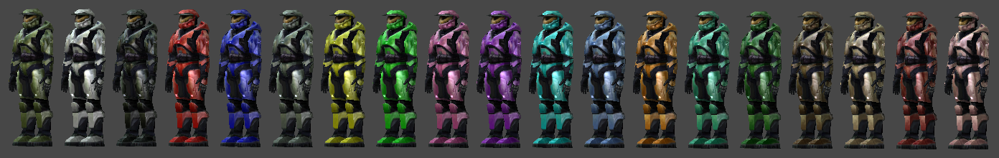

There are lots of hard-coded values in Halo's engine, such as the multiplayer
armor color. These values do not typically appear anywhere in tag data, and
cannot be directly changed or controlled.

# Multiplayer armor colors

<figure>
  <a href="armor_colors.png">
    
  </a>
  <figcaption>
    <p>Spartan armor colors with shaders as they appear ingame.</p>
    <p>The far-left is the single-player color, which comes from the
    unit (usually biped) tag and is <strong>not</strong> hard-coded</p>
  </figcaption>
</figure>

In multiplayer, the player's armor color value comes from this hard-coded list and is stored in their [profile file][files#blam-sav]. For non-player unit color change, see [actor_variant][] & [object][].

Color name matches the name as it appears in the game's menu. HEX and RBG color
values are both listed in red-green-blue order. Note that these colors will look
somewhat different ingame, since cubemaps and specular maps are applied over the
diffuse color listed here.

| Name   | Color                                       | HEX       | RGB           |
|--------|---------------------------------------------|-----------|---------------|
| White  |<div style="background: #FFFFFF">&nbsp;</div>| `#FFFFFF` | 255, 255, 255 |
| Black  |<div style="background: #000000">&nbsp;</div>| `#000000` |   0,   0,   0 |
| Red    |<div style="background: #FE0000">&nbsp;</div>| `#FE0000` | 254,   0,   0 |
| Blue   |<div style="background: #0201E3">&nbsp;</div>| `#0201E3` |   2,   1, 227 |
| Gray   |<div style="background: #707E71">&nbsp;</div>| `#707E71` | 112, 126, 113 |
| Yellow |<div style="background: #FFFF01">&nbsp;</div>| `#FFFF01` | 255, 255,   1 |
| Green  |<div style="background: #00FF01">&nbsp;</div>| `#00FF01` |   0, 255,   1 |
| Pink   |<div style="background: #FF56B9">&nbsp;</div>| `#FF56B9` | 255,  86, 185 |
| Purple |<div style="background: #AB10F4">&nbsp;</div>| `#AB10F4` | 171,  16, 244 |
| Cyan   |<div style="background: #01FFFF">&nbsp;</div>| `#01FFFF` |   1, 255, 255 |
| Cobalt |<div style="background: #6493ED">&nbsp;</div>| `#6493ED` | 100, 147, 237 |
| Orange |<div style="background: #FF7F00">&nbsp;</div>| `#FF7F00` | 255, 127,   0 |
| Teal   |<div style="background: #1ECC91">&nbsp;</div>| `#1ECC91` |  30, 204, 145 |
| Sage   |<div style="background: #006401">&nbsp;</div>| `#006401` |   0, 100,   1 |
| Brown  |<div style="background: #603814">&nbsp;</div>| `#603814` |  96,  56,  20 |
| Tan    |<div style="background: #C69C6C">&nbsp;</div>| `#C69C6C` | 198, 156, 108 |
| Maroon |<div style="background: #9D0B0E">&nbsp;</div>| `#9D0B0E` | 157,  11,  14 |
| Salmon |<div style="background: #F5999E">&nbsp;</div>| `#F5999E` | 245, 153, 158 |

# Engine-referenced tag paths
These [tag paths][tags#tag-references-and-paths] are directly referenced by the game engine at runtime. Not every map needs to have these, but depending on which ones are missing, different things can happen. Maps might not load, menus might not appear, sounds might not play, etc.

## unicode_string_list
Xbox only:
```
ui\shell\main_menu\player_profiles_select\button_set_short_descriptions
```

All platforms:
```
ui\multiplayer_game_text
ui\random_player_names

ui\shell\main_menu\credits_screen
ui\shell\main_menu\map_list_short
ui\shell\main_menu\map_list_oneline
ui\shell\main_menu\mp_map_list

ui\shell\main_menu\multiplayer_type_select\join_game\join_game_rules_strings
ui\shell\main_menu\multiplayer_type_select\join_game\join_game_ticker_labels

ui\shell\main_menu\player_profiles_select\button_set_long_descriptions
ui\shell\main_menu\player_profiles_select\joystick_set_defaults_descriptions
ui\shell\main_menu\player_profiles_select\joystick_set_short_descriptions
ui\shell\main_menu\player_profiles_select\profile_description_labels

ui\shell\main_menu\settings_select\player_setup\player_profile_edit\color_edit\colors_list
ui\shell\main_menu\settings_select\player_setup\player_profile_edit\controls_setup\controls_axis_direction_names
ui\shell\main_menu\settings_select\player_setup\player_profile_edit\controls_setup\controls_device_labels
ui\shell\main_menu\settings_select\player_setup\player_profile_edit\controls_setup\controls_gamepad_names
ui\shell\main_menu\settings_select\player_setup\player_profile_edit\controls_setup\controls_keyboard_button_names
ui\shell\main_menu\settings_select\player_setup\player_profile_edit\controls_setup\controls_mouse_button_names

ui\shell\main_menu\settings_select\multiplayer_setup\item_options_edit\var_weapon_set
ui\shell\main_menu\settings_select\multiplayer_setup\player_options_edit\player_options_labels
ui\shell\main_menu\settings_select\multiplayer_setup\player_options_edit\var_invisible_players
ui\shell\main_menu\settings_select\multiplayer_setup\player_options_edit\var_maximum_health
ui\shell\main_menu\settings_select\multiplayer_setup\player_options_edit\var_number_of_lives
ui\shell\main_menu\settings_select\multiplayer_setup\player_options_edit\var_odd_man_out
ui\shell\main_menu\settings_select\multiplayer_setup\player_options_edit\var_respawn_time
ui\shell\main_menu\settings_select\multiplayer_setup\player_options_edit\var_respawn_time_growh
ui\shell\main_menu\settings_select\multiplayer_setup\player_options_edit\var_shields
ui\shell\main_menu\settings_select\multiplayer_setup\player_options_edit\var_suicide_penalty
ui\shell\main_menu\settings_select\multiplayer_setup\playlist_edit\ctf_edit\ctf_labels
ui\shell\main_menu\settings_select\multiplayer_setup\playlist_edit\ctf_edit\var_assault
ui\shell\main_menu\settings_select\multiplayer_setup\playlist_edit\ctf_edit\var_captures_to_win
ui\shell\main_menu\settings_select\multiplayer_setup\playlist_edit\ctf_edit\var_flag_at_home
ui\shell\main_menu\settings_select\multiplayer_setup\playlist_edit\ctf_edit\var_flag_must_reset
ui\shell\main_menu\settings_select\multiplayer_setup\playlist_edit\ctf_edit\var_single_flag
ui\shell\main_menu\settings_select\multiplayer_setup\playlist_edit\ctf_edit\var_time_limit
ui\shell\main_menu\settings_select\multiplayer_setup\playlist_edit\koth_edit\koth_labels
ui\shell\main_menu\settings_select\multiplayer_setup\playlist_edit\koth_edit\var_moving_hill
ui\shell\main_menu\settings_select\multiplayer_setup\playlist_edit\koth_edit\var_score_to_win
ui\shell\main_menu\settings_select\multiplayer_setup\playlist_edit\oddball_edit\oddball_labels
ui\shell\main_menu\settings_select\multiplayer_setup\playlist_edit\oddball_edit\var_ball_spawn_count
ui\shell\main_menu\settings_select\multiplayer_setup\playlist_edit\oddball_edit\var_ball_type
ui\shell\main_menu\settings_select\multiplayer_setup\playlist_edit\oddball_edit\var_random_start
ui\shell\main_menu\settings_select\multiplayer_setup\playlist_edit\oddball_edit\var_score_to_win
ui\shell\main_menu\settings_select\multiplayer_setup\playlist_edit\oddball_edit\var_speed_with_ball
ui\shell\main_menu\settings_select\multiplayer_setup\playlist_edit\oddball_edit\var_trait_with_ball
ui\shell\main_menu\settings_select\multiplayer_setup\playlist_edit\race_edit\race_labels
ui\shell\main_menu\settings_select\multiplayer_setup\playlist_edit\race_edit\var_laps_to_win
ui\shell\main_menu\settings_select\multiplayer_setup\playlist_edit\race_edit\var_race_type
ui\shell\main_menu\settings_select\multiplayer_setup\playlist_edit\race_edit\var_team_play
ui\shell\main_menu\settings_select\multiplayer_setup\playlist_edit\race_edit\var_team_scoring
ui\shell\main_menu\settings_select\multiplayer_setup\playlist_edit\slayer_edit\slayer_labels
ui\shell\main_menu\settings_select\multiplayer_setup\playlist_edit\slayer_edit\var_death_bonus
ui\shell\main_menu\settings_select\multiplayer_setup\playlist_edit\slayer_edit\var_kill_in_order
ui\shell\main_menu\settings_select\multiplayer_setup\playlist_edit\slayer_edit\var_kill_penalty# UNUSED?
ui\shell\main_menu\settings_select\multiplayer_setup\playlist_edit\slayer_edit\var_kills_to_win
ui\shell\main_menu\settings_select\multiplayer_setup\playlist_edit\slayer_edit\var_team_play
ui\shell\main_menu\settings_select\multiplayer_setup\teamplay_options_edit\teamplay_options_labels
ui\shell\main_menu\settings_select\multiplayer_setup\teamplay_options_edit\var_friendly_fire
ui\shell\main_menu\settings_select\multiplayer_setup\teamplay_options_edit\var_friendly_fire_penalty
ui\shell\main_menu\settings_select\multiplayer_setup\vehicle_options_edit\var_vehicle_set
ui\shell\main_menu\settings_select\multiplayer_setup\vehicle_options_edit\var_vehicles_respawn
ui\shell\main_menu\settings_select\multiplayer_setup\vehicle_options_edit\vehicle_options_labels

ui\shell\strings\common_button_captions
ui\shell\strings\default_player_profile_names
ui\shell\strings\game_variant_descriptions
ui\shell\strings\loading
ui\shell\strings\temp_strings
```

## ui_widget_definition
Xbox only:
```
ui\shell\main_menu\multiplayer_type_select\connected\pregame\connected_pregame_screen
```

All platforms:
```
ui\shell\main_menu\main_menu

ui\shell\multiplayer_game\pause_game\1p_pause_game
ui\shell\multiplayer_game\pause_game\2p_pause_game
ui\shell\multiplayer_game\pause_game\4p_pause_game

ui\shell\solo_game\pause_game\pause_game_split_screen
ui\shell\solo_game\pause_game\pause_game

ui\shell\solo_game\player_help\player_help_screen_a10
ui\shell\solo_game\player_help\player_help_screen_a30
ui\shell\solo_game\player_help\player_help_screen_a50
ui\shell\solo_game\player_help\player_help_screen_b30
ui\shell\solo_game\player_help\player_help_screen_b40
ui\shell\solo_game\player_help\player_help_screen_c10
ui\shell\solo_game\player_help\player_help_screen_c20
ui\shell\solo_game\player_help\player_help_screen_c40
ui\shell\solo_game\player_help\player_help_screen_d20
ui\shell\solo_game\player_help\player_help_screen_d40

ui\shell\error\error_modal_fullscreen
ui\shell\error\error_modal_halfscreen
ui\shell\error\error_modal_qtrscreen
ui\shell\error\error_nonmodal_fullscreen
ui\shell\error\error_nonmodal_halfscreen
ui\shell\error\error_nonmodal_qtrscreen
```

## font
```
ui\gamespy
ui\large_ui
ui\small_ui
```

## virtual_keyboard
```
ui\english
```

## bitmap
```
ui\shell\bitmaps\cursor
ui\shell\bitmaps\background
ui\shell\bitmaps\team_background
ui\shell\bitmaps\team_icon_slayer
ui\shell\bitmaps\team_icon_race
ui\shell\bitmaps\team_icon_oddball
ui\shell\bitmaps\team_icon_king
ui\shell\bitmaps\team_icon_ctf
ui\shell\bitmaps\trouble_brewing
ui\shell\bitmaps\white
```

## globals
```
globals\globals
```

## scenario
```
levels\ui\ui
```

## sound_looping
```
sound\music\title1\title1
```

## sound
```
sound\sfx\ui\flag_failure
sound\sfx\ui\back
sound\sfx\ui\forward
sound\sfx\ui\cursor
```
