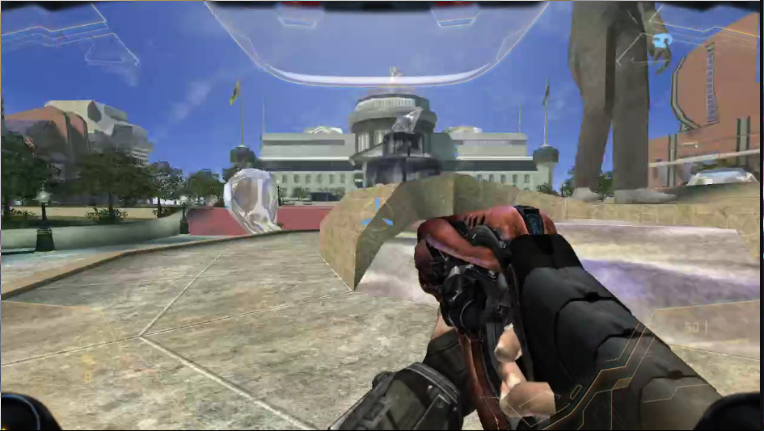

The **Halo engine**, colloquially called the **Blam! engine** by the community, is the proprietary game engine powering [Halo][h1]. It was developed in-house at Bungie and has undergone significant evolution over the series' expansion. According to a [Jason Jones interview][jones-interview], the engine has its roots in [Myth][]:

> Halo didn't begin as a strategy game but the engine it uses started out that way. The engine Halo uses began as a next-generation Myth terrain engine, with polygonal units.

By 2001's standards, the engine and asset tools were fairly innovative and powerful, combining techniques like portal-based occlusion, radiosity, particles, AI and pathfinding, dynamic physics, advanced shaders, and a scripting engine. It was written in C and C++.

# Architecture
Blam! is not a generic game engine like Unreal or Unity; it was purpose built to implement a sandbox shooter. Concepts like [projectiles][projectile], [wind][], and [vehicles][vehicle] are part of the engine, and it is not possible to add new systems to the game which were not required to build the kind of gameplay Halo has now. However, the systems which _do_ exist are highly data-driven through the use of [tags][]. Aside from writing singleplayer scripts (part of the [scenario][] tag), map authors can expect not to have to write any code to build new experiences.

Tags come in expected types only and can be seen as the "interface" to the game. All customizable assets and gameplay parameters are represented as tags within [map files][map], with tags forming a dependency tree via references. When the game loads a map, it will use the included tags to drive game systems such as AI, weapons, vehicles, rendering, physics, and more.

See also:

* [Map loading][map#map-loading]
* [The renderer][renderer]
* [The physics engine][physics-engine]
* [AI system][ai]
* [Sound system][sound-system]
* [In-memory game state][game-state]
* [Scripting engine][scripting]
* [Netcode][]

Note that on Xbox, the engine makes some in-memory [tag edits][tool#hardcoded-tag-patches] for balancing.

# Other games

The Halo engine was not just used for the Halo series. Bungie co-founder [Alex Seropian][alex] went on to found [Wideload Games][wideload] and used the engine for [Stubbs the Zombie in Rebel Without a Pulse][stubbs] as well as a prototype of [Hail to the Chimp][chimp-proto]. In fact, it is possible to extract [tags][] from Stubbs using [Refinery][mek] and recompile levels for Halo.

Another lesser-known use was in the [Shadowrun prototype][shadowrun-prototype].

[stubbs]: https://en.wikipedia.org/wiki/Stubbs_the_Zombie_in_Rebel_Without_a_Pulse
[wideload]: https://en.wikipedia.org/wiki/Wideload_Games
[alex]: https://en.wikipedia.org/wiki/Alex_Seropian
[chimp-proto]: https://hiddenpalace.org/Hail_to_the_Chimp_(Nov_15,_2006_prototype)
[shadowrun-prototype]: https://www.youtube.com/watch?v=I-uJLTLqYpA
[jones-interview]: https://web.archive.org/web/20000815110240/http://www.insidemacgames.com/features/99/jones/jones.shtml
[myth]: https://en.wikipedia.org/wiki/Myth_(series)
