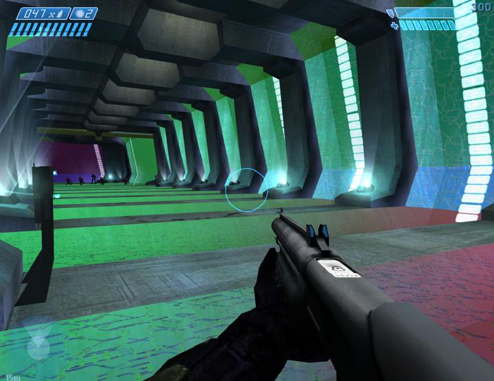

The **renderer** is the system of [Halo's engine][engine] responsible for drawing the scene to the screen. Each [edition][h1] of Halo has a slightly different renderer. Halo uses a traditional Z-buffered forward rendering approach using the DirectX 9 API and shader version 2.0. When Halo was released for PC, programmable shader support in user hardware was not as widespread as today, so the renderer can be configured with [argumements][arguments#graphics-options] to use older shader versions or even [fixed function][ff] compatibility.

# PC regressions

<figure>
  
  <figcaption>
    
The glass shader with bump-mapped reflections renders incorrectly in Custom Edition.

  </figcaption>
</figure>

The renderer needed to be adapted for the range of user hardware for the PC port and it was based on a pre-release version of Xbox. For example, [shader_transparent_generic][] tags were converted to [shader_transparent_chicago][] (or extended) tags. The game could also now exceed 30 frames per second and outpace the simulation tick rate. As a result, there are numerous graphical issues and regressions compared to the released Xbox version. Some issues are only present in Custom Edition, while others were fixed in MCC:

* The _detail after reflection_ flag of [shader_model][] is working in reverse of how it should. Enabling the flag should cause detail maps to apply after specularity/cubemaps. The client mod [Chimera][] has a built-in fix which is disabled for Halo Custom Edition (but enabled in Retail) except in the Vaporeon builds.
* The reflections of [projectile][] _widgets_ like [light_volumes][light_volume] in mirrored surfaces are misaligned. _Attachments_ like [contrails][contrail] are not affected, nor are vehicle widgets. This works correctly on Xbox and MCC only.
* The [fog][] screen layers effect for simulated volumetric fog does not render at all.
* HUD shield meters are missing their flash effect when drained.
* Monochrome bitmaps and p8 bump map formats are unsupported.
* Transparent shaders have a host of appearance and sorting problems:
  * Ripple map mipmaps for [shader_transparent_water][shader_transparent_water#known-issues] are reversed, with smaller mipmaps being used at closer distances. MCC is not affected.
  * [shader_transparent_glass][] which use bump maps use the wrong tag for cube map reflections in Custom Edition. They should use the shader's referenced cube map, but instead use the rasterizer _vector normalization_ bitmap referenced by [globals][].
  * Transparent shaders do not sort properly behind [shader_transparent_glass][]; they will shift in front and behind each other. Part indexes allow draw order to be set manually for objects through the [gbxmodel][], but there is no such method for the [scenario_structure_bsp][]; the best you can do is flag the transparent shader to _draw before water_ since glass shaders seem to render in the same stage as water.
  * [shader_transparent_plasma][] (energy shields) [does not render correctly][shader_transparent_plasma#known-issues] on some hardware, and always incorrectly in MCC.
  * Weather particles don't draw when near opaque fog. Suspected difference from Xbox but not confirmed.
  * [Atmospheric fog][sky] appears to have sorting issues with [fog planes][fog], and is even further compounded by [shader_transparent_water][] sorting. The levels 343 Guilty Spark and Assault on the Control Room are most impacted by this. The water sorting issue is fixed in MCC.
  * Transparent shaders occasionally Z-fight with BSP geometry due to floating point precision.
* Many effects are still tied to frame rate rather than _tick rate_. Without using mods, and at high frame rates, these effects may break down or progress faster than intended.
  * Camera shake in [damage_effect][]
  * Point generation of [contrail][]
  * The fading of radar blips
  * Camera point animation (stops being smooth over 60 FPS)
* [shader_environment][] is also heavily affected:
  * Using [shader_environment][] on [gbxmodels][gbxmodel] does not function properly; specularity isn't masked, and atmospheric fog does not render correctly on such objects. This only affects Custom Edition.
  * Self-illumination animation has inconsistent behavior. Plasma animation does not scale or loop properly on some hardware (working in MCC).
  * The bumped cubemap reflection type does not tint cubemaps. Perpendicular and parallel brightness do not take angle into account.
  * Some specular lighting may be missing, which makes dynamic lights appear smaller in radius (e.g. flashlight).
  * Bump map shadows are only visible when dynamic lights are nearby, but should be visible at all times using [lightmap data][lightmaps] for light direction and tint.
  * The "normal" _type_ may(unconfirmed) incorrectly mask primary and secondary detail maps when an alpha is present in the base map, visible in b40 exterior tech wall.

# Troubleshooting
Some PC hardware configurations may cause problems with the renderer, specifically transparent shaders stretching/exploding, and mirror reflections exploding. If you are experiencing this, try forcing 1 core affinity for the game process.

[ff]: https://en.wikipedia.org/wiki/Fixed-function
