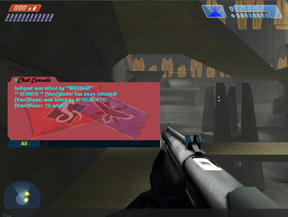

# haloce.exe
This is the main game executable containing the bulk of the game's code.

By default, Halo is only permitted to use [2 GB][2gb] of virtual memory. By applying value `0x2F` at offset `0x136` in the 1.0.10 executable, Halo can be made "Large Address Aware" and capable of using up to 4GB of virtual memory. The same upgrade can be made to [Sapien][sapien#limits]. The increased limit can be useful for client mods like Chimera which run in the game's address space and allocate more memory to speed up map loading.

# strings.dll
The library `strings.dll` is required to run the game or dedicated server. Prior to the 1.10 patch, one of its functions was the `executable_is_valid` checksum. Another of its functions is containing the loading screen seen before the main menu (all other loading screens are contained in [maps][map]).

This DLL is often replaced with a modified version for mods like SAPP and Chimera 1.0+.

# Watson
The `Watson` directory and the files within it (`dw15.exe`, various `dwintl.dll`) are a defunct crash reporting system. The server to which crash reports would be sent is no longer running. The mod Chimera disables this to allow the game to crash faster without waiting for a network timeout.

# Multiplayer chat: Keystone, controls, and content

<figure>
  
  <figcaption>
    
An example modified chat editbox, a practice abandoned after the HAC2 and Chimera mods implemented better chat systems.

  </figcaption>
</figure>

The library `Keystone.dll` is used for [Halo's][h1] multiplayer chat functionality. The game also requires the library `msxml.dll` to be installed on the system for chat to display properly. An installer can be found in Halo's `redist` directory.

The `controls` directory is host to `Controls.ini` and `Controls.dll`, a library used to render the multiplayer chat input box. It makes use of files in the `content` directory, which can be modified to customize the appearance of the chat "editbox" and text input.

The above files are not needed if using the mod Chimera, which re-implements the chat system. Keystone is required to use HAC2.

# Profile and savegame files
Halo stores savegames and profile data according to the system-wide `%USERPROFILE%` environment variable. On Windows, with a system drive "C" and user name "Example", Halo saves can be found in `C:\Users\Example\Documents\My Games\Halo CE\`. When running on Linux under Wine, the default location is `~/My Games/Halo CE/`. Some mods also store data under this location, such as downloaded maps.

## blam.sav
The file `savegames\<profile name>\blam.sav` contains the information & configuration for a HCE profile. Information includes player details, and configuration includes video/audio/network settings and input configurations (mouse, keyboard, and controller). It has a fixed length of 8192 bytes (8 [KiB][]).

The file structure follows, but is known to be incomplete:

<table>
  <thead>
    <tr>
      <th>Section</th>
      <th>Field</th>
      <th>Offset</th>
      <th>Type</th>
      <th>Comments</th>
    </tr>
  </thead>
  <tbody>
    <tr>
      <td rowspan="2">Profile</td>
      <td>Name</td>
      <td><code>0x0002</code></td>
      <td><code>utf-16 string</code></td>
      <td>The player's name, encoded as <a href="https://en.wikipedia.org/wiki/UTF-16">UTF-16</a>. Null-terminated with a maximum of 11 characters (excluding the null).</td>
    </tr>
    <tr>
      <td>Colour</td>
      <td><code>0x011A</code></td>
      <td><code>uint8</code></td>
      <td>
        
Determines the player's <a href="/h1/hard-coded-data/#multiplayer-armor-colors">multiplayer armour colour</a>.

        <table>
          <thead>
            <tr>
              <th>Option</th>
              <th>Value</th>
            </tr>
          </thead>
          <tbody>
            <tr><td>White</td><td><code>0x00</td></tr>
            <tr><td>Black</td><td><code>0x01</td></tr>
            <tr><td>Red</td><td><code>0x02</td></tr>
            <tr><td>Blue</td><td><code>0x03</td></tr>
            <tr><td>Gray</td><td><code>0x04</td></tr>
            <tr><td>Yellow</td><td><code>0x05</td></tr>
            <tr><td>Green</td><td><code>0x06</td></tr>
            <tr><td>Pink</td><td><code>0x07</td></tr>
            <tr><td>Purple</td><td><code>0x0A</td></tr>
            <tr><td>Cyan</td><td><code>0x0B</td></tr>
            <tr><td>Cobalt</td><td><code>0x0C</td></tr>
            <tr><td>Orange</td><td><code>0x0D</td></tr>
            <tr><td>Teal</td><td><code>0x0E</td></tr>
            <tr><td>Sage</td><td><code>0x0F</td></tr>
            <tr><td>Brown</td><td><code>0x10</td></tr>
            <tr><td>Tan</td><td><code>0x11</td></tr>
            <tr><td>Maroon</td><td><code>0x14</td></tr>
            <tr><td>Salmon</td><td><code>0x15</td></tr>
            <tr><td>Random (default)</td><td><code>0xFF</td></tr>
          </tbody>
        </table>
      </td>
    </tr>
    <tr>
      <td rowspan="3">Mouse</td>
      <td>Invert vertical axis</td>
      <td><code>0x012F</code></td>
      <td><code>bool</code></td>
      <td></td>
    </tr>
    <tr>
      <td>Horizontal sensitivity</td>
      <td><code>0x0954</code></td>
      <td><code>uint8</code></td>
      <td>Ranges in value from 0 (minimum) to 10 (maximum).</td>
    </tr>
    <tr>
      <td>Vertical sensitivity</td>
      <td><code>0x0955</code></td>
      <td><code>uint8</code></td>
      <td>Ranges in value from 0 (minimum) to 10 (maximum).</td>
    </tr>
    <tr>
      <td rowspan="11">Video</td>
      <td>Horizontal resolution</td>
      <td><code>0x0A68</code></td>
      <td><code>uint16</code></td>
      <td>This value is little-endian, for example the value 1280 is encoded as the bytes <code>0x00 0x05</code>.</td>
    </tr>
    <tr>
      <td>Vertical resolution</td>
      <td><code>0x0A6A</code></td>
      <td><code>uint16</code></td>
      <td>This value is little-endian, for example the value 960 is encoded as the bytes <code>0x03 0xC0</code>.</td>
    </tr>
    <tr>
      <td>Refresh rate</td>
      <td><code>0x0A6C</code></td>
      <td><code>uint8</code></td>
      <td>Options: 59 (<code>0x3B</code>), 60 (<code>0x3C</code>)</td>
    </tr>
    <tr>
      <td>Unknown</td>
      <td><code>0x0A6D</code></td>
      <td><code>pad(2)</code></td>
      <td>Example value: <code>0x00 0x02</code></td>
    </tr>
    <tr>
      <td>Frame rate</td>
      <td><code>0x0A6F</code></td>
      <td><code>uint8</code></td>
      <td>Options: vsync off (<code>0x0</code>), vsync on (<code>0x1</code>), 30 FPS (<code>0x2</code>)</td>
    </tr>
    <tr>
      <td>Specular</td>
      <td><code>0x0A70</code></td>
      <td><code>bool</code></td>
      <td></td>
    </tr>
    <tr>
      <td>Shadows</td>
      <td><code>0x0A71</code></td>
      <td><code>bool</code></td>
      <td></td>
    </tr>
    <tr>
      <td>Decals</td>
      <td><code>0x0A72</code></td>
      <td><code>bool</code></td>
      <td></td>
    </tr>
    <tr>
      <td>Particles</td>
      <td><code>0x0A73</code></td>
      <td><code>uint8</code></td>
      <td>Options: off (<code>0x0</code>), low (<code>0x1</code>), high (<code>0x2</code>)</td>
    </tr>
    <tr>
      <td>Texture quality</td>
      <td><code>0x0A74</code></td>
      <td><code>uint8</code></td>
      <td>Options: low (<code>0x0</code>), medium (<code>0x1</code>), high (<code>0x2</code>)</td>
    </tr>
    <tr>
      <td>Gamma</td>
      <td><code>0x0A76</code></td>
      <td><code>uint8</code></td>
      <td>Options: +1 (<code>0xD8</code>), +2 (<code>0xDF</code>), +3 (<code>0xE6</code>)</td>
    </tr>
    <tr>
      <td rowspan="7">Audio</td>
      <td>Master volume</td>
      <td><code>0x0B78</code></td>
      <td><code>uint8</code></td>
      <td>Ranges in value from 0 (minimum) to 10 (maximum).</td>
    </tr>
    <tr>
      <td>Effects volume</td>
      <td><code>0x0B79</code></td>
      <td><code>uint8</code></td>
      <td>Ranges in value from 0 (minimum) to 10 (maximum).</td>
    </tr>
    <tr>
      <td>Music volume</td>
      <td><code>0x0B7A</code></td>
      <td><code>uint8</code></td>
      <td>Ranges in value from 0 (minimum) to 10 (maximum).</td>
    </tr>
    <tr>
      <td>Sound quality</td>
      <td><code>0x0B7D</code></td>
      <td><code>uint8</code></td>
      <td>Options: low (<code>0x0</code>), medium (<code>0x1</code>), high (<code>0x2</code>)</td>
    </tr>
    <tr>
      <td>Sound variety</td>
      <td><code>0x0B7F</code></td>
      <td><code>uint8</code></td>
      <td>Options: low (<code>0x0</code>), medium (<code>0x1</code>), high (<code>0x2</code>)</td>
    </tr>
    <tr>
      <td>EAX</td>
      <td><code>0x0B7B</code></td>
      <td><code>bool</code></td>
      <td></td>
    </tr>
    <tr>
      <td>Hardware acceleration</td>
      <td><code>0x0B7C</code></td>
      <td><code>bool</code></td>
      <td></td>
    </tr>
    <tr>
      <td rowspan="4">Network</td>
      <td>Connection type</td>
      <td><code>0x0FC0</code></td>
      <td><code>uint8</code></td>
      <td>Options: dial-up off (<code>0x0</code>), dsl-low on (<code>0x1</code>), dsl-avg (<code>0x2</code>), dsl-high (<code>0x3</code>), t1/lan (<code>0x4</code>)</td>
    </tr>
    <tr>
      <td>Server address</td>
      <td><code>0x0FC2</code></td>
      <td><code>utf-16 string</code></td>
      <td>Stores the default server address for Direct IP connections. This value could contain an IP and port separated by a ":" or even a DNS host name. Encoded as UTF-16, null-terminated with a maximum of 31 characters (excluding the null).</td>
    </tr>
    <tr>
      <td>Server port</td>
      <td><code>0x1002</code></td>
      <td><code>uint16</code></td>
      <td>This value is little-endian, for example the value 2302 is encoded as the bytes <code>0xfe 0x08</code>.</td>
    </tr>
    <tr>
      <td>Client port</td>
      <td><code>0x1004</code></td>
      <td><code>uint16</code></td>
      <td>This value is little-endian, for example the value 2303 is encoded as the bytes <code>0xff 0x08</code>.</td>
    </tr>
    <tr>
      <td>Other</td>
      <td>CRC32 hash</td>
      <td><code>0x1FFC</code></td>
      <td><code>uint32</code></td>
      <td>The blam.sav has a CRC-32 hash appended at the end of it. The value is actually stored in its complement equivalent (i.e. bitwise NOT). The hash represents the data between <code>0x000</code> and <code>0x1FFC</code> - the hash itself is not hashed! Note that there is a relatively large amount of padding before this field, and it is the final 4 bytes of the file.
      </td>
    </tr>
  </tbody>
</table>

[KiB]: https://en.wikipedia.org/wiki/Kibibyte
[2gb]: https://en.wikipedia.org/wiki/2_GB_limit
