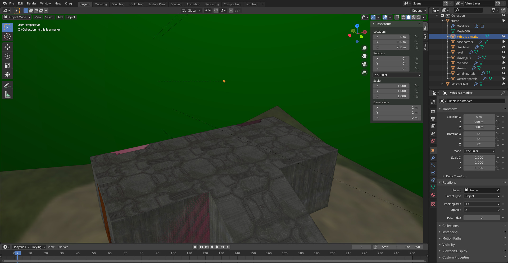
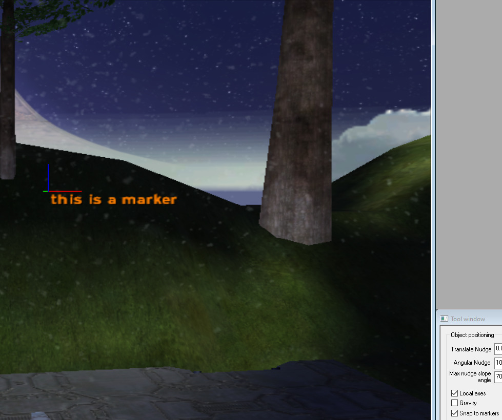

# File List
| File Link                                                                                                         | Description
|------------------------------------------------------------------------------------------------------------------ | --------------------------------------------------------------------------------
[Multiple Skies Example Blend](https://drive.google.com/file/d/1T2CRlv6LrgsfA_Nj3n56e7qWJSrAwEFl/view?usp=sharing)  | A blend file showcasing how to use multiple skies in a level.
[Weather Portals Example Blend](https://drive.google.com/file/d/1glRGo2QXlCuUJI_gVh7Vf2UjZi6M8PlH/view?usp=sharing) | A blend file showcasing how to use the special +weatherpoly material in a level.

# Multiple skies
It's possible to use multiple skies in your level by adding a digit to the end of your `+sky` material. If we wanted three skies in our level for example we would have the following:

```
+sky0
+sky1
+sky2
```

It's important that the digit at the end of the material starts at zero. The digit will be used as an index by the [cluster](~scenario_structure_bsp#clusters-and-cluster-data) to get a sky tag reference from the scenario [skies tag block](~scenario#tag-field-skies). You'll also have to make sure that a cluster does not use more than one sky or you will get [an error on import](~bsp-troubleshooting#warning-cluster-can-see-multiple-skies).

If you were not aware, a cluster is a section of a level divided by a portal. In the case of the provided blend file above there are 7 clusters. If a map has no portals then there is one cluster. Be sure to also prevent multiple skies from being able to be seen by the player at once, or else the player will see a sudden transition between them when moving between clusters. Tool will output a warning if a sky can see another sky.

Avoid using trailing digits on non-sky material names, or you'll get tool warnings about duplicate shaders, and avoid numbers in shader tag names. Use letters instead if you need to make variants.

# Weather polyhedra
Let's say you wanted to have weather on the tutorial map. You may notice that either your weather effects go through the walls of your structure or that it instantly disappears the moment you enter the hallway. This can be quite jarring, so naturally there is a solution for this that mappers can implement.

The special `+weatherpoly` material can be assigned to [convex polyhedron][wiki-polyhedron] geometry to create a volume that hides any weather effects within the volume. You can see an example of this in blend file provided above.

You can compare the videos below to see the difference.

Here's what the hallway looks like without a weatherpoly volume.


Here's what the hallway looks like with a weatherpoly volume.


The weather poly geometry is included in the [BSP tag](~scenario_structure_bsp#weather-polyhedra) when you compile your [JMS](~). There can be a max of 8 on screen at any given time. Any weather polys that go over this limit will have no effect. [Sapien](~h1-sapien) will print a message in the console if you hit this limit.

# Markers
You can use markers to snap objects to a specific location in a level. You can create a marker object by adding a mesh object to your scene and having the first character of the name use a "#" symbol.



Once the level is compiled you can toggle the "Snap to markers" checkbox in the _Tool window_.



Once the option is enabled all markers in the BSP will be rendered on screen. Spawning an object and moving it near the marker should snap the object's center of origin to the position of the marker. This can make it much easier to get exact positions for [device_machines](~device_machine) and [scenery](~).

# Multiple BSPs
It is common for singleplayer maps to have multiple BSPs. This helps manage game resources and avoid BSP limits for long missions. To accomplish this, place multiple JMS files in the same `models` folder for the level. Each JMS will be compiled into it's own unique [BSP tag](~scenario_structure_bsp) for your [scenario](~) to use. Do not attempt to use multiple BSPs in an MP scenario unless you are trying to achieve a scripted day/night setting and each BSP is geometrically identical.

# Player movement measurements
Some values below come from trial and error testing and may not be exact.

| Measurement | Value |
|-------------|-------|
| Player width (Hallway width min) | 0.4wu/4ft/40jms
| Player height standing (Hallway height min) | 0.7wu/7ft/70jms
| Player height crouching (Vent height min) | 0.5wu/5ft/50jms (don't actually make hallways and vents this tiny!)
| Step height max standing | 0.06wu/0.6ft/6jms
| Step height max moving | 0.12wu/1.2ft/12jms (make railings taller than this!)
| Jump height max standing | 0.71wu/7.1ft/71jms
| Jump height max moving | 0.79wu/7.9ft/79jms
| Jump distance moving | ~2.75wu/~27.5ft/~275jms
| Crouch jump height max standing | 0.9wu/9ft/90jms
| Crouch jump height max moving | 0.98wu/9.8ft/98jms
| Grenade jump height standing | ~1.6wu/~16ft/~160jms
| Grenade jump + crouch jump height standing | ~1.7wu/~17ft/~170jms
| Weapon through ceiling max moving | 0.49wu/4.9ft/49jms
| Health pack through wall max moving | 0.38wu/3.8ft/38jms
| Max walkable slope angle | 45 degrees

See also general [scale and unit conversions information](~scale).

[wiki-polyhedron]: https://en.wikipedia.org/wiki/Convex_polytope
