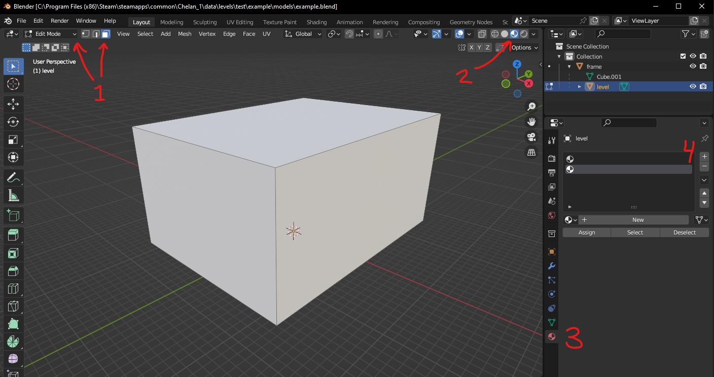
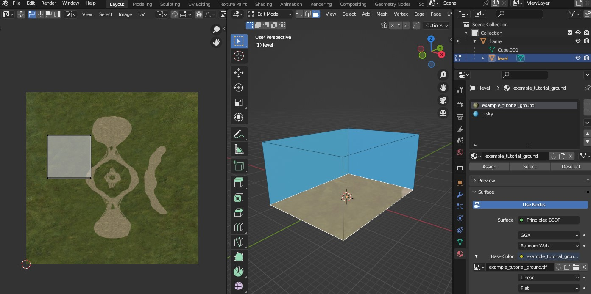
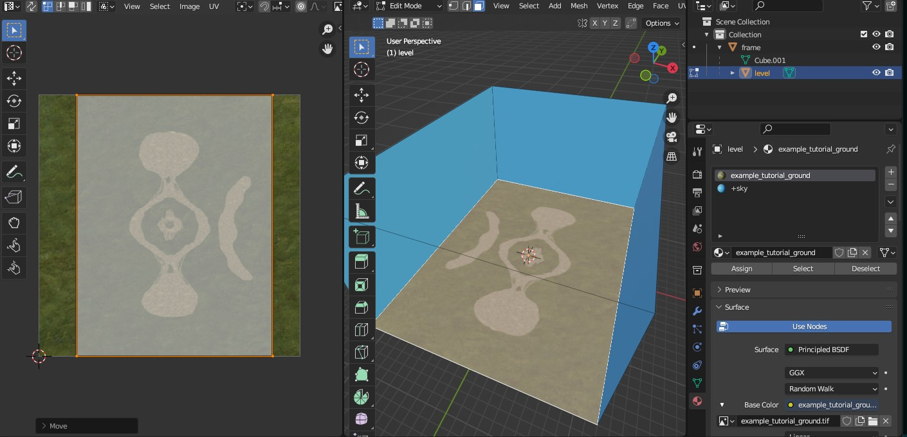
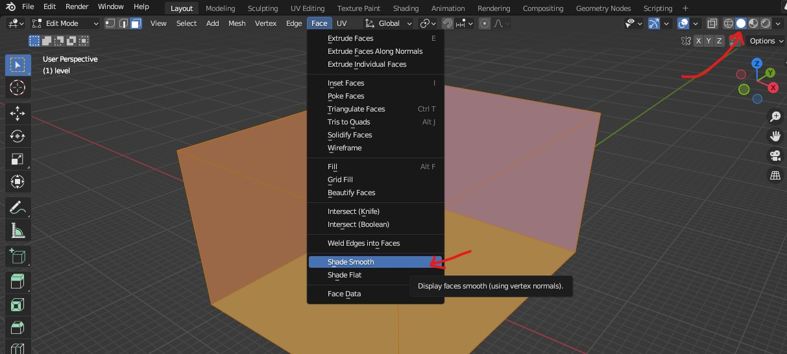
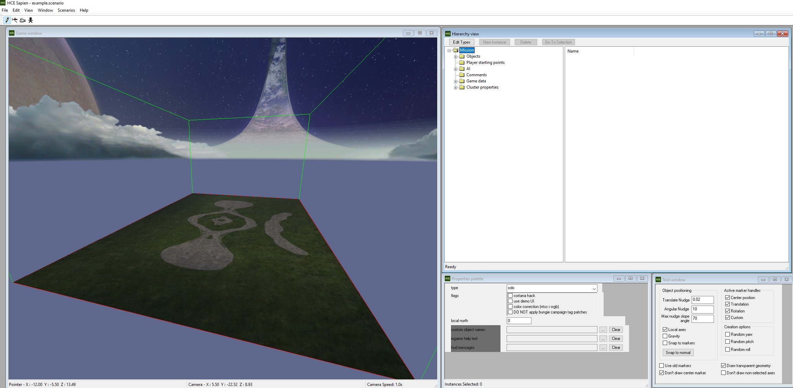

In this guide you'll create a bare minimum box level. Despite the result's lackluster appearance, this is intended to teach you the basic end-to-end workflow of creating a custom level, from modeling its [BSP](~scenario_structure_bsp) to testing in-game, and you can use the result in [other level guides](~levels).

# Prerequisites
* Follow the [general prerequisites](~guides#general-prerequisites) to install the mod tools/HEK and learn modding basics.
* Install an up-to-date version of [Blender](~) and the [Halo Asset Blender Development Toolset](~halo-asset-blender-development-toolset#installation).
* Understand the [basics of Blender's interface](~blender#usage-basics).
* Read the [levels overview](~levels#overview).
* Skim the [H1 materials page](~h1-materials).


All hotkeys given in this guide assume default Blender settings.


# Folder setup
We will start by going over how your level's files and folders will be organized and creating the level's data folders. Files related to levels will be found in both the `data` and `tags` folders of your mod tools/HEK and have a similar layout. If you don't have these folders then you've missed an installation step. A typical finished level might include:

```
HEK/Mod Tools
├─data
│ └─levels
│   └─test
│     └─example ┄┄┄┄┄┄┄┄┄┄┄ level data folder
│       ├─models
│       │ ├─example.blend
│       │ └─example.JMS
│       ├─bitmaps
│       │ ├─*.psd
│       │ └─*.tif
│       └─scripts
│         └─*.hsc
├─tags
│ └─levels
│   └─test
│     └─example ┄┄┄┄┄┄┄┄┄┄┄ level tags folder
│       ├─example.scenario
│       ├─example.bitmap
│       ├─example.scenario_structure_bsp
│       ├─bitmaps
│       │ └─*.bitmap
│       └─shaders
│         └─*.shader_*
└─maps
  └─example.map ┄┄┄┄┄┄┄┄┄┄┄ built map
```

We're going to create source data/assets under the `data` folder, and _import_ them into tag format under the `tags` folder using [Tool](~h1-tool). We will also use [Guerilla](~h1-guerilla) to edit some tags. Not every level will require custom bitmaps and shaders or scripts, the above is just an example.

By convention, Halo's stock singleplayer levels are under `levels` while its multiplayer levels are under `levels\test`. You don't have to follow this convention and can put your level folder wherever you want, e.g. `data\my_stuff\levels\cool_map`.

Firstly, **pick a name for your level** and **create a data folder** for it like `data\levels\test\example`. The name you choose for this folder will later become the scenario name (`example.scenario`) and map name (`example.map`). We do have some guidance on naming the level:

* Use lower case characters.
* Use underscores instead of spaces. This avoids needing to always put quotes around tag/file paths when using CLI tools or Halo's console.
* Pick something unique if you intend on releasing the map later. Check the [Steam workshop](https://steamcommunity.com/app/976730/workshop/) and/or [release sites](~sharing) for existing maps.

Next, **create a subfolder called `models`** where you will later export the level geometry in JMS format.

It is not necessary to create a tags folders for your level yet unless you want to make some custom shaders in advance of importing the [BSP](~scenario_structure_bsp), which is when shaders get linked to the BSP tag. For this guide we'll use existing shaders from other levels and the [scenario](~) tag will be generated automatically for us when importing the BSP for the first time.

You may have noticed source files like Photoshop documents (`*.psd`) or the level's Blender scene (`example.blend`) in the example layout above. There is no requirement to keep them under the `data` folder like this but it can help to organize them together with your level's data.

You also may have noticed the `example.bitmap` without a corresponding `example.tif`. This is the BSP's [lightmap](~lightmaps) and we'll generate that later.

# Blender modeling
For the next few steps we'll create the level geometry in [Blender](~). Go ahead and open it up now.

## Scene setup
Let's prepare the scene before adding any geometry:

1. When you open Blender it may contain a default cube, light, and camera. We're going to start fresh so select and delete all of these. If you want, you can [save a startup file](~blender#startup-file) so they won't appear again.
2. Next, you'll want to [increase the viewport clipping range](~blender#clip-start-and-end). Set _Clip Start_ to `1 m` and _End_ to `100000 m`.
3. Save the scene to `data\levels\test\example\models\example.blend`, or similar for your level's data folder. You should also periodically save during this guide.

We now have a saved empty scene with the right settings and can begin adding geometry.

## Creating a reference frame
We first need to create a _reference frame_ for all our geometry to be parented to. The reference frame is the origin for all objects in our scene, and only objects which are _children_ of the frame will be included in the export to JMS later. This helps you keep reference models for scale or unfinished pieces of geometry separate from the export.

In order for the exporter to write a JMS file successfully later, there **must** be a reference frame and at least one valid object in your scene parented to it. Not having any reference frame will result in the export error `No nodes in scene. Add an armature or object mesh named frame`. Having no valid geometry will also cause `No objects in scene`.

To create the reference frame we just need to add an object to our scene and name it `frame`. The object can be anything that contains location and rotation data, like an _empty_, but we will use a cube in this guide:

1. In [object mode](~blender#modes), [add a cube object](~blender#adding-geometry) to your scene.
2. Set the name of the object in the [outliner][] to `frame` by double clicking it or pressing  to edit it.

We recommend leaving the frame at its default location at the origin (0, 0, 0), though this is not strictly necessary.


Be aware that once you have started to populate the level with objects using [Sapien](~h1-sapien) you cannot move the reference frame, since it will cause all placed objects to move out of alignment with the level geometry.


[outliner]: https://docs.blender.org/manual/en/latest/editors/outliner/introduction.html

## Creating a box level
Halo has certain requirements for level geometry called the [sealed world rules](~bsp-troubleshooting#sealed-world-rules) which we need to adhere to. With some exceptions, the level must be a sealed inwards-facing "room" without any holes/open edges, faces with no surface area, or intersecting faces. Even the sky of the level is sealed with a "ceiling" of invisible but collideable faces. Our box level will certainly follow these rules, but it's helpful to be aware of them for later.

Let's go ahead and create the box now:

1. From object mode, add another new cube.
2. Bring up the [sidebar](https://youtu.be/H64e1RDZKuA) with  and set it to the _Item_ tab.
3. Set the [location](https://youtu.be/P0RfuocRY9c) of the box to X: `0.0` Y: `0.0` Z: `800.0`.
4. Set the [dimensions](https://youtu.be/P0RfuocRY9c) for the to X: `2400.0` Y: `3200.0` Z: `1600.0`. This corresponds to an [in-game scale](~scale) of 24x32x16 world units.
5. Select [_Object > Apply > All Transforms_](~blender#applying-transforms) to apply the above transforms to the object's vertices, resetting the object's own location to the origin and scale to `1` in each axis. Avoid any transforms on the level object to ensure the level is scaled correctly in-game. From this point on you should only move or resize the level in _Edit Mode_, which does not change the object's transforms.
6. Set the name of the object in the [outliner](https://youtu.be/UIRaqLLjnmY) to `level` by double clicking it or pressing  to edit it.

There should now be a large grey box in the scene. We next need to parent it to the `frame` object:

1. Ensure the `level` object is selected. You can click it in the outliner.
2. Use  to select `frame` in the outliner. The frame should be highlighted in yellow while the level should be highlighted in orange.
3. With your cursor over the 3D viewport, hit  and click _Object_, or select the viewport's menu option [_Object > Parent > Object_](~blender#parenting-objects).

In the outliner you should now see that `level` is contained as a child under `frame`:


The problem now is that the level is inside-out. We need to flip its face's [normals][] so they're facing inwards like a room.

1. With the `level` object selected, [switch to _Edit Mode_](~blender#modes).
2. Switch to face selection mode by pressing  or clicking the face button beside the Edit Mode drop-down.
3. Press  to select all faces.
4. Flip normals by hitting  and selecting _Flip_ or choosing the menu option _Mesh > Normals > Flip_.

Make sure [backface culling](~blender#backface-culling) is enabled if it's not already. This makes it so geometry is see-through when seen from its back side, allowing you to see into the level and confirm the direction of normals. This will also make modeling easier:


You can also inspect face normals using the [normals overlay](~blender#normals-overlay) if you want, though leaving it enabled will eventually clutter the viewport as your model becomes more complex.

## Applying materials
Creating and assigning materials to faces in Blender is how we assign different [shader](~) tags to parts of our BSP model. Objects in Blender can have multiple [material slots][mtl-slots], and each can reference a different _material_. Multiple slots can technically reference the same material, even from different objects, but for our needs in this guide we'll sometimes use the term _material_ to mean both a slot and its referenced material.


**The name of the material is key**. Shader tags define the appearance and physical properties of faces in-engine, while Blender materials define their appearance only within Blender. Assigning textures to materials in Blender has no effect on the ingame appearance and the only point is to help you preview the level and perform UV mapping. Any custom textures need to be imported as [bitmaps](~bitmap) and referenced from new custom shader tags.


When we later use [Tool](~h1-tool) to convert our level into a BSP tag, it will try to find shader tags matching your material names. For example, a material named `example_tutorial_ground` will match `tags\levels\test\tutorial\shaders\example_tutorial_ground.shader_environment`. The matched shader doesn't even need to be in your level's shaders folder; Tool can match a shader tag anywhere under your `tags` folder. There are also some [special material names](~h1-materials#special-materials) which don't use shader tags and [material symbols](~h1-materials#material-symbols) which alter how a surface behaves. We'll cover these later.

Firstly, let's create 2 material slots for our level object. The first will be for the ground, while the second will be for sky faces.

1. With the `level` object selected, make sure you're in _Edit Mode_ and face selection mode.
2. Switch to _Material Preview_ render mode (hold  for a radial menu). This will allow us to see textures when we later add them to our materials. It's normal that the level now appears inside-out again because in this render mode each material has its own backface culling setting.
2. Open the _Material Properties_ tab.
3. Click the + button to add two material slots.



We now need to create some materials to occupy these slots, starting with the ground material. Instead of creating a new custom shader tag, we'll keep it simple for now and reuse an existing shader tag from the mod tools/HEK's tutorial level.

1. Select the first (top) material slot and click the _New_ button.
2. Replace the name of the material with `example_tutorial_ground`.
3. Under the material's _Surface_ section, click the yellow circle for _Base Color_ and choose _Image Texture_ from the menu that appears.
4. Under _Base Color_ click the _Open_ button. Browse to and select the file `data\levels\test\tutorial\bitmaps\example_tutorial_ground.tif` from your editing kit installation.
5. Now that the base color is using a texture, some more settings have appeared under it. Switch its _Alpha_ setting from _Straight_ to _None_. This will ignore the texture's alpha channel and help you see the texture better in Blender. That texture's alpha channel is a [blending mask](~shader_environment#detail-map-blending) relevant to the shader tag only.
6. Scroll down to the _Settings_ section of the material and enable _Backface Culling_.
7. In the _Viewport Display_ section, set the _Color_ to some green to help you recognize this material if you need to go back to _Solid_ viewport rendering mode.

All faces are assigned to the first slot by default. You should now see the ground texture on all faces of the level. Remember, the `.tif` texture we added is only a preview. The existing shader tag `levels\test\tutorial\shaders\example_tutorial_ground.shader_environment` is responsible for how these faces will appear in-game and is composed of more than just the base map texture, but also tiling detail map textures like grass and dirt.


Don't worry that the ground texture doesn't line up quite right yet. We'll cover that in UV mapping later.

The second material we'll set up is for the sky. Our level will [later](#setting-a-scenario-type-and-sky) reference a [sky](~) tag for its actual skybox model, but we still need faces for the skybox to be visible through. We can't simply delete the top faces of our level box because that would break the sealed world rules.

The solution is the special material name `+sky`. Faces assigned to this material will be invisible but collideable and still form a sealed level that the player cannot escape from. They also allow light from the sky's sun to pass through and illuminate the level during radiosity. This material does not use a shader tag.

1. Select the second material slot and click the _New_ button.
2. Replace the name with `+sky`.
3. This time we won't assign a texture for _Base Color_, but instead click its color box to assign a solid color like light blue. This just helps us see which faces the material is assigned to (currently none of them).
4. Under the _Settings_ section enable _Backface Culling_.
5. Under the _Viewport Display_ section set _Color_ to a similar light blue.

Let's assign this sky material to the non-ground faces.

1. Use  to select those faces in the viewport. Alternatively you can select just the ground face then use  to invert the selection.
2. Select the `+sky` material slot and click the [_Assign_ button][mtl-assign].
3. Click anywhere outside the level to deselect faces.

The level should now look like this:


[mtl-slots]: https://docs.blender.org/manual/en/latest/render/materials/assignment.html#material-slots
[mtl-assign]: https://docs.blender.org/manual/en/latest/render/materials/assignment.html#edit-mode

## UV mapping
Each vertex in our model has not only XYZ coordinates for its position in 3D space, but also UV coordinates for its position in 2D _texture space_. This determines how faces are mapped to different parts of a texture. The process of _UV mapping_ is how we unwrap our model's faces and give them a location in UV space to align textures the way we want.

Similar to the 3D Viewport, Blender has another type of editor window called the _UV Editor_. You can can either [split our viewport's area][area] and change one area's editor type to the UV Editor, or switch to the _UV Editing_ [workspace](~blender#workspace) (however, you will need to redo the [clip start and end settings](~blender#clip-start-and-end)).

When you select faces in the 3D viewport, the UV editor will show you how they're mapped to the material's texture:



Because we started with a cube that had a default UV unwrap, the ground face is mapped to just a small part of the texture we want to use. Let's unwrap that face again:

1. Select the ground face.
2. With your cursor over the 3D viewport, press the  key and choose _Unwrap_. There are a number of unwrapping methods which we won't cover in this guide. _Cube Projection_ is also a good option when you've selected axis-aligned faces or are applying a mass unwrap while blocking out a level during development.
3. You'll see the face remapped to a larger part of the texture in the UV editor. The UV editor operates similarly to the 3D viewport in that you can select vertices, edges, or faces and move, scale, or rotate them.
4. With your cursor in the UV editor, press  to select all faces then use the move tool (you may need to drag out the tool bar in the UV editor) or press  to move them. Try to align the face with the pathways in the texture.



See Blender's [UV editor docs][uv-docs] for more information. You can leave the UV editor window in your workspace, and just resize it to be narrow when you don't need it.

[uv-docs]: https://docs.blender.org/manual/en/latest/editors/uv/introduction.html
[area]: https://docs.blender.org/manual/en/latest/interface/window_system/areas.html

## Assigning sharp edges
Next we'll adjust how the level is smooth shaded by setting up sharp edges and an _Edge Split_ modifier. Let's quickly cover how models are shaded in Halo. Games like Halo use [_normal vectors_][normals] to represent the "outwards" direction of surfaces which affects how they reflect light. Each vertex, such as [those in your BSP tag](~scenario_structure_bsp#tag-field-lightmaps-materials-rendered-vertices-offset), has a single normal vector. The normal vector is interpolated across each triangle based on the normals of its 3 vertices, causing the triangle to appear rounded/smooth even though it's physically flat.

To represent sharp edges we need to actually split vertices so that each adjacent face can have its own copy with a distinct normal vector, despite the vertices still being in the same physical location. Here's an example of the effect it will have on our shading:

 causes normals to split too which has a drastic effect on how smooth objects look. In the leftmost model there are no sharp edges and all normals are the average direction of adjacent faces, making the surface look completely smooth despite its low polygon count. On the right, every edge is sharp causing each face to get its own copy of the vertex and a normal aligned with that face, resulting in a faceted appearance.")

Let's first smooth-shade our level so we can see the level with vertex normals in effect:

1. Switch back to _Solid_ viewport rendering mode. This makes it easier to see how the model is shaded without any textures visible. Hold  for a radial menu.
2. Switch to face selection mode () and select all faces of the level by pressing .
3. Open the _Face_ menu or hit , then select _Shade Smooth_.



This will have a noticeable effect on your level, especially as you move the camera around it. The transition from ground to sky faces should not be considered rounded, and if we leave the model as-is then the radiosity process will bake unwanted smooth highlights and shadows into our level's lightmaps.

Next, add an edge split modifier to the object:


1. Select the _Modifier Properties_ tab.
2. Click _Add Modifier_ and select _Edge Split_.
3. Untick _Edge Angle_. If your level will only contain sharp edges then you might want to leave this enabled, but for levels which contain any organic terrain shapes or rounded surfaces it's better to be explicit about where you want sharp edges. Not using _Edge Angle_ also doesn't prevent you from bulk-assigning sharp edges by angle later, since you can always use _Select > Select Sharp Edges_.

We're going to assign sharp edges to mark where we want vertices to be split by the modifier.

1. Switch to edge selection mode () and use  to select all edges bordering the ground face.
2. Open the _Edge_ menu or hit  and select _Mark Sharp_. Cyan lines will appear on these edges:


It's not necessary to mark any of the edges in the sky sharp since they are not rendered.

## Exporting a JMS
Make sure to save your Blender scene so you don't lose any work. Now that we've created the level model, we can export it to a [JMS file](~jms) which we'll later convert to a BSP tag with Tool:

")

This will open an export with some settings:


**Ensure the export settings match those above**. Specifically:
* _Game Version_ is **Halo CE**.
* _Generate Asset Subdirectories_ is **disabled**.
* _Apply Modifiers_, _Triangulate_, and _Edge Split_ are all **enabled**.
* _Edge Split_ on _Sharp Edges_ is **enabled**.

Some of the other settings don't apply to levels but you can learn more about them [here](~halo-asset-blender-development-toolset#jms-export-settings).


If you want to ensure these settings are stored in your scene and used for every export, you can configure the toolset's [scene game version](~halo-asset-blender-development-toolset#scene-game-version) and [scene JMS settings](~halo-asset-blender-development-toolset#scene-jms-settings), then select _Use Scene Export Settings_. This will grey out the settings in the export window and use the settings stored in your scene instead so you don't accidentally change anything.


Next, browse the export window to your level's `models` data folder, for example `data\levels\test\example\models`. Enter the filename `example.JMS` and click _Export JMS_.

You should now have a file `data\levels\test\example\models\example.JMS`.

# Tagging
The following steps are concerned with creating and editing [tags](~) for your level.

## Importing the BSP
The level geometry now needs to be imported from JMS format into [scenario_structure_bsp](~) tag format for Halo to use it. We do this using Tool's [structure](~h1-tool#structure) verb. [Open a command prompt](~command-line#opening) in your mod tools/HEK location and enter the following command:

```cmd
tool structure "levels\test\example" example
```

The first argument, `"levels\test\example"`, is the path your level's data folder (without the `data\` prefix). The second argument, `example`, is the name of the BSP you're importing and corresponds to `models\example.JMS` you exporter earlier. Singleplayer levels may include multiple BSPs but in our case we just have one named the same as the level folder.

If all went well, you now have a BSP tag at `tags\levels\test\example\example.scenario_structure_bsp`. However this is also the step where people often first run into trouble:

* Tool has prompted you to select a shader type. This means you have faces in your level assigned to a material whose name did not match with any existing shader tags. You probably missed assigning some faces or named the materials incorrectly.
* Tool logs warnings or errors about geometry errors because the level doesn't follow the [sealed world rules](~bsp-troubleshooting#sealed-world-rules) or has other issues. This indicates a mistake in modeling the level or bad level size. Tool generates a [WRL](~wrl) file which you can import back into Blender to [troubleshoot](~bsp-troubleshooting).

If your level did not have a pre-existing [scenario](~) tag, which is our case, Tool also generated one at `tags\levels\test\example\example.scenario` with the BSP already referenced.

## Setting a scenario type and sky
Next we need to edit the scenario in [Guerilla](~h1-guerilla). Open `tags\levels\test\example\example.scenario`. There are two fields we need to update, which will both be near the top of the tag:

1. Set the [type](~scenario#tag-field-type) to multiplayer or leave it as solo depending on the type of level you're making.
2. Add an entry to the [skies block](~scenario#tag-field-skies) and set the reference to a sky you want to use, such as `tags\sky\sky_timberland\sky_timberland.sky`. The referenced [sky](~) tag is responsible for the skybox you see outside the level and for lighting parameters like sunlight.
3. Save the scenario tag.

Although it's not often used, levels can actually reference multiple skies used in different BSPs or parts of the same BSP ([with restrictions](~bsp-troubleshooting#warning-cluster-can-see-multiple-skies)). Even fully indoor levels with no visible sky may still want to reference a sky tag because it sets [indoor cluster](~scenario_structure_bsp#indoor-vs-outdoor-clusters) fog and ambient light parameters. These are more advanced topics so we'll just stick with a single sky reference.

## Lighting the BSP
The BSP tag currently doesn't have any [lightmaps](~). If you were to open the scenario in [Sapien](~h1-sapien) now the level would either be invisible (HEK Sapien) or fullbright (H1A Sapien). We need to run the radiosity process to bake lighting with the Tool [lightmaps verb](~h1-tool#lightmaps). From a command prompt again, enter:

```cmd
tool lightmaps "levels\test\example\example" example 0 0.3
```

The arguments are:
1. A [tag path](~general/tags#tag-paths-and-references) to your scenario.
2. The name of the BSP you want to light.
3. Quality, either `0` (draft) or `1` (final). Keep it draft for now.
4. Stop threshold. This ranges between `0` and `1` and tells Tool to stop radiosity when the amount of "in flight" light reduces to this level. Values closer to `0` result in more accurate lighting but takes longer.

If successful this will count down from 1 to your stop threshold. With a simple box level it should complete nearly instantly. As with importing the BSP, this step may also halt on geometry errors and produce a WRL file. The most common issue is [degenerate UVs](~bsp-troubleshooting#degenerate-triangle-or-triangle-with-bad-uvs-blue) so make sure you followed the steps of the [UV mapping](#uv-mapping) section correctly.

Lightmaps are cleared any time the BSP tag is reimported from JMS so you will need to repeat this step whenever you change level geometry. This is why you should use draft quality until later in development.

## Adding spawn points
Launch [Sapien](~h1-sapien) and open the level's scenario tag at `levels\test\example\example.scenario`. You probably won't see anything at first since the camera begins at the origin, which is exactly in line with the level's ground. In the _Game window_, [move the camera up](~h1-sapien#game-window) above the ground and you should see:



We're going to skip placing any scenery, weapons, vehicles, or other data in the scenario. We'll cover those aspects in other guides and just focus on adding some spawn points for now.

1. In the _Hierarchy view_, select _Player starting points_.
2. In the _Game window_, ensure the camera is within the level box then right click somewhere on the ground to place a spawn point.
3. The _Properties palette_ will let you edit the selected spawn point:
    * If you leave types 0-3 set to `none` then the spawn point will be used when the scenario is loaded in singleplayer mode.
    * If you set _type 0_ to `all games` then it will be used for all multiplayer game modes but not singleplayer.
    * The _team index_ field can be left as `0` for a singleplayer spawn. For multiplayer spawns, index `0` is red team and `1` is blue team.

For a multiplayer scenario you may want to place 3 spawn points for now; one singleplayer spawn and one `all games` spawn for each team. This will allow you to still load the level in singleplayer mode during development.

You can now save the scenario.

# Testing the level
The tags are now ready so let's test the level in-game. How you do this will depend on which toolset you're using and the [scenario type](#setting-a-scenario-type-and-sky) you chose. Note that you will not be able to play any multiplayer [game modes](~) besides slayer until you've set up the relevant [netgame flags](~scenario#tag-field-netgame-flags) with Sapien.



If you're using the H1A mod tools you can [use Standalone](~h1-standalone-build#usage) to test the scenario. Standalone is preferable to testing in MCC itself during development since it includes debug features and loads tag files directly, avoiding the need to build a map file with Tool and install it into MCC. Run `halo_tag_test.exe` and enter the following into the [developer console](~developer-console):

```console
game_variant slayer ; only if your level is a multiplayer map
map_name levels\test\example\example ; tag path for the scenario
```

This will load the scenario tag as a playable level and you should spawn at one of the spawn points you placed earlier. A multiplayer scenario can also be loaded as a singleplayer level (without first setting a `game_variant`) if you included a singleplayer spawn too.

If you can see the game world but aren't spawning then your spawn points are not correctly configured. If the game instead crashes, you likely have some problem with your tags and should open `reports\debug.txt` for a log of what went wrong.

You don't need to restart Standalone to see changes to your map's tags. Use the [console history](~developer-console#usage) to rerun `map_name` and the level's tags will be reloaded. You can also put the above console lines into `init.txt` to [run at startup](~arguments#init-txt) automatically.



If you're using the HEK and targeting Halo Custom Edition then you need to build a map from tags. This is because Custom Edition, unlike Standalone, is a [cache build](~blam#build-types) of the engine that loads [map cache files](~maps) rather than unprocessed tags. Open your command prompt and run the Tool [build-cache-file verb](~h1-tool#build-cache-file):

```cmd
tool build-cache-file levels\test\example\example
```

This will produce `maps\example.map`. You can then launch Custom Edition and load this level, either via the UI for MP maps or [via the console if enabled](~developer-console#usage):

```console
map_name example ; if SP
sv_map example slayer ; if MP
```

You can put this command in your [init.txt](~arguments#init-txt) to run whenever the game launches.



If you're using the H1A tools and want to test in MCC itself then you need to build the map. It's generally recommended to test in [Standalone](~h1-standalone-build) during development since it's easier and catches more tag errors, but doing final testing in MCC when the map is close to release is a good idea. Run Tool's [build-cache-file verb](~h1-tool#build-cache-file) verb from command prompt:

```cmd
tool build-cache-file levels\test\example\example classic none
```

This differs a bit from the HEK tool command because H1A tool exposes more options. Tool will create the file `maps\example.map`. You can then use the _replacement method_ to play the map:

1. Copy the map into `C:\Program Files (x86)\Steam\steamapps\common\Halo The Master Chief Collection\halo1\maps` or the equivalent path for your MCC installation.
2. Choose an existing map with the same scenario type, e.g. bloodgulch for MP maps, and move it to a new subfolder called `backups`.
3. Rename your custom map after the map you just moved.
4. Launch MCC with EAC off and play the map you just replaced. It should load your custom map.
5. To undo this, just move the original map from `backups` back into the `maps` folder.

If you want to release the final version of your map on Steam then you would include your map file in the mod created with [Excession](~).




If you've loaded the level but are stuck waiting to spawn, check [these possible reasons](~player-spawns#troubleshooting-waiting-for-space-to-clear).


Congratulations on reaching this point! You should now have a minimal starter level that you can use as the foundation for [further guides](~levels). Revisit this page if you need a refresher on any of the steps.


[normals]: https://en.wikipedia.org/wiki/Normal_(geometry)