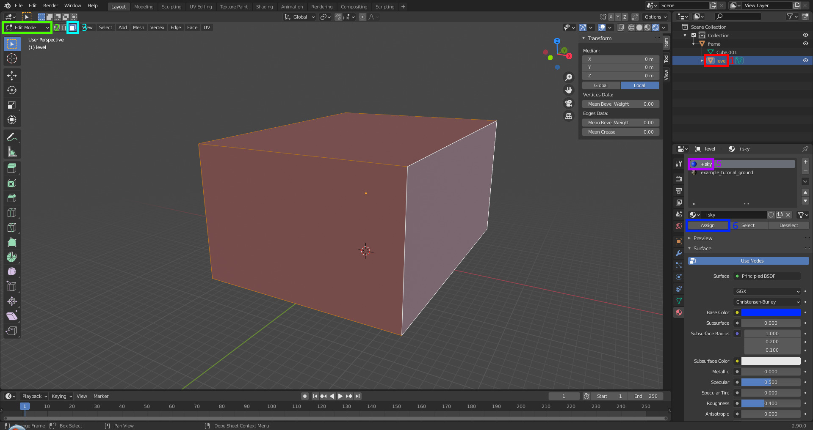
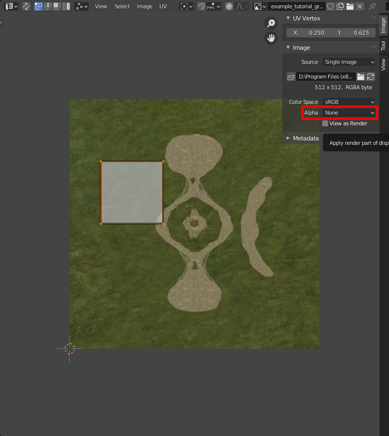

In this guide you'll create a bare minimum box level. Despite the result's lackluster appearance, this is intended to teach you the basic end-to-end workflow of creating a custom level, from modeling to testing in-game, and you can use the result in [other level guides](~levels). This guide includes a [completed version](#file-list) of our work as an example for you to compare if needed.

# Prerequisites
* Follow the [general prerequisites](~guides#general-prerequisites) to install the mod tools/HEK and learn modding basics.
* Install an up-to-date version of [Blender](~) and the [Halo Asset Blender Development Toolset](~halo-asset-blender-development-toolset#installation).
* Understand the [basics of Blender's interface](~blender#usage-basics).
* Read the [levels overview](~levels#overview).
* Skim the [H1 materials page](~h1-materials).


All hotkeys given in this guide assume default Blender settings.


## File list
| File link                                                                                              | Description
|------------------------------------------------------------------------------------------------------- | -----------------------------------
|[End Result](https://drive.google.com/file/d/1MDxZGkpi90ETwVZDXpl2zrDAHU3SDQhu/view?usp=sharing)        | The end product of this tutorial for you to examine and compare.
|[Tutorial Textures](https://drive.google.com/file/d/1Z9ehd94ByHRRs68rbtuDIZ3lpm1463Lf/view?usp=sharing) | The textures we will be using in this guide. Make sure to have this ready.

# Folder setup
We will start by going over how your level's files and folders will be organized and creating the level's data folders. Files related to levels will be found in both the `data` and `tags` folders of your mod tools/HEK and have a similar layout. If you don't have these folders then you've missed an installation step. A typical finished level might include:

```
HEK/Mod Tools
├─data
│ └─levels
│   └─test
│     └─example ┄┄┄┄┄┄┄┄┄┄┄ level data folder
│       ├─models
│       │ ├─example.blend
│       │ └─example.JMS
│       ├─bitmaps
│       │ ├─*.psd
│       │ └─*.tif
│       └─scripts
│         └─*.hsc
├─tags
│ └─levels
│   └─test
│     └─example ┄┄┄┄┄┄┄┄┄┄┄ level tags folder
│       ├─example.scenario
│       ├─example.bitmap
│       ├─example.scenario_structure_bsp
│       ├─bitmaps
│       │ └─*.bitmap
│       └─shaders
│         └─*.shader_*
└─maps
  └─example.map ┄┄┄┄┄┄┄┄┄┄┄ built map
```

We're going to create source data/assets under the `data` folder, and _import_ them into tag format under the `tags` folder using [Tool](~h1a-tool). We will also use [Guerilla](~h1a-guerilla) to edit some tags. Not every level will require custom bitmaps and shaders or scripts, the above is just an example.

By convention, Halo's stock singleplayer levels are under `levels` while its multiplayer levels are under `levels\test`. You don't have to follow this convention and can put your level folder wherever you want, e.g. `data\my_stuff\levels\cool_map`.

Firstly, **pick a name for your level** and **create a data folder** for it like `data\levels\test\example`. The name you choose for this folder will later become the scenario name (`example.scenario`) and map name (`example.map`). We do have some guidance on naming the level:

* Use lower case characters.
* Use underscores instead of spaces. This avoids needing to always put quotes around tag/file paths when using CLI tools or Halo's console.
* Pick something unique if you intend on releasing the map later. Check the Steam workshop and/or [release sites](~sharing) for existing maps.

Next, **create a subfolder called `models`** where you will later export the level geometry in JMS format.

It is not necessary to create a tags folders for your level yet unless you want to make some custom shaders in advance of importing the [BSP](~scenario_structure_bsp), which is when shaders get linked to the BSP tag. For this guide we'll use existing shaders from other levels and the [scenario](~) tag will be generated automatically for us when importing the BSP for the first time.

You may have noticed source files like Photoshop documents (`*.psd`) or the level's Blender scene (`example.blend`) in the example layout above. There is no requirement to keep them under the `data` folder like this but it can help to organize them together with your level's data.

You also may have noticed the `example.bitmap` without a corresponding `example.tif`. This is the BSP's [lightmap](~lightmaps) and we'll generate that later.

# Blender modeling
For the next few steps we'll create the level geometry in [Blender](~). Go ahead and open it up now.

## Scene setup
Let's prepare the scene before adding any geometry:

1. When you open Blender it may contain a default cube, light, and camera. We're going to start fresh so select and delete all of these. If you want, you can [save a startup file](~blender#startup-file) so they won't appear again.
2. Next, you'll want to [increase the viewport clipping range](~blender#clip-start-and-end). Set _Clip Start_ to `1 m` and _End_ to `100000 m`.
3. Save the scene to `data\levels\test\example\models\example.blend`, or similar for your level's data folder. You should also periodically save during this guide.

We now have a saved empty scene with the right settings and can begin adding geometry.

## Creating a reference frame
We first need to create a _reference frame_ for all our geometry to be parented to. The reference frame is the origin for all objects in our scene, and only objects which are _children_ of the frame will be included in the export to JMS later. This helps you keep reference models for scale or unfinished pieces of geometry separate from the export.

In order for the exporter to write a JMS file successfully later, there **must** be a reference frame and at least one valid object in your scene parented to it. Not having any reference frame will result in the export error `No nodes in scene. Add an armature or object mesh named frame`. Having no valid geometry will also cause `No objects in scene`.

To create the reference frame we just need to add an object to our scene and name it `frame`. The object can be anything that contains location and rotation data, like an _empty_, but we will use a cube in this guide:

1. In [object mode](~blender#modes), [add a cube object](~blender#adding-geometry) to your scene.
2. Set the name of the object in the [outliner][] to `frame` by double clicking it or pressing  to edit it.

You can leave the frame at its default location at the origin, or you may [move](https://youtu.be/P0RfuocRY9c) it outside of the level you are creating so as to not interfere with object selection or obscure geometry.


Be aware that once you have started to populate the level with objects using [Sapien](~h1a-sapien) you cannot move the reference frame, since it will cause all placed objects to move out of alignment with the level geometry.


[outliner]: https://docs.blender.org/manual/en/latest/editors/outliner/introduction.html

## Creating a box level
Halo has certain requirements for level geometry called the [sealed world rules](~bsp-troubleshooting#sealed-world-rules) which we need to adhere to. With some exceptions, the level must be a sealed inwards-facing room without any holes/open edges, faces with no surface area, or intersecting faces. Even the sky of the level is sealed with a "ceiling" of invisible but collideable faces. Our box level will certainly follow these rules, but it's helpful to be aware of them for later.

Let's go ahead and create the box now:

1. From object mode, add another new cube.
2. Bring up the [sidebar](https://youtu.be/H64e1RDZKuA) with  and set it to the item tab.
3. Set the [location](https://youtu.be/P0RfuocRY9c) of the box to X: `0.0` Y: `0.0` Z: `800.0`. This step is not really necessary but lifts the level off the viewport grid and the reference frame if you've left it at the origin. If you expect to be mirroring the level later, keep the level horizontally centered at the origin since this can make mirroring easier.
4. The [dimensions](https://youtu.be/P0RfuocRY9c) for the Box can be manually set. The dimensions for the box that will be used are X: `2400.0`  Y: `3200.0`  Z: `1600.0`
5. Set the name of the object in the [outliner](https://youtu.be/UIRaqLLjnmY) to `level` by double clicking it or pressing  to edit it.

...

1. While having the box selected [change the context mode](https://youtu.be/SVLAYHJSXYA) from object mode to edit mode
  * The following steps will make the box satisfy the Sealed World Rules and will link it to the frame, in effect making it a simple Halo level in terms of geometry.
2. [Flip all the normals](https://youtu.be/zog43sqj0Qc) for the box inwards, the interior of the box will be the playable area of the level.
  * There are two ways you can confirm the direction of the normals on the model. They are as follows:
  * Backface culling: This option will render the geometry transparent when viewed from the opposite side of the face normal.
    
    * [Backface culling docs](https://youtu.be/FAiMN1Zohps)
  * Normal overlay: This option will render lines coming out the center of the face to indicate the direction it is pointing. This option will only be available to you if you are in edit mode for the object you wish to examine.
    
    * [Normal overlay docs](https://youtu.be/zog43sqj0Qc)
3. [Set context](https://youtu.be/SVLAYHJSXYA) back to object mode if you haven't already.
4. With both your level and frame object selected, [set the parent](https://youtu.be/FsMnUhG1CWo) of the box (level) to the Reference Frame (frame) with frame being the active object.


The last object you selected is considered the active object and will be the parent of all other objects you have selected when doing set to parent object.


## Applying materials
_Materials_ define the appearance of surfaces within Blender, like their texture. Objects in Blender can have multiple [material slots][mtl-slots], each of which can reference a different material. You can then [assign][mtl-assign] material slots to faces on that object and they will take on the appearance of the material in that slot. A material can be referenced by multiple objects or even multiple slots in the same object, but for our needs we'll keep it one-to-one and use the term _material_ to mean both a slot and the material referenced by it.

Assigning materials in Blender is how we assign different [shader](~) tags to parts of our BSP. The name of the material, and what faces it's assigned to, will be included in the JMS file and used by Tool to search for a matching shader tag to reference for those faces. For example, a material named `example_tutorial_ground` will match `tags\levels\test\tutorial\shaders\example_tutorial_ground.shader_environment`. The matched shader doesn't even need to be in your level's shaders folder; Tool can match a shader tag anywhere under your `tags` folder.


**Only the material name matters** for export! Shader tags define the appearance of surfaces in-engine, while Blender materials define the appearance only in Blender itself. Assigning textures to materials in Blender has no effect on the ingame appearance and the only point is to help you preview the level and perform UV mapping. Any custom textures need to be imported as [bitmaps](~bitmap) and referenced from new custom shader tags.


There are some [special material names](~h1-materials#special-materials) which don't use shader tags. Since we need to follow the sealed world rules, we use `+sky` for faces we want the sky to be visible through. Certain [material symbols](~h1-materials#material-symbols) can be added to your material names too, like `^` in `example_tutorial_ladder^` which makes the surface climbable.


The frame does not have to have any specific material applied to it.

[mtl-slots]: https://docs.blender.org/manual/en/latest/render/materials/assignment.html#material-slots
[mtl-assign]: https://docs.blender.org/manual/en/latest/render/materials/assignment.html#edit-mode

## UV mapping

## Assigning sharp edges

## Exporting a JMS
Make sure you've saved your Blender scene so you don't lose any work. Now that we've created the level model, we can export it to a [JMS file](~jms) which we'll later convert to a BSP tag with Tool:

")


**Ensure the export settings match those above**. Specifically:
* _Game Version_ is **Halo CE**.
* _Generate Asset Subdirectories_ is **disabled**.
* _Apply Modifiers_, _Triangulate_, and _Edge Split_ are all **enabled**.
* _Edge Split_ on _Sharp Edges_ is **enabled**.

Some of the other settings don't apply to levels but you can learn more about them [here](~halo-asset-blender-development-toolset#jms-export-settings).


If you want to ensure these settings are stored in your scene and used for every export, you can configure the toolset's [scene game version](~halo-asset-blender-development-toolset#scene-game-version) and [scene JMS settings](~halo-asset-blender-development-toolset#scene-jms-settings), then select _Use Scene Export Settings_. This will grey out the settings in the export window and use the settings stored in your scene instead so you don't accidentally change anything.


Next, browse the export window to your level's `models` data folder, for example `data\levels\test\example\models`. Enter the filename `example.JMS` and click _Export JMS_.

You should now have a file `data\levels\test\example\models\example.JMS`.

# Tagging
The following steps are concerned with creating and editing [tags](~) for your level.

## Importing the BSP
The level geometry now needs to be imported from JMS format into [scenario_structure_bsp](~) tag format for Halo to use it. We do this using Tool's [structure](~h1a-tool#structure) verb. [Open a command prompt](~command-line#opening) in your mod tools/HEK location and enter the following command:

```cmd
tool structure "levels\test\example" example
```

The first argument, `"levels\test\example"`, is the path your level's data folder (without the `data\` prefix). The second argument, `example`, is the name of the BSP you're importing and corresponds to `models\example.JMS` you exporter earlier. Singleplayer levels may include multiple BSPs but in our case we just have one named the same as the level folder.

If all went well, you now have a BSP tag at `tags\levels\test\example\example.scenario_structure_bsp`. However this is also the step where people often first run into trouble:

* Tool has prompted you to select a shader type. This means you have faces in your level assigned to a material whose name did not match with any existing shader tags. You probably missed assigning some faces or named the materials incorrectly.
* Tool logs warnings or errors about geometry errors because the level doesn't follow the [sealed world rules](~bsp-troubleshooting#sealed-world-rules) or has other issues. This indicates a mistake in modeling the level or bad level size. Tool generates a [WRL](~wrl) file which you can import back into Blender to [troubleshoot](~bsp-troubleshooting).

If your level did not have a pre-existing [scenario](~) tag, which is our case, Tool also generated one at `tags\levels\test\example\example.scenario` with the BSP already referenced.

## Setting a scenario type and sky
Next we need to edit the scenario in [Guerilla](~h1a-guerilla). Open `tags\levels\test\example\example.scenario`. There are two fields we need to update, which will both be near the top of the tag:

1. Set the [type](~scenario#tag-field-type) to multiplayer or leave it as solo depending on the type of level you're making.
2. Add an entry to the [skies block](~scenario#tag-field-skies) and set the reference to a sky you want to use, such as `tags\sky\sky_timberland\sky_timberland.sky`. The referenced [sky](~) tag is responsible for the skybox you see outside the level and for lighting parameters like sunlight.
3. Save the scenario tag.

Although it's not often used, levels can actually reference multiple skies used in different BSPs or parts of the same BSP ([with restrictions](~bsp-troubleshooting#warning-cluster-can-see-multiple-skies)). Even fully indoor levels with no visible sky may still want to reference a sky tag because it sets [indoor cluster](~scenario_structure_bsp#indoor-vs-outdoor-clusters) fog and ambient light parameters. These are more advanced topics so we'll just stick with a single sky reference.

## Lighting the BSP
The BSP tag currently doesn't have any [lightmaps](~). If you were to open the scenario in [Sapien](~h1a-sapien) now the level would either be invisible (HEK Sapien) or fullbright (H1A Sapien). We need to run the radiosity process to bake lighting with the Tool [lightmaps verb](~h1a-tool#lightmaps). From a command prompt again, enter:

```cmd
tool lightmaps "levels\test\example\example" example 0 0.3
```

The arguments are:
1. A [tag path](~general/tags#tag-paths-and-references) to your scenario.
2. The name of the BSP you want to light.
3. Quality, either `0` (draft) or `1` (final). Keep it draft for now.
4. Stop threshold. This ranges between `0` and `1` and tells Tool to stop radiosity when the amount of "in flight" light reduces to this level. Values closer to `0` result in more accurate lighting but takes longer.

If successful this will count down from 1 to your stop threshold. With a simple box level it should complete nearly instantly. As with importing the BSP, this step may also halt on geometry errors and produce a WRL file. The most common issue is [degenerate UVs](~bsp-troubleshooting#degenerate-triangle-or-triangle-with-bad-uvs-blue) so make sure you followed the steps of the [UV mapping](#uv-mapping) section correctly.

Lightmaps are cleared any time the BSP tag is reimported from JMS so you will need to repeat this step whenever you change level geometry. This is why you should use draft quality until later in development.

## Adding spawn points

# Testing the level
The tags are now ready so let's test the level in-game. How you do this will depend on which toolset you're using and the [scenario type](#setting-a-scenario-type-and-sky) you chose. Note that you will not be able to play any multiplayer [game modes](~) besides slayer until you've set up the relevant [netgame flags](~scenario#tag-field-netgame-flags) with Sapien.



If you're using the H1A mod tools you can [use Standalone](~h1a-standalone-build#usage) to test the scenario. Standalone is preferable to testing in MCC itself during development since it includes debug features and loads tag files directly, avoiding the need to build a map `file` with Tool and install it into MCC. Run `halo_tag_test.exe` and enter the following into the [developer console](~developer-console):

```console
game_variant slayer ; only if your level is a multiplayer map
map_name levels\test\example\example ; tag path for the scenario
```

This will load the scenario tag as a playable level and you should spawn at one of the spawn points you placed earlier. A multiplayer scenario can also be loaded as a singleplayer level (without first setting a `game_variant`) if you included a singleplayer spawn too.

If you can see the game world but aren't spawning then your spawn points are not correctly configured. If the game instead crashes, you likely have some problem with your tags and should open `reports\debug.txt` for a log of what went wrong.

You don't need to restart Standalone to see changes to your map's tags. Use the [console history](~developer-console#usage) to rerun `map_name` and the level's tags will be reloaded. You can also put the above console lines into `init.txt` to [run at startup](~arguments#init-txt) automatically.



If you're using the HEK and targeting Halo Custom Edition then you need to build a map from tags. This is because Custom Edition, unlike Standalone, is a [cache build](~blam#build-types) of the engine that loads [map cache files](~maps) rather than unprocessed tags. Open your command prompt and run the Tool [build-cache-file verb](~h1a-tool#build-cache-file):

```cmd
tool build-cache-file levels\test\example\example
```

This will produce `maps\example.map`. You can then launch Custom Edition and load this level, either via UI for MP maps or [via the console if enabled](~developer-console#usage):

```console
map_name example ; if SP
sv_map example slayer ; if MP
```

You can put this command in your [init.txt](~arguments#init-txt) to run whenever the game launches.



If you're using the H1A tools and want to test in MCC itself then you need to build the map. It's generally recommended to test in [Standalone](~h1a-standalone-build) during development since it's easier and catches more tag errors, but doing final testing in MCC when the map is close to release is a good idea. Run Tool's [build-cache-file verb](~h1a-tool#build-cache-file) verb from command prompt:

```cmd
tool build-cache-file levels\test\example\example classic none
```

This differs a bit from the HEK tool command because H1A tool exposes more options. Tool will create the file `maps\example.map`. You can then use the _replacement method_ to play the map:

1. Copy the map into `C:\Program Files (x86)\Steam\steamapps\common\Halo The Master Chief Collection\halo1\maps` or the equivalent path for your MCC installation.
2. Choose an existing map with the same scenario type, e.g. bloodgulch for MP maps, and move it to a new subfolder called `backups`.
3. Rename your custom map after the map you just moved.
4. Launch MCC with EAC off and play the map you just replaced. It should load your custom map.
5. To undo this, just move the original map from `backups` back into the `maps` folder.

If you want to release the final version of your map on Steam then you would include your map file in the mod created with [Excession](~).




Congrats on reaching this point! You should now have a minimal starter level that you can use as the foundation for [further guides](~levels). Revisit this page if you need a refresher on any of the steps.



---

# AAAAAAAAAAAAAA Application of materials

Before discussing and demonstrating materials and the application of materials to surfaces in the level, it is HIGHLY recommended that the [Materials Overview](~materials) page be reviewed. The information contained in the Material Naming Conventions and Rules as well as the names of Special Materials and special Shader Symbols of this section will be referenced in the following examples.

The following section will show you how to create new materials and use them across multiple objects properly. We will also show how to assign a texture to a material so that it displays on surfaces that have that material assigned. This is not necessary for exporting or the compiling of raw assets but it should help you visualize the look of your level in your scene. The only data exported to the .JMS is the name of our material and the path to the texture it has assigned if one exists. The name of the material is the only important bit here. The name of the material will be the filename tool.exe searches for when looking for a shader tag to assign to a surface.

Images assigned to materials can be used to examine generated UVs from your scene along with just checking out the aesthetics of your assets. Special materials like +sky or +portal do not have any use for assigned images. Consider instead using the diffuse color in the material nodes to display a solid color for all surfaces that have that material assigned in your scene.

Every face for the game level must have a material assigned to it (except for the Reference Frame as previously mentioned).

## Creating new materials
If you do not have the textures referenced in this section then grab them from the [file list.](#file-list)

1. Select the box object (level) and navigate to the materials tab.
  
2. [Add a material](https://youtu.be/2yOOzN0zJfQ) named `+sky` to your box (level) object.
3. [Add a material](https://youtu.be/2yOOzN0zJfQ) named `example_tutorial_ground` to your box (level) object.
4. This is where we will assign a texture to our `example_tutorial_ground` material. Your material will need to have `Use Nodes` enabled in order to make use of textures.
5. [Assign an image texture node](https://youtu.be/2yOOzN0zJfQ) to your material.
6. Once the image texture node has been assigned you should now see file directory options instead of a diffuse color option. We will be clicking on the button labeled `Open` and browsing to our HEK install directory.
7. Navigate to the following directory `(HEK Install Path)\data\levels\test\tutorial\bitmaps`
  
8. Select an image texture to use for your material. In this instance we shall use `example_tutorial_ground.tif`.
9. Go ahead and click the button labeled `Open Image` to set the selected image to be used by your material. This completes the texture assigning process.


Material names in Blender must be unique. Blender does not allow for any duplicate material names in your scene. If you have an existing material named `test` and create a new material in another object named `test` then that material will be renamed to `test.001`. If you need the same material name then reselect it from the material dropdown.



Be sure to also not use a digit at the end of your material name unless you are specifically working with shader permutations. A shader with a digit at the end will have that digit culled on import.



Be sure to keep your material names lowercase as all tags paths in Halo should not make use of uppercase letters.


## Applying new materials

We will now be going over how to apply your newly created materials to faces in your scene.

1. Select the box (level) object.
  
2. [Change context mode](https://youtu.be/SVLAYHJSXYA) from object mode to edit mode.
3. Make sure you are in [face selection](https://youtu.be/C_X7muZP3XA) so that you can properly select the object faces.
4. [Select all](https://youtu.be/p27vyrHvpkk) faces of the cube except for the bottom area.
5. [Select the material](https://youtu.be/2yOOzN0zJfQ) named `+sky` from the materials list in the object.
6. Click the assign button.
7. Select the bottom face of the cube that we didn't assign +sky to.
8. [Assign the material](https://youtu.be/2yOOzN0zJfQ) named `example_tutorial_ground`.

You've completed this section. There are two ways you can see what materials you have applied to your object surfaces. Read the section [here](https://docs.blender.org/manual/en/latest/editors/3dview/display/shading.html) to see your options.

 Materials that have `Use Nodes` enabled and either define a texture or use base color for a diffuse will be displayed in the `render preview shading`. Materials that have "Use Nodes" disabled can use `solid shading` and set the diffuse colors to differentiate materials but keep in mind that you will not be able to assign textures. You can switch between both to assign a diffuse and assign a texture when switching between solid and render. Most images in this guide will be using solid shading for rendering.

# UV mapping
Now that we have assigned our textures we can begin to modify the UV coordinates for our mesh to properly display our textures. Since we only have one material that makes use of the texture in the scene at the moment we will only need to modify the UV mapping coordinates for the surfaces that have `example_tutorial_ground` assigned to them.

Follow the instructions below to begin.

## Setting up a second viewport for UV editing

1. Lets start by [setting up our second window](https://youtu.be/5wcfi3o2-ks) for UV mapping.
2. Go ahead and select [UV Editor](https://youtu.be/dR_TCHUTEw0) from the dropdown to switch the viewport to that editor type.

Now that you set up your scene there is one more detail you should be aware of. You may notice that if your viewport shading settings are set to this.


You will not have to switch to rendered viewport shading to see your textures but you have to deal with image alpha. If you do not want to see the alpha you can disable it in the newly created UV window. Move your cursor over your UV editing window and bring up the [UV properties window.](https://youtu.be/dR_TCHUTEw0)

This will let you set some specific settings for your materials. Make sure to have a surface that has the `example_tutorial_ground` material selected in the viewport on the left so that we set the settings for the proper material.



Change the setting labeled `Alpha` from `Straight` to `None`.

## Editing UVs

Now that we can properly view our textures lets set up our UVs for the level. Have only the surfaces with the `example_tutorial_ground` material selected and do a quick unwrap.

Using the info you learned from [the UV editing video](https://youtu.be/dR_TCHUTEw0), run a smart UV unwrap. Just use the default settings for the menu that pops up like you see in the example.

The result from that should be something that looks like this.


# Assigning sharp edges
A key difference between work in Blender VS 3DS Max is that Blender does not have a smoothing groups feature. For our modeling work in Blender we must instead make use of sharp/smooth edges with an edge split modifier to properly set up our normals. Please be aware that options like auto smooth or shade smooth/flat will not have any effect on the resulting JMS.

The purpose of assigning sharp edges is to make our polygon count seem higher than it actually is or just design more aesthetically pleasing geometry. Geometry with properly set edges can have drastic effects on a piece of geometry. See the following examples.


As you can see we have two cylinder objects that have the same number of faces but two different looks. The object on the left could be considered a pipe or a paint can while the object on the right could be a hex nut. Making proper use of sharp edges can get you the look you need for your objects.

Normals if it isn't clear is the direction the face or vertex is pointing in and directly affects the look of lighting and specular on our object. Lets go over how to set up some sharp edges for our level.

Firstly lets set shading to smooth so that we can see the effects of our sharp edges properly.


1. Make sure you have the box (level) object selected.
2. [Change context mode](https://youtu.be/SVLAYHJSXYA) from object mode to edit mode.
3. Make sure you are in [face selection](https://youtu.be/C_X7muZP3XA) and right click to bring up the face context menu.
4. Now [set shading to smooth](https://youtu.be/vsYkRKV-Gn8)

The result should look something like this.


Now that we finished our work we can begin to mark the edges as sharp.


Do not worry about sharp edges for materials that are considered special materials such as +portal and +sky.


Follow the instructions [here](https://youtu.be/Zlu5pT1WPJY) for setting up the sharp edges on your geometry.

Now to see the results of our assigned sharp edges we will need an edge split modifier for our object. The next section will go over what you need.

## Assigning a modifier

Lets go over how to assign a modifier if you don't know how real quick.


Review the information found [here.](https://youtu.be/dZtNCIHLOkg)

You will want to use these settings for your newly added edge split modifier.


We are unchecking `Edge Angle` so that we don't split edges automatically based on degrees and only split based on what we have personally marked as sharp. Due to the level being a cube with only a flat plane as the ground for our level geo this option makes very little difference at the moment. This will be more important as we start to sculpt our geo in later sections to have hills and pits.

The modifier can also be permanently applied from this area. Simply click on the dropdown area and hit apply like so.


# Saving the level
It's probably a good idea to make frequent backups as you make progress just in case. Follow the instructions below to save a scene.

1. Go to File dropdown in the top left and click it.
2. Click on the menu item labeled `Save As`.
3. A window named "Blender File Dialog" should come up. Navigate to `(HEK Install Path)\data\levels\test\(Level Name)\models` and set the name of the blend file to the name of your level. You'll remember that we created this directory in the [creation of a level directory](#folder-setup) section
4. Click on the button labeled `Save As`.

You've now saved your level. The file as is will be used for future sections in this tutorial.