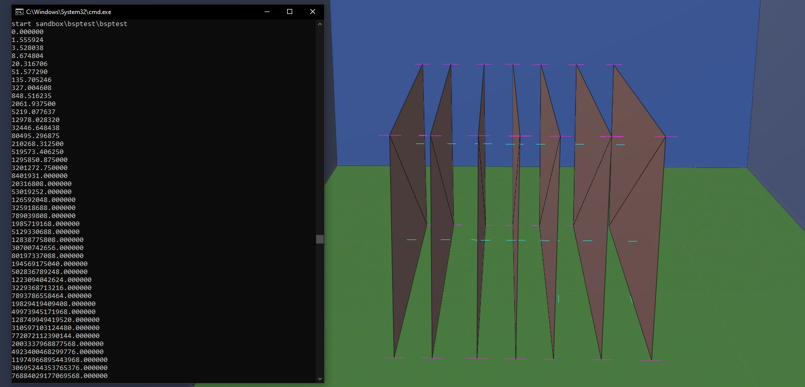

When compiling a level's [structure BSP](~scenario_structure_bsp) using [Tool](~h1-tool#structure) you may encounter warnings or errors in Tool's output indicating problems with your model, for example:

```
### Warning found nearly coplanar surfaces (red and green).
### Warning found #1 degenerate triangles.
```

Use this guide to understand how to avoid problems _before_ you start modeling and you will have an easier time getting your BSP in-game. This guide offers examples in [Blender](~), but the concepts are equally applicable to modeling BSPs in [Max](~3dsmax). Note that the shown model is triangulated during export to JMS and quads are used in examples for modeling ease.

# Sealed world rules

A classic BSP rules cheat sheet.


Halo generally requires your BSP to be one or multiple completely sealed volumes with no intersecting faces, open edges (holes), 0-area faces, or other _non-manifold_ surfaces. There are some exceptions for certain types of surfaces which require [material symbols](~h1-materials), but the main "balloon" of the level still needs to follow these rules.

The normals of the faces used to create the level geometry must face inwards towards the playable area of the level. The normals determine not just the viewing direction but also which direction the surface is collideable from.

It should also not be too geometrically complex or large. Avoid super-small details and edge lengths smaller than roughly the Chief's hand; at these scales, JMS unit rounding means edges can collapse into points and cause import problems.

For most types of problems Tool generates a [WRL](~) file that can be imported back into your 3D software to find the sources of the problems, usually found in either the root of your editing kit or adjacent to the JMS file you're importing; the location and name depends on the Tool version and verb used, so see [Tool verbs](~h1-tool#verbs) for help. You should attempt to fix all errors and warnings in your map. Many of these errors can also show up when compiling [model_collision_geometry](~) and the solutions will be the same.

Your 3D software can help you find some issues before exporting. Blender has [select non-manifold][non-manifold] and 3ds Max has [STL check][stl-check].

[non-manifold]: https://docs.blender.org/manual/en/latest/modeling/meshes/selecting/all_by_trait.html#non-manifold
[stl-check]: https://help.autodesk.com/view/3DSMAX/2021/ENU/?guid=GUID-4C0D058C-4196-4D05-BE68-981E7FF68C7F

# General geometry problems
## Error: Edge is open (red)
_Open edges_ are holes in the surface of your level. Your level needs to be a completely sealed/closed volume. Even outdoor levels must including faces which form a "roof" over your playable space with the `+sky` material. It doesn't matter if the hole is completely airtight and not visible; if the edges are technically open then Tool will not allow it. An unmerged seam along two edges is not considered open if the vertices along those edges are in the same position. In fact, this is the result of the Edge Split modifier that gives you sharp edges.

Open edges are also allowed on render-only surfaces like lights and water, and other special 2D surfaces like ladders, glass, and fog planes that are typically modeled as simple floating quads (a rectangle made of two triangles). If you are attempting to model one of these special surfaces, make sure you are including the [necessary material symbol(s)](~materials).

Closing open edges usually involves merging vertices or filling. In Blender you can select multiple and press , or use [_Auto Merge_][blender-tool-settings] with snap to ensure vertices are merged when you move them to the same location as another vertex. Max users can use _Target Weld_. Filling can be done by selecting multiple edges and pressing .


## Error: Couldn't update edge (red)
This error indicates that an edge is shared by _more_ than 2 adjacent faces. This is usually seen where 3 faces meet and share a common edge. Like with open edges, render-only (`!`) and double-sided (`%`) faces don't count.

This is usually fixed by deleting any accidental leftover faces present after stitching together multiple objects (e.g. a base to the ground) and by avoiding connecting the edges of two shapes by a single edge.

Another common cause for this error is incorrect level [scale](~scale); Tool merges together vertices which are very close together (within 0.1 JMS units) and may interpret many faces as sharing a common edge when in Blender they don't. Remember that with default JMS export settings, 1 Blender meter = 1 JMS unit and the Chief is 70 JMS units tall. Make sure you are modeling the level at the correct scale


## Warning: Nearly coplanar faces (red and green)
This is one of the most common warnings map-makers will encounter. Let's first define coplanarity. If two faces are "coplanar" it means they are _on the same plane_; there is a flat infinite surface that both faces would perfectly lie on. Tool warns you when connected faces are _nearly coplanar_, meaning they are actually facing slightly different directions and the edge they share is a slight hill or valley.

Exact coplanarity is desirable because Tool will combine together adjacent coplanar faces into a single larger collision surface as an optimization. _Nearly coplanar_ faces are undesirable because they can cause a problem called [phantom BSP](~scenario_structure_bsp#collision-artifacts), including cases undetectable by [`collision_debug_phantom_bsp`](~scripting#external-globals-collision-debug-phantom-bsp) but which cause objects to fall back to [BSP default lighting](~object#shadows-and-lighting).

You should deal with this problem even though it's a warning. This is not to say all your cliffs need to be flat walls and the ground featureless, but just avoid very slightly deviations in angle from face to face. Any collection of faces which _should_ be flat, like walls and floors, should be aligned and coplanar.

To avoid this issue you can:

* Avoid "eyeballing it" when modeling things which should be straight and aligned. Use snap when moving vertices along an axis to ensure they align with others;
* Scale sets of faces which should be coplanar to 0 along an axis (see video);
* Avoid sculpting tools, which produce a lot of slight angles in dense geometry;
* Model with simple, low-poly shapes.
* Keep the level's size reasonable. Far from the origin, imprecision can contribute to non-planarity.

In some cases having nearly coplanar faces is unavoidable. When faces are axis-aligned it is easy to make them coplanar, but when they are meant to be at an 45-degree or other angle you may encounter the nearly coplanar warning due to a loss of precision in the [JMS](~) format, which is only capable of storing up to 6 digits to the right of the decimal points (e.g. `123.123456`). This will result in vertices on angled surfaces going slightly out of alignment. In this case check for phantom BSP around the area identified in the WRL file. If any is found, you may be able to clear it up with simple triangulation changes or other minor alterations in the vicinity.

You should also avoid using the Halo Asset Blender Development Toolset's [non-JMS scale settings](~halo-asset-blender-development-toolset#scale) when working with collision models/BSPs. Stick to JMS scale to avoid amplifying floating point precision inherent to the editor and causing the same issue as JMS precision loss.


## Error: Z-buffered triangles (red)
_Z-buffered triangles_ are when two triangles intersect each other rather than being connected by edges and vertices. This rule applies only to collideable geometry and not render-only geometry. The [WRL](~) error file represents this error as an edge along the intersection.

Modders who are used to working with other engines where this is allowed will probably find this restriction annoying, but it's a requirement for how Halo creates collision models. Avoid poking parts of your model through other parts without attaching them to form a continuous mesh.


## Warning: Degenerate triangles (red)
A _degenerate triangle_ is one that has zero (or near-zero) surface area. In other words, it's not functioning as a proper triangle because all 3 of its vertices are in a line (colinear) or at a single point. The warning applies to both collideable and render-only geometry. When edges are below 0.1 JMS units in length, they will also collapse into a single point when compiled by Tool and cause this warning.

You can avoid this warning by avoiding:

* Extremely small or thin triangles;
* N-gons with colinear points (points which line up perfectly) since these may triangulate in a way that produces degenerate triangles.

Like with [_Couldn't update edge_](#error-couldn-39-t-update-edge-red), this warning can also be caused by improper level scale and may not actually be due to actual degenerate triangles.


## Warning: A surface clipped to no leaves (cyan)
This warning occurs when a collideable or render-only surface is _outside_ the BSP. It is usually a sign of an improper triangulation or modeling mistake and should be corrected, since the rationale is that if the player can't leave the level then they probably won't see or interact with such a surface anyway.

However, you might have legitimate reasons for putting render-only faces outside the BSP and ignoring this warning:

* The faces are visible through `+sky` and you do not want to expand the BSP to encompass them, e.g. to reduce [lightmap](~lightmaps) size.
* The faces are part of a larger render-only object which is only partially outside the BSP and removing the faces outside the BSP would be tedious or limit your ability to adjust the model later. Examples might be foliage or wires/cables.


## Error: Couldn't build BSP because of overlapping surfaces (orange)
This error indicates that two collideable surfaces are overlapping ([Z-fighting](https://en.wikipedia.org/wiki/Z-fighting)). They are on the same plane and are intersecting each other. This is not an issue for render-only geometry. It can happen for similar reasons to the [z-buffered triangle example](#error-z-buffered-triangles-red) or when special floating surfaces like ladders and glass are coplanar with walls. The solution is usually to move one of the overlapping surfaces slightly:


## Warning: Found possible T-junction (pink)
This is likely a side-effect of other issues with your geometry. Correct them first and this should go away. On a more technical level, this warning happens when a leaf surface is colinear with a BSP2D plane. Such surfaces would have to be very narrow. If you are seeing a T-junction warning in isolation you should look for extremely thin or small faces and resolve them the same way as [degenerate faces](#warning-degenerate-triangles-red).

## Error: Vertex has a bad point
A vertex is too far away from the origin (0, 0, 0 coordinate). All points must be within -1500 and +1500 [world units](~scale) (-150000 and +150000 JMS units) in each axis. If you have encountered this error it means your BSP is too large and must be scaled down.

## Exception: bsp3d_plane_test_point(plane, point0, NULL)==_bsp3d_plane_test_on
In full, this rare exception appears as:
```
EXCEPTION halt in e:\jenkins\workspace\mcch1codebuild\mcc\main\h1\code\h1a2\sources\tool\import_collision_bsp\build_collision_geometry.c,#979: bsp3d_plane_test_point(plane, point0, NULL)==_bsp3d_plane_test_on
```
The likely culprit is that your BSP is **too large**. Scale it down to a reasonable playable size.

## Exception: global_plane_count < MAXIMUM_BSP3D_DEPTH
The collision BSP's role is to allow efficient lookups of collideable surfaces (e.g. where a projectile will impact) without the game having to test every single surface in the level. It does this by recursively organizing all surfaces under [a tree](~scenario_structure_bsp#tag-field-collision-bsp) of dividing planes, where at each branch the game checks only the surfaces in front or behind the plane. The more collision surfaces (triangles) your level has, the more planes are needed to organize them, and at some point a limit of 128 levels is reached. There is no precise polygon limit here because the BSP depth depends a lot on the specific layout of your level, but generally this error means your topology is too dense and you need to reduce polygon counts.

Tool tries to select optimal dividing planes from existing candidate planes in the BSP, namely collideable surfaces and portal planes. As a result certain shapes like spheres can exacerbate the depth issue because there's no face you can pick that splits the sphere in half and Tool is forced to build a very deep and unbalanced tree. Spherical spaces like this represent the worst case for BSP construction.

You can attempt to pass the limit using H1A Tool's `-noassert` option, but will probably encounter the error _"Couldn't build leaf map"_ next. The best solution is to simplify your geometry and reduce polygon count. From the outset of modeling you should also avoid sculpting tools which generate dense geometry or heavy subdividing. If you absolutely need to maintain existing topology, an advanced workflow is introducing candidate plane hints by intentionally placing collision surfaces or portal planes so they optimally split a problematic area.


## Exception: result.vertex_count!=NONE

```
building intermediate geometry...
building collision geometry...
reducing collision geometry...
building collision bsp...
reducing collision bsp...
EXCEPTION halt in c:\mcc\main\h1\code\h1a2\sources\structures\leaf_map.c,#260: result.vertex_count!=NONE
...
```

This exception is rare, but from a reported example seems to have the same cause as [BSP depth exceeded](#exception-global-plane-count-maximum-bsp3d-depth). Your level's shape is likely near worst-case for building a collision tree, containing rounded or spherical sections which cannot be optimally split up by choosing a dividing plane from any surface in the level. You will need to remove or simplify such features, or add geometry to serve as dividing plane hints.

 allowed this level to progress past the exception.")

## Couldn't allocate subcluster
This error means you have too many triangles in a cluster (>16k). Simplify your level geometry or add portals to divide triangles among more clusters.

## Exception: dividing_edge->vertex_indices\[1]==NONE
In full, this exception appears as:
```
EXCEPTION halt in .\import_collision_bsp\build_collision_bsp.c,#1529: dividing_edge->vertex_indices[1]==NONE
```

This is a very rare problem caused by nearly coplanar surfaces and/or rounding error. Nearly coplanar faces usually result in [a warning](#warning-nearly-coplanar-faces-red-and-green) and are easily identified with the WRL file. For an unknown reason, sometimes they instead cause an assertion exception like the above. We've only encountered a couple cases of this error, so we can't rule out other potential causes like improper level scale which may also contribute to imprecision.

Finding the cause of this error is difficult since a WRL is not generated. Our best advice is to ensure that any sets of faces which should be planar are indeed planar. You can also try setting up a Blender material like below which accentuates faces which aren't coplanar with their neighbours.


This material assigns a distinct colour to each face direction with high sensitivity, so coplanar faces will share the same colour while nearly coplanar faces will have different colours. Temporarily assign faces to a material with this shader node setup to help spot the issue.


## Exception: #-1 is not a valid structure_bsp_cluster_block index in [#0,#0)

```
EXCEPTION halt in c:\mcc\main\h1\code\h1a2\sources\tag_files\tag_groups.c,#4440: #-1 is not a valid structure_bsp_cluster_block index in [#0,#0)
```

This exception occurs from the level being too small, possibly in combination with other problems in the level like degenerate or overlapping faces. Create a [scale reference](~scale) for comparison and increase the level's scale. Address any errors that come up from the next import's WRL. Also ensure you don't have any super-fine details as they will collapse to points on import and cause problems like this.

# Portal problems
Be sure to follow the [portal placement rules](~portals-and-clusters#placement-rules) or you may encounter these types of issues:

## Warning: Unearthed edge (magenta)
An _unearthed edge_ is where a portal's open edge is exposed within the BSP. It is similar to the [open edges error](#error-edge-is-open-red), but for portals. Portal edges should either extend through the BSP or be connected with another portal. If connecting the portal to another portal you must ensure that they are attached at vertices rather than simply touching.


## Error: Portal does not define two closed spaces (yellow)
This error is usually encountered when there are _more_ than two closed spaces ([clusters](~scenario_structure_bsp#clusters-and-cluster-data)) created by the portal. Portals must create only [two clusters](~scenario_structure_bsp#tag-field-cluster-portals-front-cluster). Some scenarios to avoid are:

* If two portals intersect without being attached at vertices then there are 2 clusters for each side of a portal, which is invalid. Portals should be connected to each other as if they were [exact portals](~materials#special-materials) connecting to map geometry.
* If a single portal passes through the BSP multiple times it could create more than two sealed spaces. Simply split up the portal into multiple portals.

Another reason this error can show up is when portal planes are made of nearly coplanar faces. This case can appear or disappear unpredictably as changes are made anywhere in the model. To resolve it, scale portal planes to 0 along their normal axis. Due to JMS imprecision this may not resolve the problem for non-axis aligned portals so you may need to adjust vertex locations to change the portal's shape slightly.


If you have ruled out the prior issues, try slightly moving or changing the triangulation of problem portals. It is possible for previously valid portals to become invalid when other unrelated changes are made to the BSP, which can alter how the BSP is subdivided into its tree structure. This seems to affect the portal process but it's not understood how exactly.

## Warning: Portal outside the BSP (magenta)
This warning is pretty much what it sounds like -- a portal is completely outside the BSP and therefore serves no purpose. You can delete it or move it into the BSP:


## Warning: Portal doesn't divide any space (green)
Usually if you are seeing this warning you likely have other issues with your portals that need addressing first, such as portals outside the BSP or unearthed edges. This warning can also show up in isolation if your portal planes are extremely narrow, less than ~8 JMS units.

## Warning: Found duplicate triangle building connected geometry (orange)
This results from having duplicated/overlapping portal geometry. You may have accidentally duplicated the faces of your portals, or imported portals from a BSP tag using the [Halo Asset Blender Development Toolset](~general/community-tools/halo-asset-blender-development-toolset) without cleaning them up after. Import the WRL to see which portals are affected. You can select the duplicate set of faces by placing your cursor over the portal in face edit mode, and hitting  to select linked (connected faces). In the tool options that appear, select "Normal" if it's not already selected. This should result in selecting just of the two sets of duplicate faces at the portal, which you can confirm by moving. Delete the selection and move on to any other affected portals. If your portals are a separate object, merging vertices by distance will also resolve this.

## Warning: this structure_bsp needs to be reimported for new, faster visibility
This warning is logged when loading a level in Sapien, not when you import a structure or run lightmaps. It indicates some kind of problem with the [PVS](~scenario_structure_bsp#potentially-visible-set) and your level will probably be invisible despite having run lightmaps. This warning should not be taken literally; at some time during Halo's development a new method of cluster visibility was developed and this message would have told artists to reimport their BSPs. With today's tools it just means that visibility data is invalid somehow.

The only known reason this can happen is if you have a cluster floating in the level that is not touching any level geometry. For example, if you have a cube floating in the air with the `+portal` material applied to it. This forms a valid cluster surrouned by 6 portals but Tool seems unable to generate the PVS in this case.

# Other
## Two fog planes intersected in a cluster (black)
This error indicates that you have two [fog planes](~scenario_structure_bsp#fog-planes) in the same sealed space (cluster). Clusters are only capable of referencing a single fog plane, and only one fog plane can be rendered at a time. You should not only avoid having multiple fog planes within a cluster, but also visible to each other in different clusters (see ["two fog planes visible from cluster"](#warning-two-fog-planes-visible-from-a-cluster)).

Note that a fog plane which is not completely flat (not planar) will be counted as multiple fog planes because each triangle becomes its own fog plane. You should also make sure that your fog plane's are only as big as they need to be for the space they will be visible in so that it doesn't intersect with other clusters that contain fog planes.


## Warning: two fog planes visible from a cluster
Although you can add portals to ensure two fog planes are not in the same localized cluster and avoid ["two fog planes intersected in a cluster"](#two-fog-planes-intersected-in-a-cluster-black), Tool will still warn you when two fog planes are [potentially visible](~scenario_structure_bsp#potentially-visible-set) to each other. In this case Sapien will only allow the assignment of a fog palette to a single fog plane and only one will render in-game.

Consider combining together your fog planes into a singular plane. If this is not desirable because you want different fog palette assignments or fog planes at different heights then you will need to ensure the clusters which contain them are completely isolated from each other either by separating the BSP into two volumes (e.g. connected by a teleporter) or ensuring they are not potentially visible to each other by creating a series of corners and intermediate portals that block visibility.


## Warning: Cluster can see multiple skies
According to the [material naming conventions](~materials), you can reference multiple skies in a BSP by including a sky index in the sky material name, e.g. `+sky0`, `+sky1`, `+sky2`, etc. Similar to how a cluster cannot see multiple fog planes, a cluster cannot see multiple skies either. This warning will happen when you have a cluster with a mix of e.g. `+sky0` and `+sky1` faces or a cluster where both are potentially visible.

The solution is to either use a single sky or separate the clusters as seen in ["two fog planes visible from a cluster"](#warning-two-fog-planes-visible-from-a-cluster).

## Weather polyhedra not working
[Weather polyhedra](~scenario_structure_bsp#weather-polyhedra) are volumes within which [weather particles](~weather_particle_system) do not render. They are created by assigning the `+weatherpoly` material to faces which form a [convex volume][wiki-convex].

If you are finding that a weather polyhedron you created isn't working at all (weather still renders inside of it) then there are two possibilities:

1. The polyhedron isn't convex. A hypothetical ant standing on any side of the polyhedron should not be able to see any other side or face than the one it's standing on; the surface should always be curving away behind the "horizon" from the ant's point of view. Halo requires these weather-masking volumes to be convex so they can be represented as an efficient [series of planes](~scenario_structure_bsp#tag-field-weather-polyhedra-planes). Modify your polyhedron to be convex or split it into multiple which are.
2. You have more than 8 weather polyhedra _visible_ at the same time (you can have more than 8 total). Combine some together if possible or alter your level to not require so many.


## Error: Couldn't allocate polyhedron plane
This error does not show up in [WRL files](~wrl), but it is usually easy to find. It means one of your [weather polyhedra](~scenario_structure_bsp#weather-polyhedra) has more than 16 sides. To be clear, this is _not_ a triangle limit for the polyhedron. One side of the shape might be comprised of multiple triangles, but as long as they are coplanar they will be treated as a single side. To resolve this error you can:

1. Simplify any polyhedra which have too many sides. Players will not notice if a polyhedra doesn't perfectly follow the contour of an overhang. As long as it generally hides rain and snow from under overhangs the effect will be convincing enough. Ensure any sides which are meant to be flat actually have coplanar faces.
2. Split the polyhedron into multiple more simple shapes. It is OK for the volumes to intersect, just stay within the 8 visible polyhedra limit.
3. Delete any sides of the polyhedra which are not necessary because they are outside the level and wouldn't usefully "contain" the masking volume. Polyhedra don't actually need to be sealed, in fact a single plane is valid.


## The transparent plasma shader cannot be used in the environment
```
### The transparent plasma shader sandbox\bsptest\shaders\bsptest_stp cannot be used in the environment.
```
This error prevents structure import from completing and indicates you're using a [shader_transparent_plasma](~) in the BSP, which is not supported. If this is unintentional, check your material names to make sure they're unique to your level and not unintentionally matching with a similarly named plasma shader.

# Radiosity problems
## Degenerate triangle or triangle with bad UVs (blue)
A _degenerate triangle_ error encountered during [radiosity](~h1-tool#lightmaps) is due to a triangle being degenerate in UV space (texture coordinates). In other words, the triangle has zero surface area in UV space because all 3 vertices are in a line or the same location so the triangle's texture will appear extremely stretched. This by itself isn't a problem for radiosity, but when the corresponding material has the [_simple parameterization_](~shader#tag-field-shader-flags-simple-parameterization) flag enabled you will encounter this error, since that flag forces radiosity to use texture UV coordinates as the basis for lightmap UVs and lightmap UVs must not be degenerate.

It is common for modeling operations like extruding and merging to produce degenerate/stretched UVs. You can use Blender's ["Correct Face Attributes"][blender-tool-settings] tool option to help avoid stretched UVs while modifying your model, or use a simple cube projection to unwrap faces during map development.


## Radiosity counts up
When [running radiosity](~h1-tool#lightmaps), a number typically counts down representing the amount of light which is still bouncing around the scene. You should expect this number to gradually reduce until it reaches your stop parameter. However, this number can sometimes _count upwards_ and grow exponentially. This may happen early in the radiosity process, or the reduction in light may slow then reverse direction. This means that light is accidentally duplicating itself and growing like a chain reaction, so radiosity will never finish.

This problem is rare and should not happen for valid map geometry. A confirmed cause is render-only double sided faces (the `%!` [material symbols](~h1-materials#material-symbols)) that are also overlapping/duplicated (occupying the same space). Light bouncing off these planes seems to be doubled or otherwise improperly accumulated, and when enough of these are present in a space (and large enough) the problem grows exponentially and can outpace light absorption in other parts of the map, causing the countdown to grow.

One way to end up with this problem is while recycling existing BSP tags for re-export to JMS. A material which was originally double sided gets duplicated into two sets of faces by Tool when creating the level's render geometry in the BSP tag. If you use one of the typical ways to get this render geometry back into your 3D software, like [importing the tag directly to Blender](~halo-asset-blender-development-toolset), but then also reapply the `%` symbol to such faces without merging both sides together (e.g. with _Import Fixup_), you'll have overlapping double sided faces.



## Exception: !point_is_coplanar || _realcmp(transformed_point.z, 0.f, k_real_epsilon * 2)
In full this error appears as:

```
EXCEPTION halt in e:\jenkins\workspace\mcch1code-release\mcc\release\h1\code\h1a2\sources\structures\radiosity\intermediate_radiosity.c,#890: !point_is_coplanar || _realcmp(transformed_point.z, 0.f, k_real_epsilon * 2)
```

Tool checks that your level will not run into floating point precision problems. If you're getting this error it means your map is probably too big. This was less likely to occur in the legacy HEK because MCC-era tools use SSE2 which has [lower floating point precision][precision] than the x87 FPU. You can try working around this issue with `-noassert`, but this may cause problems down the line. It's better to reduce the scale of your level to a reasonable size that the engine was intended to support.

## Exception: bitmap_format_type_valid_height(format, _bitmap_type_2d, height)
This means that radiosity has internally completed, but the final resulting lightmap texture would exceed the maximum supported dimensions. This will happen if you have large continuous sections of your level that require a lot of lightmap space, possibly due to them using a high [radiosity detail level](~shader#tag-field-detail-level-high) and/or [simple parameterization](~shader#tag-field-shader-flags-simple-parameterization). Avoid this by:

* Making your level smaller.
* Introducing seams to large continuous surfaces, especially those with continuous UV unwraps and simple parameterization. This will let Tool treat the UV islands as different packable charts rather than a single larger one that needs to fit in a single lightmap page. These seams can be separations in UV space or through adding modeled details like short cliffs.
* Reducing radiosity detail level.
* Disabling simple parameterization where not needed.

## Error: smooth triangle group too big for page
An example error appears like:
```
radiosity error: smooth triangle group too big for page radon\levels\grounded\shaders\grounded_snow
EXCEPTION halt in e:\jenkins\workspace\mcch1codebuild\mcc\main\h1\code\h1a2\sources\structures\radiosity\intermediate_radiosity.c,#2311: surface_index==last_material->first_surface_index+last_material->surface_count
```

This likely has the same cause as [above](#exception-bitmap-format-type-valid-height-format-bitmap-type-2d-height); you have a smooth continuous area which should form a single lightmap chart but is too big to fit in a bitmap page.

## Error: edge has more than four triangles
```
radiosity error: edge has more than four triangles (see red in error geometry)
```
This error is caused by render-only geometry overlapping with too many duplicate faces in the same location. Remove accidental duplicates. If you are stacking up faces for visual effect, then space planes apart with a small gap.

## Error: there are no lightmapped triangles on the map
```
radiosity error: there are no lightmapped triangles on the map
-nan(ind)
EXCEPTION halt in c:\mcc\main\h1\code\h1a2\sources\structures\radiosity\radiosity.c,#701: valid_radiosity_in(in)
```
Your BSP is composed entirely of non-lightmapped triangles like `+sky`, collision-only (`@`), or transparent shaders. Include some renderable materials using [shader_environment](~).

## Warning: Clusters have no background sound or sound environment
During radiosity you may see this warning logged:

```
<number> clusters in structure_bsp <bsp-tag-path> have no background sound or sound environment.
```

It is totally harmless and just means you have not assigned [background sounds](~sound_looping) and [sound environments](~sound_environment) to all of your [clusters](~scenario_structure_bsp#clusters-and-cluster-data). This step is done in Sapien and is recommended but optional for your map.

# File problems
## Error: reached end of file during parse
This means the JMS file was incomplete or improperly formatted. Tool expected it to have more data but the file ended. You should never see this error unless the JMS exporter addon/script you are using has a bug, in which case you should upgrade it to the latest version or use a different JMS exporter. This error has been known to occur with some 3ds Max scripts.

## Error: model file has wrong version number
Your JMS file was exported for the wrong game version (e.g. Halo 2). If using the [Halo Asset Blender Development Toolset](~halo-asset-blender-development-toolset), pay attention to the export settings and choose Halo CE.

## error 0x00000026 Reached the end of the file
```
file_read('tags\levels\test\<your_bsp>\<your_bsp>.scenario_structure_bsp') error 0x00000026 'Reached the end of the file. '
couldn't read #38496 bytes from offset #80761 in local tag 'tags\levels\test\<your_bsp>\<your_bsp>.scenario_structure_bsp'
couldn't read elements for plane block
```

If you see many errors like this while importing a BSP with `tool structure`, it means the existing BSP tag was incomplete/malformed. This can happen if you cancelled the previous `tool structure` command before it finished, e.g. if you saw a warning logged and killed the command with  in the command prompt. Unfortunately this means you lost any BSP data which cannot be reproduced from JMS, such as detail objects, palettes for weather, fog, sound environments, and their assignments to clusters. You will need to set these up again on the newly imported BSP using Sapien. In the future, allow `tool structure` to run to completion even if you see warnings logged.

# Unknown causes

If you encounter any of these errors, please contact a c20 maintainer so examples can be added.


The following error messages were found in `tool.exe` but could not be reproduced in experiments:

* **Error: Edge is too short (red)**: Creating very short edges leads to degenerate face errors instead.


[blender-tool-settings]: https://docs.blender.org/manual/en/latest/modeling/meshes/tools/tool_settings.html#transform
[wiki-convex]: https://en.wikipedia.org/wiki/Convex_polytope
[precision]: https://en.wikipedia.org/wiki/SSE2#Differences_between_x87_FPU_and_SSE2