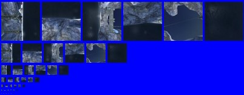
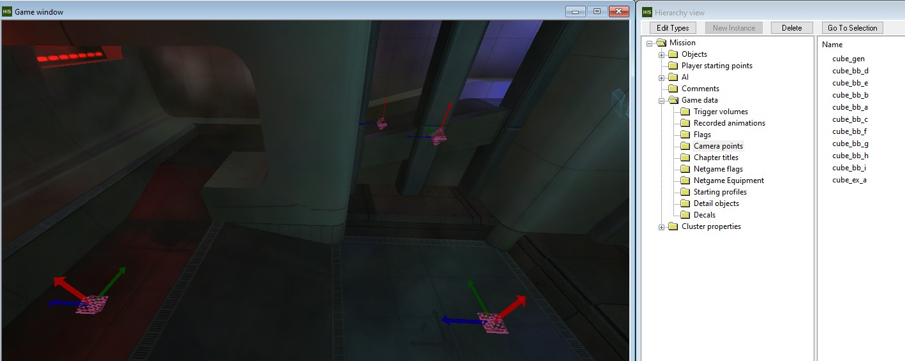

**Cubemaps** are a type of [bitmap](~) that can be referenced by level and model shaders as an approximation of the environment for reflections. These are simple effects which are not meant to accurately reflect the level, but rather just give the impression of specularity. In Halo 1 there are no reflection probes or dynamic reflections and one cubemap needs to look convincing in every space the shader will be seen in. Therefore the game's stock cubemaps tend to be fairly low resolution and abstract without any details that would break the illusion.

However, creating custom cubemaps for your level's shaders will help them fit in by more realistically reflecting their environment, and with control over the resolution and locational use of these cubemaps you can keep the effect convincing.

# Generating cubemap textures
You can use the `screenshot_cubemap` feature included in the MCC tools to generate a cubemap for an in-game location. This script function was backported from H2 to H1A and is unfortunately not available in Custom Edition. In [Standalone](~h1-standalone-build) or [Sapien](~h1-sapien), move the camera to a central location representative of the environment you want reflected. In Standalone you can do this by walking or entering flying camera mode with . The exact placement may take some experimentation, but as a rule of thumb place it in the average location of any reflecting surfaces you want to use the cubemap on and about head height above the ground.

Next, prepare the scene by deleting or hide any dynamic objects which you don't want to appear in reflections such as vehicles. In Sapien, make sure you've selected the _Mission_ folder in the _Hierarchy view_ so [placeholders](~placeholder) aren't visible. You will also need to set some [globals](~scripting#external-globals) in the [console](~developer-console) to ensure the cubemap is seamless:

```console
rasterizer_environment_fog_screen 0 ;doesnt tile
rasterizer_lens_flares 0 ;hide sun lens flares
```

Now use `screenshot_cubemap` to generate the cubemap texture from the camera location. Give the cubemap a name, in this case `my_cubemap`:

```console
screenshot_cubemap my_cubemap
```

The game will briefly orient the camera in 6 directions, taking 6 screenshots which it combines into an output file at `screenshots\my_cubemap.tif`. This texture has the correct "unfolded" shape to [import as a cubemap with Tool](~bitmap#cube-maps):


This texture is likely too large for your needs and should be scaled down before importing. Although it would produce sharp reflections and look very convincing at the location you produced the screenshot, it won't look good in other camera locations because the reflections won't line up. Having blurry low-resolution reflections is actually a good thing because it will look "good enough" everywhere.

Use your preferred 2D software (e.g. GIMP or Krita) to resize the image to `256 x 192` or `128 x 96` pixels.


Even with `rasterizer_lens_flares` enabled, the [ray of Buddha effect](~lens_flare#ray-of-buddha) does not render in cubemap screenshots so the sun will not appear as bright. You may need to paint the sun directly into your cubemap texture.


# Importing the bitmap
Move the cubemap's `.tif` file to your level's source bitmaps folder, e.g. `data\levels\my_level\bitmaps\my_cubemap.tif`. Since the texture has non-power of two height, it will not import as-is and you must first create the destination [bitmap](~) tag using [Guerilla](~h1-guerilla) with the following settings:

| Field  | Value        |
|--------|--------------|
| type   | cube maps    |
| format | 32-bit color |
| usage  | default      |

Save the bitmap tag as `tags\levels\my_level\bitmaps\my_cubemap.bitmap`, then run the Tool command to import it:

```cmd
tool bitmap levels\my_level\bitmaps\my_cubemap
```

The bitmap tag will be populated with texture data. You can reopen and preview the tag in Guerilla and should see something like this:



You're now ready to reference this bitmap from your level's shaders, for example [with shader_environment](~shader_environment#tag-field-reflection-cube-map).

# Advanced cubemaps
Although cubemap reflections are very basic, there are some tricks you can use to improve realism. The cubemap knows nothing about _where_ it was generated and essentially moves with the player. As a result it can end up reflecting things which don't match the space around the player. Here are some ways you can mitigate this:

## Camera placement
When generating a cubemap texture representing reflections at large infinite distances like the skybox, the camera placement is not so important. However for indoor spaces which have a large amount of parallax it's important to optimize the cubemap generation point in a way that maximizes the accuracy of reflections for typical viewing angles.

Consider the space where the cubemap will be used. You should identify:

1. What are the localized points of interest that you want reflected? For example, a certain light on the ceiling, a hologram in the room, or a bright window. Decide which are the most important.
2. What are the typical locations players will occupy? Try to identify an "average" location where those points of interest should be reflected.
3. Which reflecting surfaces should be prioritized for accuracy? This is usually the floor but can include any highly reflective wall surfaces which need to reflect a point of interest.

Let's now consider the geometry of the problem:


In this example we have a room with a central point of interest (red), and the typical observer location. Assuming the floor and wall were highly reflective, the observer should _expect_ to see the point of interest reflected as the two images shown in blue and pink.

For the floor to have accurate reflections from this observer's point of view, the cubemap should be generated at point A. Likewise for the wall to have accurate reflections the cubemap should be generated at point B. However, if they share the same bitmap both can't be true so we need to pick an average location C that compromises accuracy and make the texture low resolution to hide this.

You can also see that if the observer moves around the room the results would be totally different. This is why it's important to prioritize the main observer locations, reflecting surfaces, and points of interest.


## Localized shaders
Rather than trying to optimize a single cubemap for multiple locations, you may instead want to create _multiple cubemaps_ referenced by copies of your level's shaders which use these distinct cubemaps in different parts of the level or even different surfaces within a room.

For example, you might have a highly reflective floor shader but are struggling to create it a cubemap that looks good in outdoor settings, red base, and blue base. Instead create 3 copies of the shader, and generate cubemaps for each of the locations:

```
my_shiny_floor_exterior.shader_environment ---> cube_exterior.bitmap
my_shiny_floor_bluebase.shader_environment ---> cube_bluebase.bitmap
my_shiny_floor_redbase.shader_environment  ---> cube_redbase.bitmap
```

You can then reassign faces in those locations to their corresponding copy of the material.

## Bulk cubemap generation
Generating and resizing many cubemaps for a level is tedious. This is made worse if you change your level's lighting or sky and have to repeat the process. You may also find it challenging to get the camera in the same locations again. So, let's try to automate the process.

Identify all the locations you want to take cubemap screenshots from using the placement tips above. In Sapien, place _camera points_ for each of them:

1. Open _Game data > Camera points_ in the _Hierarchy view_.
2. In the _Game window_, press  to place a camera point at the camera's current location.
3. Give the new camera point a name, for example `cube_ex_a` to help identify it as a cubemap point for exterior reflections. The camera point's rotation doesn't matter but you can zero it out if you want.



Camera points are normally used for cutscenes but we'll use them to quickly move the camera around the level for screenshots. [Add a script](~scripting#compiling-scripts-into-a-scenario) like this to your level:

```hsc
(script static void cubes
    ;perform any setup needed here
    (object_destroy c_shield)
    (set rasterizer_environment_fog_screen 0)
    (set rasterizer_lens_flares 0)
    ;start moving the camera and taking screenshots
    (camera_control 1)
    (cube cube_gen cube_gen)
    (cube cube_bb_a cube_bb_a)
    (cube cube_bb_b cube_bb_b)
    (cube cube_bb_c cube_bb_c)
    (cube cube_bb_d cube_bb_d)
    (cube cube_bb_e cube_bb_e)
    (cube cube_bb_f cube_bb_f)
    (cube cube_bb_g cube_bb_g)
    (cube cube_bb_h cube_bb_h)
    (cube cube_bb_i cube_bb_i)
    (cube cube_ex_a cube_ex_a)
    ;restore state
    (object_create c_shield)
    (set rasterizer_environment_fog_screen 1)
    (set rasterizer_lens_flares 1)
    (camera_control 0)
)

(script static void (cube (cutscene_camera_point pt) (string filename))
    (camera_set pt 0)
    (screenshot_cubemap filename)
    (sleep 15)
)
```

Now, in Standalone, you can simply enter `cubes` into the console and the script will output `.tif` files in your `screenshots` folder for all of the camera points. You can repeat this whenever you need to regenerate the cubemaps, then delete the script when you're done with the level.

To bulk resize these textures you can use a [Python][python] script. Install the [Pillow image processing library][pillow], then create and run a script like this:

```py
from PIL import Image
import glob

for src in glob.glob("./screenshots/cube*.tif"):
    print(src)
    with Image.open(src) as img:
        size = (128, 96)
        out = img.resize(size)
        out.save(src)
```

This will resize all the textures to `128 x 96`. You can then copy them to your level's bitmaps data folder and import them all with Tool using the [bitmaps verb](~h1-tool#bitmaps). Note that you'll need to pre-create the bitmap tags with the necessary settings the first time.

[python]: https://www.python.org/
[pillow]: https://pillow.readthedocs.io/en/latest/installation/basic-installation.html