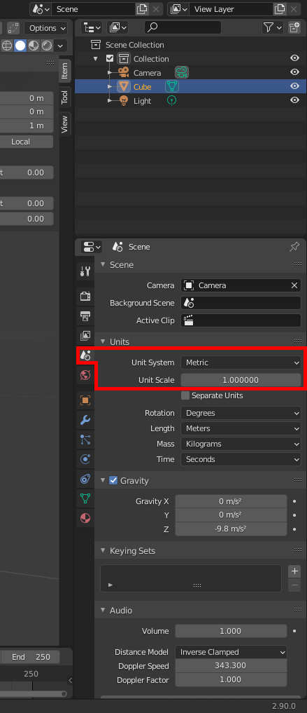
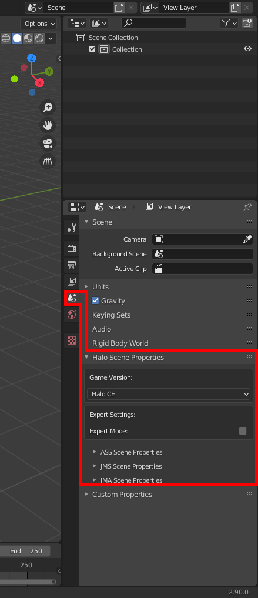
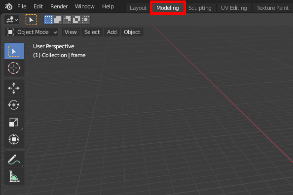

# File List
[Blender 3D Software](https://www.blender.org/) -> The Blender application that we will be using to create our assets.
  

# Setting Up Blender
[Installing the Blender addon](https://general-101.github.io/HEK-Docs/w/Plugin/Install/Install.html)

See the above link for setting up the Blender addon for exporting Halo assets if you haven't installed the addon already. Beyond that there may be a few other settings you may want to mess with before starting with any modeling.
  

## Undo Count
Consider increasing the number of edits you can undo in Blender by changing the setting in preferences. Be aware that increasing this setting will use up more of your system RAM. Don't have stats cause I'm not a nerd so go forth.

  

## Hotkeys
There will probably be certain Blender functions you will be using over and over again so it's probably a good idea to setup some quick hotkeys for important functions.
  

## Unit Measurement
All units given in this guide are given with the expectation that your Blender instance is set to use metric units. If you haven't messed with this then it's already set to metric by default most likely. All units will also be given with the expectation that you are using global transforms.

  

## Scene options
An option added by the exporter to keep settings you don't need to care about hidden. Be sure to set game version to Halo CE as seen in the image below.

  

## Workspace
Since we are modeling lets be sure to pick the correct workspace for our work. Choose the "Modeling" workspace found in the top left by default.

  

## Key Configuration

All hotkeys given in this guide are given with the expectation that you are using the default Blender 2.8 preset.
  
