# Advanced introduction
We will begin from where we last left off.

# Modifying the Level
Lets paint some hills and gullies in our level to get out of this plane hell.

## Subdividing a Face

Assuming you still have your tutorial level loaded you can continue on from where we last left off.

<a href="1G.png" target="_blank">
	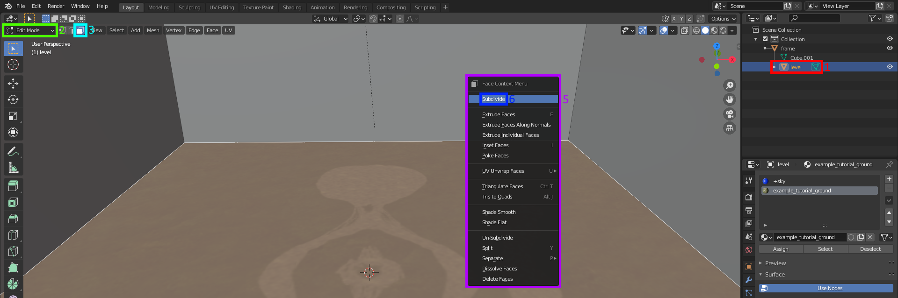
</a>

1. Select your box (level) object

2. [Change context mode](https://general-101.github.io/HEK-Docs/w/Blender%20Overview/Blender_Overview.html#context-mode) from object mode to edit mode.

3. Set your [selection mode](https://general-101.github.io/HEK-Docs/w/Blender%20Overview/Blender_Overview.html#geometry-selection-type)  to face selection.

4. Select the bottom of the box (level) object. Only the face that has your "example_tutorial_ground" material applied should be selected.

5. Drag your cursor over your 3D viewport and right click. It should bring up a [face context menu](https://general-101.github.io/HEK-Docs/w/Blender%20Overview/Blender_Overview.html#geometry-context-menu).

6. Select the [subdivide](https://general-101.github.io/HEK-Docs/w/Blender%20Overview/Blender_Overview.html#subdividing) option from the menu. Repeat this process 4 times to match our setup.

The end result of this should look something like this.

<a href="1H.png" target="_blank">
	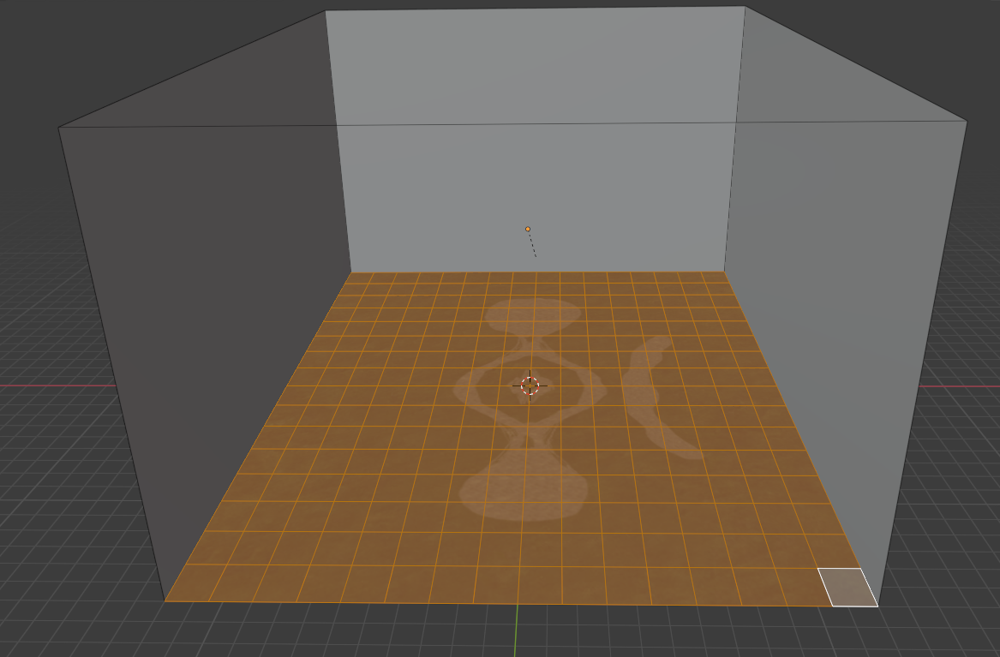
</a>
<br><br/>

```$alert info
You may have noticed that I am seeing through the object in this image. If you want to enable this then you can enable [backface culling](https://general-101.github.io/HEK-Docs/w/Blender%20Overview/Blender_Overview.html#backface-culling) in shading options. You must be in the solid renderer for this option to work. You can also enable the xray option here to select faces through other faces. This will make working in backface culling mode less awkward.
```

<a href="1I.png" target="_blank">
	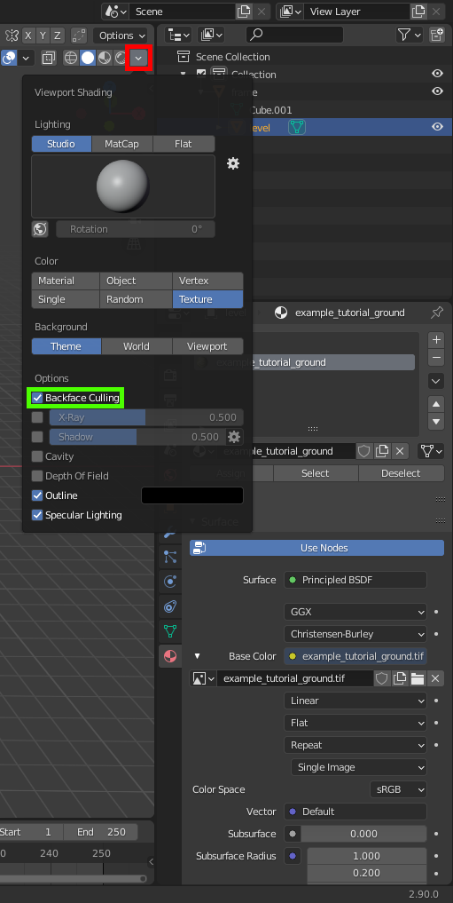
</a>

## Creating the Border For Our Level

We will need to create some hills on the edge of our level that our players can't see past. We don't want them to be able to stare into the abyss and ruin their immersion after all.

<a href="1J.png" target="_blank">
	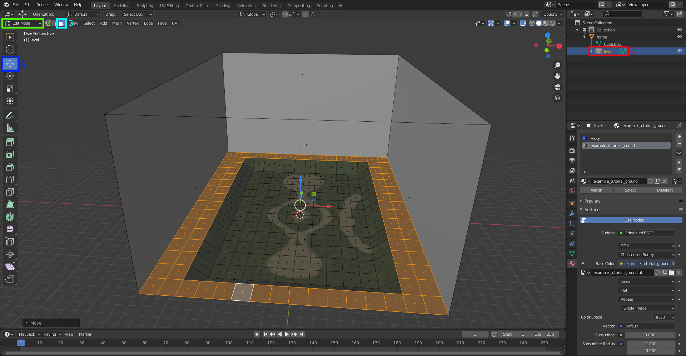
</a>

1. Select your box (level) object.

2. [Change context mode](https://general-101.github.io/HEK-Docs/w/Blender%20Overview/Blender_Overview.html#context-mode) from object mode to edit mode.

3. Set your [selection mode](https://general-101.github.io/HEK-Docs/w/Blender%20Overview/Blender_Overview.html#geometry-selection-type) to face selection.

4. Select two rows of quads on the west and east and select one row on the north and south.

5. Select the [move tool.](https://general-101.github.io/HEK-Docs/w/Blender%20Overview/Blender_Overview.html#set-transform)

6. Move the planes to around 128 units up on the Z axis.

```$alert info
You can find the exact units you are setting during translation by looking in the top left by default. Should look something like the image below.
```

<a href="1K.png" target="_blank">
	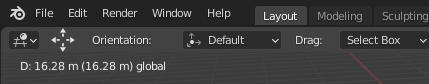
</a>

# Using the Sculpting Tools
Lets get creative and use the sculpting tools to generate some details in our level.

The first step is the generate a mask for where we will be sculpting our hills. Lets start with the following.

<a href="1L.png" target="_blank">
	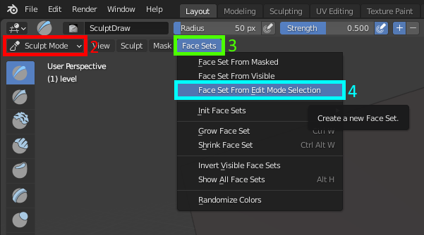
</a>

1. Ensure the steps from the [creating the border for our level](#creating-the-border-for-our-level) section is complete.

2. [Change context mode](https://general-101.github.io/HEK-Docs/w/Blender%20Overview/Blender_Overview.html#context-mode) to sculpt mode.

3. Find the "Face Sets" dropdown option.

4. In the "Face Sets" dropdown there will be an option labeled "Face Set From Edit Mode Selection"

<a href="1M.png" target="_blank">
	
</a>

## Sculpt Tool Settings
A couple of things to keep in mind while working in [sculpt mode](https://general-101.github.io/HEK-Docs/w/Blender%20Overview/Blender_Overview.html#sculpting). If you don't see the tool settings for setting things like brush radius and strength then you'll want to right click the context option and set some settings there.

<a href="1N.png" target="_blank">
	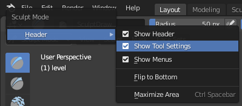
</a>

From here we will change a few settings. You can choose to ignore these suggestions if you rather have them enabled.

1. You can disable symmetry for brush strokes. The symmetry option here will mirror your changes on the axis of your choosing. Can be a bit annoying when the work you're doing shouldn't be mirrored so go ahead and change this. For our setup we will disable symmetry completely. By default you should only have to click the X button to do this.
	* <a href="1O.png" target="_blank"> 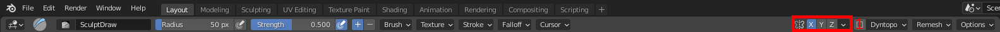 </a>

2. Set the axis that your sculpt goes in. You can lock all changes you make to a particular axis. In this case we will go with Z since we are making some hills.
	* <a href="1P.png" target="_blank"> 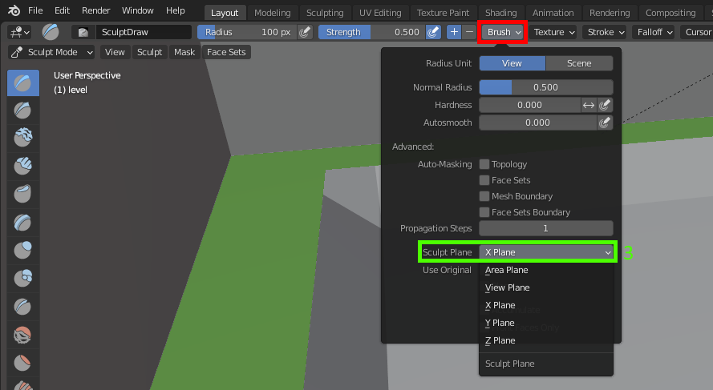 </a>

3. You can set the direction of your sculpt to be positive or negative. In terms of directions this would mean either up or down respectively if you were doing changes locked to the Z axis.
	* <a href="1Q.png" target="_blank">  </a>

4. Change the radius of your brush so that you affect a larger area. The default is 50 units so we will change it to around 100 units.
	* <a href="1R.png" target="_blank">  </a>

## Editing the mesh
This is where the face set you created comes into play. We will be using it to hide the geometry we do not want to edit currently.

1. Drag your cursor over a patch of colored geometry that was generated from the face set.

2. Click the **H** key. This should [hide](https://general-101.github.io/HEK-Docs/w/Blender%20Overview/Blender_Overview.html#hide) all geometry except for the geometry connected to the face set we currently hovering over.

3. Left click on the remaining geometry until you have hills you are satisfied with. You can always hit **CTRL + Z** to undo if you are unsatisfied with any of your work.

The end result should look something like the following image.

<a href="1S.png" target="_blank">
	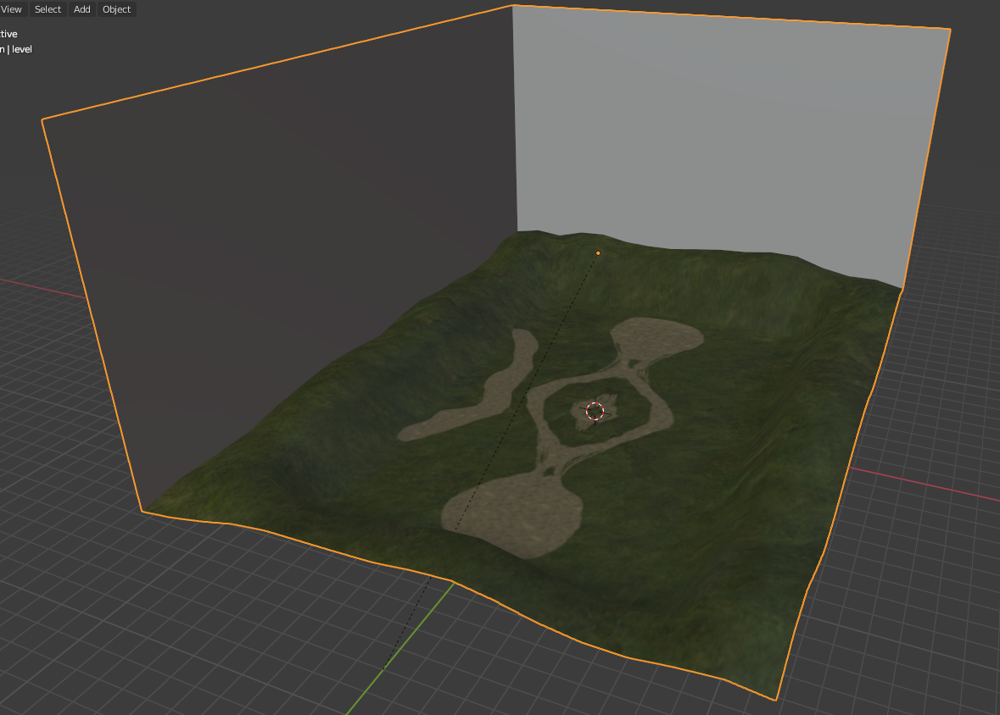
</a>

```$alert info
If you can't see your masks in sculpt mode then temporarily disable any modifiers you have until the job is done.
```

<a href="1T.png" target="_blank">
	
</a>

Lets add some final touches to the geometry we sculpted.

You can add another [mask](https://general-101.github.io/HEK-Docs/w/Blender%20Overview/Blender_Overview.html#sculpting) for the interior geometry if you want to. Should help with the next few steps.

<a href="1U.png" target="_blank">
	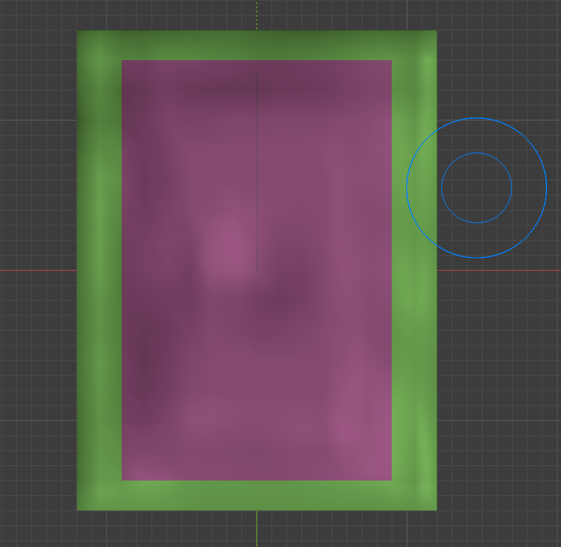
</a>

Use what you learned from the [sculpting](https://general-101.github.io/HEK-Docs/w/Blender%20Overview/Blender_Overview.html#sculpting) instructions to create a small hill in the middle of the level.

<a href="1V.png" target="_blank">
	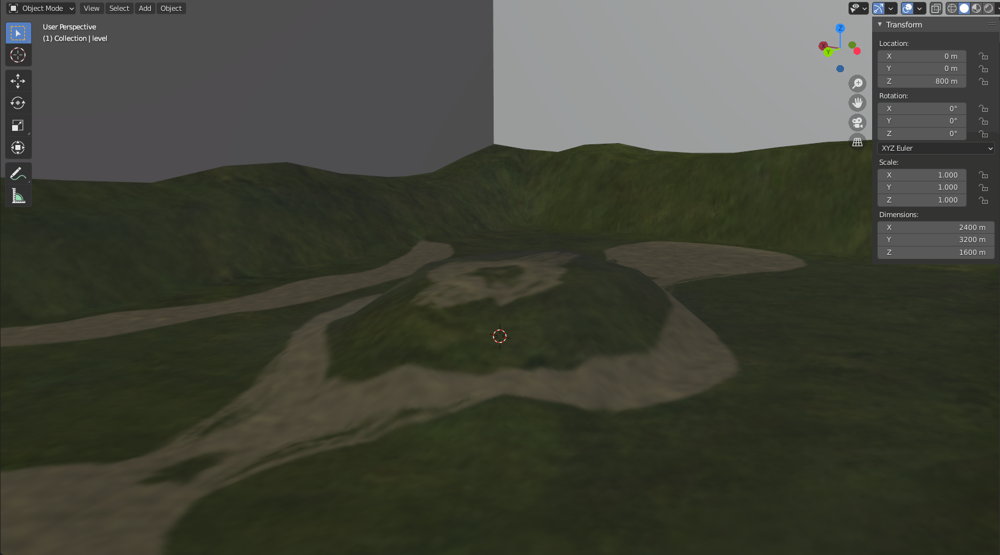
</a>

Consider raising the geometry on the -X axis like in the following image. This will give the play space in your level some more varied height.

<a href="1W.png" target="_blank">
	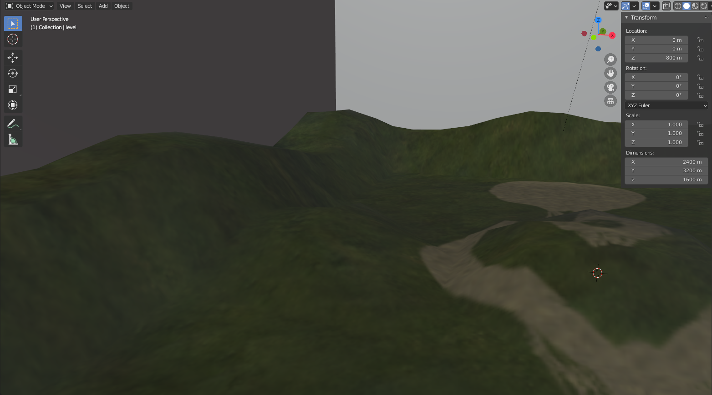
</a>

Mess with the edges of the map a bit to make it also look a bit more varied. Do not mess with the edge on the +X axis too much. We will mess with that in a bit.

<a href="1X.png" target="_blank">
	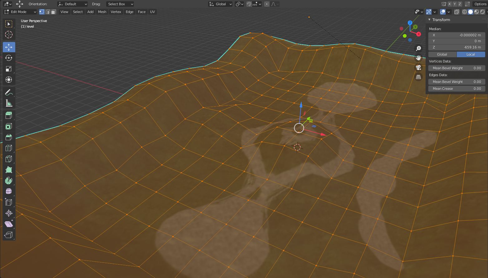
</a>

# Creating a Stream Bed
Lets finally take care of that area we didn't mess with on the +X axis. Select the faces seen in the following image.

<a href="1Y.png" target="_blank">
	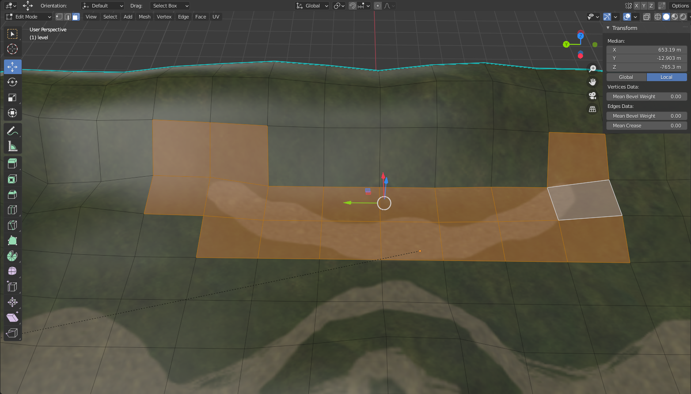
</a>

Go ahead and use the [subdivide](https://general-101.github.io/HEK-Docs/w/Blender%20Overview/Blender_Overview.html#subdividing) function on the selected faces again. Only one time so that we get the effect we need. The end result should look something like this.

<a href="1Z.png" target="_blank">
	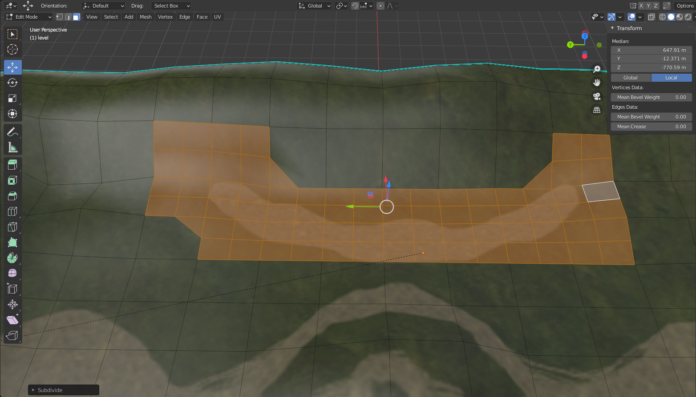
</a>

Go head and select the vertices that are inside the dirt texture. Bring them down a few units on the Z axis using the [translation tool](https://general-101.github.io/HEK-Docs/w/Blender%20Overview/Blender_Overview.html#set-transform). The end result should look something like this.

<a href="2A.png" target="_blank">
	
</a>

Now go to the add tab and add a plane object like you did with the cubes. Make sure to set frame to be the parent on the plane object. Lets now move the object over to the stream bed and [scale](https://general-101.github.io/HEK-Docs/w/Blender%20Overview/Blender_Overview.html#set-transform) it so that it covers it completely.

You will probably have to manually edit both the geometry of the level and of the stream for this to look correct. Lets go over some of the steps you will have to do.

1. Take your plane [scale](https://general-101.github.io/HEK-Docs/w/Blender%20Overview/Blender_Overview.html#set-transform) it to properly cover the stream bed area.

	* <a href="2B.png" target="_blank"> 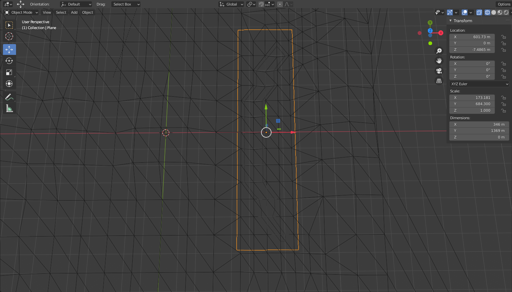 </a>

2. While having the plane selected, change your [context](https://general-101.github.io/HEK-Docs/w/Blender%20Overview/Blender_Overview.html#context-mode) from object mode to edit mode. We will add 8 segments to our plane so that we can make it fit the stream a bit better. Use edge select and select only the sides of the plane. Run [subdivide](https://general-101.github.io/HEK-Docs/w/Blender%20Overview/Blender_Overview.html#subdividing) around 4 times to get the 8 segments you need.

	* <a href="2C.png" target="_blank">  </a>

3. [Move](https://general-101.github.io/HEK-Docs/w/Blender%20Overview/Blender_Overview.html#set-transform) the plane to somewhere a bit below the stream bed. You may have to edit the surrounding geometry to get this to look right.

	* <a href="2D.png" target="_blank"> 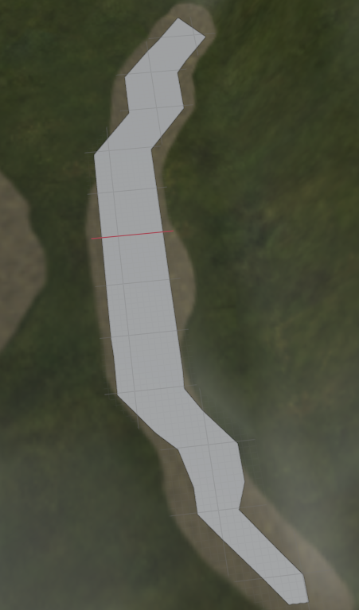 </a>

4. Run a [smart UV unwrap](https://general-101.github.io/HEK-Docs/w/Blender%20Overview/Blender_Overview.html#uv-creation) while you're here.

5. Edit the shape of the stream in edit mode to get it to fit the stream and get the texture to look like it's bending with the shape of the stream. This is why we created the segments a while back.

	* <a href="2E.png" target="_blank"> 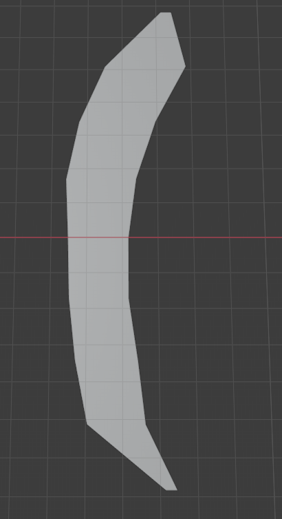 </a>

## Adding a Material

Lets add a material to our stream object. Go ahead and [add a new material](https://general-101.github.io/HEK-Docs/w/Blender%20Overview/Blender_Overview.html#material-creation) named "example_tutorial_stream". We need to also assign the texture this material is going to use so that we can see how our UVs will look.

Go ahead and set your base color to an image node and navigate to

```(HEK Install Path)\data\levels\test\(Level Name)\bitmaps```

Select the texture "example_tutorial_stream.tif" for your material.

Now due to it being a one sided plane that means it has open edges and does not follow the sealed world rules. In order to solve this we need to add a shader symbol to the end of our material name.

rename your stream material from...

```example_tutorial_stream```

to...

```example_tutorial_stream!```

This will set the geometry that has this material assigned to be render only. Render only here meaning that the geometry does not generate collision geometry and will not break the sealed world rules.

Now that we've set up our materials and textures lets make sure our UVs are correct.

## UV Mapping our stream

Go ahead and open a viewport for a UV editor if you don't have one open already. Once you have it open select all faces of the stream mesh with the **A** key. You should see the UV for the mesh in the UV editor now. Let's go over a few tools you'll need to know for manually adjusting UVs.

* The highlighted options are your selection modes like the ones found in edit mode. You can pick from vertex, edge, face, and island selection. We will go with island for this example.
	* <a href="2H.png" target="_blank"> 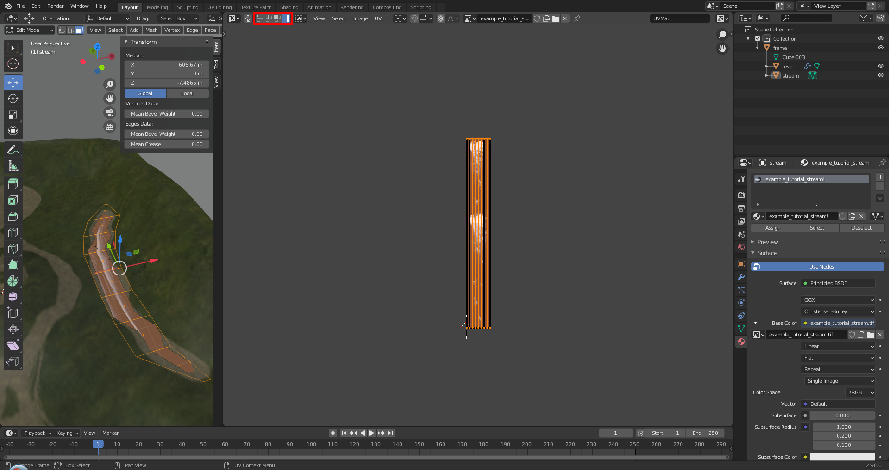 </a>

* Some of the hotkeys you may be familiar with from edit mode work here as well. We can use the **R** key to rotate selected UVs. You can also use the **G** key to move the selected UVs and **S** to scale them. You can of course also hold **CTRL** while doing any of these actions to have fine control over them. Using the **X** or **Y** key while doing a transform will lock your transform to that axis.

Lets fix the UV for this stream mesh. If you were to look at it you probably have noticed that it appears stretched. We need to rotate it in the correct direction and scale it to fix this issue. Use the **R** key while holding **CTRL** to rotate it 90 degrees counter clockwise.

<a href="2I.png" target="_blank">
	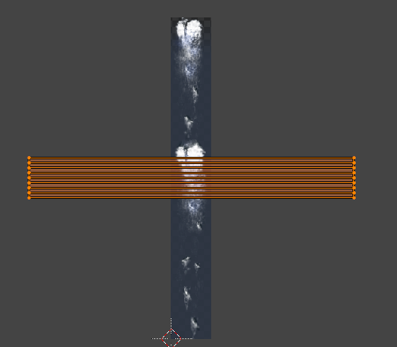
</a>

Now make sure to scale it on the X axis to fit the texture. Press the **S** key to enter scale mode then press the **X** key to lock it to that axis. Click your **LEFT MOUSE BUTTON** to confirm your transform. Should end up with something that looks like this.

<a href="2J.png" target="_blank">
	
</a>

Scale it again but this time on the Y axis. Repeat the steps from above but replace the **X** key with a **Y** key press. This should be the end result.

<a href="2K.png" target="_blank">
	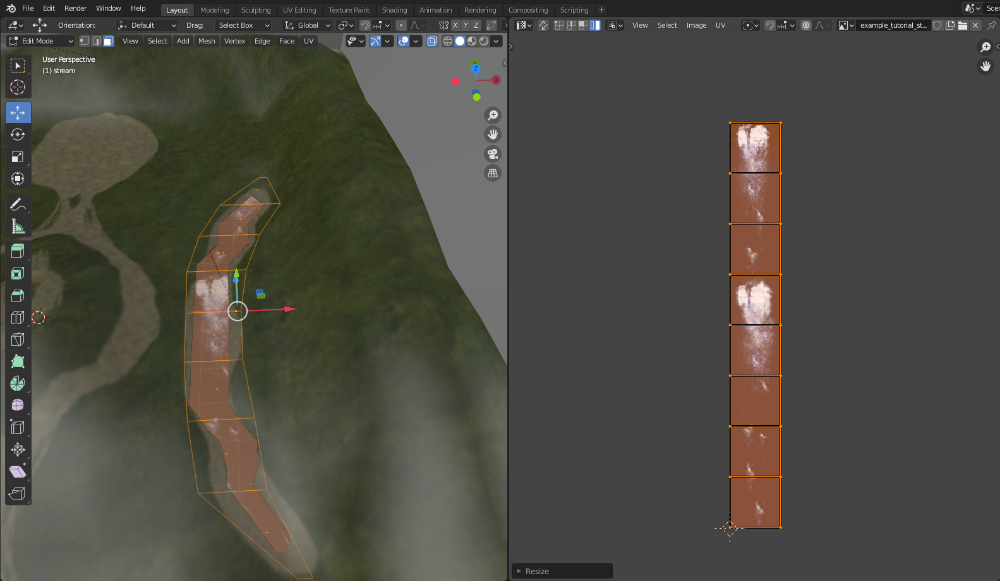
</a>

## Final thoughts

The stream now has a material and mapping coordinates applied to it that once viewed in game will scroll and give the appearance of running water.
For additional water effects the stream bed will have a different material applied to it than the currently applied terrain material. Such additional water effects include: the sound of water splashing when the player runs through the water or stream bed, the water particle effects when the player runs through the stream or stream bed, and the explosion effects and particle effects that occur when such an event occurs in the stream.

It should be noted that the steam in the examples and tutorials is the simplest case of creating or "simulating" water.  Before continuing, a short discussion on water and water volumes and how they exist and behave in Halo is in order.

# Water and Water Volumes in Halo
Water in Halo is very simple, almost to the point where water does not truly exist (at least in the sense that most people that have edited or created water in other games are used to).  This is understandable since there are no specifically designed underwater missions or environments in Halo.  In the case of streams, the water is shallow and the player cannot get under the surfaces of the water and be completely immersed.  Couple these facts with the game play mechanic that the player in the role of the Master Chief has a self contained suit of armor and has no fear of drowning, there was no need for complicated underwater player behaviors, physics, and effects.

The majority of water encountered is in the form of simple streams.  This kind of "water" has 2 parts: a stream surface with a shader whose settings simulate a water surface (small waves, flowing water, etc...) and the terrain underneath which has specific settings so that when objects interact with the terrain water effects occur (particles, sprites, sounds, etc...) giving the appearance that the stream itself is water.  It is this kind of water that is demonstrated in the tutorial below.

There is one instance in the game where a large volume of water exists that the player can interact with or go "completely under water", this occurs for the island level in single player Halo, Silent Cartographer and in its multiplayer derivative, Death Island.

In this instance, the water is still very simple.  Just like the stream example, there are the water surfaces that have the water shader effects and the terrain or surfaces underneath that are setup to simulate water with the effects that occur when objects interact with these surfaces.  In the case of the water surfaces, these are defined with a .shader_transparent_water where as the streams use .shader_transparent_chicago or shader_transparent_chicago_extended shader tags.  The water is made to have no collision using the "!" Render Only Shader Symbol just as with the stream example below.

The combination of the .shader_transparent_water and water fog volumes described below determine additional game behaviors such as the ability of vehicles to travel over the water (Ghosts will eventually stop and sink).

For large volumes of water, a water fog volume is created.  This is done by adding the fog plane Shader Symbol "$" to the material names for the water surfaces, or a similar plane is created with another fog plane defined shader assigned to the surfaces of the plane.  The volume is defined to be a water fog volume by enabling the "is water" flag located in the .fog tag.

Fog planes or volumes (such as those seen throughout the game and in the chasm in the multiplayer level Gephyrophobia) as well as water fog volumes are all created in a similar manner.

Make a plane that covers the entire area and extends past the level borders (this plane does not have to follow the Sealed World Rules), face the normals for the faces of the plane upwards, apply a material with the fog plane symbol or use the +unused special material (this material has no collision nor will it draw) with the fog plane symbol (to create the material +unused$).  In Sapien, create a fog reference (a .fog tag that contains fog color and density as well as other properties) for the "fog palette" and then enter the volume and set the .fog palette entry to be applied to this volume.

The following procedures and example images will discuss the implementation of materials to achieve water effects.  The faces that compose the stream bed will be assigned a material that will give the stream the appearance of being water when the player and other game objects interact with it.

# Water Effects For Our Stream Bed
Now that we have our stream bed will we need to create a new material identical to our "example_tutorial_ground" material. The key difference between these two materials will be that their ingame physics material setting will be set differently. The "example_tutorial_ground" material will be set to dirt while the "example_tutorial_streambed" material will be set to water. A couple of things you might want to consider.

* You should triangulate your geometry so that you can get specific with how the new material will be applied. You can find the option here.
	1. Select your mesh objects and set their context mode to edit mode and set your selection type to face select.

	2. Go over to the "Face" dropdown

	3. While having all the faces in your mesh selected press the option labeled "Triangulate Faces"

You may need to edit the geo so that your stream looks correct. The end result of all this should look something like this.

<a href="2M.png" target="_blank">
	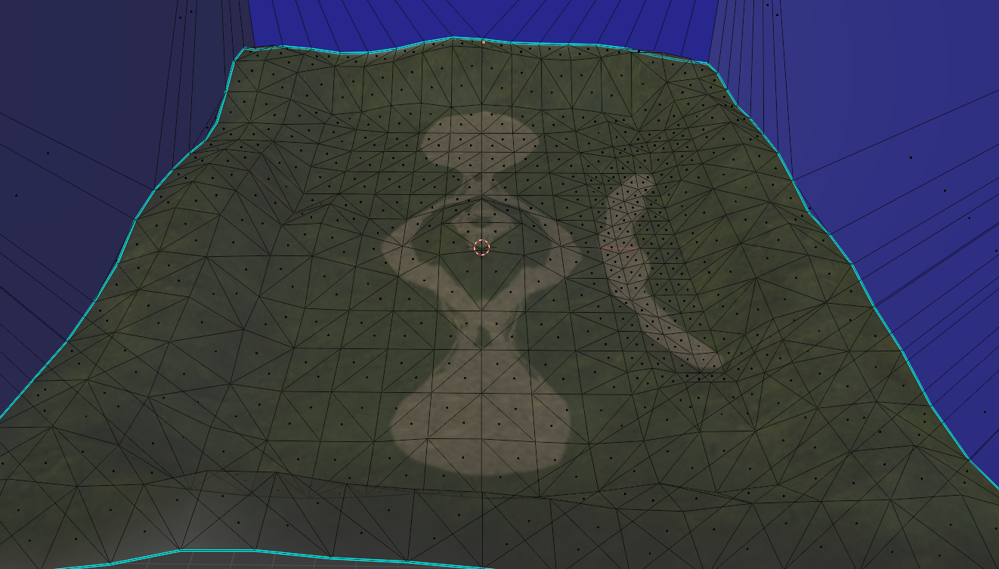
</a>

Once that's done you should create a new material named "example_tutorial_streambed" if you haven't already. We will start assigning this to the triangles that make up the dirt area in our stream. Should look something like this.

<a href="2N.png" target="_blank">
	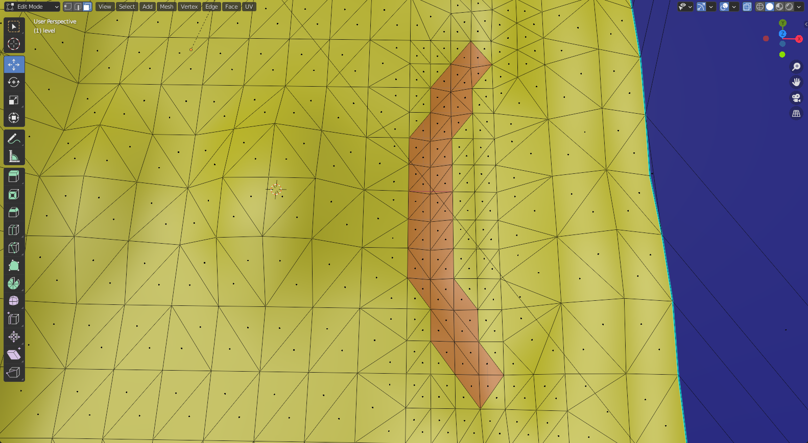
</a>
<br><br/>
<a href="2O.png" target="_blank">
	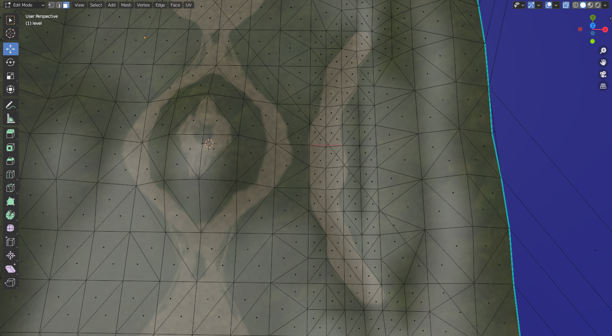
</a>

# Creation of a Simple Base Structure
This section of the guide will be covering how to create a simple structure from a mesh. This object will eventually be mirrored to have a base on the opposite end. We will cover this in future sections along with application of materials and UV editing for our structure.

## Adding a Reference Model
When creating a level, particularly indoor environments and\or buildings or structures, it is always helpful to have a scale reference.  The dimensions of various game elements of Halo, including the player dimensions, are available for reference in the Halo Player Statistics.

Another technique is to use a reference model. The file list in this guide has links to a reference model for the player (the Master Chief) and a vehicle (the Warthog) for use in Blender.  The following procedures will demonstrate how to add a reference model to our scene for use as scale reference for the creation of the base structure geometry. Here's how to do this.

<a href="2P.png" target="_blank">
	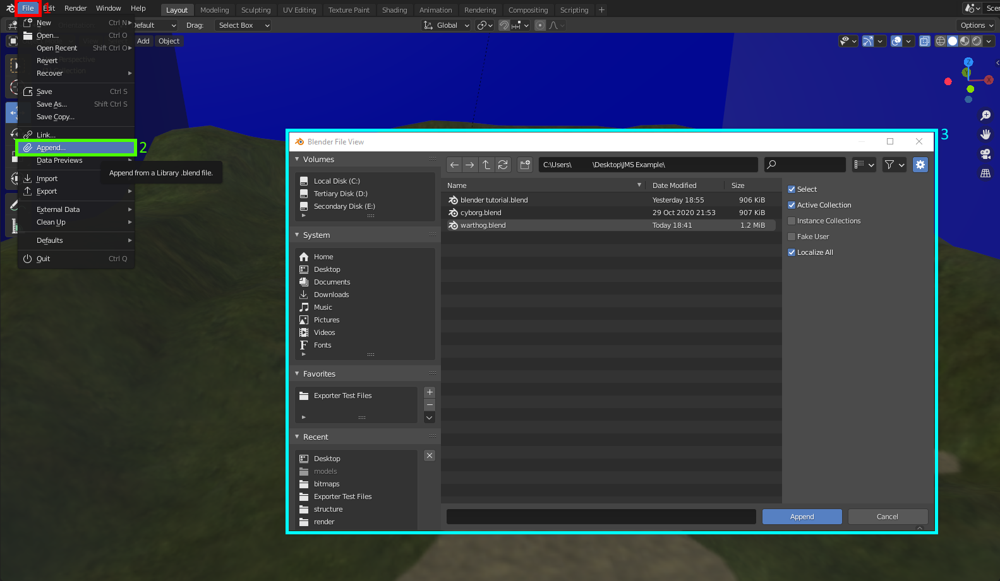
</a>

1. Find the "File" dropdown in the top left.

2. Click on the option labeled "Append"

3. A file browser dialog window should pop up. Navigate to some blend files that contain assets you would like to add to the scene.

Once you've found it then go ahead and click on the asset you've chosen. This will reveal the contents of the file to you.

1. Click on "Object"

	* <a href="2Q.png" target="_blank">  </a>

2. Select the object you want from the blend file's object list. In our case will we be picking the Cyborg.

	* <a href="2R.png" target="_blank"> 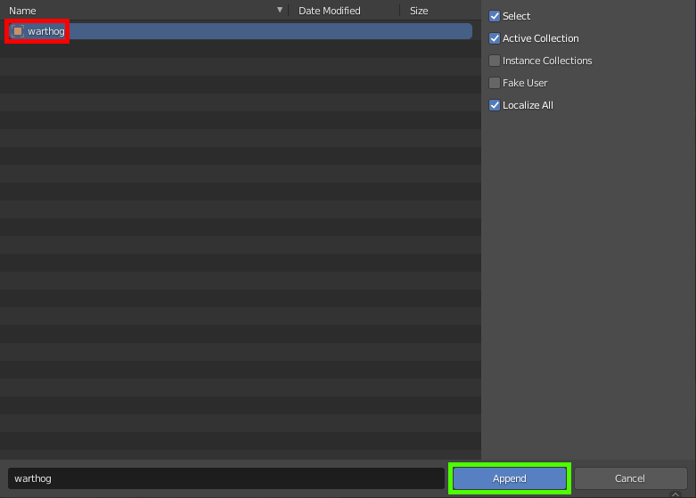 </a>

3. With the object highlighted you can now press the button labeled "Append" to add it to your scene.

The Master Chief reference model will now appear in the level and can be moved and rotated as necessary. For this tutorial, the reference model will be moved to the southern dirt patch of the level where the base structure will be constructed.

Note that the model may appear below the terrain but will be selected, move the model up to make it visible.

The reference model will NEVER be linked to the reference frame and only exists as a reference tool. Since the model is not linked to the frame, it will never be part of the level and will never be exported. Therefore, the model can be kept in the .blend file and does not have to be deleted each time the level is exported to a .JMS.

The second image further explains the above procedures.

## Creation of The Base Structure Geometry

1. Go to the "Mesh" tab and add a cube shaped mesh.

2. Set the dimensions of the cube to X: 96.0 Y: 280.0 Z: 96.0

3. Select the edges along the Y axis and subdivide them.

	* <a href="2S.png" target="_blank"> 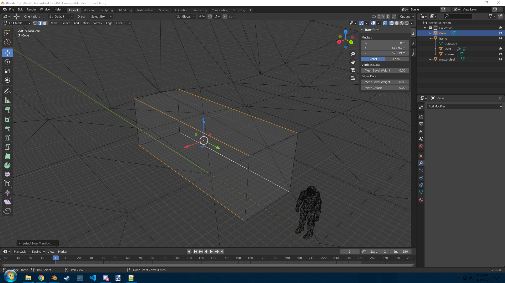 </a>

	* <a href="2T.png" target="_blank"> 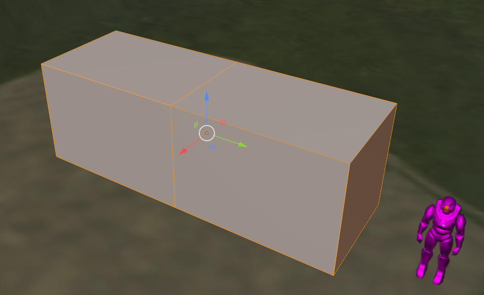 </a>

4 Position the cube so that it's somewhat center of the dirt patch but closer to the middle. We will be doing X: 0.0 Y: -820.0 Z: 48.0

The box will now be manipulated to create a ramp and simple hallway.

1. Select the new box object you made and change your context from object mode to edit mode.

2. Merge the two edges facing the center of the map. Here's how to do that.

	* A: Use vertex selection for this. You'll need it to merge the vertices.

	* B: Start with the verts on the left side from top to bottom

	* C: While having your cursor over your 3D viewport hit the **M** key to bring up the merge menu. Select the "At Last" option from the menu.

	* D: Repeat this for the right side. The end result should look something like this.

	* <a href="2U.png" target="_blank"> 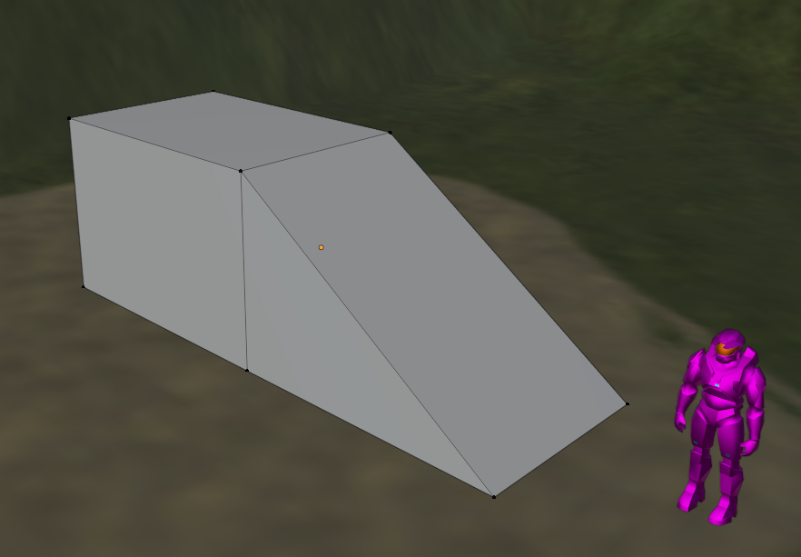 </a>

Now lets create the hallways in our structure.

1. Switch to face selection and delete the faces on the sides of the cube along with the bottom. You can do this by having your cursor over the 3D viewport and pressing **X** to bring up a menu. Select the "Faces" option to delete the selected faces.

<a href="2V.png" target="_blank">
	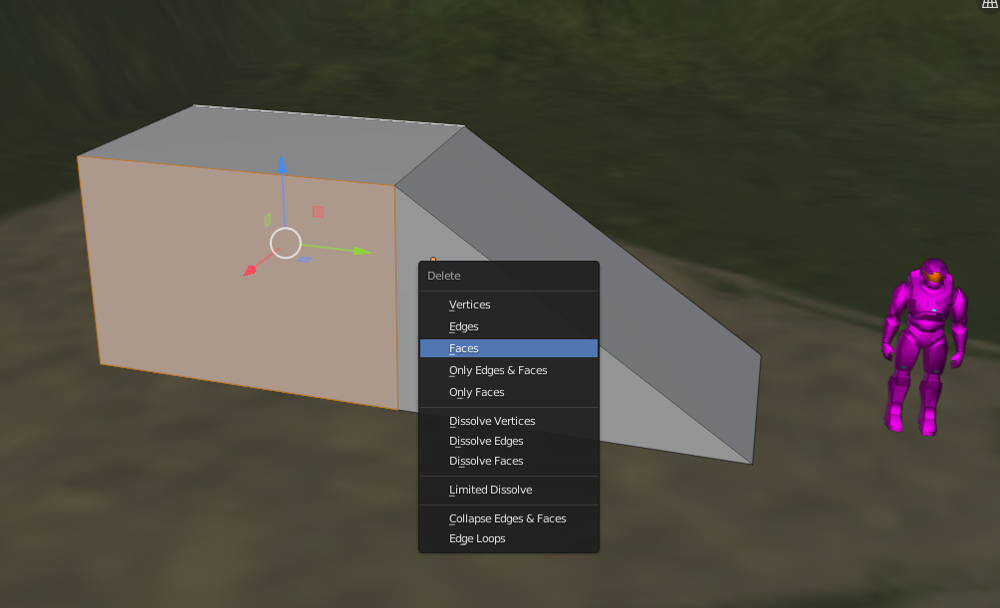
</a>

Once that's done you can extrude the areas you made to generate the area we will use for our hallways.

1. Select the edges that belonged to the faces on the side of the structure and hit the **E** key then right click.

2. Press the **S** key to scale it and then press **X** to lock it to the X axis. Extend it around 3 units. Take this opportunity to also move the ramp forward a bit. The end result should look something like this.

<a href="2W.png" target="_blank">
	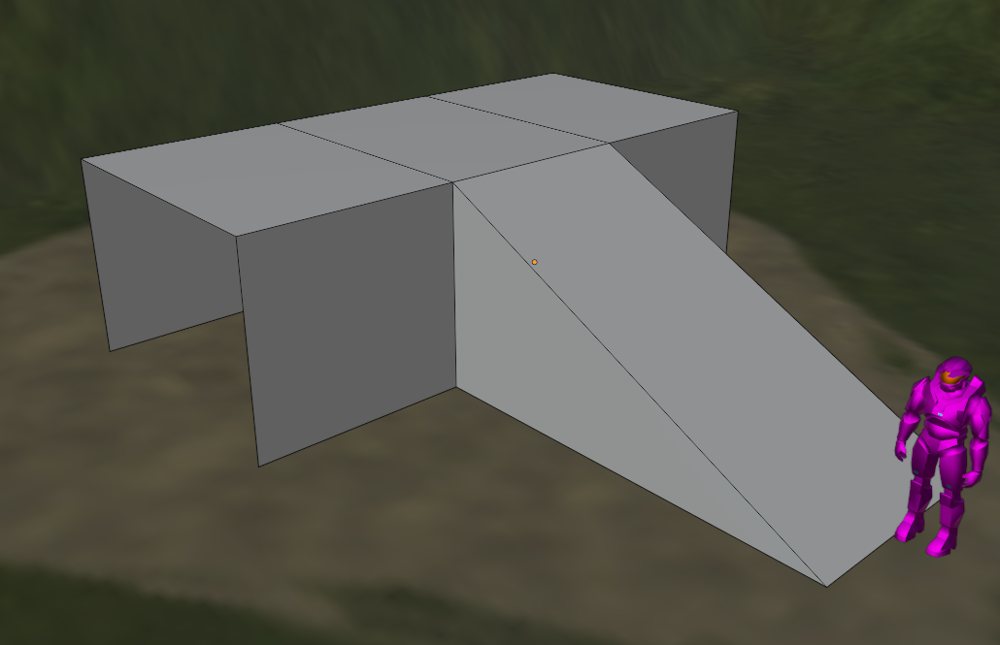
</a>

Now lets start with the internals. Consider bringing your reference model over to see how big the hallway needs to be to fit our players.

1. Select the left and right edge on both ends of the hallway.

2. Extrude them with the **E** key and right click once. Press the **S** key to scale it and then **Y** to scale it in the Y axis. Bring them in for around 0.4 units

	* <a href="2X.png" target="_blank"> 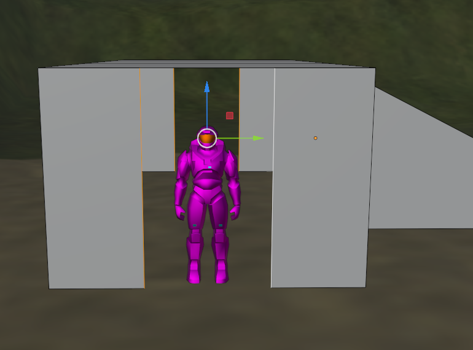 </a>

3. Bring down the vertices on the top of the doorway like so.

	* <a href="2Y.png" target="_blank"> 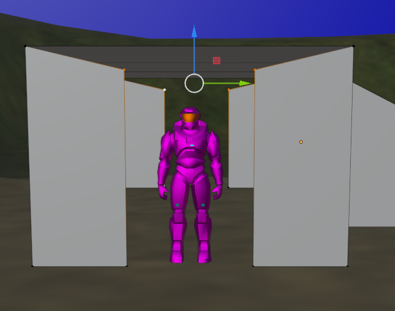 </a>

4. Select the top edges of the door frame and of the roof then hit the **F** key to fill it. You can do **ALT** + **Shift** while selecting an edge to quickly select the entire thing you need. Do each side individually to avoid the edges connecting to each other from opposite ends.

	* <a href="2Z.png" target="_blank"> 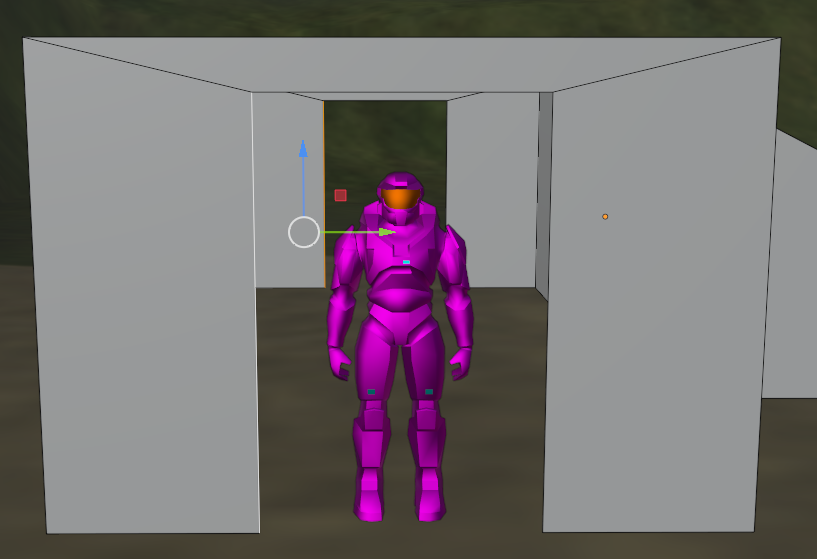 </a>

5. Select the edges on the left side of the door frame from both ends and press the **F** key to connect them. Repeat this process for each side until you have a hallway

	* <a href="3A.png" target="_blank"> 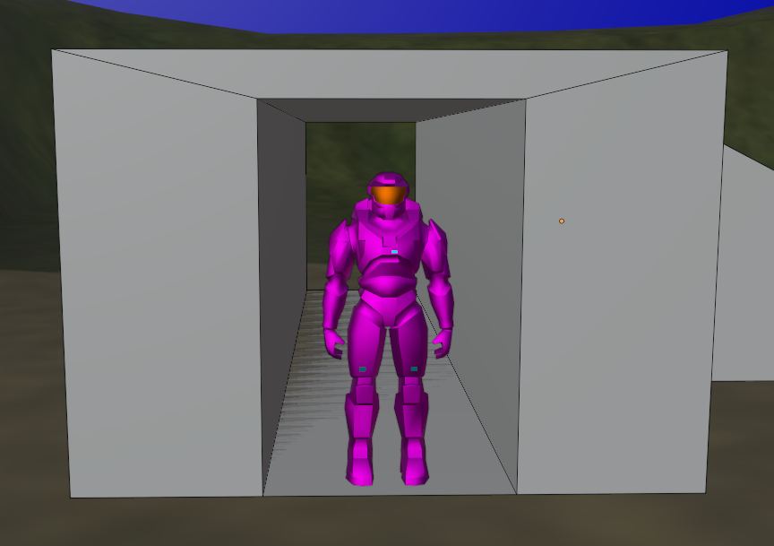 </a>

6. Make sure the normals for the object are pointing in the correct direction. Use the "Recalculate Outside" from the "Normals" menu in the "Mesh" tab

7. Move the edges on the bottom a bit away from the center of the hallway. Select the edges and then hit the **S** key to scale and then the **Y** key to lock it to the Y axis. Move it around 1.2 units

	* <a href="3B.png" target="_blank"> 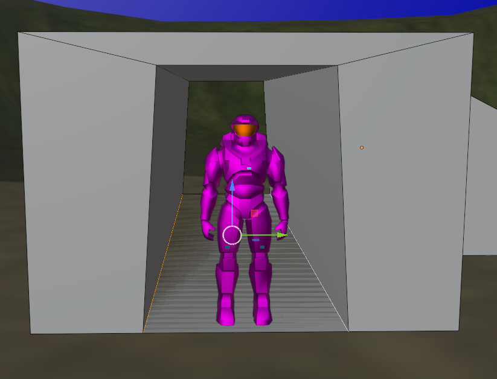 </a>

## Creation of ladder guides and ladder faces

When adding ladders to a level, it is always good to provide some geometry that helps "guide" the player while getting on or off the ladder and that helps keep the player from falling off or shifting on the ladder as the player travels along the ladder face.

1. Go ahead and delete the back and top faces on the left and right.

	* <a href="3C.png" target="_blank"> 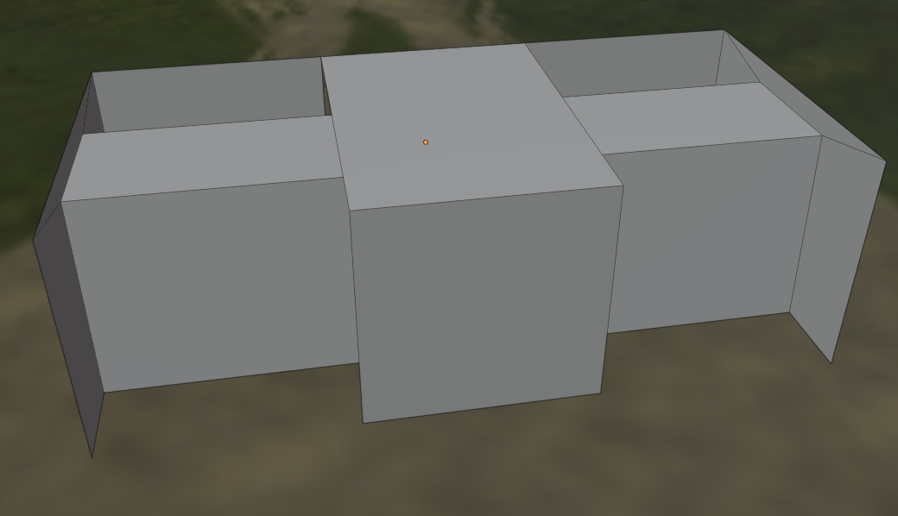 </a>

2. Grab each edge on the back faces and press **E** to extend it then press right click. Press **S** to scale it and then **X** to lock it to the X axis. Pull the selected edges in about 0.5 units. Do each side individually to avoid any issues.

	* <a href="3D.png" target="_blank"> 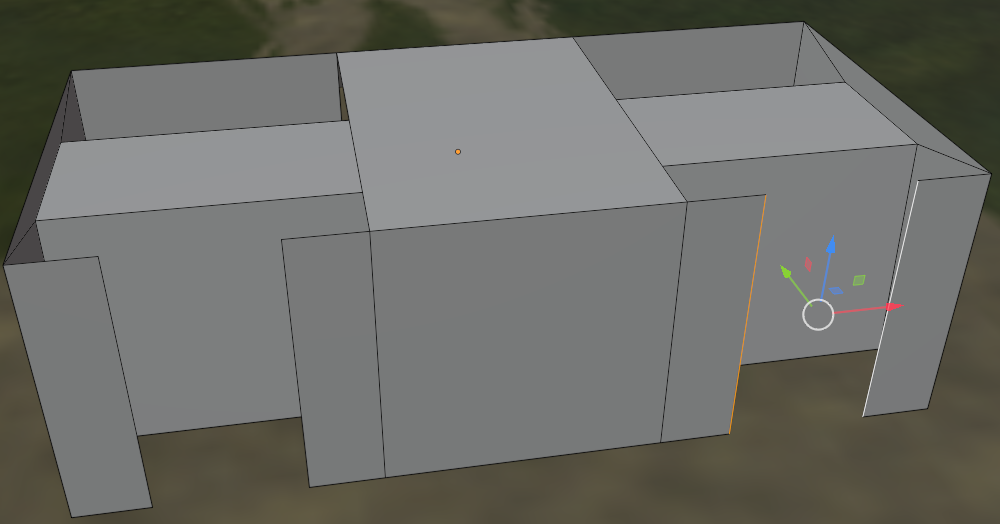 </a>

3. Repeat the previous steps on the new faces you made but move it for about 0.7 units on the X axis. Once it's done move it around 5 units in the Y axis

	* <a href="3E.png" target="_blank"> 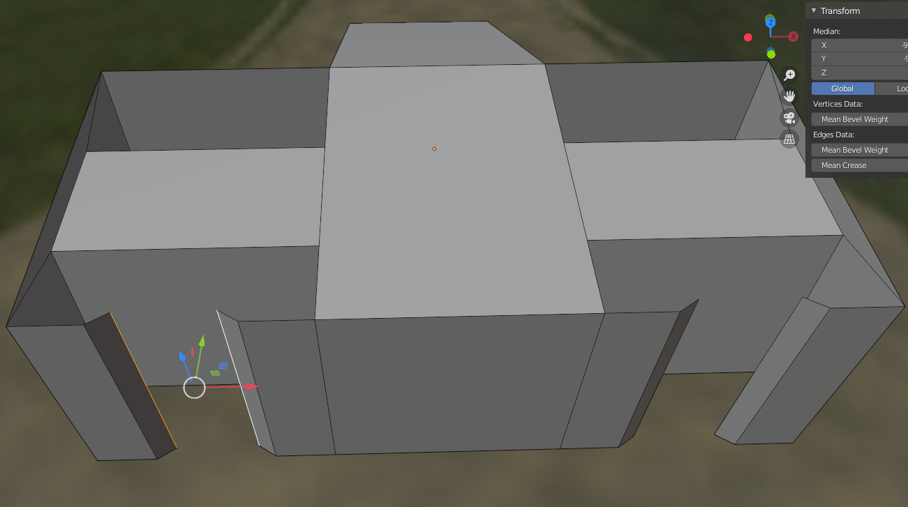 </a>

4. Now Press **E** and right click then move it around 4 units on the Y axis

	* <a href="3F.png" target="_blank"> 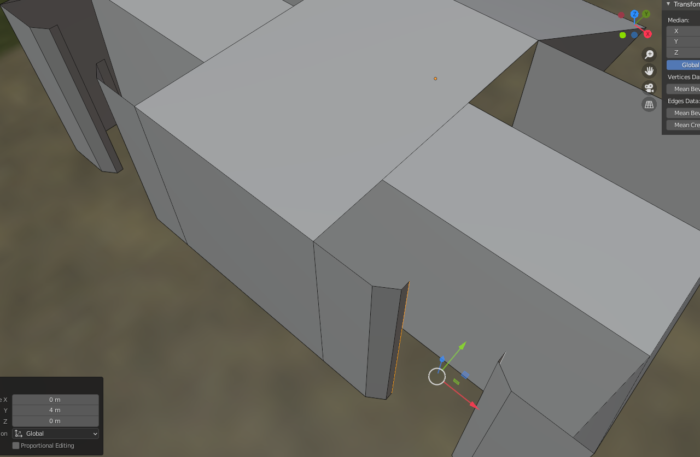 </a>

5. Go ahead and fill in the areas you deleted with the **F** key. Should end up like this.

	* <a href="3G.png" target="_blank"> 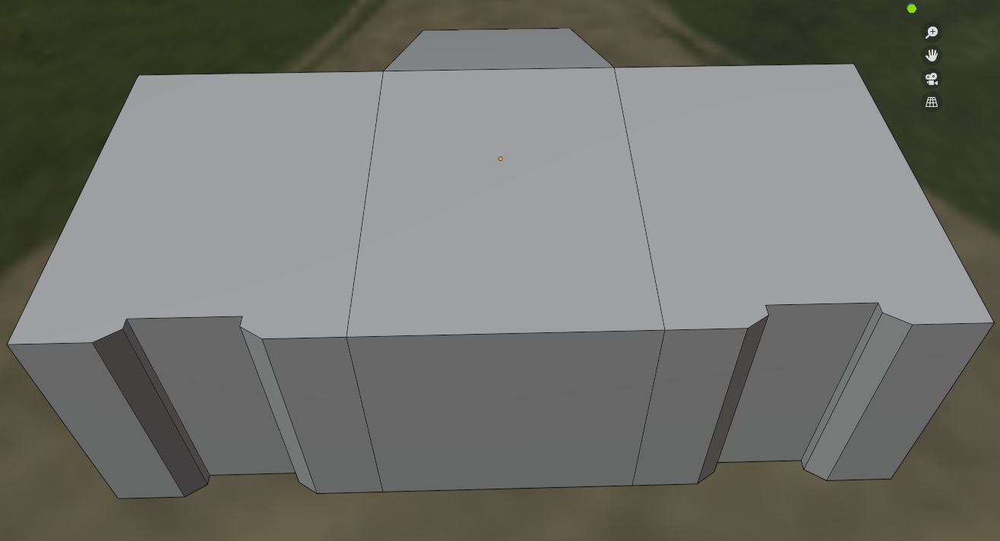 </a>

6. Select the back faces where the ladder belongs and press **SHIFT** + **D** to duplicate the selected faces. Move them around -2 units on the Y axis.

	* <a href="3H.png" target="_blank"> 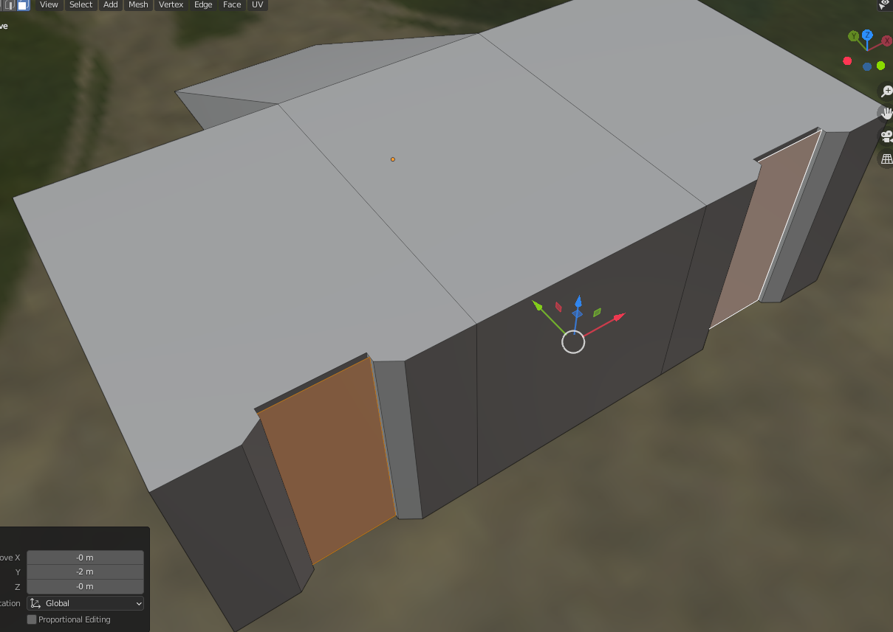 </a>

## Creation of a teleporter gateway

1. Delete the face in the middle of the backside of the structure. We will be extruding the edges for our teleporter.

	* <a href="3I.png" target="_blank"> 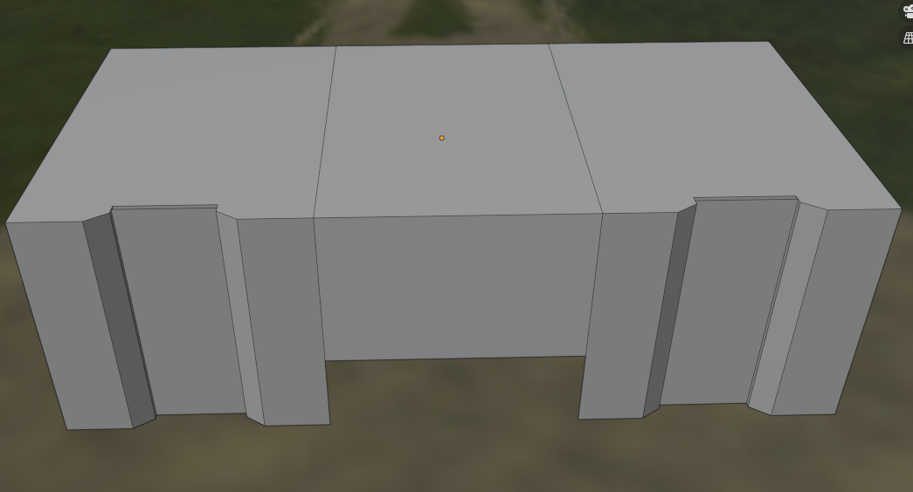 </a>

2. Select the left, right, and top edges of the hole you just made and press **E** to extrude it and right click. Press **S** to scale the selected edges for around 0.7 units. Once the scaling is done move the two vertices on the bottom so that they touch the floor again.

	* <a href="3J.png" target="_blank"> 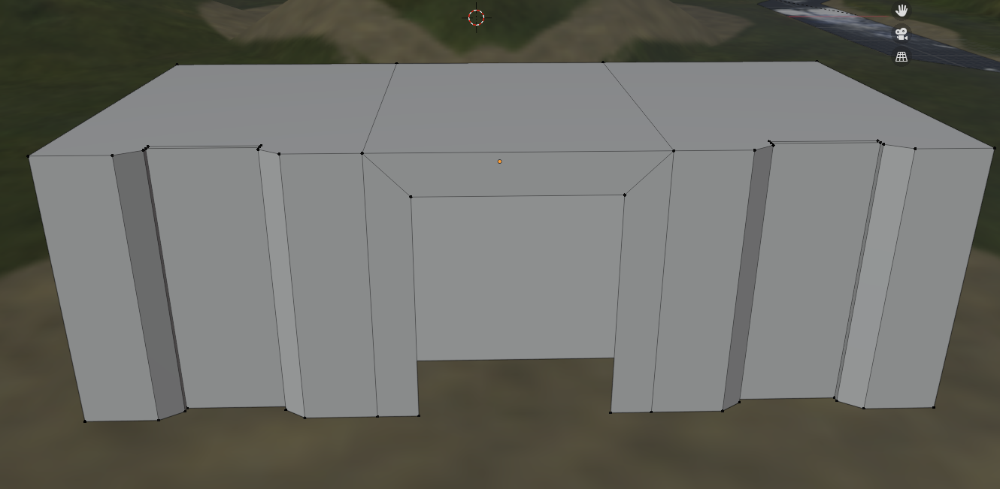 </a>

3. Select the left, right, and top edges of the hole again and press **E** to extrude it and right click. Move the selected edges around -20 units on the Y axis. Press **S** to scale the selected edges for around 0.8 units. Make sure the vertices on the bottom are touching the floor as well.

	* <a href="3K.png" target="_blank"> 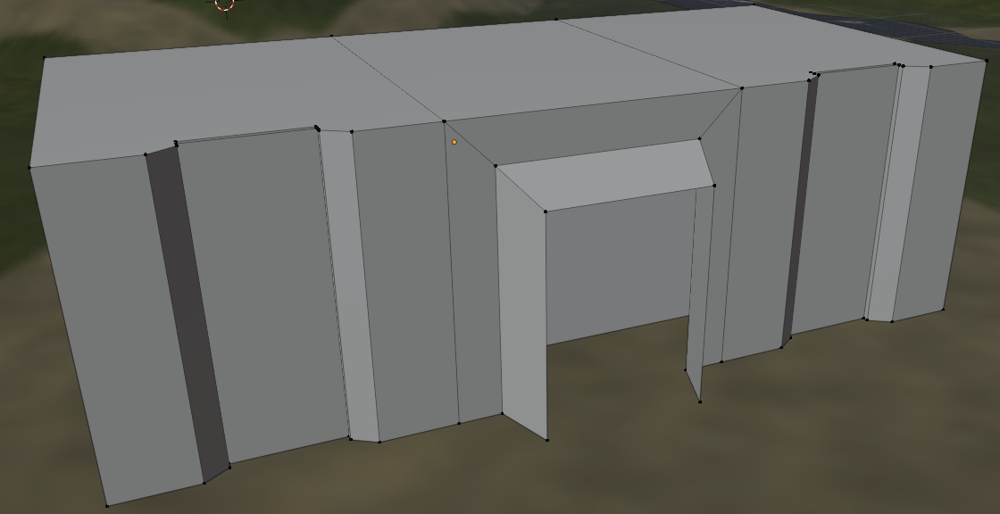 </a>

4. Select the left, right, and top edges of the hole again and press **E** to extrude it and right click. Press **S** to scale the selected edges for around 0.8 units. Make sure the vertices on the bottom are touching the floor one last time.

	* <a href="3L.png" target="_blank"> 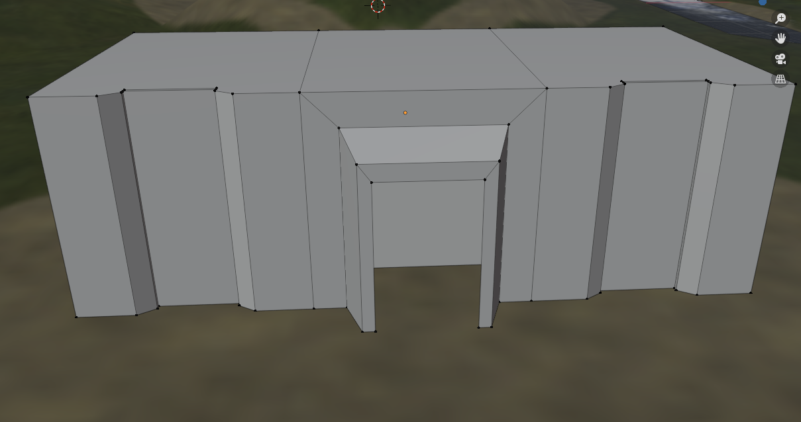 </a>

5. Select the edges on the left and right and press **E** to extrude it and right click. Move them around 30 units on the Y axis. Fill in the back and roof face from here.

	* <a href="3M.png" target="_blank"> 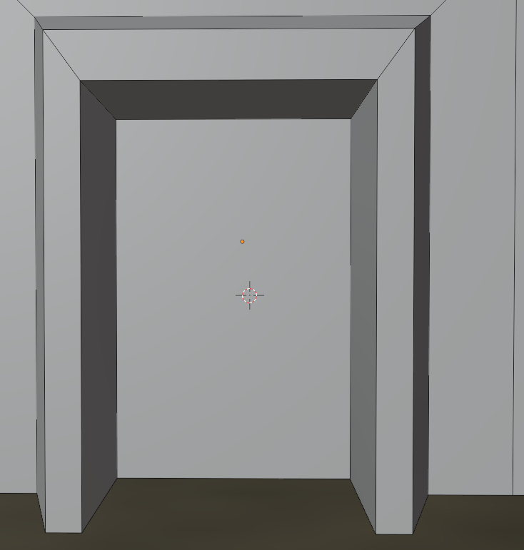 </a>

Now that the gateway is done lets add the teleporter mesh real quick to finish this off.

1. While in edit mode on the structure (blue base) object add a plane object from the mesh menu. Adding a mesh while in edit mode will add that geometry to the current object instead of creating a new object. Drag that plane over to the teleporter gateway. Go ahead and rotate it and scale it until the plane fits the gateway entrance.

	* <a href="3N.png" target="_blank"> 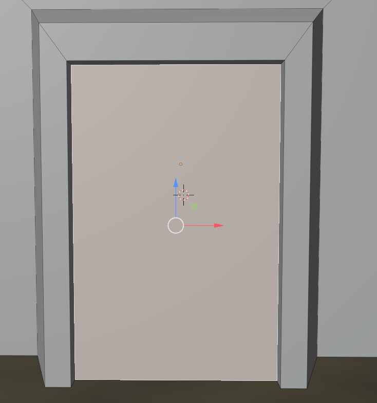 </a>

2. Select the top and bottom edges and subdivide twice to add a few segments

	* <a href="3O.png" target="_blank"> 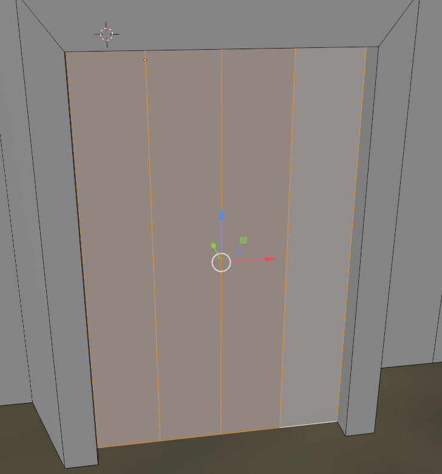 </a>

3. Move the edges around to give it some curvature.

	* <a href="3P.png" target="_blank"> 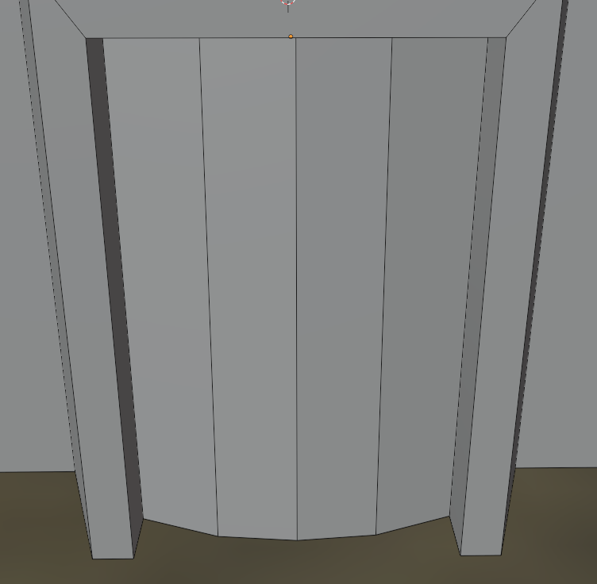 </a>

4. Make sure the normals for the object are pointing in the correct direction. Select the entire structure and use the "Recalculate Outside" from the "Normals" menu in the "Mesh" tab

These faces will be made render only later when materials are applied just as the stream faces were and therefore these faces may have open edges since they will be non-solid (no collision).

The netgame flags required to make the teleporter work will be placed using Sapien and will be demonstrated in the Population section.

## Addition of lights to the base hallway

Lets create some faces in the roof of the hallway for lights.

1. Select the roof of the hallway and duplicate it. Scale the plane until it looks something like in the image below. Do this for both sides. Make sure to lower the plane on the Z axis to avoid z fighting.

	* <a href="3Q.png" target="_blank"> 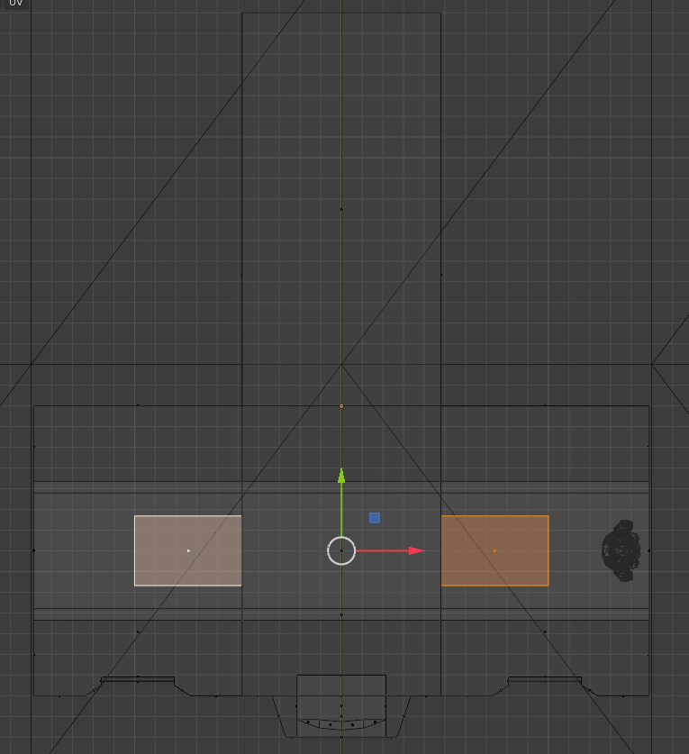 </a>

Note that these lights currently do not follow the Sealed World Rules since they have open edges. As was demonstrated with the creation of the stream in the level, these faces will be made "render only" and will have no collision once the appropriate material is applied to the faces.  These faces will then comply with the Sealed World Rules.

In this case, the light faces WILL be visible AND cast light for use in radiosity.  As will be covered in the Radiosity (Lighting) section, faces can emit light and not render, or render and not emit light, or both.

The Master Chief reference model was moved or hidden in the example image.

# Separation of the Level into Separate Mesh Objects
Before creating the materials for the base structure we created above and applying the materials, texture coordinates, and smooth/hard edges to the base structure mesh, the structure must be made part of the level and satisfy the Sealed World Rules.

There are several ways to build a level. It is perfectly valid to make the entire level a single object that satisfies the Sealed World Rules.

Since there are so many parts to a level and a level can become quite large and cumbersome to work with, it is very advantageous to separate the level into several objects. This separation of mesh parts greatly helps in the organization of the level and greatly decreases the cumbersome nature of dealing with a single large mesh when creating something as complicated as a game environment.

It is the latter approach that will be followed and demonstrated in the proceeding tutorials and examples.

When the level data is exported using the Blender toolset, only the vertices and subsequent face data (material name, image nodes, smooth/hard polys, texture coordinates, etc...) are exported. Therefore, objects that meshes are separated into only exist in Blender.  Because of this, as long as the vertices and related edges match exactly between the mesh objects (satisfying the Sealed World Rules), the exported data will reflect this.  The level will export and compile properly.

The following procedures and example images will demonstrate the merging of the base with the level terrain to create polygons to seal the world and to match the relevant vertices and associated edges.  The faces that compose the base will then be detached from the level mesh to create a separate object.  The base object will then be linked to the reference frame.

The following procedures and example images will demonstrate the merging of the base with the level terrain to satisfy the Sealed World Rules.

# Making the Base Structure Geometry Follow Sealed World Rules
Now that we've made our structure geometry lets make it something Halo would accept.

1. Start by selecting your level object and adding a boolean modifier to your modifier list.

	* <a href="3R.png" target="_blank">  </a>

2. We will want to set up our boolean properly. Go ahead and click the black area in the object box and it will reveal a dropdown to select your object. Find your blue base structure object in this list and select it. You can also click the drop picker icon on the right of the black box and select your blue base structure object from the 3D viewport.

3. Now set the boolean to "Union" to cut out most of the geometry keeping our level from being valid.

	* <a href="3S.png" target="_blank"> 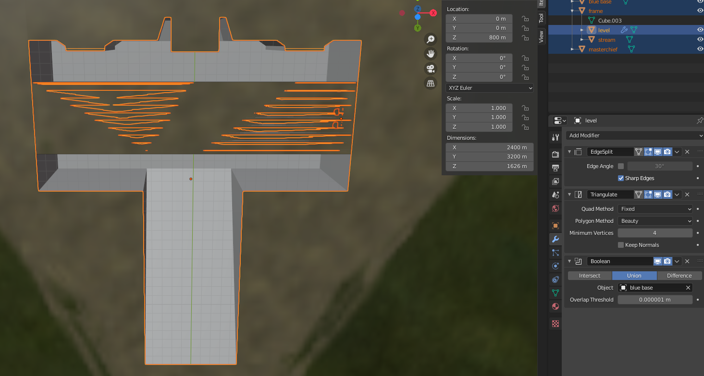 </a>
	
4. Apply the modifier to your geometry.

5. Clean up the leftover faces that it didn't get rid of such as the level faces from the interior hallway. You should triangulate the geometry so that you can delete the hallway faces properly.

Now that we've finished the boolean application you'll want to add a basic material to the base real quick. This will be important for later steps so don't skip it.

1. Select your base object

2. Add a material named "base" and make sure it's applied.

We will be using this unique material to select the faces in a later section.

Now lets join the level and base geometry to help make cleaning up triangles in the next section easier.

1. Select your base object.

2. While holding **CTRL** also select your level object.

3. **CTRL** + **J** to join the two objects as one.

Now lets go into edit mode on the object and do what we need to do.

Lets merge the verts first.

1. Select your level object and switch from object mode to edit mode.

2. Press **A** to select all faces in the level.

3. While having your cursor over the 3D viewport press the **M** key to bring up the merge menu and select "By Distance" or press **B**

Now you'll want to select the faces around the structure. Make sure to get in there and ensure you have everything selected. There may be some small triangles generated from the boolean modifier.

<a href="3T.png" target="_blank">
	
</a>

While having your cursor over the 3D viewport press the **X** key to bring up the delete menu. Either select the "Limited Dissolve" option or press the **L** key. You don't need to mess with any of the options so you can just triangulate the geometry to see how the wireframe ended up.

Once that's all done you can go into edge select mode and press the **PRINT SCREEN** key to run "Select Non Manifold".

<a href="3U.png" target="_blank">
	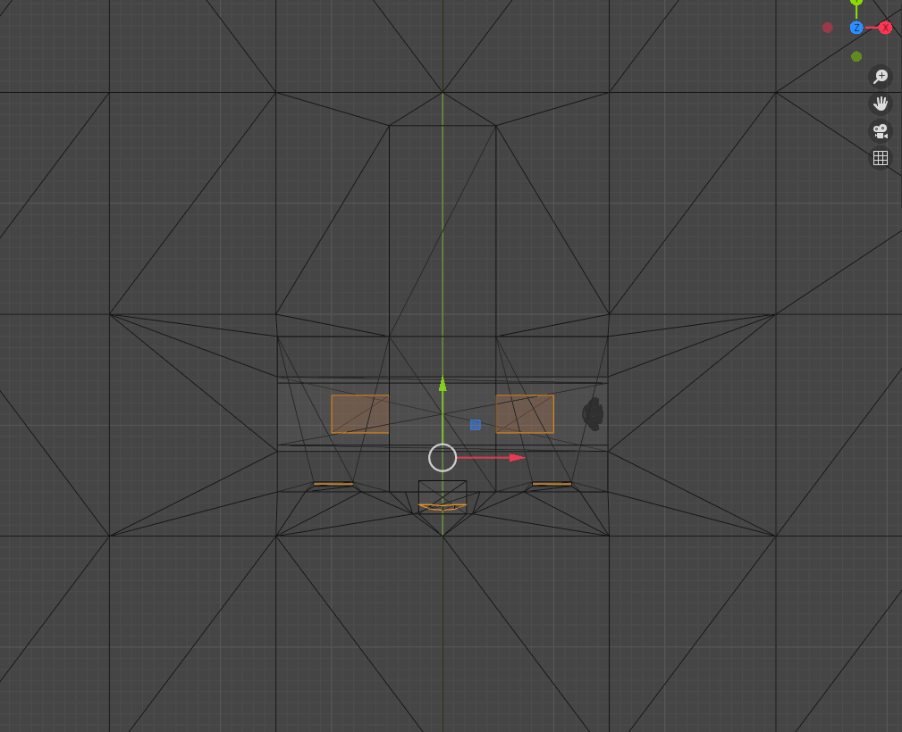
</a>

If the only things that light up match the image then you're good. Otherwise try running the laid out steps again until it matches.

Now that we've cleaned up the triangles and made sure our geometry is sealed we can make the base object separate once more.

Go into face selection and select one of the base faces. Press the key combo **SHIFT** + **G** to open the "Select Similar" menu. This is where that material you made will come in handy cause otherwise you're gonna have to select all the faces of the base manually. Select the material option from the menu so that the base gets highlighted and while having the cursor over the 3D viewport hit the **P** key and then select "Selection" or press **S**. For the final step make sure to rename level.001 to "blue base"

# Application of Materials to the Base
Now that the blue base has been separated into a separate object, we will start creating materials for our base object.
The following steps and example images will demonstrate the application of our new materials needed to complete the base structure.

Start by creating the listed materials in your base object along with assigning the texture we will be using for the material. Just like before you can find these images in...

```(HEK Install Path)\data\levels\test\tutorial\bitmaps```

| Name                          | Diffuse Map (.tif file)          |
| ----------------------------- | -------------------------------- |
| example_tutorial_metal        | example_tutorial_metal.tif       |
| example_tutorial_panels       | example_tutorial_panels.tif      |
| example_tutorial_metal_floor  | example_tutorial_metal_floor.tif |
| example_tutorial_plate_floor  | example_tutorial_plate_floor.tif |
| example_tutorial_ladder%^     | example_tutorial_ladder.tif      |
| example_tutorial_lights_blue! | example_tutorial_lights_blue.tif |
| example_tutorial_lights_red!  | example_tutorial_lights_red.tif  |
| example_tutorial_teleporter!  | example_tutorial_shield.tif      |

Note that the Shader Symbols have been included.  The material example_tutorial_ladder%^ demonstrates that materials can have multiple Shader Symbols applied.  In this case the ladder material has been made viewable from both sides or two-sided using the % symbol and has been made a ladder or climbable by the player using the ^ symbol.

The .tif files listed above were included with the Halo PC End User Editing Kit.

As before, the completed or provided example resources will be used for the following examples for the sake of simplicity.

Lets now apply the materials we created to our structure geometry.

* Select all the faces that make up the teleporter gateway and assign it the "example_tutorial_metal" material.

	* <a href="3V.png" target="_blank"> 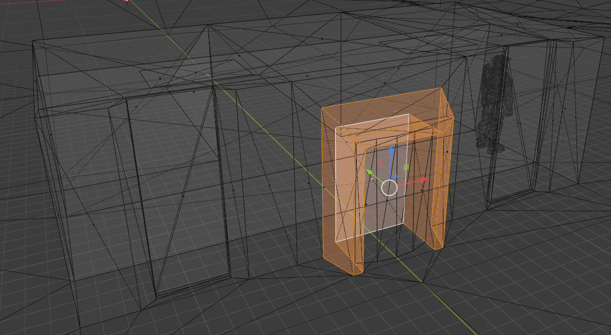 </a>

* Select all the faces that make up the interior hallway ceiling and assign it the "example_tutorial_metal" material.

	* <a href="3W.png" target="_blank"> 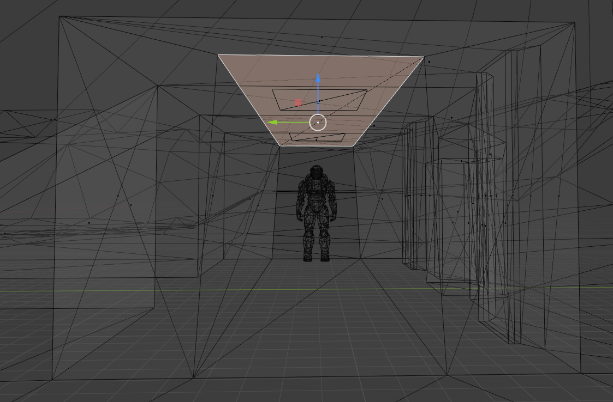 </a>

* Select all the faces that make up the interior hallway side walls and assign it the "example_tutorial_metal" material.

	* <a href="3X.png" target="_blank"> 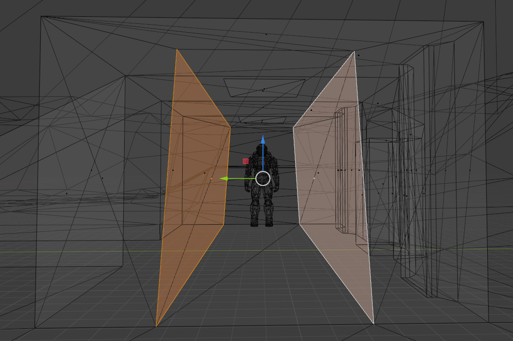 </a>

* Select all the faces that make up the exterior walls of the structure and assign it the "example_tutorial_panels" material.

	* <a href="3Y.png" target="_blank"> 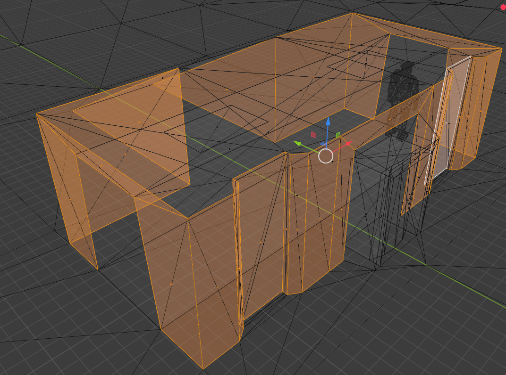 </a>

* Select all the faces that make up the interior hallway floor and assign it the "example_tutorial_metal_floor" material.

	* <a href="3Z.png" target="_blank"> 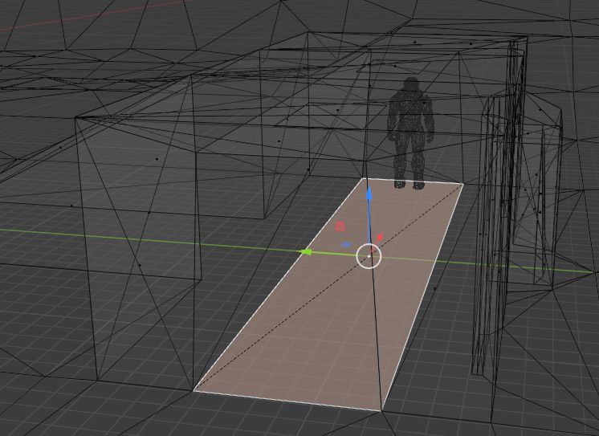 </a>

* Select all the faces that make up the top faces of the structure along with the ramp and assign it the "example_tutorial_plate_floor" material.

	* <a href="4A.png" target="_blank"> 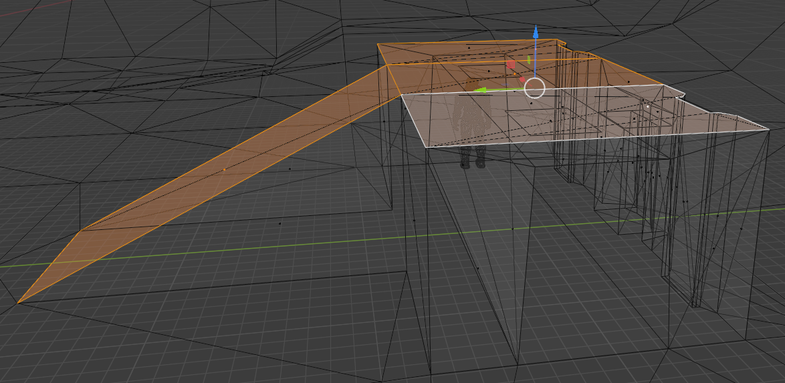 </a>

* Select all the faces that make up the ladder planes and assign it the "example_tutorial_ladder%^" material.

	* <a href="4B.png" target="_blank"> 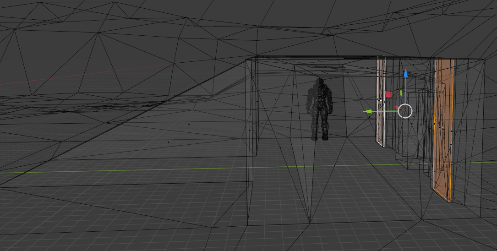 </a>

* Select all the faces that make up the light planes and assign it the "example_tutorial_lights_blue!" material.

	* <a href="4C.png" target="_blank"> 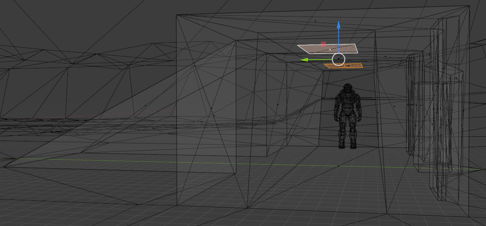 </a>

* Select all the faces that make up the teleporter planes and assign it the "example_tutorial_teleporter!" material.

	* <a href="4D.png" target="_blank"> 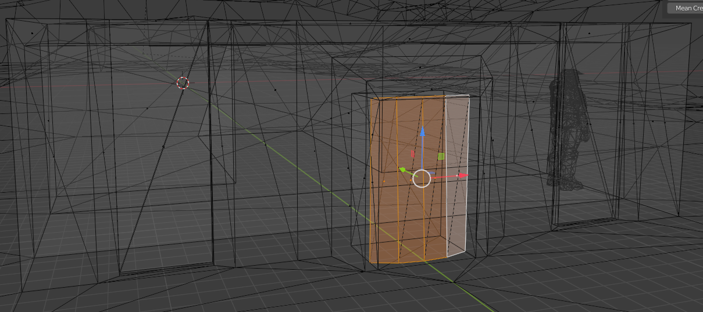 </a>

# Unwrapping the Base
Now that we've set up the materials on our faces we can start working on UV unwrapping the structure object so that our textures look nice.

Another feature that we should introduce here is UV seams. Seams help you split up UV faces when you run an unwrap to fine tune the results. Start with the following...

1. With the blue base structure selected, change your context from object mode to edit mode and enable edge selection.

2. Select the highlighted edges as seen in the following image.

	* <a href="4E.png" target="_blank"> 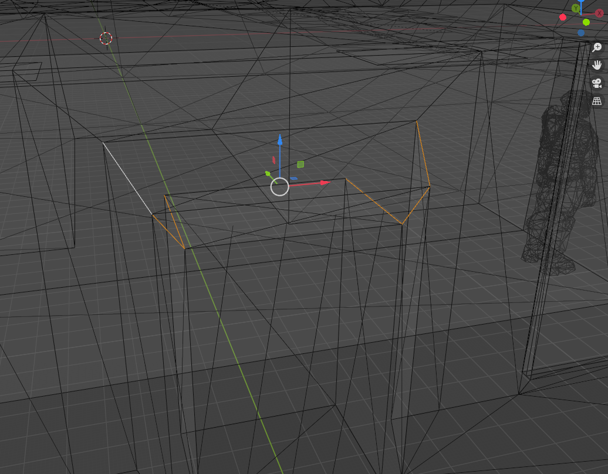 </a>

3. While having your cursor over the 3D viewport, right click to bring up the edge context menu. From there you should select the option labeled "Mark Seam". The edges you have selected should turn a red color once you're done.

## Why use seams
Seams help you split up the UVs to finely edit your texture coordinates. See the two images below to see a comparison between geometry using no seams VS seams.

<a href="4F.png" target="_blank">
	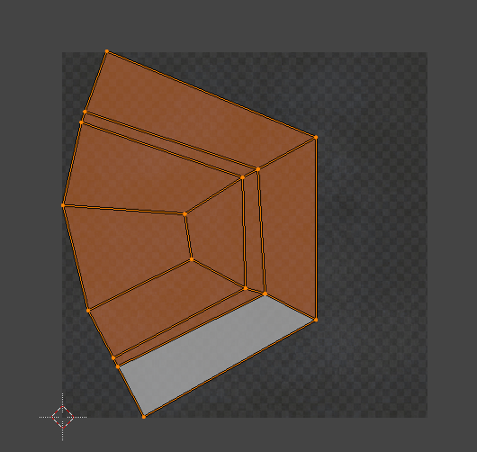
</a>

<a href="4G.png" target="_blank">
	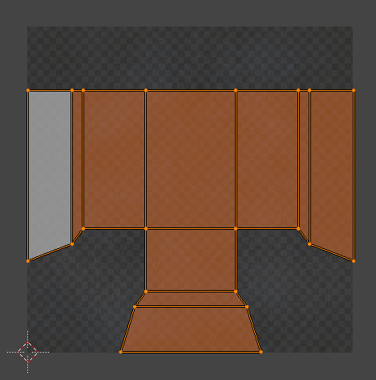
</a>

You can think of seams like the creases in a piece of paper used to shape an origami piece.

## Starting our Unwrap
With the previous section in mind lets unwrap the teleporter gateway and scale the created UV by around 2 units.

<a href="4H.png" target="_blank">
	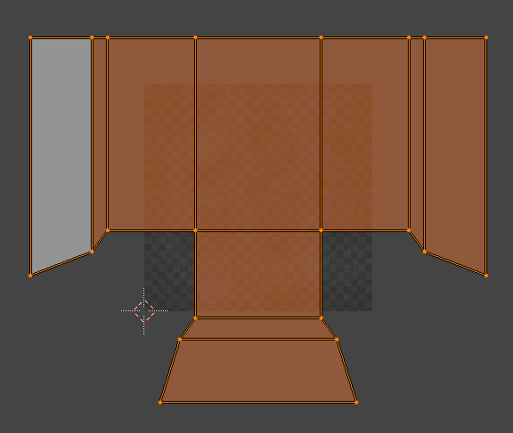
</a>

Scale the interior hallway ceiling UV so that it resembles something like this. The **N** key was used in the UV viewport to bring up the UV vertex menu. This will give us more fine control over the texture coordinates.

<a href="4I.png" target="_blank">
	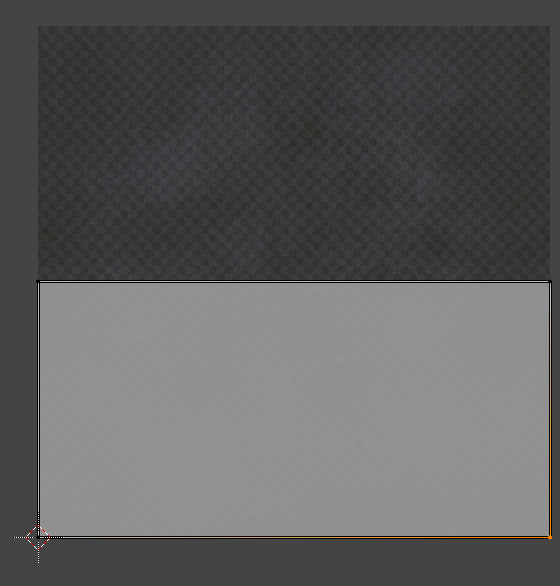
</a>

Scale the interior hallway side wall UVs so that it resembles something like this.

<a href="4J.png" target="_blank">
	
</a>

Scale the exterior wall UVs so that it resembles something like this. 12.3 units was used for the scale in this image.

<a href="4K.png" target="_blank">
	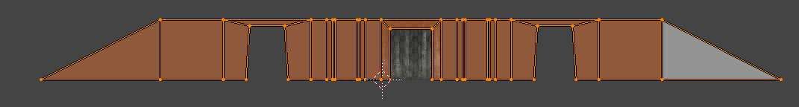
</a>

Scale the interior hallway floor UV so that it resembles something like this. The **N** key was used in the UV viewport to bring up the UV vertex menu. This will give us more fine control over the texture coordinates.

<a href="4L.png" target="_blank">
	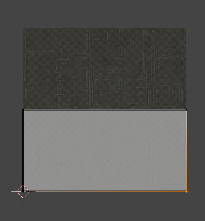
</a>

Scale the roof and ramp UVs so that they resemble something like this.

<a href="4M.png" target="_blank">
	
</a>

Run a smart UV unwrap on the ladder plane UVs so that they resemble something like this.

<a href="4N.png" target="_blank">
	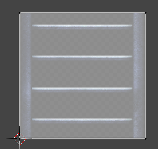
</a>

Scale the light plane UVs so that they resemble something like this.

<a href="4O.png" target="_blank">
	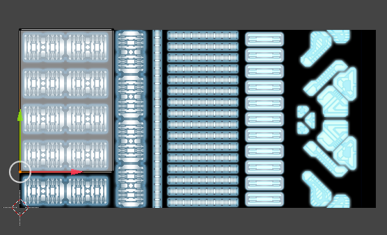
</a>

Scale the teleporter plane UVs so that they resemble something like this.

<a href="4P.png" target="_blank">
	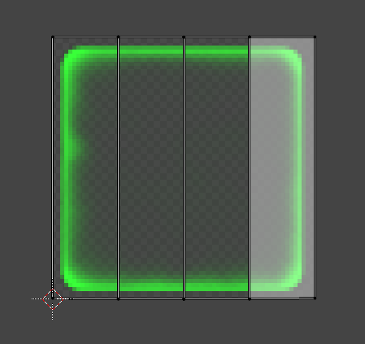
</a>

## Setting Up Our Sharp Edges
Lets set up sharp edges for our structure. We are going to use an option that will quickly select all edges it deems sharp based on angle and then set those to sharp.

Start by navigating to the "Select" tab and finding the "Select Sharp Edges" button.

<a href="4Q.png" target="_blank">
	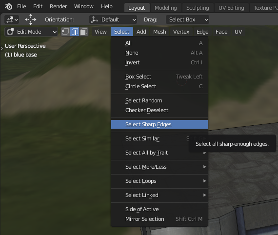
</a>

Be sure to be in edge select mode before selecting it. Certain edges in your object should now be highlighted like below. Lets add and remove a few edges. Add the edge where the top of the ramp meets the top structure faces. Remove the edges that curve into the structure near the ladder. Should look something like this.

<a href="4R.png" target="_blank">
	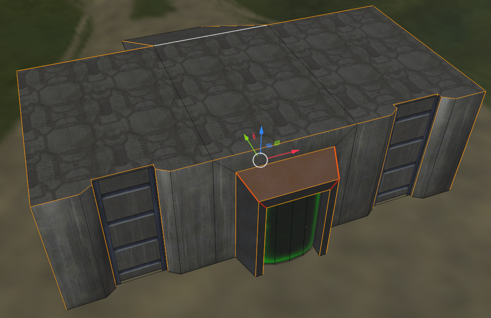
</a>

Go ahead and mark these edges as sharp through the edge context menu. The edge split modifier will take care of the rest.

# Creating the Opposing  Base Structure
Now that the blue base structure has been completed, it can be copied and used to construct a second base structure on the opposite end of the level. We will be using a mirror modifier to generate a structure on the opposite side of the Y axis to quickly construct a base for our red players.

1. Start by selecting your blue base structure object and adding a mirror modifier to the object.

2. Set the mirror modifier to these settings. This will create a mirror of the structure of the Y axis. Once it's set, apply the modifier to make it a permanent addition.

	* <a href="4S.png" target="_blank">  </a>

Select all of the faces of the newly created structure. You can quickly do this by hovering your mouse over sections of the structure and pressing the **L** hotkey to select linked geometry. Once that is done hit the **P** key and then select "Selection" or press **S**. Once you've finished separating it you can rename the object to "red base".

Repeat the process you went through with the blue base to make the red base follow the sealed world rules. If the boolean modifier doesn't cut through the geometry properly then extrude the bottom of the base and bring it down in the Z axis so that it intersects with the level geometry.

Once that's done go into the red base structure and change the lights in the interior hallway from "example_tutorial_lights_blue!" to "example_tutorial_lights_red!". You will have to edit the UVs so that they fit the texture image for your new material

Make sure both base structures are children of your frame object so that they are included in export.

# Player Clipping Techniques
It is sometimes necessary to create additional collision geometry in the level that prohibits the ability of the player to reach certain areas of the level or to help smooth the movement of the player around certain geometry. This technique is sometimes referred to as "player clipping". Geometry that is not rendered, but only affects the player and vehicles is added to the existing geometry of the level.

Restricting access to certain areas of the level such as the tops of canyon walls, roofs of structures, pillars, etc... can be crucial in creating a good game play experience. The player must not be allowed to exploit the game environment and break the game mechanics.  A good example are the Capture the Flag (CTF) game modes in Halo, if a player has the flag and can take it to an unexpected area where it is easily defended or they cannot be reached, this breaks the game. Fortunately, Halo does have mechanisms to help when objectives such as the flag or oddball get into odd areas, these items will eventually respawn or reset after a specific amount of time.

Restricting the player is also often used to keep the player from seeing "behind the scenes" of the level by preventing the player from seeing past the edges or over the tops of the core geometry of the level, typically where the level geometry for the terrain mesh intersects with the faces used to render the sky model or sky box.

The following tutorials will discuss the uses of and demonstrate the creation of the player clipping material and the implementation of player containment or player clipping.

1. Select the edges of the entrance to your teleporter gateways and press the **F** key to create a face. Go ahead and separate it from the base mesh.

	* <a href="4T.png" target="_blank"> 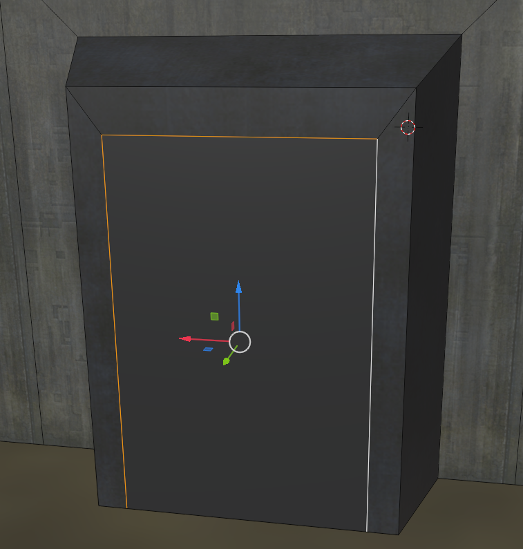 </a>

2. We will be creating a wall that surrounds the level so that players can't walk to the very edge and stare into the abyss. Start by deleting the top face of your sky mesh to open the level up. You'll need this for the new faces you'll create.

	* <a href="4U.png" target="_blank"> 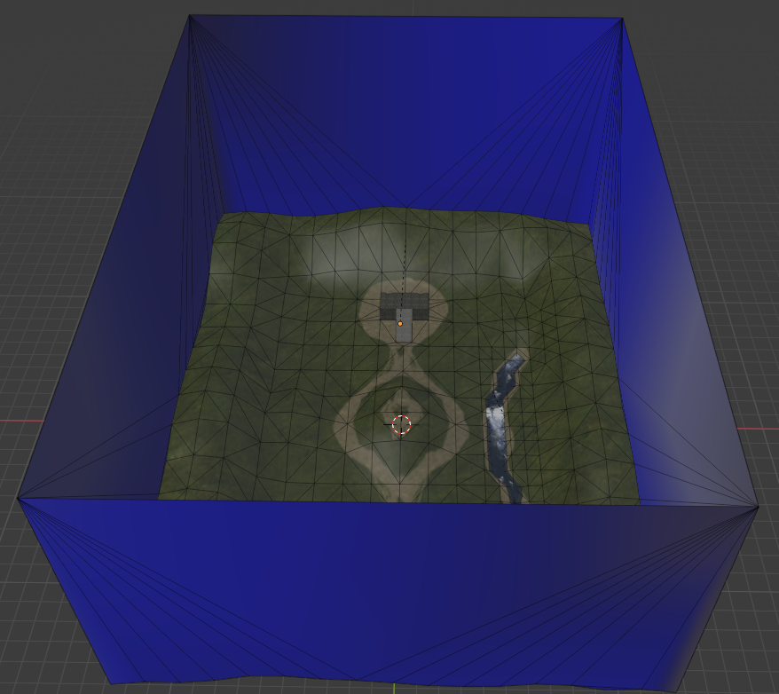 </a>

3. Do you remember that row of faces we raised before in [Creating the Border For Our Level](#creating-the-border-for-our-level) section. We will be selecting the edges of that to form a wall.

4. Once it's selected press the **E** key to extrude your selection. Press **Z** to lock movement to the Z axis and move it up to around the same height as the skybox currently is.

5. Press the **S** key to scale the edges and lock it to the Z axis. Scale it so that the units read 0.0 units. This will make the edges you just raised flat along the Z axis.

6. Set the Z coordinates for the selected edges to a value of 1600.0 units. You can do this through the properties panel.

7. Dissolve any vertices on the top besides the corners. We won't be needing them.

8. Fill in the hole you created and apply the "+sky" material to the geometry once more. You can use "Bridge Edge Loops" in the "Edge" tab to help you with this. Separate the faces you raised from the border like with the teleporter gateway faces.

Go ahead and join the teleporter gateway faces and wall you just created to form one object. Rename this object to "player_clip". Remove all materials from the object with the "-" symbol in the material list and add a new one. Name this material "example_tutorial_playerclip*". You can use the texture named example_tutorial_playerclip.tif for this material.

Notice the "*" Shader Symbol which denotes that this material will be treated by Tool and the game as collideable only, it will not render in the game. Now that you've finished this you have completed the player clip mesh be sure to leave plenty of room in the Z axis by moving the skybox up. You'll want room for things Fuel Rod Gun to arc or vehicles such as Banshees so that they don't collide with the skybox collision ingame

# Placement of Portals
The final step to completing the core geometry for the level is the addition of surfaces or planes that define portals. These portals are used by the engine for several purposes. The primary function of these portals are as "visibility portals", portals that the Halo game engine uses to try and cull out objects that cannot be seen to improve performance by not rendering such objects.

The portals in general help break up the level so that it can be handled in parts to help performance in general. Attributes can also be set for portals, such as ambient sounds to play in the portal as well as environmental audio effects. Portals can also be used to define weather volumes and fog volumes.

There are two kinds of portals that are defined, "portals" and "exact portals". The following are descriptions for each:

1. Exact Portals: These are portals defined by surfaces or planes with the "+exactportal" material applied to them. Exact portals are created such that the faces (edges and vertices) match the surrounding geometry (edges and vertices). These faces in effect create a "seal". The volume that is between these surfaces or planes is an exact portal. The direction of the normals of the faces helps determine how the portal is defined.

2. Portals: These are portals defined by surfaces or planes with the "+portal" material applied to them. These portals are created by faces or planes that are used to divide the game environment. These planes must create a seal with the level, but do not have to match vertices and the associated edges with the surrounding geometry. These planes are much more loosely defined and placed in the level and are used to break or divide the level up into sections. The direction of the normals for the faces helps determine how the portal is defined.

A volume defined as an Exact portal CAN have standard Portal areas defined within it and vice versa as long as the above rules outlined in their definitions are satisfied. However, an open ended or non-enclosed Portal cannot intersect an Exact portal, a "vis error" or rendering anomaly will occur. In other words, be careful to not let a Portal plane improperly divide or bisect an Exact portal volume.

Portals can be used to help portal horizontally (looking left and right in the XY plane) AND vertically (looking up and over objects or geometry that vary in the Z-Axis).

The tutorials below will demonstrate the creation and placement of planes that will define Portal volumes and Exact portal volumes.

# The Creation and Placement of Portals
In this section we will be using the entrances to our interior hallway on both structures to create an exact portal volume.

Later, when the level is running in the game, use rasterizer_wireframe 1 to view the level and exit and enter the hallways to see how the level geometry and objects are not drawn from the player view as this portal volume is entered and exited.

1. Select the edges that make up the entrance of the hallway and create a face using the **F** key. Once you've done this for all 4 entrances separate them from the structure objects to make them a unique object. Join the new objects you created from the structure and rename it to "base portals".

	* <a href="4W.png" target="_blank"> 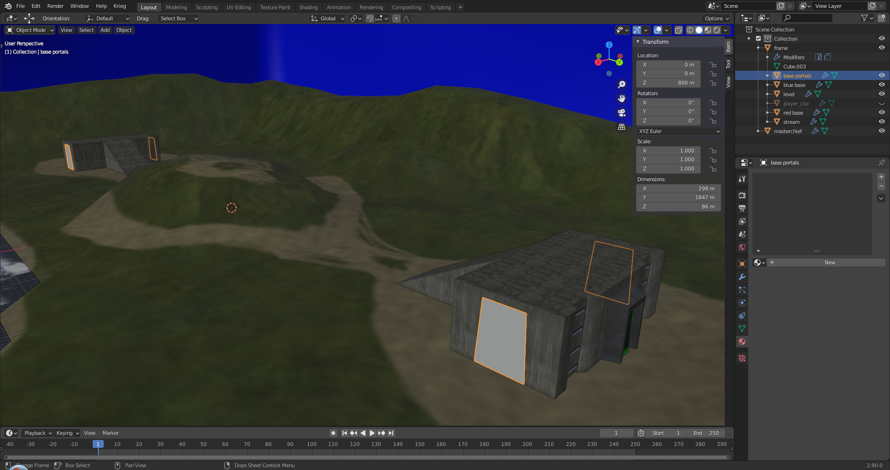 </a>

2. Remove all other materials from the object and create a new material. Name this material "+exactportal".

3. Make sure the normals for the faces are pointing outwards. This will help define the volume

Now lets set divide up the level using standard portals.

1. Create a plane and rotate it 90 degrees on the Y axis. Make sure to apply the rotation with **CTRL** + **A** and then set the dimensions of the plane to Y: 3600.0 Z: 2000.0. Set the position of the plane to X: 0.0 Y: 0.0 Z: 650.0. Subdivide the top and bottom plane edges to get five sections.

2. Make sure the sections you created split the map somewhat nicely. The values we used for ours is...

	* X: 0.0 Y: -1200.0 Z: 650.0
	
	* X: 0.0 Y: -400.0 Z: 650.0
	
	* X: 0.0 Y: 400.0 Z: 650.0
	
	* X: 0.0 Y: 1200.0 Z: 650.0

3. Duplicate the object so that it splits the map into five sections. The location for the planes in the image from left to right is...

	* X: -750.0 Y: 0.0 Z: 650.0
	
	* X: -300.0 Y: 0.0 Z: 650.0
	
	* X: 300.0 Y: 0.0 Z: 650.0
	
	* X: 750.0 Y: 0.0 Z: 650.0
	
	* <a href="4X.png" target="_blank"> 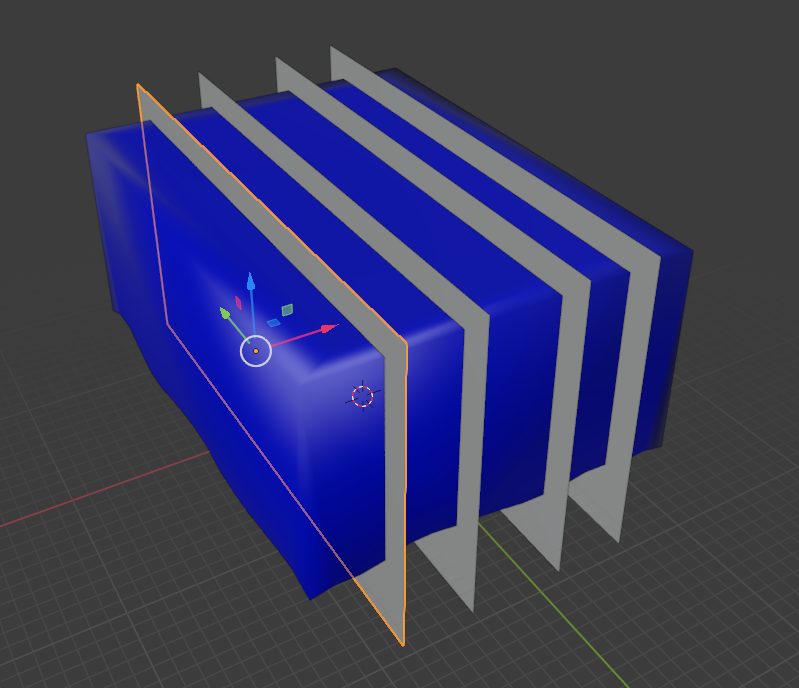 </a>

4. Now go ahead and fill in the edges you created and then extrude the edges on the outside to extent the plane past the BSP.

	* <a href="4Y.png" target="_blank">  </a>

Take this opportunity to name your object "terrain portals" and add a material named "+portal" to the geometry you just created. Also set the parent of terrain portals to frame.

# Saving the Level Again
It's probably a good idea to make frequent backups as you make progress just in case. Follow the instructions below to save a scene.

1. Go to File dropdown in the top left and click it.

2. Click on the menu item labeled "Save As".

3. A window named "Blender File Dialog" should come up. Navigate to ```(HEK Install Path)\data\levels\test\(Level Name)\models``` and set the name of the blend file to the name of your level. You'll remember that we created this directory in the [creation of a level directory](level-creation-beginner/#creation-of-a-level-directory) section

4. Click on the button labeled "Save As".

You've now saved your level. The file as is will be used for future sections in this tutorial.

# Conclusion of Level Creation
The level geometry is now "complete" and can be successfully exported and compiled and is ready to go through the steps that will get it running in Halo.
As previously mentioned, a completed version or example version of the level created in the tutorial sections can be found under...

```(HEK Install Path)\data\levels\test\tutorial```

The source and related materials have been provided as a reference to aid in the learning process.

Once the user has successfully completed the tutorials in Level Creation they can proceed to the next section Level Exporting.

Please note that the section Level Exporting and the subsequent sections will assume that the end user has completed all of the examples and tutorials up to and including those in Level Creation. The remaining sections in Multiplayer Level Design will use the completed "tutorial.blend" file from these sections.
