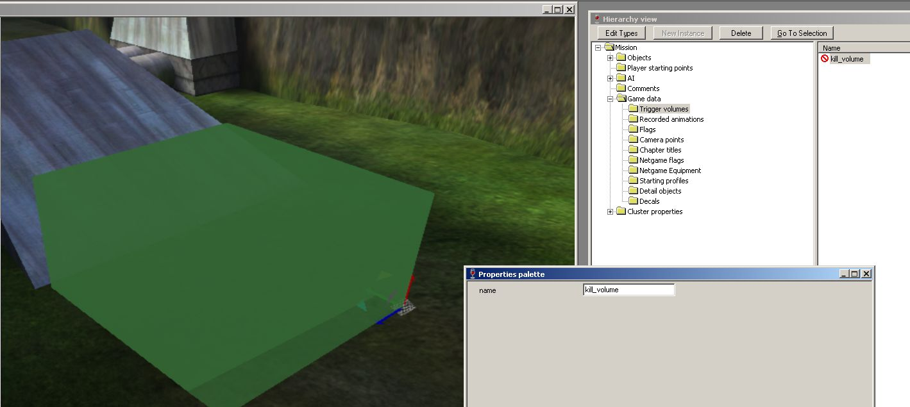


This guide assumes you have basic working knowledge of [Sapien](~h1-sapien) and [scripting](~scripting).

Map authors who want to prevent players from reaching certain areas can use **kill volumes** (aka **death barriers** or **kill zones**). These are cuboid 3D trigger volumes which are scripted to instantly kill any player that enters them. These are safe to use in multiplayer maps because the scripts run on the host too, which will kill the players [authoritatively](~netcode#gearbox-netcode).

# Adding trigger volumes
The first step is to add trigger volumes to your map's [scenario](~) using [Sapien](~h1-sapien).

1. Select "Trigger volumes" in the Hierarchy view.
1. Right click on the ground in the Game window to place a volume.
1. Left click and drag the faces of the new volume to adjust its size. Ensure the "Custom" marker handle is enabled in the _Tool window_ to do this.
1. Rotate the volume using the active marker if needed.
1. Using the Properties palette, give the volume a suitable name like `kill_volume` (should be lower-case).

To cover a larger area, you may need to place multiple volumes with different names.



# Writing the kill script
Now that the volume(s) are placed, you'll need to write a [script](~scripting) to continuously test if players are within this volume, and kill them if so.

Supposing your level was _Danger Canyon_, you would place the script file at `data\levels\test\dangercanyon\scripts\kill.hsc`. You may need to create the `scripts` directory for your level if it didn't already exist. The name of the script file, `kill.hsc`, is not important other than it must have the `.hsc` extension.

In the script file, paste the following:

```hsc
(script continuous kill_players_in_zone
  (if (volume_test_object kill_volume (list_get (players) 0))
    (unit_kill (unit (list_get (players) 0)))
  )
  (if (volume_test_object kill_volume (list_get (players) 1))
    (unit_kill (unit (list_get (players) 1)))
  )
  (if (volume_test_object kill_volume (list_get (players) 2))
    (unit_kill (unit (list_get (players) 2)))
  )
  (if (volume_test_object kill_volume (list_get (players) 3))
    (unit_kill (unit (list_get (players) 3)))
  )
  (if (volume_test_object kill_volume (list_get (players) 4))
    (unit_kill (unit (list_get (players) 4)))
  )
  (if (volume_test_object kill_volume (list_get (players) 5))
    (unit_kill (unit (list_get (players) 5)))
  )
  (if (volume_test_object kill_volume (list_get (players) 6))
    (unit_kill (unit (list_get (players) 6)))
  )
  (if (volume_test_object kill_volume (list_get (players) 7))
    (unit_kill (unit (list_get (players) 7)))
  )
  (if (volume_test_object kill_volume (list_get (players) 8))
    (unit_kill (unit (list_get (players) 8)))
  )
  (if (volume_test_object kill_volume (list_get (players) 9))
    (unit_kill (unit (list_get (players) 9)))
  )
  (if (volume_test_object kill_volume (list_get (players) 10))
    (unit_kill (unit (list_get (players) 10)))
  )
  (if (volume_test_object kill_volume (list_get (players) 11))
    (unit_kill (unit (list_get (players) 11)))
  )
  (if (volume_test_object kill_volume (list_get (players) 12))
    (unit_kill (unit (list_get (players) 12)))
  )
  (if (volume_test_object kill_volume (list_get (players) 13))
    (unit_kill (unit (list_get (players) 13)))
  )
  (if (volume_test_object kill_volume (list_get (players) 14))
    (unit_kill (unit (list_get (players) 14)))
  )
  (if (volume_test_object kill_volume (list_get (players) 15))
    (unit_kill (unit (list_get (players) 15)))
  )
)
```

Because HaloScript do not support [loops][], we must explicitly repeat the test for all 16 players (indexes 0 to 15). For a singleplayer map, just testing for players 0 and 1 is sufficient since MCC only supports up to 2 players in co-op. Because these checks are happening in a `continuous` script, all players will be tested every game tick (30 times per second). If you're OK with some delay and want to shorten this script you can rely on [faux looping](~advanced-scripting#looping).

Note that the script contains the name of the trigger volume, `kill_volume`, so adjust if your volume is named differently.

If you created multiple trigger volumes, you will need to repeat the above code for each trigger volume name.

# Compiling the script and saving the scenario
The final steps takes place back in Sapien. with the HEK tools we need to compile the raw script source from the `data\levels\...\scripts\` directory into script data in your scenario. Select _File > Compile scripts_ and you should see "scripts successfully compiled" in the Game window. This step is not necessary for the H1A tools because the scripts under `data` are compiled automatically when the scenario is loaded or built into a map.

Save the scenario now. Next, you should [build the map](~h1-tool#build-cache-file) and test the kill volumes ingame.

[loops]: https://en.wikipedia.org/wiki/For_loop
