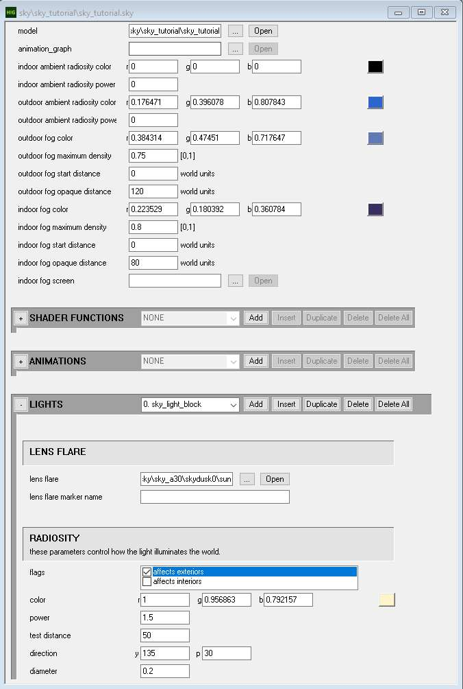
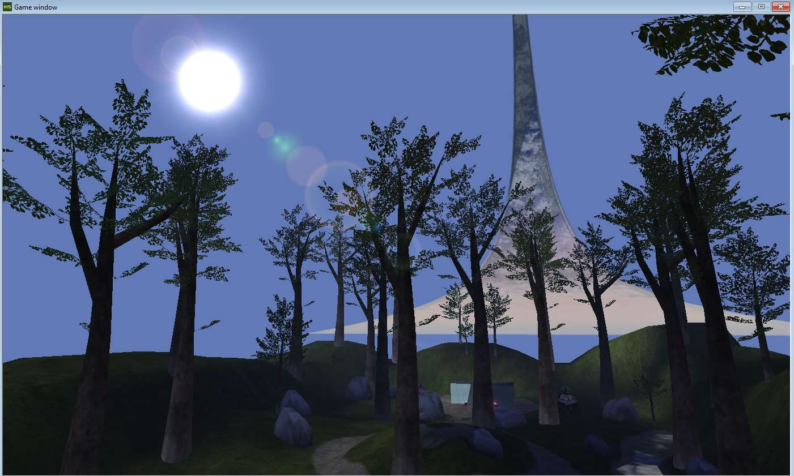
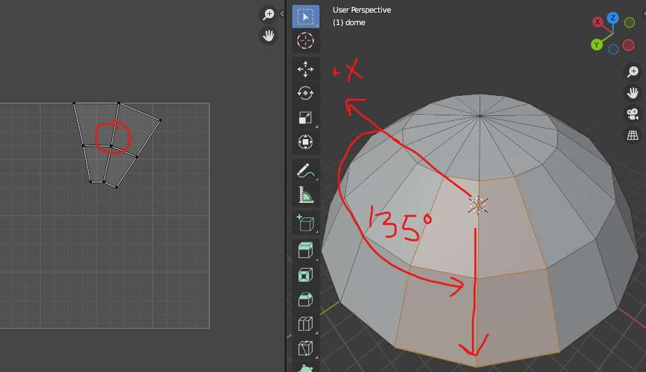
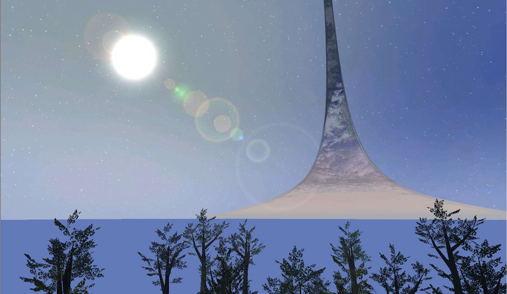

This guide will explain the process of creating custom **skyboxes** for Halo 1. These are models which depict the sky or backdrop scene of a level and are not part of the playable space (the [BSP](~scenario_structure_bsp)).

Our goal will be to create a very basic outdoor skybox containing:

1. A Halo ring using the game's existing model and texture.
2. A dome which has the backdrop texture and a twinkling star shader effect.
3. A sun light that illuminates the level for lightmaps.

We will create [sky](~), [gbxmodel](~), [bitmap](~), and [shader_transparent_chicago](~) tags as a result.

This is NOT a comprehensive tutorial on general 3D modeling or texture painting and will only cover the techniques needed to accomplish the example sky.

# Project files
Download [sky_tut_files.zip](sky_tut_files.zip), which contains final copies of all the assets and tags created with this guide. You can use these for reference or as a starting point if you want to skip steps. You **will** need the included `ring.blend` for one step later.

# Prerequisites

If you are new to Halo 1 modding and need a primer on the general asset-creation workflow, see [Introduction to Halo 1 modding](~intro-to-h1-modding). [Basic Blender knowledge](~blender#usage-basics) is also needed.


To complete this guide you will need:

* The [Halo Editing Kit](~hek) for Custom Edition or the [H1A Editing Kit](~h1a-ek) for H1A in MCC (available on Steam).
* 3D software like [Blender](~) or [3ds Max](~3dsmax). Blender is free software and you can export to JMS directly with the [Halo Asset Blender Development Toolset](~halo-asset-blender-development-toolset) or use [H1A-Tool's FBX pipeline](~h1a-tool#creating-a-jms-file-from-an-fbx-file). Max users can also use the FBX pipeline or a JMS exporter like [Bluestreak](~).
* 2D software like [Krita](~), [GIMP](~), or [Photoshop](~) for creating custom textures.

This guide will specifically be using the H1A-EK, Blender, the Halo asset toolset, and Krita. The techniques are generally transferrable to 3ds Max (see [regions and FBX](~fbx#region-assignment)) and Photoshop if you use those. The process is also the same using either the [HEK](~) or [H1A-EK](~).

# Setting up the project folders
We'll need some folders to organize our source assets. Navigate to your editing kit home/root folder and create these folders as needed:

* data
  * sky
    * sky_tutorial
      * models
      * bitmaps

You can name `sky_tutorial` whatever you want, but keep the name lowercase. This guide will refer to it as `sky_tutorial` from now on. It is important that you name the `models` and `bitmaps` folders as shown since [Tool](~h1a-tool) will expect to find our assets there when we compile them later.

# Planning ahead
Although these models are colloquially called "skyboxes" they are not usually modeled as literal boxes like you might see in classic games like Counter Strike 1.6 or Half Life. Halo skyboxes are large fully 3D scenes containing multiple layered elements that can be viewed from slightly different angles as the player moves through the level. Before you start creating assets it's important to know the constraints involved in making skyboxes and set expectations accordingly.

* Although skyboxes are 3D models, they are seen mostly from a single vantage point where the level's playable space is. Halo therefore does not perform depth sorting or depth testing during rendering of skybox models (although [backface culling][backfaces] still happens). You are expected to manually define "depth layers" of polygons using [model regions](~gbxmodel#regions) (more on this later), and these layers should hold up as the skybox is viewed from different places in your level (e.g. from opposite ends of the map). In other words, if you don't set up the render order, background faces may incorrectly render on top of foreground faces.
* Also because the skybox is mainly seen from one point of view, there is no need for complex detailed geometry. It should be made of a few very simple elements, often simple planes.
* The skybox can be animated. Elements of the model can move or rotate and textures can slide via shader animations.
* It is not feasible to create objects in the skybox at "true scale". Although its model is very large compared to the level you should fake perspective by scaling down distant objects. You'll see an example of this once we import the ring model into our scene.
* Atmospheric fog like you see on the [BSP](~scenario_structure_bsp) and the objects within it does NOT apply to the sky model. You will need to use texturing tricks to give the impression that distant parts of the sky are more occluded by fog.
* Similarly, the sky model receives no shading at all. Lighting and shadows must be done with your textures only.
* You should be trying to use as little texture space as possible for the skybox. [Bitmaps](~bitmap) are large assets and will use up your [available tag space](~map#tag-space). Not all parts of the sky need high resolution textures and parts of the model can be repeated.

# Creating the first version
Like most complex Halo assets, creating skyboxes benefits from iteration; we will start with getting a basic version in-game first then adding to and refining it in multiple steps later in this guide.

## Blender scene setup
Open up Blender. The default scene will include a camera, a cube, and a light. We don't need any of it so press  to select all and  to clear the scene of objects.

Since we will be working with a very large model, we need to increase the viewport's clipping distances. These are the minimum and maximum distances that the viewport will draw anything. Press the  key and select the _View_ tab in the sidebar that appears. Within, expand the _View_ menu if it's not already open. Set _Clip Start_ to `10000 m` and _End_ to `30000000 m`. Increasing both values, rather than just _End_, will avoid excessive [Z-fighting][z-fighting] in Blender's viewport. You can press  again to hide the _View_ menu then [zoom out](~blender#moving-the-camera) until you can see the grid again.


Although Blender is labeling our units as "meters" by default, this label is totally arbitrary and we just care about the actual values. Try not to think of Blender units as real life meters but rather _JMS units_. We'll be creating a model on the order of ~10,000,000 Blender/JMS units across, which equates to 100,000 in-game world units (Tool divides coordinates by 100). If you would prefer not to see the meters label, expand _Scene Properties > Scene > Units_ and set _Unit System_ to _None_.



Next, we'll add an armature to the scene with the _Add > Armature_ menu option, and give it a radius of `100000 m` to make it a bit easier to see when working at the sky's scale. This is a sort of skeleton structure where we can add bones and attach parts of the sky to them. For our basic sky we'll just have a single parent bone but creating an armature now means it's easier to add more bones in the future, in case you want to animate parts of the sky. Expand the armature in the outliner and double-click to rename the bone to `frame sky`.


You can use a parent object named "frame" instead of an armature if you don't intend to animate your sky, but we won't cover that technique here.



It's a good practice to confirm our scene's JMS export settings. Open up _Scene Properties_ and review _Halo Scene Properties_ and the inner _JMS Scene Properties_:

* _Game Version_: Halo CE
* _Generate Asset Subdirectories_: unchecked
* _Export Hidden Geometry_: checked
* _Triangulate_: checked
* _Scale_: JMS
* _Use as Default Export Settings_: **Check this** to make sure we always use these settings every time we export to JMS.

Now **save the scene** to `data\sky\sky_tutorial\models\sky_tutorial.blend`.

## Adding a ring mesh
We will not model and texture the ring from scratch but rather re-use the model from Halo's stock skyboxes. To save time and keep this guide focused, I have prepared the ring model as a Blender scene for you which can be appended to your sky's scene. This model is already UV unwrapped to fit the game's stock ring bitmaps. In the included [project files](#project-files) you will find the file `data\sky\sky_tutorial\models\ring.blend`. Place it somewhere convenient like in the same folder as your `sky_tutorial.blend`.

In the sky_tutorial Blender scene, open the _File > Append_ window and navigate to find `ring.blend` -- you should likely already see it because we downloaded it to the same place as our sky's Blender file. Navigate within `ring.blend` by double-clicking it in this window to see a list of data categories. We're interested in _Object_, so go there and find the `ring` object and append it to the scene. You may need to zoom out a bit to see it:


In case you are wondering how this ring model was obtained, I used [Mozzarilla](~) to convert a sky's gbxmodel to JMS and then used the [Blender Toolset](~halo-asset-blender-development-toolset) to import that JMS into Blender where it was cleaned up.

Next, the ring must be parented to our `frame sky` bone. In Blender's _Outliner_ (shows the scene collection in the top-right corner), select the `ring` object then hold  and select the `frame sky` bone. From the viewport menu select _Object > Parent > Bone_ or hit  and select _Bone_. If done right, the ring object will show as a child of the armature in the outliner and the object relations properties will show the bone as a parent:


We're not quite done setting up this ring. Although we have the mesh, we still need to assign its faces to a _material_ and a _region_...

## Materials
A _material_ is how Blender represents different types of surfaces and their appearances. Each face of an object can be assigned to a different material if needed. For Halo's purposes **only the material names** used by our model's faces will be included in the [JMS](~) file we will export later. This is because Halo has its own material system and the material name instructs Tool to [find a matching shader tag](~h1-materials#material-naming-and-shaders) to use for those faces when we compile our [gbxmodel](~). None of the other material settings in Blender matter for export, though assigning textures will help you visualize UV mapping and get a rough preview of the sky.

To demonstrate this matching behaviour, we will create a material for the ring with the same name as an existing stock tag:

1. Click to select the ring object.
2. Switch to [edit mode](~blender#interaction-modes), then to face mode ( then ).
3. Select all faces with 
4. Open the materials pane and add a material slot to this object, then create a new material in this slot.
5. Name the material exactly `ring dusk`. We intend for this material name to match with the existing tag `tags\sky\sky_a30\skydusk0\shaders\ring dusk.shader_transparent_chicago`.
6. Click the _Assign_ button to assign the active material slot to the selected faces. Technically we didn't need to do this because all faces will already use the first material slot once it's created, but I wanted to demonstrate this important step anyway. Remember that an object can have multiple material slots and you can assign different materials to different faces.
7. Enable _Backface Culling_. This will help us later when using _Material Preview_ viewport shading.
8. Give the material an identifiable _Color_ under _Viewport Display_ to help distinguish the faces with this material assignment. This colour is used when viewport shading is in _Solid_ mode, which it is by default. We will use the _Base Color_ in other materials later so ignore it for now.


Our ring now has a material assigned which should match with an existing shader tag when we later export a JMS and compile a gbxmodel tag. We're almost ready to do that and get a first version in-game, but we first need regions.

## Regions
Skybox artists must manually define the render order of groups of faces so they draw over each other correctly in-game. If this is not done properly, clouds may render _behind_ the ring for example. Much like layers in 2D software like Photoshop, we need to create render layers using [regions](~gbxmodel#regions). A region is simply a named group of faces and a model can have multiple regions, but each face can only belong to a single region. Regions need not correspond to whole objects/mesh elements and are completely independent of material assignments.

Region names are sorted alphanumerically when the gbxmodel is created and then rendered in this order in-game. For skyboxes they are typically named with a numeric prefix to make this clear:

* 00.dome
* 05.moon
* 40.ring
* 60.clouds_far
* 70.clouds_near

The numbers are somewhat arbitrary. Choosing numbers in the double-digits and spacing them out means you probably won't need to rename all your regions to "make space" as your skybox gains more layers and needs more regions.

Since we are using the Halo Asset Blender Development Toolset to export our JMS, we'll use Blender's _Face Maps_ feature to assign regions.

1. With the ring in face edit mode, open _Object Data Properties_ and find _Face Maps_.
2. Add a face map and double-click it to rename to "40.ring". 
3. Select all faces by pressing  while the cursor's over the viewport.
4. Assign the region to the selected faces.


If you are using the FBX export pipeline you'll instead need to assign regions by [combining them with material names](~fbx#region-assignment). 3ds Max users who are directly exporting to JMS with a legacy plugin like [Blitzkrieg](~) can use named selection sets (note that [Bluestreak](~) does not support regions).



## Exporting the model to JMS
We're now ready to get our first version of the skybox in-game. This begins by exporting a JMS:

1. **Save** the blender scene
2. Open the JMS export dialog using _File > Export > Halo Jointed Model Skeleton (.jms)_
3. The file browser should already be at the `data\sky\sky_tutorial\models\` folder, but navigate there if not.
4. The export settings should already be configured because of the [steps we took earlier](#blender-scene-setup).
5. Leave the filename as `sky_tutorial`, and click _Export_.

You should now see a new file created if you browse to the `models` folder in Explorer: `data\sky\sky_tutorial\models\sky_tutorial.JMS`. It's time to start tagging our sky, starting with compiling the gbxmodel.

## Compiling the gbxmodel
With our JMS file exported, we can now use [Tool](~) to create a [gbxmodel](~) tag from it. [Open a command prompt](~command-line#command-prompt-windows) in the editing kit root and enter the following command:

```dos
tool model sky\sky_tutorial
```

This instructs tool to convert our JMS file in the `data\sky\sky_tutorial\models` folder. When running this for the first time you should see the output:

```
### created model 'sky\sky_tutorial\sky_tutorial', remember to set the lod cutoffs
```

This means it has successfully created the tag `tags\sky\sky_tutorial\sky_tutorial.gbxmodel`. We can ignore the message about LOD cutoffs because our sky model only has one [LOD](~gbxmodel#level-of-detail).

## Creating the sky tag

Open [Guerilla](~) and use _File > New_ to create a new empty [sky](~) tag. We're going to set just a few values to get the sky in-game and make sure it's working before continuing with the guide:

| Field | Value | Purpose
|-------|-------|--------
| _model_ | Reference to `tags\sky\sky_tutorial\sky_tutorial.gbxmodel` | The model which is rendered for this sky.
| _outdoor ambient radiosity color_ | A sky blue (see image) | Sets the colour of ambient light which emulates the incoming light from all directions. It should usually be roughly the same colour as your sky backdrop.
| _outdoor ambient radiosity power_ | `0.25` | Controls the brightness of ambient lighting. You can raise or lower this later if the map appears too light in shadowed places after running lightmaps.
| _outdoor fog color_ | A slightly darker and more desaturated blue | Controls how distant parts of the [BSP](~scenario_structure_bsp) appear covered by atmospheric fog/haze.
| _outdoor fog maximum density_ | `0.75` | Controls the maximum density that our outdoor fog will have at great distances.
| _outdoor fog opaque distance_ | `120` | The distance where fog reaches its maximum density.
| _indoor fog color_ | A similar colour to the outdoor fog, but darker. | The colour of fog, but for indoor clusters\*.
| _indoor fog maximum density_ | `0.8` | The max density of fog, but for indoor clusters\*. Setting higher than the outdoor equivalent can help a map's indoor clusters feel more gloomy.
| _indoor fog opaque distance_ | `80` | The opaque fog distance, but for indoor clusters\*. As above, decreasing this compared to outdoors can also aid gloominess when the indoor fog colour is very dark.


\*[Indoor clusters](~scenario_structure_bsp#indoor-vs-outdoor-clusters) are a more advanced topic, but basically they are areas of the level where the sky is not visible and it depends on a BSP being correctly portalled. Some hallways in _Danger Canyon_ are classified as indoor clusters, for example, and a fully indoor level with no [sky faces](~h1-materials) will be completely comprised of indoor cluster. These clusters use the scenario's _first sky_ (since it can reference multiple) for ambient indoor lighting and fog information, which is why even indoor levels may still want to reference a sky tag.


In addition to the values we've set so far, we need some lights to cast directional light. Click the _Add_ button in the lights [block](~tags#blocks) to add a new light and give it the following values:

| Field | Value | Purpose
|-------|-------|--------
| _lens flare_ | `sky\sky_a30\skydusk0\sun` | Gives the light a visible [lens_flare](~) in the sky as well as a [Ray of Buddha](~sky#ray-of-buddha) effect.
| _affects exteriors_ | Checked | Allows this light to affect outdoor clusters for lightmaps.
| _color_ | A light yellow-orange | Colours the light emitted by this light. Usually this will be your sunlight colour.
| _power_ | `1.5` | Think of this as the brightness of the light. A value around `1.1` to `1.7` is typical for sunlight.
| _test distance_ | `50` | Sets the maxmimum distance in world units that lightmapped shadows can be cast by this light. Unless your BSP is extremely large and has objects casting shadows across great distances you shouldn't need to increase this.
| _direction_ | y: `135`, p: `30` | Specifies the direction toward the light from the origin. Yaw is measured in degrees counter-clockwise from the +X axis, while pitch is measured in degrees above or below horizontal (-90 to +90).
| _diameter_ | `0.2` | Angular diameter of the light measured in degrees. The larger the value, the softer lightmapped shadows will be.

The radiosity settings we picked take effect during [lightmapping](~lightmaps). While developing your sky you should periodically [run lightmaps](~h1a-tool#lightmaps) on the map you use to test the sky so you can adjust these settings as needed.


If you are wondering why we did not need to create a [marker](~gbxmodel#markers) in our model and set the _lens flare marker_ field of the light, it's because the game will use the _direction_ field to place the lens flare in the sky by default. We will cover markers as an advanced topic [later in this guide](#using-light-markers).


Here is what the completed tag should look like:



**Don't forget to save the tag** at `sky\sky_tutorial\sky_tutorial.sky`.

## Viewing the sky
The last step before getting this sky in-game is to add it to a scenario. Open up the tag `levels\test\tutorial\tutorial.scenario` in Guerilla and replace its existing _sky_ reference with one to our new sky tag at `sky\sky_tutorial\sky_tutorial.sky`. If you have a custom map of your own you want to use for testing you can use that too.

Save the edited scenario then open it in [Sapien](~h1a-sapien) or load it in [standalone](~h1a-standalone-build#usage). You should see the custom sky:



There's just a blue background (this is the _outdoor fog color_), the sun in the _direction_ we specified, and the ring model. Even though we never assigned any textures to our ring model in Blender you can see it is fully textured in-engine. Again, this is because the shader tags define the appearance of materials in-engine and only the material name technically matters when exporting our JMS and compiling the gbxmodel.

In the next steps we will add new custom objects to our model, UV unwrap them, and create their textures and shaders.

# Backdrop dome
Rather than a plain blue background we should create a textured dome wich surrounds the sky. In this section we'll go through the whole process of modeling, texturing, and tagging it.

## Modeling

1. In object mode, use _Add > Mesh > UV Sphere_ to add a sphere to our scene with `16` segments, `8` rings, and a radius of `10000000 m` (10 million).
2. Enter edit mode and then face mode.
3. Switch to wireframe using the selector in the upper-right of the viewport or using the radial menu by holding .
4. Drag a box to select the top 3 layers of the sphere, then invert the selection ()
5. Delete the bottom faces of the sphere by pressing . Make sure you choose the _Faces_ option or you may leave behind floating edges and vertices.
6. Switch back to solid viewport shading again.
7. Select all remaining faces of the dome by pressing . In the video below I put my cursor over the mesh and press  to select all geometry connected to what's under the cursor, which has the same effect.
8. Press  then  to initiate a move along the Z axis. Use the mouse to move the faces down until the bottom edge of the dome is just beneath the grid.


Now that the mesh has the right shape and location we will repeat some steps we took with the ring to further prepare it for Halo:

1. Rename the object to `dome`.
2. Select all faces and assign them to a _Face Map_ named `00.dome`. Remember, because of region sorting this region will render behind our ring (`40.ring`).
3. Switch back to object mode, select the dome, then  + select the `frame sky` bone. Use  and select _Bone_ to parent the dome to this bone. You can confirm this worked under _Relations_ in _Object Properties_.


## UV mapping

The default UV unwrap for this mesh is not suitable for our needs. We'll need to unwrap it in preparation for texturing:

1. In edit mode, select all faces of the dome.
2. Switch to Blender's _UV Editing_ workspace.
3. Viewport settings belong to each workspace. [Repeat the earlier step](#blender-scene-setup) of increasing the near and far clip distances so we can see the model when zoomed out.
4. Press  and select _Unwrap_ to automatically UV unwrap the selected faces. We use _Unwrap_ rather than something like _Cube Projection_ because Blender will attempt to minimize texture stretching.


## Texturing

It can be easier to texture a mesh when you have a UV template -- basically a screenshot of the UV unwrapped polygons. Blender can generate one from the _UV Editor_. Select _UV > Export UV Layout_, and specify a size of 256x256 pixels and an opacity of 1. Always use [power of 2][pow-2] dimensions for textures. Save the PNG anywhere convenient, such as in `data\sky\sky_tutorial\bitmaps`.


Open the PNG you exported in [Krita](~) or your favourite 2D software (e.g. GIMP, Photoshop). I'll show Krita in this guide.

1. Rename the current layer to `uv layout` and add a new layer named `background`.
2. Re-arrange the layers so `uv layout` is above `background`.
3. Redue the opacity of `uv layout` so we can see below it when painting.
4. Select the _Fill_ tool () and choose a sky blue colour.
5. With the `background` layer selected, fill with blue.


Let's give the dome some variation in colour. Remember that we placed our sun 135 degrees counter-clockwise from the +X axis, and 30 degrees above the horizon. If you select faces in that region of the dome you will see roughly what part of the UV layout it is:



Back in Krita:

1. Add a new layer called `light`.
2. Select the _Brush_ tool (), then choose a large soft brush in _Brush Presets_.
3. You can adjust the brush radius with  and .
4. Choose a light yellow similar to our sunlight.
5. Paint into the `light` layer around where the sun should be.
6. Adjust the layer opacity as needed to achive the desired look. You can hide the `uv layout` layer to see better.


The horizon should be a lighter colour than the top of the sky. Let's add another new layer called `horizon` for that and paint a light blue roughly around the edge of the UV layout:


It's time to export our texture to TIFF format. We're not going to use Krita's _File > Export_ menu because it doesn't preserve RGB data where the alpha channel is black. Instead, we'll use Krita's "split alpha" feature to export. This requires us to put our layers in a group and give that group a mask. We can then export from the context menu of that mask.

1. Select all of our our painted layers (not the UV layout) by selecting `horizon` then  + selecting `background`.
2. Press  to create a layer group.
3. Right click the layer group and add a transparency mask, which you can rename to `alpha`.
4. Right click the `alpha` layer and select _Split Alpha > Save Merged_.
5. Use the dialog that appears to save the texture as `data\sky\sky_tutorial\bitmaps\dome.tif`. Make sure the compression setting is _None_ or Tool will be unable to convert this TIFF to a [bitmap](~) tag.


Our alpha channel is completely white (opaque) so technically we could have gotten away with using _File > Export_. However, we'll make other textures that need an alpha channel so you should get in the habit of using split alpha now.



**Save the Krita document** as `data\sky\sky_tutorial\bitmaps\dome.kra`. Use this as your "master" copy in case you want to make edits later.

## Compiling a bitmap
In order for `dome.tif` to be usable by the game, it needs to be compiled into a [bitmap](~) tag using [Tool](~h1a-tool). [Open a command prompt](~command-line#command-prompt-windows) in your editing kit folder (e.g. where you would find `tool.exe`) and enter the following command:

```
tool bitmaps sky\sky_tutorial\bitmaps
```

This command will tell Tool to [batch compile](~h1a-tool#batch-bitmap-compilation) every TIFF file found in the `data\sky\sky_tutorial\bitmaps` folder into a corresponding bitmap tag under `tags\sky\sky_tutorial\bitmaps`. You should see this output:

```
### dome.tif
bitmap created: #256x#256, compressed with color-key transparency, 42K-bytes
```

The message means Tool has created the file `tags\sky\sky_tutorial\bitmaps\dome.bitmap`. You can open it in Guerilla to see how it looks compressed.


By default, Tool creates the tag using color-key transparency (DXT1) compression which is fine for this bitmap but won't be for ones with alpha channels that need to be preserved. For an overview of bitmap compression formats and their uses, [see here](~bitmap#format). If you want to change the format Tool uses, use Guerilla to open the bitmap tag it created and change the _format_ field to something else, save the tag, then re-compile the bitmap using Tool. It will use the existing bitmap tag as input to the compilation process and use the selected format for the updated tag.


## Creating a shader
We want the dome shader to have a twinkling star effect. The easiest way to create our backdrop's shader will be to copy a similar existing shader and change our bitmap reference. Shaders are a very extensive topic on their own so we're not going to dive into all the details.

1. In Explorer, create a new folder `tags\sky\sky_tutorial\shaders` if it doesn't exist already.
2. In Guerilla, open `tags\sky\clear afternoon\sky clear blue.shader_transparent_chicago`.
3. Use _File > Save As_ to save a copy to `tags\sky\sky_tutorial\shaders\sky_tut_dome.shader_transparent_chicago`.
4. In the _MAPS_ block of the tag, select the `sky clear blue` entry (3rd).
5. Replace the _map_ reference with the `sky\sky_tutorial\bitmaps\dome.bitmap` tag we compiled earlier.
6. Save and close the shader tag.


The name of this new shader, `sky_tut_dome`, is important because it will also be the name of the material we create and assign to the dome model in Blender. Always name shaders in lowercase and without numbers, and give them a unique name so Tool can unambiguously relate the material name in your JMS with a single shader tag when compiling your gbxmodel.


## Assigning a material
Back in Blender, let's create a material for the dome that will match with the shader tag we just created.

1. With the `dome` object in edit mode, select all faces.
2. Enable the viewport's _Backface Culling_ option using the drop-down in the upper right of the viewport. This option is available when you are in _Solid_ shading mode. Enabling [backface culling][backfaces] helps us better see how the model will appear in-game. As you can see, the dome can only be seen from the outside, but we'll fix that soon.
3. Create a new material called `sky_tut_dome` and assign it to the selected faces.
4. Under _Viewport Display_, set _Color_ to a distinguishable blue to help you spot where this material is assigned when using solid shading mode.
5. Switch to _Material Preview_ shading mode either by holding  and using the radial menu or selecting the third sphere icon in the upper-right of the viewport. You will see that backfaces are visible again because in this shading mode backface culling is controlled on a material-by-material basis.
6. Enable _Backface Culling_ in the material.
7. Set the material's _Base Color_ to an _Image Texture_. Use _Open_ to find and choose `data\sky\sky_tutorial\dome.tif`.


You may notice that the surface of the dome looks rather faceted or angular rather than smooth. This doesn't matter in-game because skies aren't shaded, but to make the dome look nicer in Blender we can set the faces to smooth shading. With all of its faces selected, hit  and select _Shade Smooth_.

The last and very important step is to flip the dome's normals so it is visible from the levels' point of view. Hit  and select _Flip_.


## Updating the gbxmodel
Because we've modified the Blender scene we must [export the JMS](#exporting-the-model-to-jms) and [compile the gbxmodel tag](#compiling-the-gbxmodel) again. Once you've done those steps you should now see the backdrop in Sapien:



# Advanced topics
## Animation
The sky model can be animated using overlay (JMO) animations. The x10 scenario use a subtle sky animation this to make the Pillar of Autumn appear to be turning in space.

1. With the armature in edit mode, use _Add > Single Bone_ to include new bones in the scene, which you would name something like `frame moon`.
2. Parent the new bone under `frame sky` by first selecting the new bone, then `frame sky` while holding , and selecting _Armature > Parent > Make > Keep Offset_ (also available via ).
3. Parent object(s) in your sky to the new bone.
4. Switch the editor's interaction mode to _Pose Mode_ and set keyframes while moving or rotating the bone.
5. Save the scene, and export a JMO animation to `data\sky\sky_tutorial\animations\sky_tutorial.JMO`.
6. Compile the animation to a [model_animations](~) tag with `tool animations sky\sky_tutorial`.
7. Reference the animations tag from the sky tag.
8. In the sky's animations block, add an entry with a period for the animation.

## Using light markers
You might want to include a [marker](~gbxmodel#markers) in your sky model if you want to animate the position of a light's lens flare. Otherwise there is little point in using them. Animating a light marker will NOT animate the lightmaps or dynamic object shadows.

1. While in object mode, use the _Add > Empty > Sphere_ menu option. An _empty_ is a type of Blender object that has no mesh.
2. Name the new object `#sun`. The `#` prefix marks this object as being a marker.
3. Under _Object Data Properties_, expand _Halo Mesh Properties_ and give the marker a region that you already have in the scene like `00.dome`. Markers need to belong to a region.
4. Parent the marker to a bone like `frame sky`.
5. Rebuild your gbxmodel, then go to the sky tag and use the marker name for a light (e.g. `sun`, without the `#` prefix).

[z-fighting]: https://en.wikipedia.org/wiki/Z-fighting
[backfaces]: https://en.wikipedia.org/wiki/Back-face_culling
[pow-2]: https://en.wikipedia.org/wiki/Power_of_two