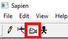
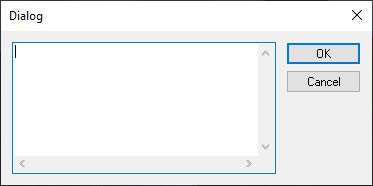
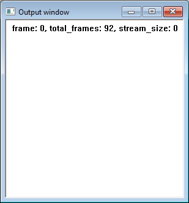
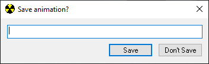

**Recorded animations** are a series of recorded inputs (e.g. movement, aiming, firing, etc) which can be later replayed on [units](~unit) like vehicles and bipeds. The animations are recorded using Sapien and stored in the [scenario](~), and can be played on units with [script functions](~scripting#functions-recording-play). They are commonly used for dropships and character movements during cinematics.

Unlike [model_animations](~) created in external 3D software and imported from [JMA](~general/source-data/animation-data), recorded animations do not animate the positions of objects over time. Instead, they record controller inputs and replay them within the engine. Because Halo's physics are deterministic and the animations are recorded and replayed tick-by-tick, the results are identical. However, any later alteration to the unit's [physics](~) or walking speed will alter the path taken. This is why the stock Banshee tags include an "oldplayback" variant with older physics.

The advantage of this system is that you can animate directly in-engine and the animations are more believable because they rely on the game's own physics engine.


The Sapien recording feature does not function in the Gearbox HEK release since it is not possible to control the posessed unit while recording. Modders traditionally relied on the 2011 [_Recorded Animations Recorder_](https://halomaps.org/hce/detail.cfm?fid=5939) mod for Custom Edition 1.09. With H1A Sapien, this feature is now working again but requires an Xinput controller (e.g. An Xbox controller) to be connected to your device.

Also, be warned that recordings done after reloading a scenario in [Sapien](~h1-sapien) may cause stability issues. Try to keep it to your first scenario load.


# Entering scripted camera mode
You will need to set your editor mode so that we can start using recording commands. Find the toolbar in the top left and select the camera icon. This will set your [Sapien](~h1-sapien) instance to scripted camera mode.



Some additional notes for this section. There are some new hotkeys you gain access to in this mode:

* : Toggle "Attach camera to unit" option.
* : Toggle "Edit camera point" option.
* : Toggle "Scripted camera control".
* : Current game view camera position is used to create a new camera point if "Edit camera point" is disabled. If "Edit camera point" is enabled then it instead moves the "Active camera point" to the current position of the game view camera.

# Taking over a unit
We will need to pick a unit for us to take over. A unit here is typically a [biped](~) or a biped in a vehicle placed in your scene. Look over to your game window and look at a biped you wish to take over. Once you've made your choice go ahead and left click on the biped directly. A sphere should encircle the biped and gradually shrink. This indicates that you have selected the unit.


Do not attempt to select the [unit](~) from the hierarchy list. You must select the unit from the game window screen.


Once the unit is selected you can press the following keys to take over the unit:

* : Some additional notes for this section. There are some new hotkeys you gain access to in this mode.
* : Toggle "Camera type". Pressing this key will cycle between 3 modes for your camera.
	* First Person
	* Third Person
	* Flycam

# Begin recording
Now that you've taken over the unit you should see a view that looks pretty similar to a standard ingame session. Press the  key to start recording. This will bring up a dialog window where you can enter scripts to be run before the recording starts:



You might use this to teleport units to flags or load into vehicles. You can leave this empty if your recording requires no setup. Once you click OK the recording will start.



You should now notice some new details in the output window. Total frames will starting increasing, indicating that the recording is currently in progress.

Perform the actions you need to include in the recording, such as walking around the level, piloting vehicles, or using weapons. Your inputs are being recorded so they can be played back on controlled units later. Once you're ready to stop the recording, see the next section.

# Saving your recording
When you have finished performing the actions you want recorded, press  to save the animation. This will bring up the following menu:



Clicking "Don't Save" will throw the recorded animation data away while saving it will place the data under the hierarchy folder named "Recorded animations".

# Playing your recording
In order to play the recording on a unit you will have to call it through a script function. The script function we will be using in this example is as follows:

```console
recording_play <unit name> <recorded animation name>
```
For example, `recording_play elite_1_2 jumping`.
