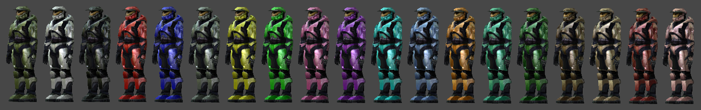

There are lots of hard-coded values in Halo's engine, such as the multiplayer
armor color. These values do not typically appear anywhere in tag data, and
cannot be directly changed or controlled.

# Multiplayer Armor Colors

<figure>
  
  <figcaption>
    
Spartan armor colors with shaders as they appear ingame.

    
The far-left is the single-player color, which comes from the
    actor_variant tag and is <strong>not</strong> hard-coded

  </figcaption>
</figure>

In multiplayer, the player's armor color value comes from this hard-coded list.
For non-player unit color change, see [actor_variant][].

Color name matches the name as it appears in the game's menu. HEX and RBG color
values are both listed in red-green-blue order. Note that these colors will look
somewhat different ingame, since cubemaps and specular maps are applied over the
diffuse color listed here.

| Name   | Color                                       | HEX       | RGB           |
|--------|---------------------------------------------|-----------|---------------|
| White  |
&nbsp;
| `#FFFFFF` | 255, 255, 255 |
| Black  |
&nbsp;
| `#000000` |   0,   0,   0 |
| Red    |
&nbsp;
| `#FE0000` | 254,   0,   0 |
| Blue   |
&nbsp;
| `#0201E3` |   2,   1, 227 |
| Gray   |
&nbsp;
| `#707E71` | 112, 126, 113 |
| Yellow |
&nbsp;
| `#FFFF01` | 255, 255,   1 |
| Green  |
&nbsp;
| `#00FF01` |   0, 255,   1 |
| Pink   |
&nbsp;
| `#FF56B9` | 255,  86, 185 |
| Purple |
&nbsp;
| `#AB10F4` | 171,  16, 244 |
| Cyan   |
&nbsp;
| `#01FFFF` |   1, 255, 255 |
| Cobalt |
&nbsp;
| `#6493ED` | 100, 147, 237 |
| Orange |
&nbsp;
| `#FF7F00` | 255, 127,   0 |
| Teal   |
&nbsp;
| `#1ECC91` |  30, 204, 145 |
| Sage   |
&nbsp;
| `#006401` |   0, 100,   1 |
| Brown  |
&nbsp;
| `#603814` |  96,  56,  20 |
| Tan    |
&nbsp;
| `#C69C6C` | 198, 156, 108 |
| Maroon |
&nbsp;
| `#9D0B0E` | 157,  11,  14 |
| Salmon |
&nbsp;
| `#F5999E` | 245, 153, 158 |
