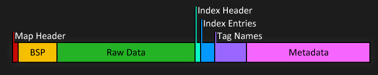
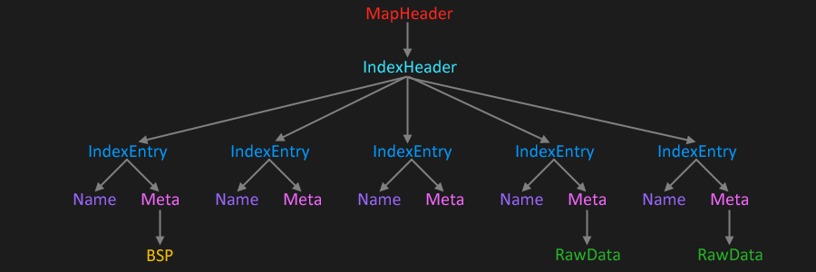

A **map**, also known as a **cache file**, is a bundle of processed [tags][] which can be loaded and used by [Halo][h1]. With the exception of [_resource maps_](#resource-maps), each map represents a playable campaign, multiplayer level, or main menu.

When tags are compiled into a map, their data is prepared for how it will be used at runtime. [Tag path references][tags#tag-references-and-paths] are replaced with pre-calculated indices or pointers, [child scenarios][scenario#child-scenarios] are merged, extra fields are calculated, and the metadata for [bitmaps][bitmap] and [sounds][sound] is separated from their raw data.

Maps are found in Halo's `maps` directory and have the ".map" extension. Maps in subdirectories are not loaded by the game. H1CE mods like [Chimera][] and [HAC2][] store [downloaded](map-sharing#halonet) maps in a separate location and force the game to load them regardless.

# Editing and porting maps
The recommended approach to porting or modifying maps is to obtain their source [tags][] and recompile the map using [Tool][] or [invader-build][]. This ensures the greatest flexibility and tags will be processed correctly when the new map is built.

Although maps work mainly the same way in each release of H1, there are a number of differences listed on this page which prevent maps from being reused across them as-is. For example, an H1CE map file cannot be used in H1PC Demo without recompiling it from tags.

It is also possible to directly edit ("poke") the tags within a map using tools like [Assembly][], but this can be error prone or more limiting than working with source tags. Adding new assets ("injecting") is harder than using the intended asset pipeline.

# Map types
The type of a map is determined by the [scenario type field][scenario#tag-field-type] when the scenario is compiled, with the exception of resource maps which are not compiled from one.

## Multiplayer
In H1CE, multiplayer maps can be loaded through the in-game menu or with the [command][developer-console] `sv_map <map> <gametype>`. Loading a multiplayer map using `map_name <map>` will trap the player in the level without the ability to use the menu.

## Singleplayer
To load a singleplayer map in H1CE, you can either use a modded `ui.map` which includes menu options to launch it, or load it directly using the `map_name <map>` console command. When [Tool][] compiles this map type, it strips multiplayer information from [globals][] and applies some balancing [tag patches][tool#hardcoded-tag-patches]. These patches are applied at runtime in H1X.

## UI
The special `ui.map` contains resources for the game's main menu, including [bitmaps][bitmap] for its UI elements like the server browser and the Halo ring background. The [HEK][] supports the creation of custom UI maps. When Tool compiles a UI map, it strips multiplayer info and fall damage blocks from [globals][].

Custom UI maps which intend to add a campaign menu to H1CE must include a dummy first menu item since the game is hardcoded to remove it.

## Resource maps
Resource maps provide a way for certain tags to be stored _external_ to a playable map rather than its tags being totally self-contained. These maps themselves are not playable and have a different [header structure](#resource-map-header), but instead contain shared tags referenced by normal map files. This feature was introduced with H1PC with `bitmaps.map` and `sounds.map` to store [bitmap][] and [sound][] tags respectively, and `loc.map` was added in H1CE to store [font][] and [unicode_string_list][]. MCC H1A no longer uses `loc.map` except for backwards compatibility with maps compiled for Custom Edition. H1X does not use resource maps.

When playable maps are compiled using [Tool][], any needed tags for the map which are already present in a resource map (determined by [tag path][map#resource-header-paths-offset]) will be excluded and referenced by pointer to the loaded resource map instead. The resource maps were created once using an internal version of Tool and were not originally intended to be modified, though [invader-resource][] and [OpenSauce][] are capable of compiling new ones. Using incompatible resource maps will result in glitched textures, sounds, and text.

Storing bitmaps and sounds in common files had the benefit of reducing the disk space needed for H1PC's maps because multiple maps are able to reference the same data rather than duplicating it. The other benefit is that the resource map can be swapped out with another to alter tag content without affecting the dependent maps. In the case of `loc.map`, the file itself contains common UI messages and prompts but varies by language of the H1CE installation. This means a custom map can be compiled once but still have localized messages when used in another language of the game, as opposed to compiling a version of the map for each language.

To create self-contained maps when using [Tool][], temporarily removing resource maps from the `maps` directory when compiling the map.

# Compressed maps
H1X maps use [zlib compression][zlib] for all data following their header. Maps are decompressed into one of multiple disk caches depending on the [header's scenario type](#map-header-scenario-type).

This compression scheme is not supported natively in other releases of the game, but it is supported by the H1CE mod [Chimera][]. Maps downloaded from [HaloNet][map-sharing#halonet] by this mod may be compressed this way. Although Chimera does not download maps to Halo's main `maps` directory, take care not to mix these maps with stock ones since they are not compatible with the base game and are unsupported by other mods at this time. Compressed maps can be identified using [invader-info][].

# Engine differences
Each game supports a slightly different set of [tag classes][tags#tags-list]. For example, [gbxmodel][] did not yet exist in H1X and H1CE cannot render [shader_transparent_generic][] (support returned in H1A). Additionally, some [script functions][scripting] used by modders are only supported in H1CE or H1A.

Because of these differences, map authors may need to create multiple tag sets to compile their maps if releasing for both H1CE and H1A. For example, the H1CE map would use [shader_transparent_chicago][] to emulate [shader_transparent_generic][] and would avoid any script functions specific to H1A.

# OpenSauce .yelo maps
Maps with the extension `.yelo` are compiled with [OS_Tool][opensauce#os-tool] and can only be played using H1CE with the [OpenSauce][] mod, which extends Halo's engine with new tag types, higher limits, and extra renderer features. These maps are typically [custom campaign missions][os-maps] specifically designed to take advantage of these extensions. [Refinery][] supports extracting OpenSauce tags from these maps.

# Protected maps
A _protected map_ is a map which has been intentionally corrupted in a way which still allows it to be loaded and played in-game, but hinders attempts to extract tags from it by removing or scrambling data like [tag paths](#resource-header-tag-path-pointer). It is now a discouraged practice.

Map protection was unfortunately common in the H1CE modding scene in the 2000s as a way to prevent others from using ones custom tags, and it has overall negatively impacted the community because the resulting maps are crash-prone, cannot be easily be ported to newer engines like H1A, and new modders cannot extract their tags cleanly for study. H1A even explicitly checks for and refuses to load protected maps.

[Refinery][] can "deprotect" maps for tag extraction but the results may require cleanup.

# Map file size limit
The maximum allowable file sizes for playable maps varies by version. Halo will reject maps if their [header has a file size](#map-header-file-size) that exceeds this limit.

* H1X:
  * SP: 278 MiB
  * MP: 47 MiB
  * UI: 35 MiB
* H1CE: 384 MiB ([Tool][] enforces 128 MiB for MP maps)
* H1A: 2 GiB

[invader-build][] can be used to build cache files which exceeds the stock limits, but this may require the user to use a mod to play the map.

# Tag space
The game's buffer for tag data is limited:

* H1X: 22 MiB
* H1CE and H1PC: 23 MiB
* H1A: 64 MiB

Total tag size is comprised of all non-raw tag data (ie. no bitmap or sound raw data) plus the _largest_ [BSP][scenario_structure_bsp] size, since the BSP is loaded within the tag space and there will only be a single BSP loaded at a time. Additionally, a maximum of 65535 tags can be in a map.

[Tool][] will enforce this limit when compiling a map. Keep an eye on its console output:

```
total tag size is 8.43M (14.57M free)
```

Care should be taken not to get too close to the tag limit, because even though you may compile a map with a certain set of resource maps (e.g. the English version of the game), Halo players with different languages may actually have _larger_ resource map tag data which now exceeds the limit and prevents your map from loading.

You can toubleshoot which tags are using the most memory by generating the `baggage.txt` report using the [Sapien][Sapien#game-window] hotkey: <kbd>Control + Shift + B</kbd>.

# Map loading
Within a map, _tag definitions_ (sometimes called _metadata_) are stored separately any _raw data_ used by the tag, such as sounds and bitmaps. [BSP data][scenario_structure_bsp] for all BSPs is also stored in its own location. The game is able to find these locations using special headers and indexes in the map file.

Each section is loaded in a different way:

* Tag metadata is copied directly into memory at a fixed address. The game has a limited amount of tag space available for the currently loaded map. The size depends on the edition:
  * H1X: 22 MiB
  * H1PC and H1CE: 23 MiB
  * H1A: 64 MiB

  Tag metadata is loaded into the _start_ of this region. Because this data has been preprocessed by Tool, it requires no further processing and thus is very fast to load. The address where tag data is loaded is also dependent on the edition:
  * H1X: `0x803A6000`
  * H1PC Demo: `0x4BF10000`
  * H1PC and H1CE: `0x40440000`
  * H1A: Dynamic
* The active BSP is loaded into the _end_ of the tag space. When a BSP switch occurs, the new BSP data is read from the map file using [information stored in the scenario tag][scenario#tag-field-structure-bsps] and replaces the previous data in-memory. In H1A, it is loaded at a separate dedicated location instead.
* Raw data is streamed from the map file as needed and dynamically allocated in the [sound cache][sound-system#sound-cache] and [texture cache][renderer#texture-cache]. The texture cache is cleared during maps loads and BSP switches. Some tags like [BSPs][scenario_structure_bsp] and [scenarios][scenario] contain a "predicted resources" block which hints to the game which data should be loaded into these caches.

Tags from resource maps are also loaded into the tag space as needed. Halo CEA uses compressed maps and additional files to store sounds and bitmaps, so loads maps [differently][h1a#changes].

# File structure
Generally map files consist of a map header section followed by BSP, model, raw data, and indexed tag definitions. The header structure and/or values vary by game. Not all maps may look like this exactly, due to map protection or differences in map compiler. All data is [little-endian](https://en.wikipedia.org/wiki/Endianness).





```.alert info
This page does not give a full accounting of how BSP and model data are stored and loaded. For further information, see this page's [acknowledgments](#acknowledgments) section for source material.
```

## Map header
Normal playable (non-resource) cache files begin with a header which is always 2048 bytes long.

```.struct
entry_type: CacheFileHeader
showOffsets: true
id: map-header
imports:
  h1/files/map:
    - CacheFileHeader
```

### Demo map header
Demo versions of H1PC use a different cache file header structure with reordered fields and extra padding between them as a means to make it harder to port retail cache files to the demo. The header is still 2048 bytes long.

```.struct
entry_type: DemoCacheFileHeader
showOffsets: true
id: demo-map-header
noEmbed:
  - CacheVersion
imports:
  h1/files/map:
    - DemoCacheFileHeader
```

## Resource map header

```.struct
entry_type: ResourceMapHeader
showOffsets: true
id: resource-header
imports:
  h1/files/map:
    - ResourceMapHeader
```

## Tag index header
The tag index/tag data header is the start of where tag data and definitions are loaded directly into memory at runtime at the game's tag address. For most versions of the game, it looks like this:

```.struct
entry_type: TagDataHeaderPC
showOffsets: true
id: resource-header
imports:
  h1/files/map:
    - TagDataHeaderPC
```

### Xbox tag index header
The H1X tag index header is slightly different since model data is also in the tag data, so it uses pointers instead of file offsets.

```.struct
entry_type: TagDataHeaderXbox
showOffsets: true
id: resource-header
imports:
  h1/files/map:
    - TagDataHeaderXbox
```

## Tag array entry
Each 32-byte element in the tag array contains information about a tag in the map, including a pointer or resource index to the actual tag definition itself.

```.struct
entry_type: TagArrayEntry
showOffsets: true
id: resource-header
imports:
  h1/files/map:
    - TagArrayEntry
```

[os-maps]: https://haloce3.com/category/downloads/open-sauce-maps/
[zlib]: https://en.wikipedia.org/wiki/Zlib
