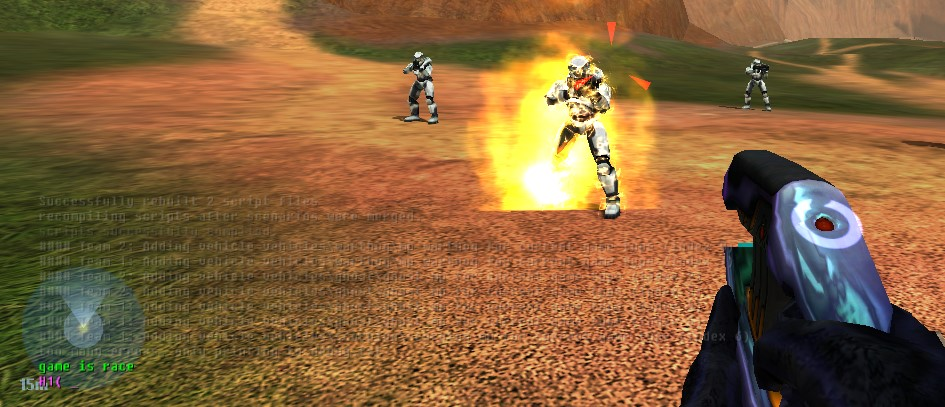

The set of [HaloScript](~scripting) functions covers most reasonable needs for singleplayer scripting. However, modders being modders means this sometimes isn't enough and creative solutions are needed.

# General
## Using globals for parameters
Only H1A supports parameters on static scripts. Use globals to pass data to static scripts in other versions of the engine. For example, this script with a parameter:

```hsc
(script static void (kill_player (short player_index))
  (unit_kill (unit (list_get (players) player_index)))
)
; (kill_player 5)
```

Can be equivalently written with a global as:

```hsc
(global short kill_player_param1 0)
(script static void kill_player
  (unit_kill (unit (list_get (players) kill_player_param1)))
)
; (set kill_player_param1 5) (kill_player)
```

This page features some example static scripts which use parameters, so be aware that you can use them outside H1A too if you use globals.

## Using globals for local variables
H1 HaloScript doesn't have local variables, so it's sometimes useful to create globals for scripts to set/get during their execution. This can avoid having to recalculate the same expressions repeatedly, or lets you force a cast to a different data type. Various examples on this page use globals this way.

# Control
## Looping
HaloScript does not natively support loops, but you can use `continuous` scripts and an incrementing global to emulate one with the caveat that iterations are spread across game ticks. Since continuous scripts are executed once per tick and the game's tick rate is 30 Hz, this means a continuous script which needs to iterate over 60 items will take 2s to complete.

```hsc
(global short player_index 0)

(script continuous loop_over_players
  ; do what you need with player_index:
  (if (volume_test_object kill_volume (list_get (players) player_index))
    (unit_kill (unit (list_get (players) player_index)))
  )
  
  ; increment/reset the index for the next tick
  (set player_index (+ 1 player_index))
  (if (>= player_index (list_count (players)))
    (set player_index 0)
  )
)
```

## Recursion
Parameterized static scripts _can_ call themselves, but also easily result in
stack overflows. Prefer iterative solutions over recursive ones.

```hsc
(script static long (fib (long n))
  (cond
    ((< n 1) 0)
    ((= n 1) 1)
    (true (+ (fib (- n 1)) (fib (- n 2))))
  )
)
```

```console
fib 1 ; 1
fib 2 ; 1
fib 3 ; 2
fib 4 ; 3
fib 5 ; 5
fib 6 ; crash/fatal due to stack overflow
```

# Math
## Modulo
You can create a [modulo/modulus operator](https://en.wikipedia.org/wiki/Modulo) with a static script and a global. The global is necessary because it forces a [cast](~general/scripting#value-type-casting) from `real` to `short`.

```hsc
(global short modulo_tmp 0)

(script static short (modulo (short x) (short y))
  (set modulo_tmp (/ x y))
  (- x (* modulo_tmp y))
)

(modulo 10 3) ; returns 1
```

If your divisor `n` is a power of 2, e.g. `16`, you can use H1A's `bitwise_and` with `n - 1` for a simpler modulo:

```hsc
(bitwise_and 20 15) ; equivalent to 20 % 16 = 4
```

## Square root
If you need a square root, it requires an approximation since there is no built-in way to calculate it. For positive values of `x`, we can use _Heron's Method_ to iteratively refine an estimate until a desired accuracy is reached:

```hsc
(global real sqrt_tmp 0)
(script static real (sqrt (real x))
  (set sqrt_tmp (/ (+ sqrt_tmp (/ x (/ x 2))) 2))
  (set sqrt_tmp (/ (+ sqrt_tmp (/ x sqrt_tmp)) 2))
  (set sqrt_tmp (/ (+ sqrt_tmp (/ x sqrt_tmp)) 2))
  (set sqrt_tmp (/ (+ sqrt_tmp (/ x sqrt_tmp)) 2))
  (set sqrt_tmp (/ (+ sqrt_tmp (/ x sqrt_tmp)) 2))
  (set sqrt_tmp (/ (+ sqrt_tmp (/ x sqrt_tmp)) 2))
)
```

```console
sqrt 100 ; 10.000000
sqrt 16 ; 4.000000
sqrt 15 ; 3.872983
sqrt 2 ; 1.414214
```

## Clamp
A clamp function limits a given value to a range:

```hsc
(script static real (clamp (real x) (real low) (real high))
  (max low (min high x))
)
```

```console
clamp -1.5 0 1 ; 0.000000
clamp 0.5 0 1 ; 0.500000
clamp 100 0 1 ; 1.000000
```

# Other
## Controlling object functions
Suppose you need to control an [object function](~object#functions) with scripts. For example, an object uses functions to alter various aspects of its appearance and this needs to happen during a scripted event. Depending on the object type, you have a variety of options available to you:

* Use `device_set_power` to scale a device's [power input](~device#tag-field-device-a-in).
* Use `object_set_facing` to alter the object's orientation and scale the [compass input](~object#tag-field-a-in-compass).
* Use `unit_set_current_vitality` to scale a unit's [body or shields inputs](~object#tag-field-a-in-body-vitality).

This is not a comprehensive list, but just be aware that scriptable properties may be exposable as object function sources.

## Getting object coordinates
There is no built-in way to get object world unit coordinates (x, y, z) in HaloScript. For most needs you probably just want [trigger volumes](~scenario#tag-field-trigger-volumes) to check if objects or players are in an area. However, if you really need to know coordinates then you can use `objects_distance_to_flag` and 4 [cutscene flags](~scenario#tag-field-cutscene-flags) with known coordinates as "base stations" to build a sort of GPS system to do this. Place cutscene flags in your scenario with these exact coordinates and names:

|x|y|z|name
|-|-|-|-
|0|0|0|`gps1`
|1|0|0|`gps2`
|0|1|0|`gps3`
|0|0|1|`gps4`

The following script then gets a object's distance to each of these flags and calculates its coordinates using 3D trilateration. The math has been derived and simplified for the above cutscene flag positions, so make sure they're correct.

```hsc
; temporary variables for the calculation
(global real gps_tmp1 0)
(global real gps_tmp2 0)
(global real gps_tmp3 0)
(global real gps_tmp4 0)
; holds the output coordinates
(global real gps_x 0)
(global real gps_y 0)
(global real gps_z 0)

(script static void gps_trilateration
  (set gps_tmp1 (objects_distance_to_flag (player0) gps1))
  (set gps_tmp2 (objects_distance_to_flag (player0) gps2))
  (set gps_tmp3 (objects_distance_to_flag (player0) gps3))
  (set gps_tmp4 (objects_distance_to_flag (player0) gps4))
  (set gps_tmp1 (* gps_tmp1 gps_tmp1))
  (set gps_tmp2 (* gps_tmp2 gps_tmp2))
  (set gps_tmp3 (* gps_tmp3 gps_tmp3))
  (set gps_tmp4 (* gps_tmp4 gps_tmp4))
  (set gps_tmp1 (+ gps_tmp1 (* gps_tmp2 -1) 1))
  (set gps_tmp2 (- gps_tmp2 gps_tmp3))
  (set gps_tmp3 (- gps_tmp3 gps_tmp4))
  (set gps_x (/ gps_tmp1 2))
  (set gps_y (/ (+ gps_tmp1 gps_tmp2) 2))
  (set gps_z (/ (+ gps_tmp1 gps_tmp2 gps_tmp3) 2))
)

; print coordinates every 1s
(script continuous gps
  (gps_trilateration)
  (print "x/y/z:")
  (inspect gps_x)
  (inspect gps_y)
  (inspect gps_z)
  (sleep 30)
)
```

The function `objects_distance_to_flag` technically accepts an object list, but you can pass it a single object like `(player0)` and it will be cast to a list for you. Use cases for a script like this might include testing player positions against complex [distance functions][sdf] rather than scenario trigger volumes, determining _how far_ a player has entered a given volume, or knowing of an object is north/south/east/west of another moving object by comparing coordinates.

## Detecting game mode
There is no script function to directly detect the [game mode](~game-modes), but we can create a custom [equipment](~) set to spawn for each game mode which has a damaging fire effect. If we place a series of named bipeds at the same locations as these equipment spawns then we can detect damage to those bipeds via scripts to find out the game mode.

Firstly, create an [item_collection](~) and [equipment](~):


The equipment uses the model `scenery\emitters\burning_flame\burning_flame.gbxmodel` and effect `scenery\emitters\burning_flame\effects\burning.effect` attached to the `smoker` marker.

Hide some bipeds in your level named `king_detector`, `oddball_detector`, `race_detector`, and `ctf_detector`. Slayer can be assumed in the absense of any damage to these bipeds. Make sure they're placed far enough away from each other that the fire effect won't damage multiple:


Now place the damage emitter equipment spawns on each biped. Make sure to set _type 0_ to the corresponding game mode for that biped:


The game mode detection should be slightly delayed from startup since it takes a moment for the items to spawn and damage the bipeds. In your level's script, you'll need something like this:

```hsc
(script startup detect_game_mode
  (sleep 30)
  (print
    (cond
      ((< (unit_get_shield king_detector) 1) "game is king")
      ((< (unit_get_shield oddball_detector) 1) "game is oddball")
      ((< (unit_get_shield race_detector) 1) "game is race")
      ((< (unit_get_shield ctf_detector) 1) "game is ctf")
      (true "game is slayer")
    )
  )
)
```

Now when your level loads, a biped will burn according to the game mode. Once the biped dies its shield value will go to `-1` which still satisfies the condition. You can test different game modes in Standalone using `game_variant <mode>` before running `map_name`.




[sdf]: https://iquilezles.org/articles/distfunctions/
