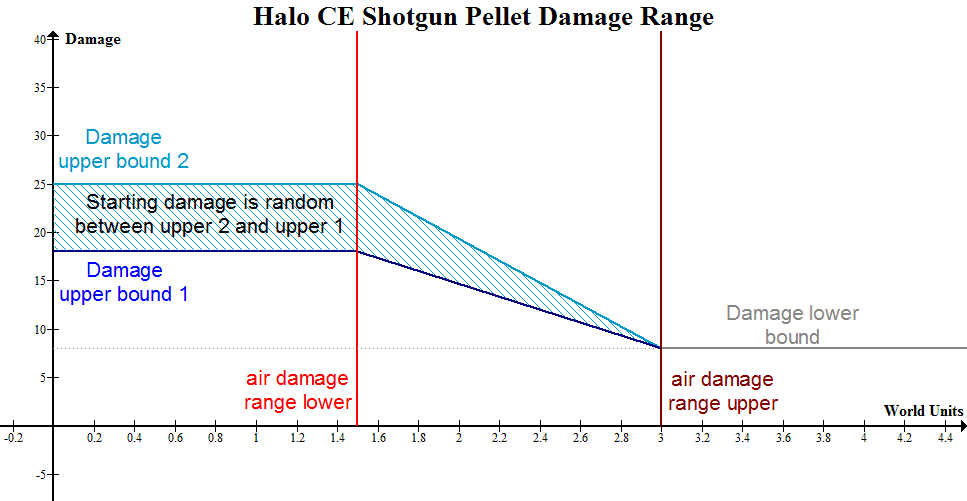

The **damage effect** tag determines the results of damage application in a wide range of use cases, including but not limited to: projectile impacts, detonations, melee attacks, falling, and vehicle collisions. They can be part of an [effect][].

A damage effect is not strictly about applying shield and health damage to [units][unit]; these tags can have an area of effect, impart acceleration on additional objects like [items][item] and [projectiles][projectile] too, and cause screen effects like colour flashes and shaking.

# Bleedthrough
When damage to shields exceeds the currently shield vitality, damage carries over to health. When this occurs, the damage multiplier of the shields still carries over to the health damage. This even occurs if the current shield vitality is 0. The result is that the initial carryover health damage may be higher than expected with weapons like the plasma rifle, which have a 2x shield multiplier. Subsequent shots will impact the body and use its material type modifiers instead.

# Impact damage formula
When applying a `damage_effect` as a projectile impact, the game may take projectile fields into account as well. When air or water damage ranges are set, the projectile's travel distance will scale damage between damage lower bound and a random selection between upper bounds. If air damage range is not set, it always uses the random high bound.

Firstly, the game randomly picks a value between the two upper bounds (will always be the same if both values are the same). Up to the projectile minimum air damage range, 100% unmodified damage is applied. However, past the minimum and up to the maximum damage ranges, damage linearly scales to the lower bound. Past this distance, the projectile disappears (but does not detonate).

In pseudocode, and assuming within max range:

```js
//falloff is 0 to 1 based on travel distance between air damage ranges
let falloff = max(0,
  (travel_distance - air_damage_min) /
  (air_damage_max - air_damage_min)
);

//given a random_value between 0 and 1, interpolate between the two high bounds
let upper_bound_delta = upper_bound_2 - upper_bound_1;
let random_upper_bound = upper_bound_1 + random_value * upper_bound_delta;

//interpolate between lower and random upper bound
let raw_damage = (
  falloff * lower_bound +
  (1.0 - falloff) * random_upper_bound
);
//finally, damage is scaled by the multiplier for the impacted material
let damage_done = material_damage_multiplier * raw_damage;
```

Or, more visually:



# Related script functions and globals
The following are related [functions][scripting#functions] that you can use in your scenario scripts and/or [debug globals][scripting#external-globals] that you can enter into the developer console for troubleshooting.


