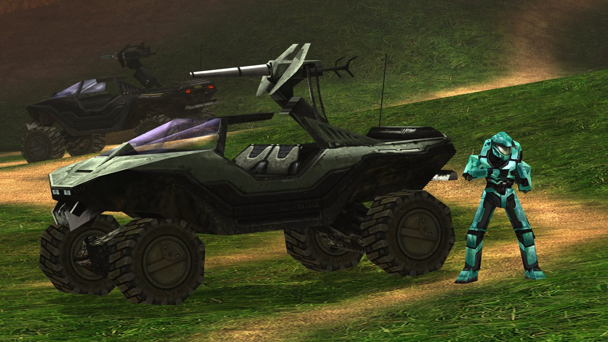

The Gearbox model tag contains the marker points and render models for [objects][object] such as [vehicles][vehicle], [scenery][], and [weapons][weapon] among others. It is not collideable nor animated on its own, and objects may reference additional [model_collision_geometry][] and [model_animations][] tags. This tag supports LODs and permutations, and includes [shader_model][] references.

Don't confuse this tag with the Xbox-only [model][], which Gearbox modified for the PC port. It is therefore used in all [derivatives][h1] of that port, like Mac, Demo, and MCC. Unlike the Xbox version, the Gearbox model uses uncompressed vertices.

# Shaders
Each [part](#tag-field-geometries-parts) of a model can reference a different [shader][], like the Warthog's windscreen using a [shader_transparent_glass][] while its body uses a [shader_model][]. While a model can _technically_ reference any kind of shader, referencing a [shader_environment][] (used for [BSPs][scenario_structure_bsp]) is **not recommended** because it [renders incorrectly][renderer#pc-regressions] in Custom Edition.

# Markers
Markers are simple named points with orientation attached to a model. Since they are parented by nodes, they can be animated. Markers can be used for a variety of purposes, such as attaching objects together with scripts (e.g. Pelicans carrying Warthogs), attaching widgets like [antenna][], or firing [projectiles][projectile] from in the case of weapons.

This tag only contains the marker data but other tags usually determine how they are used. However, certain marker names have special behaviour in-engine:

* `head`:
  * Determines where AI look at when scripted to talk to another character.
  * Base location for the friendly indicator in multiplayer.
  * Used as a ray origin when testing if AI can see their enemy.
* `primary trigger`: Where a weapon's primary trigger projectiles and effects come from. See also the [_projectiles use weapon origin_ field][weapon#tag-field-triggers-flags-projectiles-use-weapon-origin].
* `secondary trigger`: As above, for secondary triggers (second trigger slot).
* `body`
* `front`: Possibly used to used to see if you're facing a [device_control][], if present.
* `ground point`: Determines the resting point for [items][item].
* `left hand`: Used during the grenade throwing animation.
* `melee`: Where melee damage comes from here. If not present, the engine picks an unknown default location.
* `hover thrusters`:
  * When used on a vehicle with "alien scout" or "alien fighter" [vehicle physics type][vehicle#tag-field-vehicle-type], creates a dust cloud effect when the vehicle is hovering close to the ground. This can be seen at a piloted Banshee's wingtips when sitting on the ground.
  * When the vehicle physics type is "human plane", creates a similar dust effect if the marker is pointed at nearby ground. Used for the Pelican's thrusters.
* `jet thrusters`: Can also be used for vehicles with "human plane" physics to create the Pelican's thruster dust effect.

# Regions
Regions are named sections of the model which can have multiple [permutations](#permutations). Region names are used by the engine to relate parts of the render model with the [collision model][model_collision_geometry]. For example, a Flood combat form losing an arm. Some regions have special behaviour in-engine:

* `head`: Sets headshot areas for [damage_effect][].

Regions render in the order they are stored in the tag. When naming regions, consider that they will be sorted by name when compiled into the `.gbxmodel`. This can be important for [skyboxes][sky] and objects with multiple layers of alpha-blended transparent shaders which aren't [z-culled][z-buf] and need a correct sorting order to be explicitly defined, assuming the object is viewed mostly from one direction.

# Permutations
A permutation is a randomly selected variation of a [region](#regions). They are often used to give [bipeds][biped] visual variety. Some permutations have special behaviour in-engine:

* `~blur`: Switched to depending on [weapon rate of fire][weapon#tag-field-triggers-blurred-rate-of-fire] and [vehicle speed][vehicle#tag-field-blur-speed] to fake motion blur. Used for the Warthog tires and chaingun when spinning fast enough.

Permutations are not [network synchronized][netcode].

# Level of detail
<figure>
  
  <figcaption>
    
Low quality LODs shown for the Chief biped and Warthog. Note the reduced geometric detail.

  </figcaption>
</figure>

Models can contain multiple levels of detail (LODs) which are rendered for the object depending on its on-screen size. An object which is very distant and small does not need a lot of geometric detail, so it can be rendered using a simplified mesh with fewer or simpler shaders in order to keep framerates high in busy scenes.

Halo CE supports 5 LODs whose [pixel cutoffs](#tag-field-super-high-detail-cutoff) can be configured in this tag. From best to worst quality:

* super high
* high
* medium
* low
* super low

When rendering first person models, Halo always uses the lowest quality LOD instead of the highest. When creating FP arms or weapons create a separate FP model from your 3P model which only includes a single super high LOD.

LODs are created by using [a special naming convention][tool#model-compilation] when compiling models with Tool.

[z-buf]: https://en.wikipedia.org/wiki/Z-buffering
