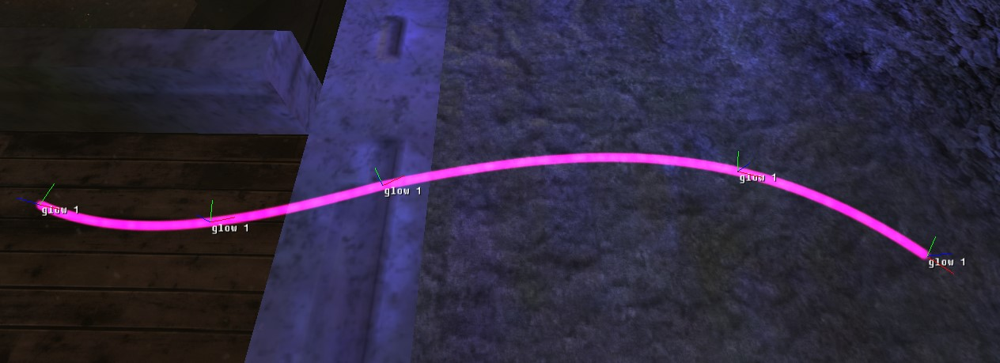

**Glow** tags are an [object widget](~object#tag-field-widgets) used to create a particle-based glowing effect, where camera-facing sprite particles travel along a path defined by markers in the [gbxmodel](~gbxmodel#markers). This tag is capable of much more complex effects than used in the energy sword, though has some known issues too.

# Glow path
Glow particles travel along a smooth 3D spine path between object markers. The [_attachment marker_](#tag-field-attachment-marker) field sets the name of the markers in the object's model which will define this path. The model should have multiple markers with the same name, e.g. `#glow 1`.


Blender doesn't allow multiple objects to have the same name, so you will need to use the [Blender toolset's](~halo-asset-blender-development-toolset) marker name override feature. You can find it under the _Object Data Properties_ pane when an object's name begins with `#`.


The exact rules around how these markers can be placed is unknown. The game tries to create a smooth path between them, but the type of interpolation and how it determines the order of markers is again unknown. Improper placement and rotation of markers can lead to different failure modes:

* Crash of the game with exception when looking at the glow: `render_cameras.c,#1086: bounds->x0<=bounds->x1`.
* Game becoming unresponsive when looking at the glow.
* Some markers being unused.
* Paths looping back on themselves in unexpected ways.
* Sharp discontinuities at some markers in the smooth path.

Some general tips to avoid these issues are:
* Avoid high curvature.
* Point the +X axis of each marker in the path toward the next marker.
* Avoid circuclar or semicircular paths. An open path seems to be the intended use.
* Avoid having more than ~6 markers.



# Particle types
Glows can contain two types of particles. _Normal particles_ follow the glow path and can be distanced from it radially, as well as animated in colour, speed, rotation, and distance. Once a normal particle reaches the end of the path they can bounce back or wrap to the beginning again. _Trailing particles_ are emitted at a given rate from a defineable segment of the path, either in random directions or vertically. They have limited lifetimes and can fade, scale down, and slow down over the lifetime.

# Limits
Halo's [gamestate](~game-state) can store up to 512 glow particles, across up to 8 glow systems and are distinct from other [particles](~particle). Be sure to budget [_number of particles_](#tag-field-number-of-particles) according to how many glows you expect will exist simultaneously.

Although [normal particles](#particle-types) stop spawning once the limit is reached, creating too many trailing particles with long lifetimes will cause a crash:
```
EXCEPTION halt in c:\mcc\main\h1\code\h1a2\sources\objects\widgets\glow.c,#547: the map limit for the number of active glow particles has been reached
```

# Known issues
The glow functionality does not appear to be fully implemented by the engine. It's only used for the energy sword, which doesn't make use of all the features of the tag. See the tag structure descriptions below.

This effect does not render on first person models.


# Structure and fields


