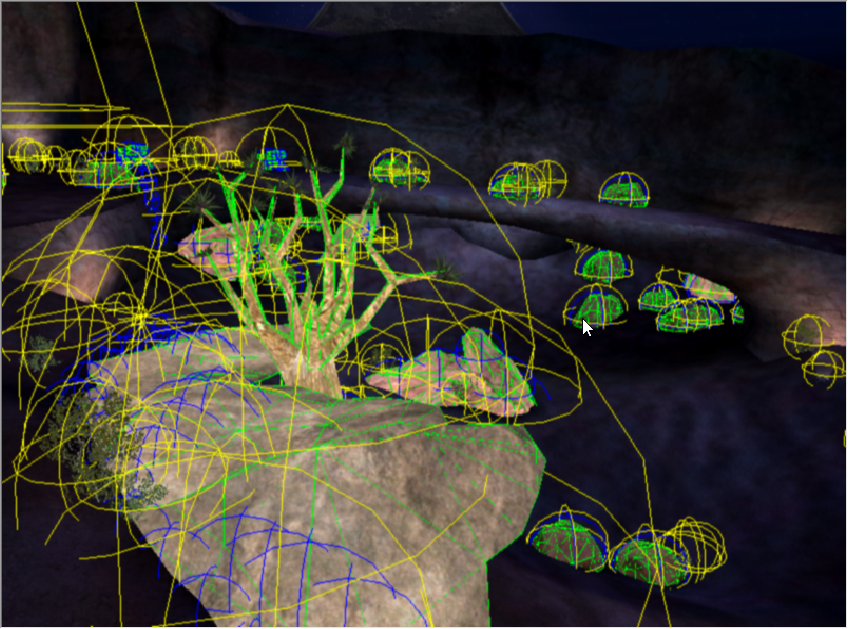
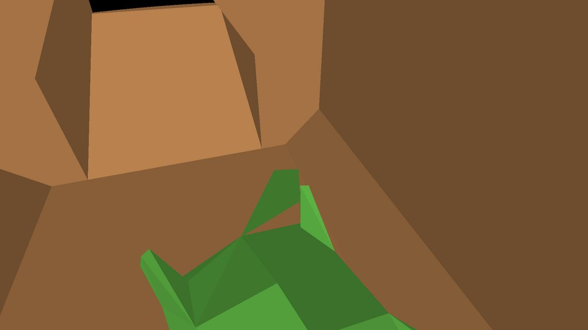

Model collision geometry tags contain collision data for an [object][]. This is in contrast to [model/gbxmodel][gbxmodel] tags, which contain the renderable data. Collision meshes tend to be less detailed than render meshes.

Beyond having a collision mesh, these tags can also contain:

* _Pathfinding spheres_ which prevent AI from trying to walk through the object
* Damage ratios for each part of the object (e.g. weak points)
* Shield and health values

Collision geometry, rather than the [model][gbxmodel], is used to cast [scenery][] shadows in [lightmaps][scenario_structure_bsp#lightmaps].

# Pathfinding spheres

<figure>
  <a href="games.svg">
    
  </a>
  <figcaption>

Pathfinding spheres (blue) for a50 shown in [Sapien][] after running `debug_objects_pathfinding_spheres 1`

  </figcaption>
</figure>

AI can figure out where to go by checking the pathfinding data on the [BSP][scenario_structure_bsp]. However, since objects like [scenery][] and [units][unit] are not part of the BSP, Bungie implemented _pathfinding spheres_: spherical markers on objects that AI actively avoid walking into.

By placing these spheres in an object's collision model, artists can tell the AI exactly where _not_. As far as we know, all object types can make use of pathfinding spheres. The object's bounding sphere does not seem to affect AI avoidance of them.

## How to add them
Pathfinding spheres are imported from the collision jms file of your object. They are marked with `#pathfinder` and their radius is the actual radius that the AI will avoid walking in relation to the mid-point.

Pathfinding spheres can also be created automatically in some cases:

* When an artist doesn't specify any pathfinding spheres, the game will assume one at the object's origin at half the size of the bounding sphere (which can be either too small or too big).
* Vehicle mass points (see [physics][]) also count as pathfinding spheres. AI will actively avoid these.
* [Bipeds][biped] by default also have a pathfinding sphere around their feet with the same width as their physics pill.

## Limits
model_collision_geometry tags can only have up to 16 pathfinding spheres<sup>(confirmation needed)</sup>, up to 8 regions, and up to 33 permutations to a region.

## Related commands

* `debug_objects_pathfinding_spheres 1`
  Can be used to view pathfinding spheres in Sapien.

# Animation
Unlike [BSPs][scenario_structure_bsp], collision geometry can have a self-intersecting mesh. However, this is only permitted between meshes parented by different nodes (e.g. limbs of a biped intersecting each other or the torso). Collision geometry cannot have weighted skinning for animations, so rigidly follows parent nodes in animations.

# Phantom BSP

<figure>
  <a href="phantom.jpg">
    
  </a>
  <figcaption>
    <p>Phantom BSP exists in the collision model of covenant crates.</p>
  </figcaption>
</figure>

Although phantom BSP is typically seen in the context of level geometry, it can also affect model collision geometry because this tag uses the same collision data structures as a [scenario_structure_bsp][scenario_structure_bsp#phantom-bsp]. In the case of models, phantom BSP is limited to the object's bounding radius.

Like with level geometry, these can be troubleshooted in [Sapien] by running the console commands:

```console
collision_debug 1
collision_debug_phantom_bsp 1
```

To fix them, use similar tricks as fixing level phantom BSP: avoiding nearly co-planar faces and slightly altering the collision model around the problematic location.
