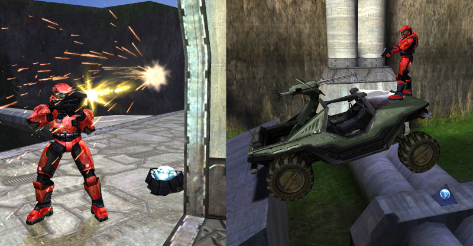

Commonly referred to as the **BSP**, this tag contains level geometry, weather data, material assignments, AI pathfinding information, [lightmaps][], and other data structures. The name "BSP" is commonly used to refer to non-[object][] level geometry in general. Aside from sounds and [bitmaps][bitmap], the BSP tends to be one of the largest tags in a map.

BSP stands for [Binary Space Partitioning][about-bsp], a technique where space within a sealed static mesh is recursively subdivided by planes into [convex][] _leaf nodes_. The resulting _BSP tree_ can be used to efficiently answer geometric queries, such as which surfaces should be collision-tested for physics objects.

# Compilation
After level geometry is exported to [JMS][] format, it can be compiled into a BSP tag using [Tool's structure verb][tool#structure-compilation].

# BSP transitions
While a [scenario][] can reference multiple BSPs, Halo can only have a single BSP loaded at a time. Transitions between BSPs can be scripted (`switch_bsp`), e.g. using trigger volumes. Objects in unloaded BSPs are not simulated.

# Shaders
The most commonly used [shader][] type for BSPs is [shader_environment][], suitable for most opaque surfaces and alpha-tested grates or billboard trees (as in _Timberland_). This shader type supports the blending between multiple detail maps, often used for ground maps with dirt and grass areas.

Transparent shaders can also be used, for example:

* [shader_transparent_chicago][] for flowing rivers or waterfalls
* [shader_transparent_chicago_extended][] for waterfalls
* [shader_transparent_water][] for lakes and oceans

The [shader_model][] type will not be rendered by the game since it is intended for use with [object models][gbxmodel].

# Clusters and cluster data
Clusters are sealed volumes of a BSP separated by portal planes. They are used both as a rendering optimization and artistically; map authors can assign [weather_particle_system][], [wind][], [sound_environment][], and [sound_looping][] tags to define local atmospheric and ambience qualities for each section of the map.

Note that it may still be desirable to reference weather for indoor clusters if there are outdoor areas visible from them, otherwise snow and rain particles will abruptly disappear. To mask weather in such clusters, use [weather polyhedra](#weather-polyhedra).

There is a maximum limit to visible weather polyhedra. The exact amount is unconfirmed but is around 8-10. Beyond this point, some polyhedra will be ignored and [Sapien][] will print warnings.

# Fog planes
Areas of a map which need a fog layer can be marked using _fog planes_. These are 2D surfaces which reference [fog tags][fog], not to be confused with atmospheric fog which is part of the [sky tag][sky].

# Weather polyhedra

<figure>
  
  <figcaption>
    
Weather polys extracted from AotCR.

  </figcaption>
</figure>

Weather polyhedra are simple convex volumes where weather particles will not render. They can be used to mask rain or snow from under overhangs, doorways, and indoor spaces when the cluster has weather.

When a JMS is compiled to BSP by [tool], connected convex faces with the material name `+weatherpoly` will generate _weather polyhedra_. Within the tag, the polyhedra are represented as a center point, bounding radius, and up to 16 planes which enclose a volume.

# Pathfinding data
The BSP contains data on traversable surfaces which aid AI in pathfinding (walking to a destination). This data is generated automatically during BSP compilation and is retained even in when the BSP is compiled into multiplayer maps.

The maximum pathfinding distance that Halo's engine permits is 3276.7 world units, an _extremely_ long distance. For reference, the distance between bases in Timberland is approximately 100 units.

# Lightmaps

_See main page: [Lightmaps][]._

# Lens flare markers

<figure>
  
  <figcaption>
    
In a10, lens flare markers were generated for fluorescent lights

  </figcaption>
</figure>

When a [shader_environment][] references a [lens_flare][], _lens flare markers_ are automatically created and stored in the BSP tag during [structure compilation][tool#structure-compilation]. These are used to give lights a "glowy" appearance. If the shader has a _lens flare spacing_ of `0`, a single lens flare is placed on the surface(how?). Otherwise, the lens flares are evenly spaced within the surface according to the spacing value (world units).

A BSP can contain up to 65535 lens flare markers, and up to 256 types of lens flares. However, there is a much lower limit to how many the game will draw at a given time, exactly how many is unknown.

# Phantom BSP

<figure>
  
  <figcaption>
    
Danger Canyon contains at least two prevalent cases of phantom BSP.

  </figcaption>
</figure>

_Phantom BSP_ is a collision artifact sometimes produced when compiling BSPs. It manifests itself as invisible surfaces which projectiles and vehicles collide with (but not players), and appears around sharp corners like those around doorways.

Phantom BSP can often be fixed by slightly moving or altering sections of the level that contain them, which causes the BSP to be divided differently. However, this may simply create new phantom BSP in another location. The chances of phantom BSP being created can be lowered by reducing complex dense geometry, ensuring co-planarity of faces, and avoiding edges sharper than 90 degrees. If Phantom BSP cannot be avoided and is a hindrance to gameplay, the tool [Ghostbuster][] can be used to fix problematic BSP tags.

Bungie was aware of this bug, and even implemented a Sapien feature to troubleshoot it (`collision_debug_phantom_bsp 1`). It is now understood to be caused when [Tool's][tool] BSP compilation process chooses a BSP dividing plane that fails to divide the remaining space meaningfully, i.e. there are no surfaces on one side of the plane, and the surfaces under the corresponding node leave parts of the dividing plane "exposed".

[about-bsp]: https://en.wikipedia.org/wiki/Binary_space_partitioning
[convex]: https://en.wikipedia.org/wiki/Convex_set
