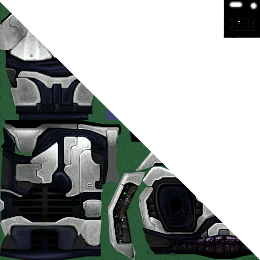
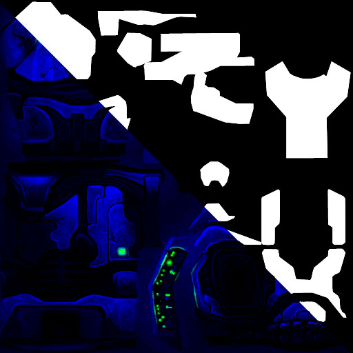

The **shader_model** tag is used for opaque materials on [object models][gbxmodel]. It supports features like map animation, detail maps, specularity, self-illumination, and colour change (e.g. for armour ranks/teams).

Singleplayer units have their colors set in their [actor_variant][] tags. In multiplayer, players' armor colors are [hard-coded][hard-coded-data#multiplayer-armor-colors].

# Base map
<figure class="">
  
  <figcaption>
    
The Chief's base map, with alpha shown in the top right.

  </figcaption>
</figure>

The _base map_ controls the diffuse colour and transparency of the shader. The **RGB** diffuse colour is multiplied with the colour change source if used, masked by the multipurpose map's colour change mask. The base map's **alpha** channel is a transparency mask.

# Multipurpose map
The _multipurpose map_ is an optional bitmap whose individual channels provide greyscale masks for colour change, reflections, self illumination, and detail maps (a technique called _channel packing_). Channel function depends on the game:

## Gearbox
<figure class="">
  
  <figcaption>
    
The Chief's multipurpose map, with alpha shown in the top right.

  </figcaption>
</figure>

When Gearbox ported Halo to PC, the channels were reordered and **don't match [Guerilla's][guerilla] description**. This is also true for all Gearbox-derived ports like [CEA][].

* **Red:** is an auxiliary mask. It can mask the [detail map](#tag-field-detail-mask) if the [detail mask](#tag-field-detail-mask) is set to _multipurpose map alpha_. Despite the option saying "alpha" in Guerilla it really means the red channel in this context.
* **Green:** Masks self-illumination, used for lights on the model. The self-illumination is added to diffuse light and _then_ multiplied with diffuse colour, rather than being added _after_. This means pure black areas of the diffuse map cannot have self-illumination.
* **Blue:** Masks [cube map specular reflections](#tag-field-reflection-cube-map). Pure blue is highest specularity, while black is none.
* **Alpha:** Masks colour change, such as for armour ranks/teams. Colour sources include the [actor_variant][actor_variant#change-colors], [multiplayer colours][hard-coded-data#multiplayer-armor-colors], and [object][object#tag-field-change-colors].

It is a common misconception that multipurpose maps need to be purple due to some stock tags having an identical red and blue channel. However, it is not necessary to have any red channel information if you do not require detail map masking or [another channel](#tag-field-detail-mask) can serve as the detail map.

## Xbox
Channel order is different on the classic Xbox version of the game. Guerilla correctly describes multipurpose maps extracted from Xbox maps:

* **Red:** Specular reflection mask (modulates reflections)
* **Green:** Self-illumination mask (adds to diffuse light)
* **Blue:** Primary change-color mask (recolors diffuse map)
* **Alpha:** Auxiliary mask
