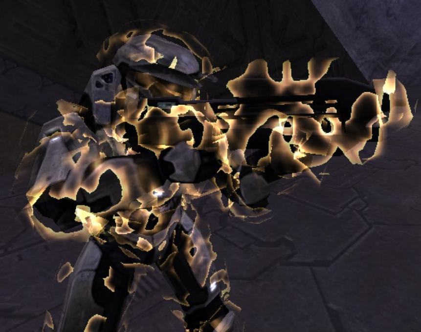

**Plasma shaders** are used for energy shield effects. They are mostly referenced as the _modifier shader_ of an [object][] like a [biped][], though the Sentinel biped instead references it via its [gbxmodel][] (presumably because it uses a custom shape).

# Known issues
The PC port of Halo includes a number of [known renderer issues][renderer#gearbox-regressions]. On some PC hardware, and always in MCC, plasma shaders render incorrectly:

<figure class="inline">
  
  <figcaption>
    
Notice how some areas of the plasma are cut off.

  </figcaption>
</figure>

After the noise maps are sampled and blended, the resuling value is supposed to be mapped to transparent at high and low values and to opaque at midtones. Something about the shader math at this step is platform-dependent and results in half the values mapping to fully transparent instead of a blend.

The workaround is to duplicate the plasma shader and apply it in two layers. The duplicate shader should be identical except for using inverted noise bitmaps.
