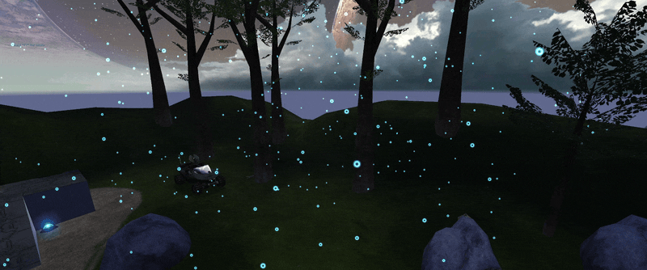

**Weather particle systems** define the appearance, density, and physical behaviour of weather like rain and snow.

# Usage
To use weather in your level, you must create weather palette entries in [Sapien](~h1-sapien) referencing a weather particle system and optionally [wind](~). You then assign these entries to [BSP clusters](~scenario_structure_bsp#clusters-and-cluster-data) within the level, allowing different areas to have different weather. Areas under overhangs and roofs which should not have weather can be masked with [weather polyhedra](~scenario_structure_bsp#weather-polyhedra), added while modeling the level.

# Simulation
Each weather particle type get simulated in a cube the size of its [_fade out end distance_](#tag-field-fade-out-end-distance), originating at the world's 0,0,0 origin point. It can be visualized by enabling `debug_point_physics`. Particles wrap around when they reach the edge, making the simulation tileable. All other weather particles in the level are simply a trick of rendering.

Individual particles are simulated according to their [point_physics](~) and the effects of [wind](~), with the exception of collision detection. The simulation resets when the weather is hidden then becomes visible again, such as when moving between clusters, and you may see the particles begin to accelerate again under the influence of wind friction or gravity. Because the particles wrap around at the edge of the cube, they will retain any velocity they had and continue to accelerate under gravity. Ensure that your _point_physics_ have sufficient [_air friction_](~point_physics#tag-field-air-friction) to slow the particles down.

# Limits
The game can simulate up to 512 weather particles. There is therefore a tradeoff between particle count and view distance: if your view distance is large, a high density is not possible because the budget of 512 particles must be spread out in an exponentially larger simulation cube. Here's a table summarizing the maximum densities for various fade out end distances:

| Fade out distance (wu) | Max achievable density (particles/cubic wu) |
|------------------------|---------------------------------------------|
| 0.5                    | 4096                                        |
| 1                      | 512                                         |
| 2                      | 64                                          |
| 4                      | 8                                           |
| 8                      | 1                                           |

Setting the [_particle count_](#tag-field-particle-types-particle-count) higher than these values will not achieve a higher density. When a weather particle system has multiple [_particle types_](#tag-field-particle-types), the first type gets first "dibs" on the particle budget. If it uses up all the budget then the following types' particles will not be present.

If you require a high density of particles, simply include multiple particles spaced out within the sprite texture and set the [_random rotation_](#tag-field-particle-types-flags-random-rotation) flag. The stock snow sprite does this and it's fairly convincing. If you need to increase the particle radius to accomodate this, don't forget to [adjust density accordingly](~point_physics#effects-of-particle-radius).

# Particle acceleration
Use the [acceleration parameters](#tag-field-particle-types-acceleration-magnitude) to give weather particles their own acceleration, independent of any external forces. Particles have an individual acceleration vector which can change direction over time, and the amount of acceleration can vary too. This is used to simulate particles that move on their own like flying insects.

# Added motion
The game adds fixed motion to weather particles each rendered frame, unrelated to wind (global or local variation) or acceleration. The direction is "random" and unique to each particle, unchanging after creation. However, the algorithm the game is using for this introduces some likely unintended bias in the direction. The first 128 particles created have a general +x -y +z direction, similar to the bias in [wind local variation](~wind#local-variation). At 256 particles, some particles now move in the -x direction too. At the limit of 512, there is a good distribution of horizontal directions but the particles still move upwards on average.

The bias is noticeable at high framerates, but not at 30 FPS. When you open the [console](~developer-console) in [Standalone](~h1-standalone-build), which pauses the simulation, this added motion is apparent.

Speculating, this motion may have been added as a cheap way to avoid noticeable patterns like the same rain drop falling in the same place, since the simulation "wraps around".

# Known issues
* When the player is within a dense [fog](~) with a nearby _opaque distance_, weather particles will stop drawing even if set for the cluster containing fog. Ensure the _opaque distance_ is sufficiently far away if weather particles in fog are desired.
* Some features of this tag are framerate-dependent. See tag fields.
* The added motion bias, described earlier.
* Changing acceleration eventually gets stuck at 0 if 0 is the minmum bound.

# Related HaloScript


# Structure and fields


