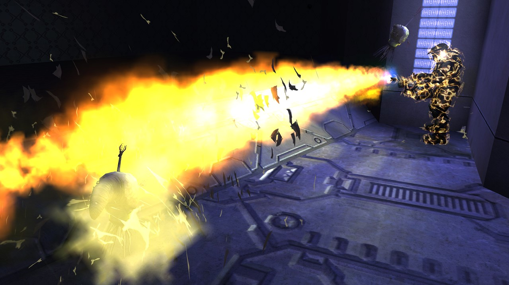

```.alert
After downloading the H1A-EK, please read `README_MODDING.txt`.
```

The **H1A Editing Kit** (**H1A-EK**) is the set of official modding tools used to create custom multiplayer and singleplayer maps targeting the PC MCC version of [Halo: Combat Evolved Anniversary][h1/h1a]. It was first released by 343 Industries during Season 7 of MCC in 2021.

This editing kit will be familiar to users of the [legacy HEK][hek] for [Halo: Custom Edition][h1#custom-edition-pc] released by Gearbox in 2003. However, this rerelease has received [significant updates and fixes](#what-39-s-new) including a complete source [tag set][tags] for the game's stock maps. Some features from [Halo 2 tools][h2ek] and later have even been backported. The tools can also receive further updates over time owing to their distribution via [Steam][].

These tools are based on the internal tools originally created by Bungie during the game's development but have been updated and sometimes trimmed down for public use.

Using the H1A-EK to author content for H1CE rather than H1A is not officially supported due to the amount of changes in the engine. **Use at your own risk.**

# What's new?
If you're coming from the legacy [HEK][hek] for Custom Edition you may be wondering what's new and great about the updated H1A tools and engine. Don't worry, we've got you covered! Features which have been brought to Custom Edition parity from earlier versions of H1A may be mentioned below.

## Exporters
* [Blitzkrieg][hek/blitzkrieg] was not rereleased. Use [Jointed Model Blender Toolset][tools/jointed-model-blender-toolset] or the new Tool commands for converting [Autodesk FBX](https://en.wikipedia.org/wiki/FBX) to JMS and JMA files.

## Content
* All the [tags][] used in retail MCC plus the ones used for the old HEK tutorial are included alongside the tools, meaning tag extraction with [Refinery][] or [invader-extract][invader#invader-extract] or prebuilt tag sets are no longer required if someone wants to mod the stock maps. Note that these tags are partially incompatible with H1CE due to their use [new flags][weapon#tag-field-triggers-flags-use-unit-adjust-projectile-ray-from-halo1], [shader_transparent_generic][], etc. The tags are intended for targeting H1A.
* The original source [HSC scripts][scripting] are included for all campaign missions.

## General
* Negative [fog][] opaque distance and depth no longer causes a crash.
* Negative power values for [skies][sky] no longer causes a radiosity crash.
* The tools are in general faster and more responsive (in part due to manual optimizations, in part due to [*play* builds][build-types#optimization-options] built with a modern optimizing compiler being used instead of *test* builds).
* The tools now use the modern [DX11](https://en.wikipedia.org/wiki/DirectX#DirectX_11) graphics API instead of the obsolete [D3D9](https://en.wikipedia.org/wiki/DirectX#DirectX_9) API. this should result in better performance and support on modern systems.
* Asserts can be disabled using the `-noassert` command line flag.
* The tags, data, and maps directories can now be set when running all tools. See [custom content paths][using-custom-content-paths] for more info. This makes it easier to work with different tag sets.

## Visual
* The renderer uses DX11 instead of DX9 now.
* First person models now use the highest [LOD][gbxmodel#level-of-detail] available instead of the lowest.
* `MAXIMUM_RENDERED_OBJECTS` increased from 256 to 512.
* Many [Gearbox visual bugs][renderer#gearbox-regressions] were fixed. For example, the restoration of [shader_transparent_generic][] and environment bump mapping.

## Tool
* Lots of new verbs have been added. See the [Tool][h1a-tool] page for more details.
* A `-verbose` flag can be added to see additional logging.
* Lightmapping code has been optimized and is even faster with the `-noassert` command line flag. Lightmapping now takes roughly a quarter of the time of legacy Tool and is even faster than [LM tool][hek/tool/lm_tool]. Additionally this code now only uses 32-bit integers instead of an unsafe mix with 16-bit ones, and 16 MiB stack reserve. This increases the crash stability of radiosity.
* Most logs (like `debug.txt`) are now saved to a `reports` subfolder (similarly to Halo 2+).
* Bitmaps compilation
  * Bitmap DXT1-3 (BC1-3) encoding now uses [DirectXTex](https://github.com/Microsoft/DirectXTex) instead of some S3TC code. This should result in higher quality similar to the original XDK.
  * The `bitmaps` verb now accepts both `.tiff` and `.tif` extensions like `bitmap` does.
* Map compilation ([`build-cache-file`][h1a-tool#build-cache-file]):
  * Script data is properly recompiled from source files when available now. A bug previously caused Tool to always fall back to sources stored in the scenario tag.
  * [Resource maps][map#resource-maps] can optionally be updated to include all the resource data for the scenario being packaged.
  * Maps can target "classic" or "remastered" mode.
  * `loc.map` [resource maps][map#resource-maps] are no longer generated or used as they are not used by H1A (aside from H1CE backwards compatibility).
  * Tool will now log errors when the user attempts to use swarm actors in firing-position based combat; _always charge at enemies_ must be set to prevent runtime crashes.
* Model and structure compilation:
  * The functionality used by [phantom_tool][hek/tool/phantom_tool] to remove [collision artifacts][scenario_structure_bsp#collision-artifacts] is now exposed as an argument for compiling [BSPs][scenario_structure_bsp] (`structure` verb) and [model_collision_geometry][] (`collision-geometry`).
  * [WRL][] files are saved alongside the [JMS][] file being compiled rather than the HEK root. The user is now told that this file was generated.
  * When compiling a structure BSP and shaders do not yet exist, the chosen types of shaders will now be generated in the level's `shaders` directory instead of the tags root.
* Usage and feedback clarity:
  * Argument parsing is now less primitive. Verbs can include optional arguments and flags and any unrecognized options are presented to the user.
  * The usage printout when Tool is run without arguments is now sorted. The names and argument descriptions of some existing verbs have been updated for clarity and consistency.
  * `zoners_model_upgrade` and `strings` verbs have been removed since they weren't useful.
  * Tool will now tell you if it couldn't find a directory rather than simply logging nothing like some verbs previously did (looking at you `model`).
  * Verbs which accept a tag path as an argument will now automatically strip `data\` and `tags\` prefixes, allowing you to use tab completion on the command line (Halo 3 backport).
  * Tool will no longer exception (but will log errors) when compiling a [gbxmodel][] where the [JMS][] has invalid node weights (two nodes where one has weight `1.0`).
* Tool supports a `-pause` flag which keeps the process running after completion until the user presses <kbd>Enter</kbd>. This was meant for community-made launchers like [Osoyoos](https://github.com/num0005/Osoyoos-Launcher).

## Sapien


* When [Sapien][h1a-sapien] crashes it will attempt to autosave the scenario to a new file.
* The [lightmap][lightmaps] painting feature was fixed. The user can perform touchups to fix light leaks or add missing lights and save changes to the lightmap.
* Game window improvements:
  * Weather and particle effects like smoke and fire will now render.
  * When the camera is outside the [BSP][scenario_structure_bsp], you will now see structure debug lines by default (`debug_structure_automatic`) (like [H2 Sapien][h2ek/h2sapien]). This helps you find the BSP if you get lost or the camera begins outside it, as with b40.
  * Interpolation code from H1A is included and `framerate_throttle` is disabled by default, allowing for smooth animation and movement.
  * The camera speed can be temporarily boosted by holding <kbd>Control</kbd>.
  * The _Game window_ resolution has been increased from 800x600 to 1280x720 (widescreen).
  * Multiple Sapien instances can now be launched at once using the `-multipleinstance` [command line][command-line] flag.
* User interface improvements:
  * Sapien now features a modern Windows file open dialog which includes locations like quick access. This is also true for the _Edit Types_ menu when finding new tags to add to a palette.
  * UI has been cleaned up a bit with unsupported elements removed (e.g. _File > New_) and others renamed.
  * Added "Clear" button to tag reference dialog.
  * The _View_ menu now includes ways to reopen the _Output window_ and _Tool window_ if they are closed.
  * Widened layouts for strings, references, block indices, etc.
  * When placing [netgame flags][scenario#tag-field-netgame-flags], the _Properties palette_ now includes explanations for how to set up each [game mode][game-modes].
* Stability improvement:
  * [Detail object][detail_object_collection] painting is possibly more stable now. More testing is needed to confirm.
  * Sapien no longer crashes if a BSP fog plane has a fog region set to NONE.
  * Recording and model view modes no longer cause a crash on closing Sapien.
  * Closing the _Output window_ now properly sets its handle to NULL.
  * The _New instance_ and _Delete_ buttons in the hierarchy view are now properly disabled when not applicable.
  * Fixed issues with invalid platoon indices.

## Guerilla
* Guerilla now features a modern Windows file open dialog which includes locations like quick access.
* H2 Guerilla backported features:
  * Tag blocks can now be collapsed.
  * UI elements have been upgraded to look more modern, with wider inputs.
  * *Expert mode*, *Show tag block sizes*, and *Copy tag name* options.
  * A zoom level feature has been added to the bitmap viewer. The alpha channel drop-down label has also been corrected.
* Some unused UI options have been removed.
* When tags are loaded for editing, tag references with an unknown [group ID][tags#group-ids] are now clamped to NONE. This fixes cases like the leftover [weapon_collection][tags#unused-tags] reference in the Bloodgulch scenario from causing downstream problems.
* _Save as_ now makes copies of read-only tags editable without having to reopen the tag.
* Hover-over tooltips for flags after unused sections are no longer off-by-one, e.g. multiplayer spawn flags for vehicles.
* Fixed a crash from changing a "go to" command list atom _modifier_ field in the [scenario][] tag.

## HaloScript and console
* The [developer console][developer-console] now supports the <kbd>Home</kbd> and <kbd>End</kbd> keys to move the cursor to the start and end of the input line.
* Console history size has been increased from 8 to 16 entries.
* Many defunct globals and functions have been removed because they are not functioning or applicable to H1A (e.g. for troubleshooting Gearbox netcode).
* The `script_doc` HSC function now includes external globals in the output file in addition to functions.
* Script docs and `help` output now show return value types for functions.
* Custom Edition-specific functions like `sv_say` and `multiplayer_draw_teammates_names` were stubbed out for compatibility with CE maps (avoids crashes).
* Unrecognized script functions and globals will now cause script data to be dropped rather than crashing the game.
* Numerous new [functions][scripting#functions] were added:
  * Numeric functions: `pin`, `abs_integer`, `abs_real`.
  * Logical functions: `bitwise_and`, `bitwise_or`, `bitwise_xor`, `bitwise_left_shift`, `bitwise_right_shift`, `bitwise_flags_toggle`, `bit_toggle`, `bit_test`.
  * Listing players: `players_on_multiplayer_team`, `local_players`.
  * Printing: `print_if`, `log_print`.
  * Distances: `objects_distance_to_object`, `objects_distance_to_flag`.
  * Physics: `physics_set_gravity`, `physics_get_gravity`, `physics_constants_reset`.
  * Debug camera: `debug_camera_save_name`, `debug_camera_load_name`, `debug_camera_save_simple_name`, `debug_camera_load_simple_name`, `debug_camera_load_text`.
  * Other: `objects_delete_by_definition`, `list_count_not_dead`, `game_is_authoritative`, `debug_structure_automatic`.
* Changes to existing functions:
  * The `print` function no longer unsafely interprets its argument as a format string.
  * `unit_kill` and `unit_kill_silent` no longer crash the game if the given unit does not exist.
  * `debug_camera_save` and `debug_camera_load` now save and load `camera_<mapname>.txt` instead of `camera.txt`. A console message is now logged when the camera file isn't found.
  * `player_effect_set_max_rumble` is no longer a hard-coded alias for `player_effect_set_max_vibrate`. Map scripts (like a10 and d40) were updated.
* H1A's versions of map scripts no longer use a repurposed `core_save_name` to signal mission segments. The function again behaves like legacy and a new `mcc_mission_segment` function was added instead.
* Globals and functions are no longer locked to specific contexts like server.

## Debug globals
* `debug_structure` shows invisible collision surfaces in semi-transparent red and includes a BSP bounding box now (Halo 2 Sapien backport).
* `debug_objects` behavior has been changed. It no longer shows bounding spheres and collision geometry by default but these can still be toggled on their own.

## Tag classes
* [unit][unit#tag-field-metagame-type] and [actor_variant][actor_variant#tag-field-metagame-type] now each include the _metagame type_ and _metagame class_ fields for MCC's scoring system.
* [shader_model][] received a [new flag][shader_model#tag-field-shader-model-flags-multipurpose-map-uses-og-xbox-channel-order] to use "OG Xbox" channel order for the multipurpose map. Guerilla's explanation of channel usage is now updated to explain both H1X and Gearbox+ channel orders.
* Some runtime tag fields have been made invisible, such as [object][], [weapon][], and [scenario_structure_bsp][] predicted resources, some other BSP fields, and [gbxmodel][] markers (processed from permutations).
* [gbxmodel][] node limit was increased from 48 to 63 to match Custom Edition 1.10.
* [scenery][] received a new [flags field][scenery#tag-field-flags] which is unused in current versions of MCC.
* [weapon][]:
  * Trigger [distribution angle][weapon#tag-field-triggers-distribution-angle] is now typed as an "angle" instead of a plain float so it can be edited in degrees (radians internally).
  * Trigger flags has a [new option][weapon#tag-field-triggers-flags-use-unit-adjust-projectile-ray-from-halo1] to force legacy (buggy) aiming behaviour seen in the Spirit dropship's turret.
* [scenario][]:
  * Unused fields have been marked deprecated and no longer appear in Guerilla and Sapien:
    * The first 3 tag references: ["don't use"][scenario#tag-field-dont-use], "won't use", "can't use".
    * The [functions block][scenario#tag-field-functions].
    * Player start location [BSP index field][scenario#tag-field-player-starting-locations-bsp-index].
    * Netgame flags [weapon group][scenario#tag-field-netgame-flags-weapon-group].
  * The previously hidden cutscene title fields [_text style_][scenario#tag-field-cutscene-titles-text-style] and [_text flags_][scenario#tag-field-cutscene-titles-text-flags] are now exposed.
  * [Script source text][scenario#tag-field-source-files-source] is now visible in Guerilla and Sapien.
  * Netgame flags _team index_ was renamed to [_usage id_][scenario#tag-field-netgame-flags-usage-id] and explanations were added in the tag for how to set this ID depending on the flag type.
  * [BSP switch trigger volumes][scenario#tag-field-bsp-switch-trigger-volumes] source and destination BSPs are now typed as proper block indices rather than integers, which causes Guerilla to display them as drop-downs. This block is also hidden unless in expert mode since it is populated during postprocessing.
  * Increased limits:
    * `MAXIMUM_SCENARIO_OBJECT_PALETTE_ENTRIES_PER_BLOCK` from 100 to 256.
    * `MAXIMUM_VEHICLE_DATUMS_PER_SCENARIO` from 80 to 256.
    * `MAXIMUM_OBJECT_NAMES_PER_SCENARIO` from 512 to 640.
    * `MAXIMUM_HS_SCRIPTS_PER_SCENARIO` from 512 to 1024.
    * `MAXIMUM_HS_GLOBALS_PER_SCENARIO` from 128 to 512.
    * `MAXIMUM_HS_REFERENCES_PER_SCENARIO` from 256 to 512.
    * `MAXIMUM_HS_SOURCE_FILES_PER_SCENARIO` from 8 to 16.
    * `MAXIMUM_HS_STRING_DATA_PER_SCENARIO` from 256kb to 800kb.
    * `MAXIMUM_HS_SOURCE_DATA_PER_FILE` from 256kb to 1MB.
    * `MAXIMUM_HS_SYNTAX_NODES_PER_SCENARIO` from 19001 to 65535.

## Maps and map loading
* The [map file size limit][map#map-file-size-limit] was increased to 2 GiB.
* [Tag space][map#tag-space] is increased from 23 MiB to 64 MiB.
* A new [flags field][map#map-header-h1a-flags] was added to the cache header for controlling H1A features.
* Tags, BSP verts (16 MiB), and game state are now stored in separate dedicated allocations rather than one giant one.
* [Protected maps][map#protected-maps] will be detected and force a crash because they are unsupported.    

## Game state
Due to changes in the game state structure, savegames from before season 7 are invalidated.

* Some AI-related [game state][game-state] was space-optimized (roughly 90 KiB savings) to make room for growing other datum arrays.
* Bump [antennas][antenna] limit from 12 to 24.

[steam]: https://store.steampowered.com/
