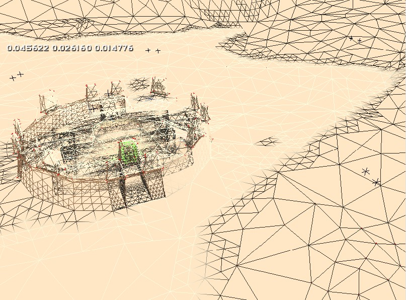

**Tool** (**tool.exe**), is a [command-line][] utility used to compile data into [tags][], and tags into [maps][map]. It is part of the [HEK][].

# Model compilation
A [JMS][] file containing model geometry can be compiled into a [gbxmodel][] using the `model` verb:

```sh
# model <source-directory>
tool.exe model "scenery\rock"
```

For the example above, Tool would expect to find a corresponding JMS file at `data\scenery\rock\models\rock.JMS`. Assuming no errors, it would be compiled into `tags\scenery\rock\rock.gbxmodel`. Geometry errors will cause Tool to create [WRL files][wrl] for troubleshooting.

Something to note is that Tool reads the filename of the JMS to decide how to generate specific tag data for the model. The format for this is as follows:

```sh
# <permutation_string> <lod_level>.JMS
base superhigh.JMS
```

[Permutations][gbxmodel#permutations] are variants for model's [regions][gbxmodel#regions]. LODs (level of detail) are different quality models rendered depending on the object's size on screen. Permutations can be named arbitrarily, though they should match a model's existing permutation names if modifying an existing asset. LOD needs to use a specific string from the list below:

* `superhigh`
* `high`
* `medium`
* `low`
* `superlow`

Use multiple JMS files to generate multiple permutations in a model.

```.alert danger
Tool only uses [markers][gbxmodel#markers] from the `superhigh` LOD when making a model tag. If you don't have a superhigh LOD (i.e. you have something explicity set as superlow/low/medium/high but not superhigh), no markers will be generated.
```

# Animation compilation
[Animation data][animation-data] files containing transforms for a skeleton can be compiled into a [model_animations][] tag using the `animations` verb:

```sh
# animations <source-directory>
tool.exe animations "characters\cyborg"
```

For the example above, Tool would expect to find corresponding animation data files at `data\characters\cyborg\animations\`. Assuming no errors, it would be compiled into `tags\characters\cyborg\cyborg.model_animations`.

See the [animation data][animation-data] page for more info on the various extensions used during animation importing and their purpose.

# String compilation
UTF-8 text files containing strings can be compiled into a [string_list][] using the `strings` verb:

```sh
# strings <source-directory>
tool.exe strings "weapons\assault rifle"
```

For the example above, Tool would expect to find text files at `data\weapons\assault rifle\`. Assuming no errors, a file named "assault rifle.txt" would be compiled into `tags\weapons\assault rifle.string_list`. Each text file that exists in the source directory will be compiled into its own individual tag with the name of the tag coming from the text filename.

**Avoid using this this command for strings because [string_list][] is an unused tag types. Use unicode strings instead.**

# Unicode String compilation
UTF-16 text files containing strings can be compiled into a [unicode_string_list][] using the `unicode-strings` verb:

```sh
# unicode-strings <source-directory>
tool.exe unicode-strings "ui\mp_map_ui"
```

For the example above, Tool would expect to find text files at `data\ui\mp_map_ui\`. Assuming no errors, a file named "prisoner.txt" would be compiled into `tags\ui\mp_map_ui\prisoner.unicode_string_list`. Each text file that exists in the source directory will be compiled into its own individual tag with the name of the tag coming from the text filename.

For more in depth instructions see the following link on [compiling text files.][unicode_string_list#creating-a-proper-text-file-for-unicode-string-lists]

# Batch bitmap compilation
[TIFF][wiki-tiff] (.tif) images can be compiled into a [bitmap][] using the `bitmaps` verb:

```sh
# bitmaps <source-directory>
tool.exe bitmaps "characters\cyborg\bitmaps"
```

For the example above, Tool would expect to find .tif files at `data\characters\cyborg\bitmaps\`. Assuming no errors, each image file will be compiled into a bitmap tag at `tags\characters\cyborg\bitmaps\`. Each image file that exists in the source directory will be compiled into its own individual tag with the name of the tag coming from the image filename.

Be aware that **all images must use the _.tif_ extension** for this command to work. If you have _.tiff_ files in the source directory, then rename their extensions to _.tif_.

Tool supports TIFF files with a [colour depth][wiki-color] of at least 8 bits per pixel, 32-bit color (8 bits per channel) being typical.

# Bitmap compilation
Compile a single TIFF image into a [bitmap][] using the `bitmap` verb:

```sh
# bitmap <source-file>
tool.exe bitmaps "characters\cyborg\bitmaps\cyborg"
```

For the example above, Tool would expect to find a _.tif or .tiff_ file at `data\characters\cyborg\bitmaps\cyborg.tif`. Assuming no errors, the image file will be compiled into a bitmap tag at `tags\characters\cyborg\bitmaps\cyborg.bitmap`. The bitmap filename will come from the image filename.

As with the `bitmaps` verb, TIFF files must have at least 8-bit colour depth and are typically 32-bit.

# Structure compilation
A [JMS][] file containing level geometry can be compiled into a [scenario_structure_bsp][] using the `structure` verb:

```sh
# structure <scenario-directory> <bsp-name>
tool.exe structure levels\a30 a30_a
```

For the example above, Tool would expect to find a corresponding JMS file at `data\levels\a30\models\a30_a.JMS`. Assuming no errors, it would be compiled into `tags\levels\a30\a30_a.scenario_structure_bsp`. Geometry errors will cause Tool to create [WRL files][wrl] for troubleshooting.

Structure compilation converts the raw polygon and materials data from the JMS into data structures which are more efficient for Halo to use during rendering, collision tests, and AI pathfinding among other tasks. Note that [lightmaps][] are **not** produced during this step, but rather with the [lightmaps verb](#lightmaps). Structure compilation will create a [scenario][] tag if one does not exist already.

Multiple JMS files can be placed in a level's `models` directory for multiple BSPs (used for large singleplayer levels). Each JMS will be compiled into a separate structure BSP and added to the scenario. Scripts and trigger volumes can then be used to switch between the BSPs.

# Structure lens flares
This command updates a BSP's [lens flare markers][scenario_structure_bsp#lens-flare-markers] using the current lens flare fields in the BSP's referenced [shader_environment][] tags. This can be used to update the markers after changes to the shader fields without having to recompile the BSP entirely with the `structure` verb.

```sh
# structure-lens-flares <bsp-path>
tool.exe structure-lens-flares "levels\a10\a10a"
```

# Structure breakable surfaces
Updates [breakable surface data][scenario_structure_bsp#tag-field-breakable-surfaces] for an existing BSP tag. Saves the tag if only if there was no error.

```sh
# structure-breakable-surfaces <bsp-path>
tool.exe structure-breakable-surfaces "levels\a10\a10a"
```

# Collision geometry compilation
A [JMS][] file containing a collision model can be compiled into a [model_collision_geometry][] using the `collision-geometry` verb:

```sh
# collision-geometry <source-directory>
tool.exe collision-geometry "scenery\rock"
```

For the example above, Tool would expect to find a corresponding JMS file at `data\scenery\rock\physics\rock.JMS`. Assuming no errors, it would be compiled into `tags\scenery\rock\rock.model_collision_geometry`. Geometry errors will cause Tool to create [WRL files][wrl] for troubleshooting.

Permutations and LODs are also supported using the same file name conventions as [render model compilation](tool#model-compilation):

```sh
# <permutation_string> <lod_level>.JMS
base superhigh.JMS
```

# Physics compilation
A [JMS][] file containing collision spheres can be compiled into a [physics][] using the `physics` verb:

```sh
# physics <source-directory>
tool.exe physics "vehicles\wraith"
```

For the example above, Tool would expect to find a corresponding JMS file at `data\vehicles\wraith\physics\wraith.JMS`. Assuming no errors, it would be compiled into `tags\wraith\wraith.physics`.

# Sounds compilation
A 16-bit [WAV][wiki-wav] file can be compiled into a [sound][] tag using the `sounds` verb:

```sh
# sounds <source-directory> platform<xbox,wav,ogg> ogg_only_value_flag<quality or bitrate>
tool.exe sounds "vehicles\ghost" ogg 1
```

The "ogg_only_value_flag" argument is only required if "platform" is OGG, and must be a [real number][wiki-real] in the range `0.0 - 1.0`. The value `0` is the lowest quality and `1` is the highest.

In order to import Xbox sounds you will need the XBADPCM codec installed on your PC. You will get tool errors when trying to convert the sound file otherwise.

Regardless of the platform you choose, the sound file you import should still be saved as a 16 bit WAV file.

# Sounds by type
A 16-bit WAV file can be compiled into a [sound][] tag using the `sounds_by_type` verb:

```sh
# sounds_by_type <source-directory> type<sound_class> <round to 64 samples:yes/no>
tool.exe sounds_by_type "vehicles\ghost" projectile_impact yes
```

Sounds imported with this command will default to Xbox platform so make sure you have the codec installed.

Replace type with a string of your choosing from the following list.

| Sound class                        | Comments
|------------------------------------|-----------------------------------
|projectile_impact                   |
|projectile_detonation               |
|weapon_fire                         |
|weapon_ready                        |
|weapon_reload                       |
|weapon_empty                        |
|weapon_charge                       |
|weapon_overheat                     |
|weapon_idle                         |
|object_impacts                      |
|particle_impacts                    |
|slow_particle_impacts               |
|unit_footsteps                      |
|unit_dialog                         |Sound file sample rate must be 22Hz. Tool will error out otherwise.
|vehicle_collision                   |
|vehicle_engine                      |
|device_door                         |
|device_force_field                  |
|device_machinery                    |
|device_nature                       |
|device_computers                    |
|music                               |
|ambient_nature                      |
|ambient_machinery                   |
|ambient_computers                   |
|first_person_damage                 |
|scripted_dialog_player              |
|scripted_effect                     |
|scripted_dialog_other               |
|scripted_dialog_force_unspatialized |
|game_event                          |

The sound class will influence the capabilities of the sound tag, and may be used when the map is compiled or at runtime. See the [sound class field][sound#tag-field-sound-class] for more info.

# Build cache file
A [scenario][] can be compiled into a [map][] using the `build-cache-file` verb. Simply provide your scenario's tag path:

```sh
# build-cache-file <scenario-name>
tool.exe build-cache-file "levels\test\tutorial\tutorial"
```

The resulting map file can be found in Halo's `maps` directory.

## Hardcoded tag patches
There are a number of gameplay-balancing tag patches ("Jason Jones edits") made at runtime on Xbox, but also at map compilation time by [Tool][]. On both platforms, these patches are only made to [singleplayer scenarios][scenario#tag-field-type].

| Tag type        | Tag path                          | Changes
|-----------------|-----------------------------------|----------------
|[weapon][]       |`weapons\pistol\pistol`            |Min error and first error angle to `0.2` degrees, second error angle to `0.4` for first trigger
|[damage_effect][]|`weapons\pistol\bullet`            |Elite energy shield damage modifier to `0.8`
|[weapon][]       |`weapons\plasma rifle\plasma rifle`|First error angle to `0.25` degrees, second error to `2.5` for first trigger

These changes are made only to the resulting tag data in the map file, but be careful when extracting tags from singleplayer maps (both PC and Xbox)! You will actually overwrite the original weapon tags and cause your custom multiplayer maps to _also_ use these values.

# Windows font
This will open a window to preview font packaged installed on your machine. From there you can select a font to package into a valid tag for Halo to make use of.

# HUD messages compilation
UTF-16 text files with an .HMT extension can be compiled into a [hud_message_text][] using the `hud-messages` verb:

```sh
# hud-messages <path> <scenario-name>
tool.exe hud-messages "levels\a10" "a10"
```

For the example above, Tool would expect to find a text file at `data\levels\a10\hud messages.hmt`. Assuming no errors, a file named "hud messages.hmt" would be compiled into `tags\levels\a10\hud messages.hud_message_text`.

It's important that you have the name of the file be "hud messages". Tool specifically looks for a file with this name when compiling hud messages. You also need an extension of .HMT for this to work. Simply renaming it from .TXT to .HMT will take care of that. The text file must also exist in the root of the scenario folder in data.

For more in depth instructions see the following link on [compiling hmt files.][hud_message_text#creating-a-proper-text-file-for-hud-messages]

# Lightmaps
<figure>
  <a href="radiosity.jpg">
    
  </a>
  <figcaption>
    <p>The radiosity process can be visualized in Sapien using <code>rasterizer_wireframe 1</code>. Notice how shadow edges and high detail shaders are subdivided more.</p>
  </figcaption>
</figure>

Both Tool and [Sapien][sapien#radiosity] can be used to generate [lightmaps][] (radiosity). Using Tool, you will need the following arguments:

1. **Scenario [tag path][tags#tag-references-and-paths]**: This is _not_ a file path! Leave off the ".scenario" extension and start the path from within the tags directory.
2. **BSP name:** The name of the BSP tag without the file extension. Although this is labeled as "bsp index" in Tool's usage, it is not intended to be a numeric value.
3. **Radiosity quality:** A value of 0 runs an inaccurate "fast radiosity", with fewer light bounces, a lower resolution lightmap, and ignoring light occlusion or blocking caused by models. A value of 1 runs a "full radiosity", which is much slower but is used for the release version of maps. For further details, see the [radiosity quality settings](#radiosity-quality-technical-details) below.
4. **Stop threshold:** Light is cast in multiple passes from each surface, getting progressively finer with each pass. Each pass also reduces the total amount of light to be cast from each surface. When the average radiosity of the scene reaches this value, the process will stop and results saved. This is the equivalent of choosing when to run `radiosity_save` in Sapien.

For example:

```sh
# lightmaps <scenario> <bsp index> <quality> <stop threshhold>
tool.exe lightmaps "levels\test\tutorial\tutorial" tutorial 1 0.01
```

After a short time, you should observe a number counting down towards 0. The radiosity process will stop once this number reaches your "stop" argument. If the number counts _up_ instead, it indicates an issue with your level geometry and you should cancel radiosity to address it (check for [WRL][] warnings).

Consider using the faster [LM_Tool][] instead for rendering final lightmaps.

## Radiosity quality technical details

| Radiosity quality | Default stop threshold| Samples per [sky light][sky#tag-field-lights] |
|-------------------|-----------------------|---------------------------|
|0 (preview)        | 10.0 / 255.0          | 4                         |
|1 (final)          | 1.0 / 255.0           | 16                        |

The radiosity process internally subdivides/tessellates the mesh into an intermediate lightmap structure which is much denser in some places. Depending on the radiosity quality chosen and [shader detail level][shader#tag-field-detail-level], different constraints will be placed on this process:

| Radiosity quality         | Shader detail level | Max adjacent light difference   | Minimum edge length | Lit patch max edge length | Unlit patch max edge length |
|---------------------------|---------------------|---------------------------------|---------------------|------------------------------------|--------------------------------------|
| 0 (preview)               | High                | 1.0                             | 0.5                 | 2.0                                | 4.0                                  |
| 0 (preview)               | Medium              | 2.0                             | 1.0                 | 4.0                                | 8.0                                  |
| 0 (preview)               | Low                 | 3.0                             | 2.0                 | 8.0                                | 16.0                                 |
| 0 (preview)               | Turd                | float_max                       | 20.0                | 40.0                               | 80.0                                 |
| 1 (final)                 | High                | 0.5                             | 0.125               | 0.5                                | 0.9                                  |
| 1 (final)                 | Medium              | 0.7                             | 0.3                 | 1.2                                | 2.4                                  |
| 1 (final)                 | Low                 | 0.8                             | 0.5                 | 2.0                                | 4.0                                  |
| 1 (final)                 | Turd                | float_max                       | 20.0                | 40.0                               | 80.0                                 |

# Process sounds
This command searches for sounds in a tag directory and sets the values in the [sound][] tag.

```sh
# process-sounds <root path> <substring> <gain+|gain-|gain=|maximum-distance|minimum-distance> <value>
tool.exe process-sounds "sound\sfx\ambience\a10" "klax" gain+ 1
```

For the example above, Tool would expect to find a set of sound tags at `tags\sound\sfx\ambience\a10\`. Any sound tags that contain the substring "klax" in the filename will have a value of 1 added to gain.

# Merge scenery
This command can merge the scenery tag blocks of the source scenario to the destination scenario. This was probably used to automate work on [child scenarios][scenario#child-scenarios] in Halo's development.

```sh
# merge-scenery <source scenario> <destination scenario>
tool.exe merge-scenery "levels\a10\a10" "levels\a30\a30"
```

For the example above, Tool would expect to find a source scenario tag file at `tags\levels\a10\a10`. The tag blocks in the scenery tag block will be copied over to the destination scenario tag file at `tags\levels\a30\a30`. This will not include scenery palette tag block or object names tag block so watch out for bad indices.

# Zoners model upgrade
Upgrades [models][model] to [gbxmodel][], likely used to port models from the Xbox edition of the game to PC by Gearbox.

```sh
tool.exe zoners_model_upgrade
```

# Import device defaults
Unknown purpose.

```sh
# import-device-defaults <defaults|profiles> <savegame path>
tool.exe import-device-defaults <defaults|profiles> <savegame path>
```

[wiki-tiff]: https://en.wikipedia.org/wiki/TIFF
[wiki-color]: https://en.wikipedia.org/wiki/Color_depth
[wiki-real]: https://en.wikipedia.org/wiki/Real_number
[wiki-wav]: https://en.wikipedia.org/wiki/WAV
