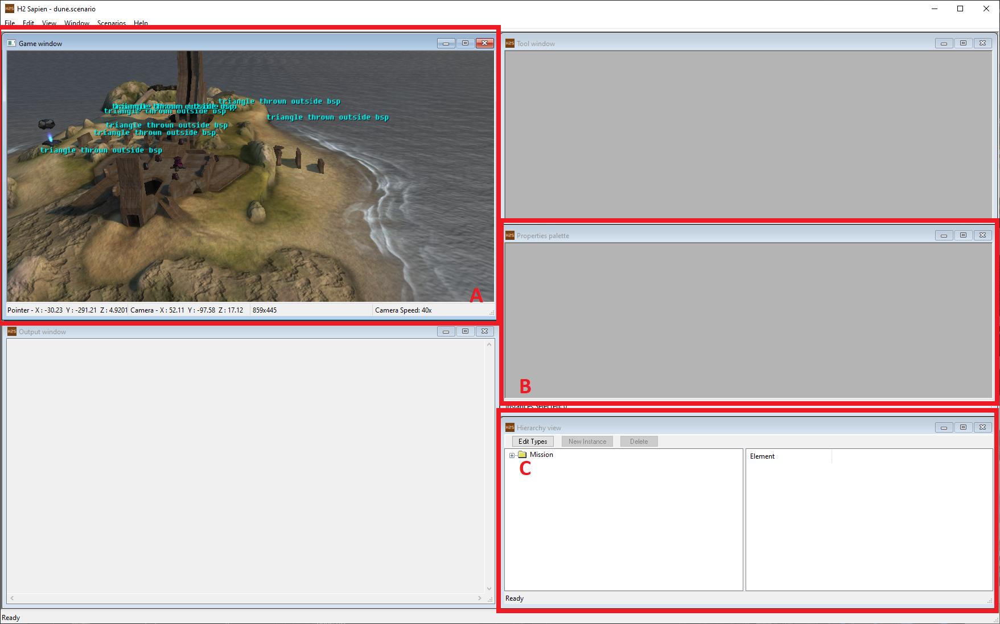
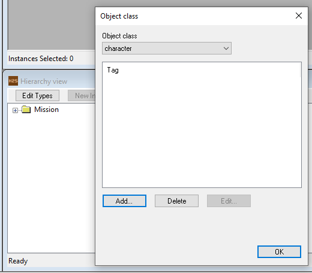
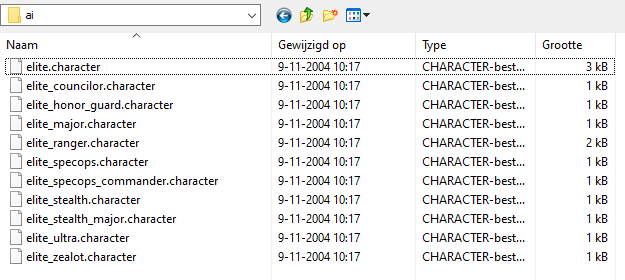
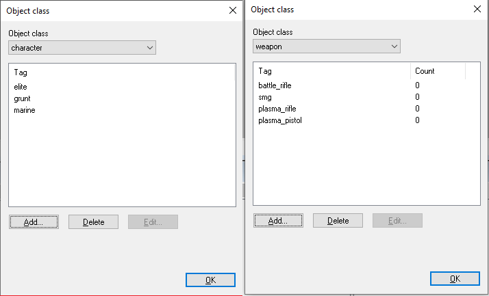

To create a custom campaign that contains AI, you will be implementing encounters, squads and bipeds. Below are some steps in creating your perfect encounter.

# Setup

We start by setting up your scenario with all the relevant information, bipeds and characters for your encounter.

Open a scenario of your choice and arrange your windows so that you have your game window, properties palette and your hierarchy window visible. 

By clicking edit types, you open a dialog that allows you to edit the tag palettes of this scenario. In the case of AI, you need to add `character` tags as they contain AI behavior.
Start by navigating your tags folders and select a few necessary characters. In our example, we'll go with a few UNSC marines, as well as Elites and Grunts.
`character` tags are located in a biped's "ai" folder.

AI typically carry weapons with them too. To be able to assign weapons to AI, select them via the palette as well.

After having selected all the necessary tags for your first combat scene, start by creating AI squads.

In the hierarchy window, expand until you see the `AI > Squads` folder. Click on `New Instance` to create a few new instances. We are going with one human squad and one covenant squad.
As soon as you create and select a squad, the properties palette will update and you can alter any details of the squads.

Note the team sections and select the correct teams for both of the squads. Be aware that any difference in teams marks opposing squads as enemies! To create common allegiances (Such as `covenant` and `prophet`) we will have to [script](~).

# Basic AI Squad

# Basic Vehicle Squad

