# Setup

We start by setting up your scenario with all the relevant information, bipeds and characters for your encounter.

Open a scenario of your choice and arrange your windows so that you have your game window, properties palette and your hierarchy window visible. 

 is the game window, showing a live version of the scenario in the H2 engine. B) is the properties palette which shows information about selected entities. C) contains all the objects and units placed in your level, grouped by type.")

By clicking *edit types* in the hierarchy window, you open a dialog that allows you to edit the tag palettes of this scenario. In the case of AI, you need to add *character* tags as they contain AI behavior.
Start by navigating your tags folders and select a few necessary characters. In our example, we'll go with a few UNSC marines, as well as Elites and Grunts.
*character* tags are located in a biped's *ai* folder.

AI typically carry weapons with them too. To be able to assign weapons to AI, select them via the palette as well.

After having selected all the necessary tags for your first combat scene, start by creating AI squads.

In the hierarchy window, expand until you see the `AI > Squads` folder. Click on `New Instance` to create a few new instances. We are going with one human squad and one covenant squad.
As soon as you create and select a squad, the properties palette will update and you can alter any details of the squads.

Note the team sections and select the correct teams for both of the squads. Be aware that any difference in teams marks opposing squads as enemies! To create common allegiances (Such as `covenant` and `prophet`) we will have to [script](~).

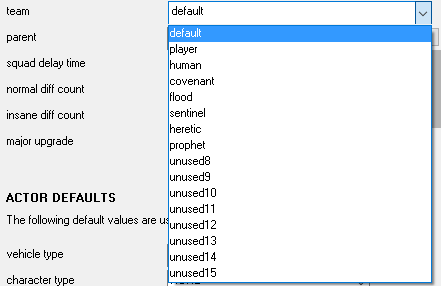

# Basic AI combat

We will set up our first marine squad. 

Semantically, we make distinctions between *squad* (A group) and *actor* (singular entity in squad)

A quick rundown of the main properties of a squad that aren't self explanatory:

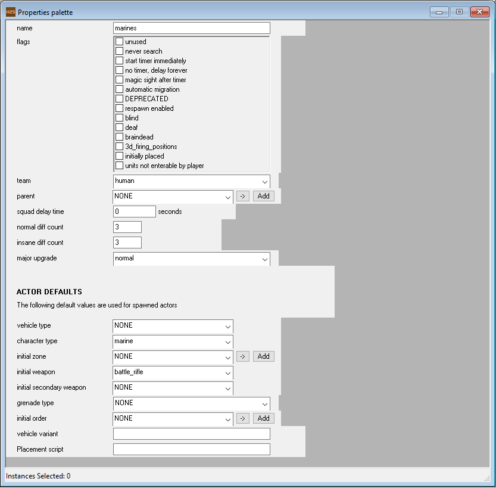

**Basics**
* name: The name as a reference to this specific squad
* team: The team this squad will be recognized as by the AI
* normal / insane diff count: The amount of AI actors to place when this squad is created.
* major upgrade: Some AI actors have a major variant (Such as elites) This indicates the chance to have an upgrade amongst the AI actors.

**Actor Details**
* vehicle type: Whether or not the AI is in a vehicle (Will be covered later)
* initial order: An Order is a set of commands for an AI squad to execute as it's placed
* placement script: A reference to a script title that is executed as soon as an AI squad is placed.

Set the count to your preferred amount, as well as the character and the weapon type.

Go to your Hierarchy View and ensure you are selecting the `Starting points`. Move to your Game View and using Right Click, place a view starting points.
As soon as you have your squad set up, select it in the Properties palette again and Right Click > Place squads. You should see your marines in view now!  

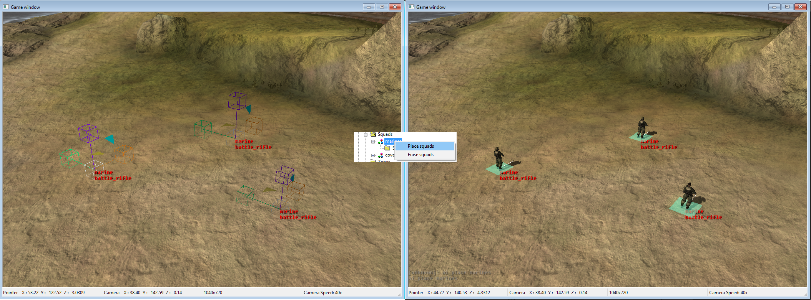

Repeat the steps for the covenant squad and place the starting positions nearby the marines. Place both squads and they will start combat.

## Alternate setup
The way we have set up a squad now, we put all the necessary properties on **squad level**. To have one squad with variations, you can place the same properties on AI actor level. We will do so for the grunts and elites to have a single squad.
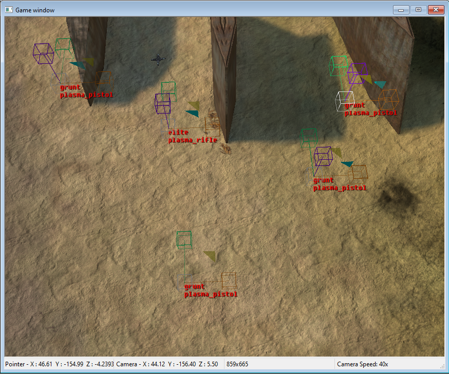

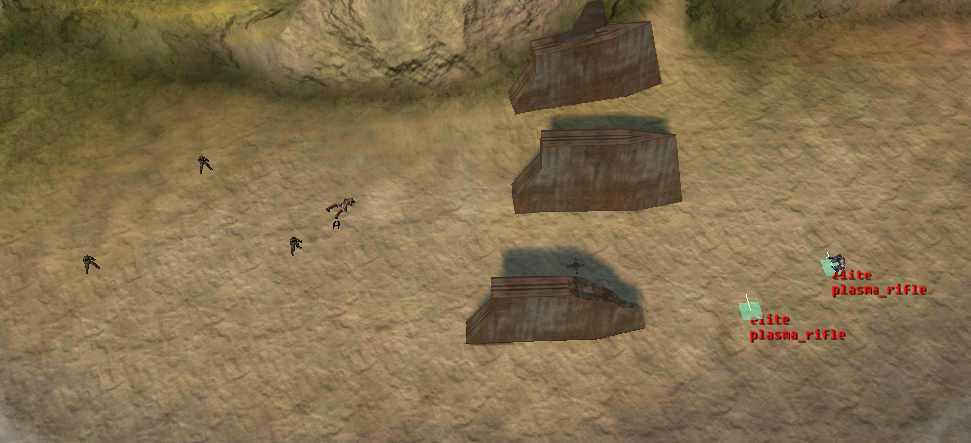

As you can tell, not a lot of dynamic behaviour is happening. To do this, we will create `zones` and `firing positions`.

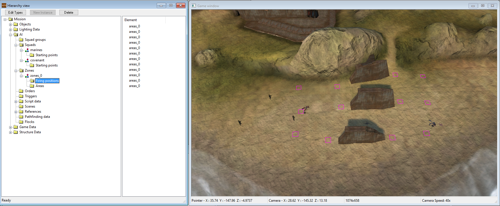

Structurally, a Zone encompasses multiple Areas, which encompasses multiple Firing Positions. Start by creating a new Zone and a new Area in the Hierarchy window. Next, select the Firing Positions folder and place a few strategically placed firing points.
In the properties of a firing position, you'll notice some possible traits that dynamically get flagged based on where on the BSP you place a firing point. The same goes for the reference frame - it's a reference to the BSP where the pathfinding will be generated. Typically, a reference frame is linked based on where you placed a firing position. If you place it on a device_machine (Such as a gondola or lightbridge) the reference frame will be a different number.

Some important steps:
* Make sure your firing positions are properly refering to the created Area_0. If they are, your firing positions should be a purple/pink color.
* **Generate pathfinding data** in Scenarios > Generate all pathfinding data.
* Update your AI squads with the Zone you just created.

Place the squads and watch the situation unfold.

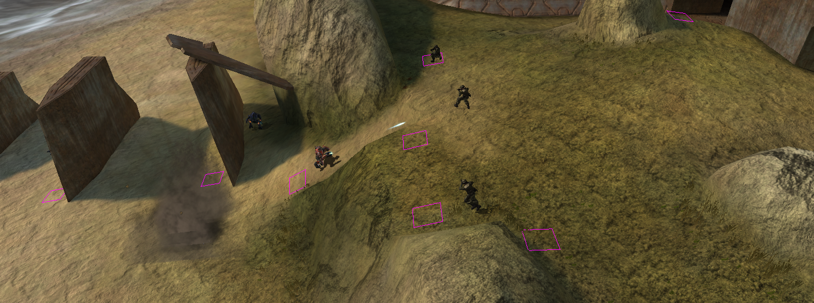

# Basic Vehicle combat

Vehicle combat works in a similar way.

Start by setting up the tags required for your vehicle combat by adding some vehicles to your palette.

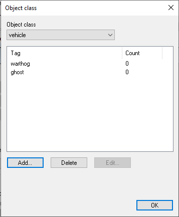

## Single-seat vehicles
Go to the AI squad that will become a vehicle squad.

Select the vehicle in the dropdown menu on the squad level.

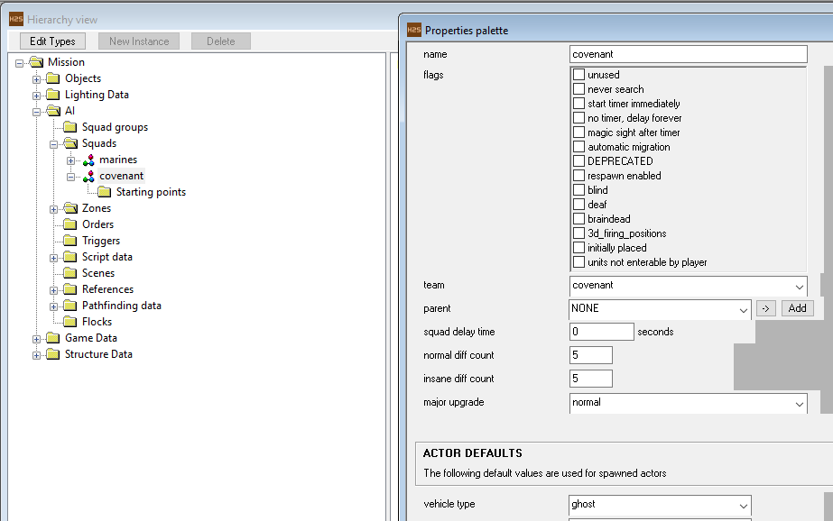

This tells the engine that each AI actor will be placed in the default seat of a vehicle - and if no specific details are set, each of the actors will get their own vehicle.

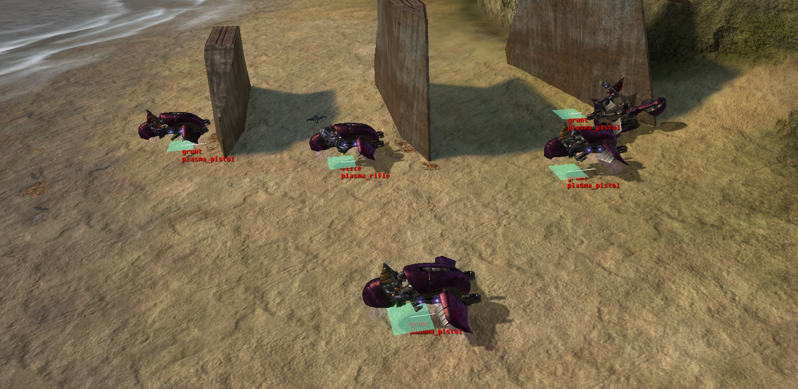

Ghosts and covenant actors are set up to control their vehicles with the set firing positions, so as soon as the actors are created and placed, Ghosts will start shooting and navigating through the paths.

## Multi-seat vehicles

For multi-seat vehicles, such as the warthog, the process remains similar.

Set, either on squad or on actor level the required vehicle (A warthog in this case) Next, in each of the actor's properties, indicate the seat of the squad vehicle. **It is not required to set the vehicle on actor level if the seat is indicated**.
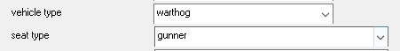

(Note that if on actor level, a vehicle is set, but no seat is indicated, it tells the engine to create separate vehicles for each of the actors)
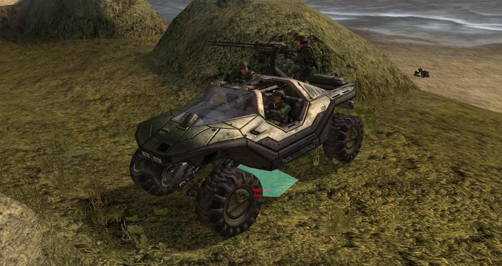

# Required scripting

*To be able use scripting in your maps, please follow [Scripting](~scripting) and other scripting guides.*

Scripting for AI happens in two forms:

* Plain scripts (usually prefixed with *ai_* or *unit_*)
* Command scripts; typical actions that apply specific to AI behavior

## Plain AI scripts

Simply placing squads in your scenario files in Sapien is not enough to have an encounter get started.

* `ai_place <squad name>` places the encounter based on the name you gave it.
* `ai_allegiance <team name 1> <team name 2>` does what the name implies.



## Command scripts

Command scripts are a chain of behavioral commands that get applied specific to an ai actor. An example can be found under [Creating a drop-off with dropships](~dropship)


