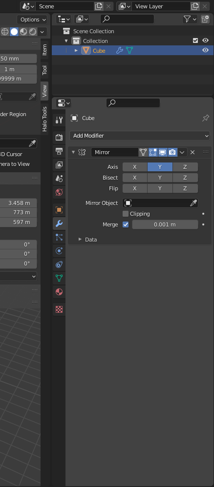

# File list
[End Result](https://drive.google.com/file/d/1M7EEcknk2rla9Ysohbj47wdEiD_0aoyi/view?usp=sharing) -> The end product of this tutorial for you to examine and compare.

[Spartan Model](https://drive.google.com/file/d/12D7pe5I3z7gNfzdETvU0P3-hdhgMWW1w/view?usp=sharing) -> Spartan model that should be to scale with the ingame player.

[Warthog Model](https://drive.google.com/file/d/1gAiTezg-Am9St-v65Cqj2ub8N6PmY9hO/view?usp=sharing) -> Warthog model that should be to scale with the ingame player.

# Introduction
Welcome to the Halo 2 level creation guide. If you have any experience with modeling levels in CE then you should feel mostly at home for better or worse. In this guide we will be showing you how to go about with creating your very own level geometry for Halo 2 in the 3D modeling software app known as Blender. This guide will include a completed version of our work as an example for you to contrast and compare but be sure to follow along.

If there are any images that you find difficult to read then try opening the image in a new tab to view it in full resolution.

# Creation of a level directory
For the sake of organizing your asset files you should consider keeping all your source files in the same level directory used to create the level (.blend, .tif, .psd, .ass, etc..).

[H2Tool.exe][h2tool] will search for subdirectories in the level directory that contain the raw asset data for compilation and eventually package the resulting assets from the raw data into a map cache file that can run in Halo 2. Any assets that you compile will end up in the tags directory plus the local path to the raw assets in the data folder. For example the file below...

`(H2EK Install Path)\data\scenarios\multi\dreamer\structure\dreamer.ASS`

has the compiled assets outputted to...

`(H2EK Install Path)\tags\scenarios\multi\dreamer`

When creating a level the scenario tag will take the name of the folder containing the sub directories and raw assets while the structure BSP tag will take the name of the ASS file itself. Compiled scenario tags can then reference other tags for use in the level.

```.alert danger
The name of the level folder containing our sub directories MUST BE UNIQUE from any other level folder in the data/tags directory as will be explained later during the packaging section.
```

Let's first start by creating our very own level directory in the data folder. We'll call this level "example" for simplicities sake but you can call it whatever you would like.

1. In the root of your H2EK install find a folder named "data". If it does not exist then create it.
2. In the "data" directory find a folder named "scenarios". If it does not exist then create it.
3. In the "scenarios" directory find a folder named "multi". If it does not exist then create it.
4. For our last step we will now create our first level in the "multi" directory.

Your final path in Windows explorer should be something like this.

`(H2EK Install Path)\data\scenarios\multi\(My Level Name)`

```.alert info
As stated before compiled assets will end up in a path that mirrors the path of the raw asset but replacing the data directory with the tags directory. A packaged map file will take the name of the scenario tag and placed in your game's map folder.
```

# Key differences from CE
While the level pipeline for Halo 2 hasn't changed much from CE, there are some important differences in workflow that we should bring up:

1. While the CE export script would only export geometry if it was the child of an object with a node prefix, the Halo 2 export script will instead export every object in the scene whether or not it is the child of an object that starts with a node prefix. If you do not wish for an object to be exported then you can hide the object with the H key.
2. Instead of .JMS, Halo 2 makes use of a new level format known as .ASS. This format has support for multiple separate objects as well as instance geometry. While H2Tool has some support for importing geometry stored in the JMS format, ASS is the new and proper format to be using.
3. H2Tool will search for a matching shader folder prefix from a list in the shader_collections file. H2Tool will only search the tags directory for matching shaders like CE if the shader_collections file does not exist.
4. Xref objects can be used to place scenery or device machine objects in 3D modeling software.
5. The way assets are placed has changed a bit from what you may be familiar with in CE.

# Creation of a simple level
The following steps and example images will demonstrate the creation of a box that will serve as the tutorial level and will be utilized for all the subsequent tutorials.
When creating or starting out a level try and keep the level centered at the origin.  This can make the creation process much easier, such as when mirroring level geometry (such as team bases and other symmetric elements of the level).

The level must be a sealed. The level must be a contiguous structure that forms a sealed volume, the following rules are referred to as the Sealed World Rules:

* There must not be any open edges, the component parts or geometry of the level must match (edges and verts). There are some exceptions to the rule which will be covered in later tutorials and examples in later sections, but basically, anything that is solid (has to have collision with the player and vehicles) cannot have any open edges.
* The normals of the faces used to create the level geometry must face towards the playable area of the level or section of the level. The normals of the faces or polygons determine not just the face that will be rendered or seen by the player but also the surface to be used for collision and physics.

## Creation of a simple box room

1. [Add a new box object](https://docs.blender.org/manual/en/latest/editors/3dview/toolbar/add_cube.html)
2. Bring up the [properties panel](https://docs.blender.org/manual/en/latest/editors/3dview/sidebar.html) with <kbd>N</kbd> and set it to the item tab.
3. Set the [location](https://docs.blender.org/manual/en/latest/scene_layout/object/properties/transforms.html) of the box to X: `197.651` Y: `-12.23` Z: `614.331`
4. The [dimensions](https://docs.blender.org/manual/en/latest/scene_layout/object/properties/transforms.html) for the Box can be manually set. The dimensions for the box that will be used are X: `1176.23`  Y: `3084.88`  Z: `1813.66`
5. Set the name of the object in the [outliner](https://docs.blender.org/manual/en/latest/editors/outliner/introduction.html) to "level" by double clicking it or pressing <kbd>F2</kbd> to edit it.
6. While having the box selected [change the context mode](https://docs.blender.org/manual/en/latest/editors/3dview/modes.html) from object mode to edit mode
	* The following steps will make the box satisfy the Sealed World Rules, in effect making it a simple Halo level in terms of geometry.
7. [Flip all the normals](https://docs.blender.org/manual/en/latest/modeling/meshes/editing/mesh/normals.html#recalculate) for the box inwards, the interior of the box will be the playable area of the level.
8. [Set context](https://docs.blender.org/manual/en/latest/editors/3dview/modes.html) back to object mode if you haven't already.

# Divide and mirror

We will now select the edges that go across the level and cut them in half. We will then delete the other half so that we can mirror our changes through a mirror modifier. This will help us have to only do our modeling work once.

1. Start by selecting the edges as shown in the following image. Make sure that you are in [edit mode](https://docs.blender.org/manual/en/latest/editors/3dview/modes.html) and have your selection type set to [edge select](https://docs.blender.org/manual/en/latest/modeling/meshes/selecting/introduction.html).
	* 
2. Once you have the edges selected, you can right click to bring up the context menu. Click the subdivide option to split the edges down the middle.
	* 
3. Now go ahead and switch from [edge select](https://docs.blender.org/manual/en/latest/modeling/meshes/selecting/introduction.html) to [face select.](https://docs.blender.org/manual/en/latest/modeling/meshes/selecting/introduction.html) Select all of the highlighted faces as shown in the following image. Press the <kbd>X</kbd> key once you are done to bring up the delete menu. Select the "Faces" option to be left with only half of the structure.
	* 
4. Lets finish this off by adding a modifier to our level object to mirror the geometry.

## Modifiers and you
Modifiers are tools that you can use to change geometry in specific ways. Examples of this are triangulating geometry, cutting intersecting geometry, or mirroring geometry like we are about to do now. Read the following link for more details.

[Modifier docs](https://docs.blender.org/manual/en/latest/modeling/modifiers/introduction.html)

1. Ensure you have the level object selected and that your context mode is set to [object mode](https://docs.blender.org/manual/en/latest/editors/3dview/modes.html). Most modifier results will only appear in object mode unless it is set to also appear in edit mode.
2.
	* 
