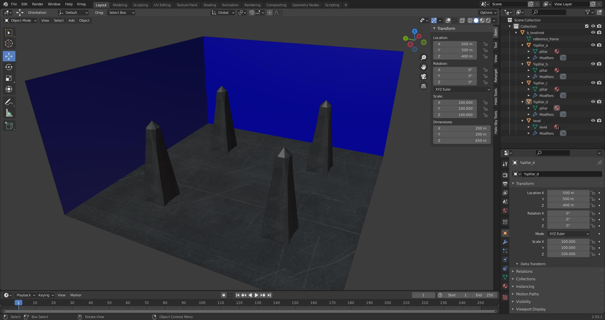
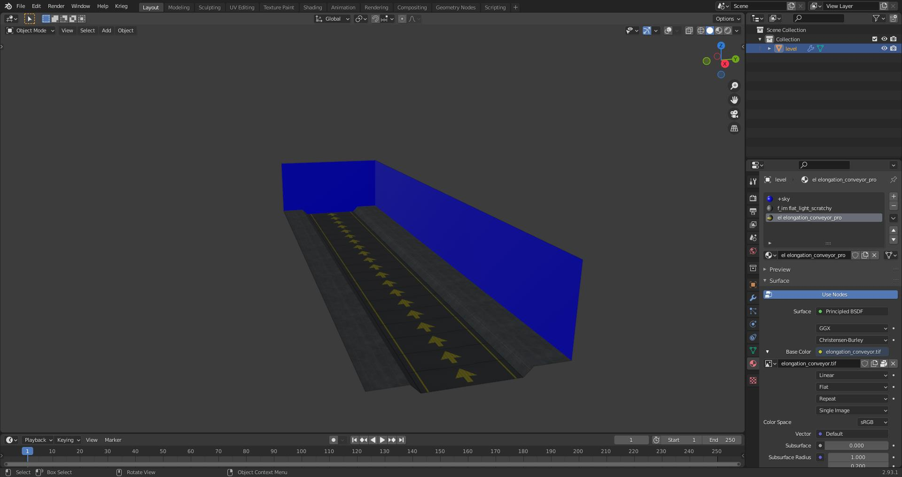
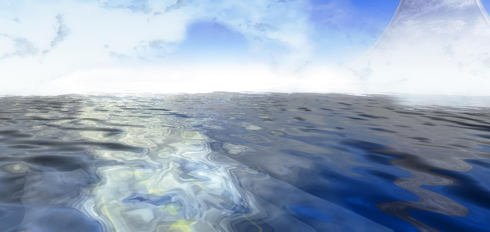

# File List
| File Link                                                                                                           | Description
|-------------------------------------------------------------------------------------------------------------------- | --------------------------------------------------------------------------------
[Multiple Skies Example Blend](https://drive.google.com/file/d/1ISomsK9tVaT16UiWe1MKo_PZ_5V5TyGI/view?usp=sharing)    | A blend file showcasing how to use multiple skies in a scene.
[Weather Portals Example Blend](https://drive.google.com/file/d/1ZPqVzBDXMTTIXA2saw9GOOgHojQ4lJjZ/view?usp=sharing)   | A blend file showcasing how to use the special +weatherpoly material in a level.
[Portals Example Blend](https://drive.google.com/file/d/1vngZYXRABGVCCvTIybMqQLDunbpUw98w/view?usp=sharing)           | A blend file showcasing how to use the special +portal material in a level.
[Instance Geometry Example Blend](https://drive.google.com/file/d/1rwpf8Dy9LMn0luFrkK3Co9bqViQBWd3F/view?usp=sharing) | A blend file showcasing how to use the instance geometry in a level.
[Conveyor Example Blend](https://drive.google.com/file/d/1jaDeKjxmX5Wl0FIqEzikJZN68FE1ZdWr/view?usp=sharing)          | A blend file showcasing how to use the conveyors in a level.

# Multiple skies
It's possible to use multiple skies in your level by adding a digit to the end of your `+sky` material. If we wanted three skies in our level for example we would have the following:

```
+sky0
+sky1
+sky2
```

It's important that the digit at the end of the material starts at zero. The digit will be used as an index by the cluster to get a sky tag reference from the scenario skies tag block. You'll also have to make sure that a cluster does not use more than one sky or you will get an error on import.

If you were not aware, a cluster is a section of a level divided by a portal. In the case of the provided blend file above there are 7 clusters. If a map has no portals then there is one cluster. Be sure to also prevent multiple skies from being able to be seen by the player at once, or else the player will see a sudden transition between them when moving between clusters. Tool will output a warning if a sky can see another sky.

Avoid using trailing digits on non-sky material names, or you'll get tool warnings about duplicate shaders, and avoid numbers in shader tag names. Use letters instead if you need to make variants.

# Weather polyhedra
Let's say you wanted to have weather on your map. You may notice that either your weather effects go through the walls of your structure or that it instantly disappears the moment you enter the hallway. This can be quite jarring, so naturally there is a solution for this that mappers can implement.

The special `+weatherpoly` material can be assigned to [convex polyhedron][wiki-polyhedron] geometry to create a volume that hides any weather effects within the volume. You can see an example of this in blend file provided above.

You can compare the videos below to see the difference.

Here's what the hallway looks like without a weatherpoly volume.


Here's what the hallway looks like with a weatherpoly volume.


The weather poly geometry is included in the BSP tag when you compile your [](~ASS). There can be a max of 8 on screen at any given time. Any weather polys that go over this limit will have no effect. Sapien will print a message in the console if you hit this limit.

# Multiple BSPs
It is common for singleplayer maps to have multiple BSPs. This helps manage game resources and avoid BSP limits for long missions. To accomplish this, place multiple `ASS` files in the same `structure` folder for the level. Each ASS will be compiled into it's own unique BSP tag for your scenario to use. Do not attempt to use multiple BSPs in an MP scenario.

# Object Symbols
Object symbols are characters that go at the start of the object name.

| Symbol | Description
|------- | -----------------------------------------------------------------------------------------------------------------------------------------------------------------------------------------------------------------------
| `#`    | Marker object prefix. Used to tell the JMS exporter that this object is to be treated as a marker.
| `%`    | Instanced object prefix. Used to tell the ASS exporter that this object is to be treated as instance geo.
| `@`    | Collision object prefix. Used to tell the JMI exporter that the object is to be written to a JMS containing only collision geometry.
| `$`    | Physics object prefix. Used to tell the JMI exporter that the object is to be written to a JMS containing only physics geometry.
| `+`    | Static pathfinding prefix. Used in conjunction with the instance object prefix to tell tool how to handle pathfinding for this object. In the case of this symbol it will generate pathfinding for the mesh.
| `-`    | Not pathfinding prefix. Used in conjunction with the instance object prefix to tell tool how to handle pathfinding for this object. In the case of this symbol ignore the object while generating the pathfinding mesh.
| `?`    | Light object per vertex. Used in conjunction with the instance object prefix to tell tool how to handle lighting for this object. In the case of this symbol it will set the geo to use per vertex for lightmap policy.
| `!`    | Light object per pixel. Used in conjunction with the instance object prefix to tell tool how to handle lighting for this object. In the case of this symbol it will set the geo to use per pixel for lightmap policy.
| `^`    | Excluded from lightprobe. Used in conjunction with the instance object prefix to tell tool how to handle lighting for this object. In the case of this symbol it will ignore this object while running lightprobes.

# Portals
Portals are plane objects that cut through geometry to divide it into sections called clusters. This is either usually to enhance performance or section off a part of a level in order to set specific environment sounds or effects in that area. Portals are defined by the special material name `+portal`. Portals can also intersect without needing to be connected unlike CE. This makes it extremely simple to just generate a set of grid portals to quickly test high poly geometry before making better portals. See the `Portals Example Blend` and [Materials Overview](~materials) for examples.


# Instance Geometry
Instance geometry is geometry that is linked and duplicated to cut down on used memory. It's also a decent way to avoid having to stich in geometry into your BSP. Think of it like scenery objects with lightmaps. The ASS exporter checks if an object is an instance by seeing if it has linked mesh data. They should also have the `%` symbol at the start of their object names. The only unique property that instance can have is uniform scale. All instances will otherwise look the same. See the `Instance Geometry Example Blend` for an example on how to use this.

Object data in Blender can be linked with the  +  hotkeys.



# Conveyors
Conveyors are surfaces that have a set speed and direction. Any physics enabled objects will move in the same direction and speed as well. Add the `>` symbol to a material name in order to mark a surface as a conveyor. Tool will then generate the needed data for the conveyor on level import. Direction and speed come from the shader assigned to the surface at import. Speed is set by how fast the texture scrolls in the shader while direction is how fast it scrolls on the X or Y axis. See the `Conveyors Example Blend` as an example.



# Water definitions
Map designers can set a fixed height to be used to create a plane that stretches infinitely into the horizon. This allows you to easily and quickly create an ocean without much hassle. The downsides for this method is you can't have any level geo that descends below your set height unless you switch to a new BSP or actually want to see water there. Some examples of levels that use this include Zanzibar and Uplift. Lets get started by adding an ocean to our example level file.

Start by opening the `scenario_structure_bsp` in Guerilla and scrolling to the bottom of the tag. You should see a tag block named `Water Definitions`. Click add to add a single element to this tag block. You should get a bunch of new options to mess with. They are as follows:

* shader - tag reference that wants a shader tag. We will be using `tags\scenarios\shaders\multi\needle\water_static.shader` as our value here.
* section - Where the post processed plane geo goes after the level is packaged. Leave this alone.
* resources - Where the post processed plane geo goes after the level is packaged. Leave this alone.
* sun spot color - The color used for the reflected sun in the water. Set it to whatever you want. We will be using a whitish yellowish color
* reflection tint - Does not seem to do anything.
* refraction tint - Does not seem to do anything.
* horizon color - The color used for the water as it fades into the horizon. Set it to whatever you want. We will be using a dark blue color.
* sun specular power - Does not seem to do anything. Set it to `32` anyways
* reflection bump scale - How clear the reflected sky is in the water. We will be using a value of `0.4`
* refraction bump scale - How clear the reflected sky is in the water. We will be using a value of `0.1`
* fresnel scale - The scale of the fresnel map in the assigned shader. We will be using a value of `0.4`
* sun dir heading - How the sun spot is stretched across the plane. We will be using a value of `0.3`
* sun dir pitch - How the sun spot is stretched across the plane. We will be using a value of `1.1`
* FOV - Set this value to `1.1`. This is important as the water won't render if it's `0`
* aspect - Set this value to `1.33333`. This is important as the water won't render if it's `0`
* height - The fixed height our water will exist in our game world. You can create a plane in Blender and take the Z height of the object divided by `100`. That should get you something that works in Guerilla.
* farz - No idea what this does. Set it to `512`
* rotate offset - Does not seem to do anything. Leave at `0`
* center - Does not seem to do anything. Leave at `0`
* extents - Does not seem to do anything. Leave at `0`
* fog near - Does not seem to do anything. Leave at `0`
* fog far - Does not seem to do anything. Leave at `0`
* dynamic height bias - Makes geometry render over the plane. Leave at `0`


Should end up with a result that looks something like this. Play around with the settings until you get something you like. Look at other levels for examples on what to use.

# XREFs

[wiki-polyhedron]: https://en.wikipedia.org/wiki/Convex_polytope


