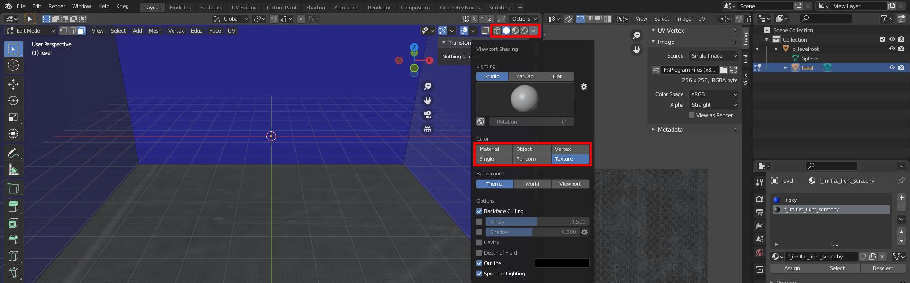
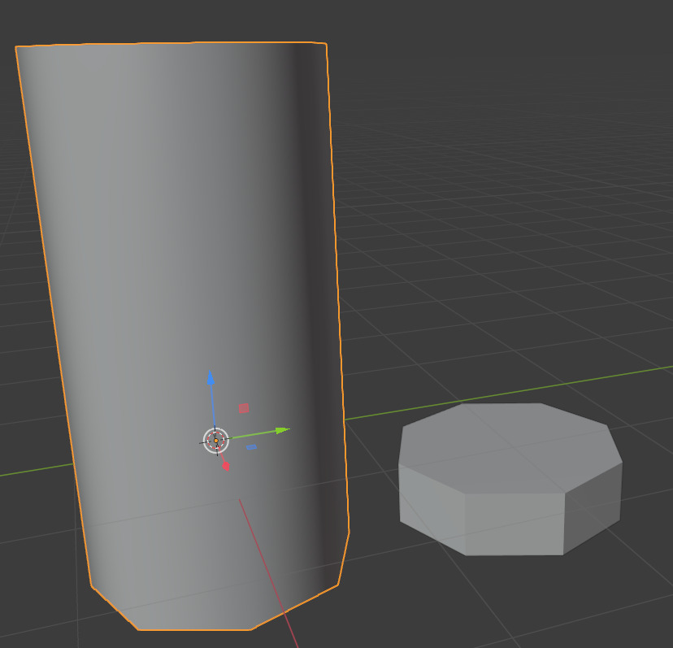
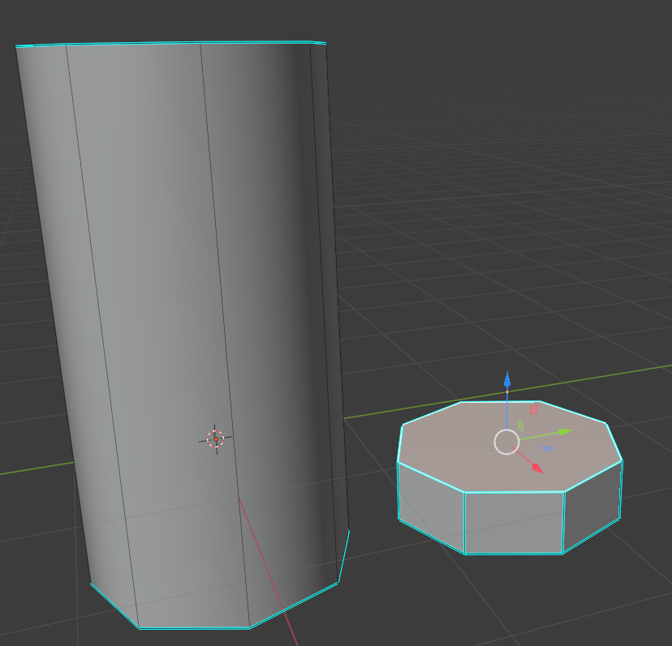
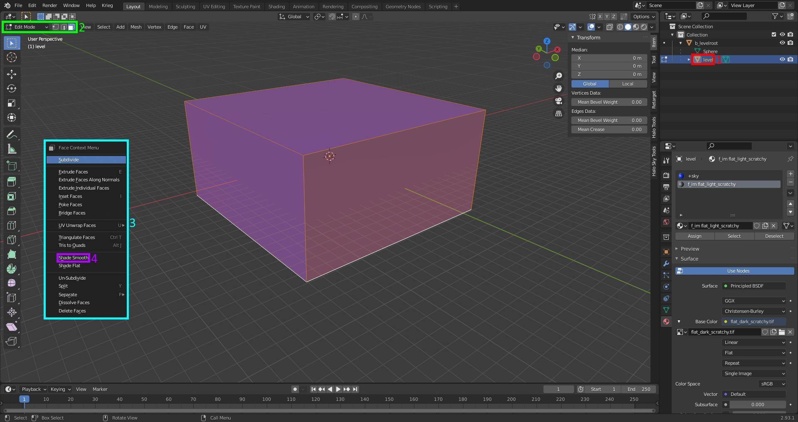
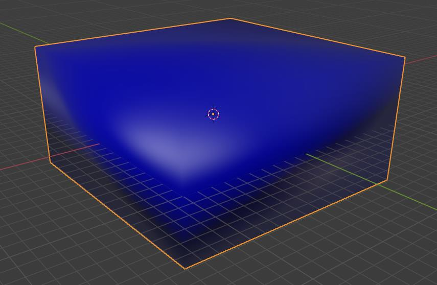
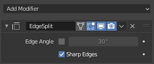
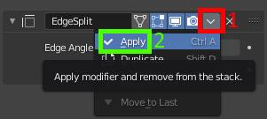

```.alert
This guide assumes you have already [prepared Blender][blender-prep].
```

# File list
| File Link                                                                                              | Description
|------------------------------------------------------------------------------------------------------- | -----------------------------------
|[End Result](https://drive.google.com/file/d/1lTTyGQvv8rnnRS8Z__vBRNXTufsNTFYB/view?usp=sharing)        | The end product of this tutorial for you to examine and compare.
|[Tutorial Textures](https://drive.google.com/file/d/1FwJpmv6ihjqCRSBvoABI2a4qpoVaPAfV/view?usp=sharing) | The textures we will be using in this guide. Make sure to have this ready.

# Introduction
Welcome to the Halo 2 level creation guide. If you have any experience with modeling levels in CE then you should feel mostly at home for better or worse. In this guide we will be showing you how to go about with creating your very own level geometry for Halo 2 in the 3D modeling software app known as Blender. This guide will include a completed version of our work as an example for you to contrast and compare but be sure to follow along.

If there are any images that you find difficult to read then try opening the image in a new tab to view it in full resolution.

# Key differences from CE
While the level pipeline for Halo 2 hasn't changed much from CE, there are some important differences in workflow that we should bring up:

1. Blitzkrieg would only export geometry if it was the child of a valid Halo node. The ASS exporter does not require a reference frame and will just export the entire scene. If a reference frame does exist in an ASS file then Tool will exclude all objects not connected to it on import.
2. Instead of .JMS, Halo 2 makes use of a new level format known as .ASS. This format has support for multiple separate objects as well as instance geometry. While H2 Tool has some support for importing geometry stored in the JMS format, ASS is the new and proper format to be using.
3. A prefix can be added to material names while naming them in your 3D software. On import tool will check `shader_collections.shader_collections` for a matching prefix and use the defined directory to find a matching shader. Searching through the entire tags folder for a matching shader will only happen if `shader_collections.shader_collections` does not exist.
4. Xref objects can be used to place scenery or device machine objects in 3D modeling software.

# Creation of a reference frame
This section is optional but you can follow it if you wish to understand reference frames. The reference frame is the origin for all objects in our scene.

```.alert danger
Be aware that once you have started to edit the level using the Halo level editing tool known as Sapien you cannot move the origin of the reference frame. Changing the origin will cause all placed objects to move.
```

If a reference frame is used then any objects that are not a child of the reference frame will be excluded from the level mesh on import in Tool. This helps the designer keep reference models for scale but not have to fumble around with deleting objects before export to prevent issues. This can also be used to remove objects from the reference frame to debug which object in particular may be causing an issue.

In order to create a reference frame we must first add an object to our scene. The object can be anything that contains location and rotation data. In our example we will use a simple box mesh to represent the origin of our level. The location of our mesh object will be the origin point for all objects in our level once ingame. Try to keep your reference frame at the origin of your Blender scene if possible.

Consider placing the frame outside of the level you are creating as to not interfere with object selection or obscure geometry but this is up to your own preference.

To create a reference frame do the following:

1. [Add a sphere object](https://www.youtube.com/watch?v=zqy0tHLiOig) to your scene.
2. Set the name of the object in the [outliner](https://youtu.be/UIRaqLLjnmY) to "b_levelroot" by double clicking it or pressing <kbd>F2</kbd> to edit it.

Make sure the reference frame is at the origin of your scene. [Move](https://youtu.be/P0RfuocRY9c) the object if needed. Your translation coordinates should read:

X: `0.0` Y: `0.0` Z: `0.0`

```.alert info
Reference frames do not have to be called b_levelroot specifically. They just have to start with a valid Halo node prefix. In the case of our b_levelroot `b` is the node prefix and `levelroot` is the object name. The underscore can either be said underscore or a space. Node prefixes should always have a space or underscore between it and the object name.
```

```.alert info
The Reference Frame does not have to have a specific Material applied to it. The application of Materials in Blender will be discussed in a later section.
```

# Creation of a simple level
The following steps and example images will demonstrate the creation of a box that will serve as the tutorial level and will be utilized for all the subsequent tutorials.
When creating or starting out a level try and keep the level centered at the origin. This can make the creation process much easier, such as when mirroring level geometry (such as team bases and other symmetric elements of the level).

The level must be a sealed. The level must be a contiguous structure that forms a sealed volume, the following rules are referred to as the Sealed World Rules:

* There must not be any open edges, the component parts or geometry of the level must match (edges and verts). There are some exceptions to the rule which will be covered in later tutorials and examples in later sections, but basically, anything that is solid (has to have collision with the player and vehicles) cannot have any open edges.
* The normals of the faces used to create the level geometry must face towards the playable area of the level or section of the level. The normals of the faces or polygons determine not just the face that will be rendered or seen by the player but also the surface to be used for collision and physics.

## creation of a simple box room

1. [Add a new box object](https://www.youtube.com/watch?v=zqy0tHLiOig)
2. Bring up the [sidebar](https://youtu.be/H64e1RDZKuA) with <kbd>N</kbd> and set it to the item tab.
3. Set the [location](https://youtu.be/P0RfuocRY9c) of the box to X: `0.0` Y: `0.0` Z: `0.0`
4. The [dimensions](https://youtu.be/P0RfuocRY9c) for the Box can be manually set. The dimensions for the box that will be used are X: `2000.0`  Y: `2000.0`  Z: `1000.0`. Make sure to apply this with <kbd>Ctrl</kbd> + <kbd>A</kbd> and select `Scale`.
5. Set the name of the object in the [outliner](https://youtu.be/UIRaqLLjnmY) to "level" by double clicking it or pressing <kbd>F2</kbd> to edit it.
6. While having the box selected [change the context mode](https://youtu.be/SVLAYHJSXYA) from object mode to edit mode
	* The following steps will make the box satisfy the Sealed World Rules and will link it to the frame, in effect making it a simple Halo level in terms of geometry.
7. [Flip all the normals](https://youtu.be/zog43sqj0Qc) for the box inwards, the interior of the box will be the playable area of the level.
	* There are two ways you can confirm the direction of the normals on the model. They are as follows:
	* Backface culling: This option will render the geometry transparent when viewed from the opposite side of the face normal.
		* 
		* [Backface culling docs](https://youtu.be/FAiMN1Zohps)
	* Normal overlay: This option will render lines coming out the center of the face to indicate the direction it is pointing. This option will only be available to you if you are in edit mode for the object you wish to examine.
		* 
		* [Normal overlay docs](https://youtu.be/zog43sqj0Qc)
8. [Set context](https://youtu.be/SVLAYHJSXYA) back to object mode if you haven't already.
9. With both your level and frame object selected, [set the parent](https://youtu.be/FsMnUhG1CWo) of the box (level) to the Reference Frame (b_levelroot) with b_levelroot being the active object.

```.alert info
The last object you selected is considered the active object and will be the parent of all other objects you have selected when doing set to parent object.
```

# Application of materials
Before discussing and demonstrating materials and the application of materials to surfaces in the level, it is HIGHLY recommended that the [Materials Overview][materials] page be reviewed. The information contained in the Material Naming Conventions and Rules as well as the names of Special Materials and special Shader Symbols of this section will be referenced in the following examples.

The following section will show you how to create new materials and use them across multiple objects properly. We will also show how to assign a texture to a material so that it displays on surfaces that have that material assigned. This is not necessary for exporting or the compiling of raw assets but it should help you visualize the look of your level in your scene. The only data exported to the .ASS is the name of our material. The name of the material will be the filename tool.exe searches for when looking for a shader tag to assign to a surface.

Images assigned to materials can be used to examine generated UVs from your scene along with just checking out the aesthetics of your assets. Special materials like +sky or +portal do not have any use for assigned images. Consider instead using the diffuse color in the material nodes to display a solid color for all surfaces that have that material assigned in your scene.

If a face does not have a material assigned then it will use a default shader on import.

## Creating new materials
If you do not have the textures referenced in this section then grab them from the [file list.][#file-list]

1. Select the box object (level) and navigate to the materials tab.
	* 
2. [Add a material](https://youtu.be/2yOOzN0zJfQ) named `+sky` to your box (level) object.
3. [Add a material](https://youtu.be/2yOOzN0zJfQ) named `f_im flat_light_scratchy` to your box (level) object.
4. This is where we will assign a texture to our `f_im flat_light_scratchy` material. Your material will need to have `Use Nodes` enabled in order to make use of textures.
5. [Assign an image texture node](https://youtu.be/2yOOzN0zJfQ) to your material.
6. Once the image texture node has been assigned you should now see file directory options instead of a diffuse color option. We will be clicking on the button labeled `Open` and browsing to our H2EK install directory.
7. Navigate to the following directory `(H2EK Install Path)\data\scenarios\bitmaps\forerunner\industrial\metals`
	* 
8. Select an image texture to use for your material. In this instance we shall use `flat_dark_scratchy.tif`.
9. Go ahead and click the button labeled `Open Image` to set the selected image to be used by your material. This completes the texture assigning process.

```.alert info
Material names in Blender must be unique. Blender does not allow for any duplicate material names in your scene. If you have an existing material named `test` and create a new material in another object named `test` then that material will be renamed to `test.001`. If you need the same material name then reselect it from the material dropdown.
```

```.alert info
Be sure to keep your material names lowercase as all tags paths in Halo should not make use of uppercase letters.
```

## Applying new materials

We will now be going over how to apply your newly created materials to faces in your scene.

1. Select the box (level) object.
	* 
2. [Change context mode](https://youtu.be/SVLAYHJSXYA) from object mode to edit mode.
3. Make sure you are in [face selection](https://youtu.be/C_X7muZP3XA) so that you can properly select the object faces.
4. [Select all](https://youtu.be/p27vyrHvpkk) faces of the cube except for the bottom area.
5. [Select the material](https://youtu.be/2yOOzN0zJfQ) named `+sky` from the materials list in the object.
6. Click the assign button.
7. Select the bottom face of the cube that we didn't assign +sky to.
8. [Assign the material](https://youtu.be/2yOOzN0zJfQ) named `f_im flat_light_scratchy`.

You've completed this section. There are two ways you can see what materials you have applied to your object surfaces. Read the section [here](https://docs.blender.org/manual/en/latest/editors/3dview/display/shading.html) to see your options.

 Materials that have `Use Nodes` enabled and either define a texture or use base color for a diffuse will be displayed in the `render preview shading`. Materials that have "Use Nodes" disabled can use `solid shading` and set the diffuse colors to differentiate materials but keep in mind that you will not be able to assign textures. You can switch between both to assign a diffuse and assign a texture when switching between solid and render. Most images in this guide will be using solid shading for rendering.

# UV mapping
Now that we have assigned our textures we can begin to modify the UV coordinates for our mesh to properly display our textures. Since we only have one material that makes use of the texture in the scene at the moment we will only need to modify the UV mapping coordinates for the surfaces that have `f_im flat_light_scratchy` assigned to them.

Follow the instructions below to begin.

## Setting up a second viewport for UV editing

1. Lets start by [setting up our second window](https://youtu.be/5wcfi3o2-ks) for UV mapping.
2. Go ahead and select [UV Editor](https://youtu.be/dR_TCHUTEw0) from the dropdown to switch the viewport to that editor type.

Now that you set up your scene there is one more detail you should be aware of. You may notice that if your viewport shading settings are set to this.



You will not have to switch to rendered viewport shading to see your textures but you have to deal with image alpha. If you do not want to see the alpha you can disable it in the newly created UV window. Move your cursor over your UV editing window and bring up the [UV properties window.](https://youtu.be/dR_TCHUTEw0)

This will let you set some specific settings for your materials. Make sure to have a surface that has the `f_im flat_light_scratchy` material selected in the viewport on the left so that we set the settings for the proper material.


Change the setting labeled `Alpha` from `Straight` to `None`.

## Editing UVs

Now that we can properly view our textures lets set up our UVs for the level. Have only the surfaces with the `f_im flat_light_scratchy` material selected and do a quick unwrap.

Using the info you learned from [the UV editing video](https://youtu.be/dR_TCHUTEw0), run a smart UV unwrap. Just use the default settings for the menu that pops up like you see in the example.

The result from that should be something that looks like this.


# Assigning sharp edges
A key difference between work in Blender VS 3DS Max is that Blender does not have a smoothing groups feature. For our modeling work in Blender we must instead make use of sharp/smooth edges with an edge split modifier to properly set up our normals. Please be aware that options like auto smooth or shade smooth/flat will not have any effect on the resulting JMS.

The purpose of assigning sharp edges is to make our polygon count seem higher than it actually is or just design more aesthetically pleasing geometry. Geometry with properly set edges can have drastic effects on a piece of geometry. See the following examples.





As you can see we have two cylinder objects that have the same number of faces but two different looks. The object on the left could be considered a pipe or a paint can while the object on the right could be a hex nut. Making proper use of sharp edges can get you the look you need for your objects.

Normals if it isn't clear is the direction the face or vertex is pointing in and directly affects the look of lighting and specular on our object. Lets go over how to set up some sharp edges for our level.

Firstly lets set shading to smooth so that we can see the effects of our sharp edges properly.



1. Make sure you have the box (level) object selected.
2. [Change context mode](https://youtu.be/SVLAYHJSXYA) from object mode to edit mode.
3. Make sure you are in [face selection](https://youtu.be/C_X7muZP3XA) and right click to bring up the face context menu.
4. Now [set shading to smooth](https://youtu.be/vsYkRKV-Gn8)

The result should look something like this.



Now that we finished our work we can begin to mark the edges as sharp.

```.alert info
Do not worry about sharp edges for materials that are considered special materials such as +portal and +sky.
```

Follow the instructions [here](https://youtu.be/Zlu5pT1WPJY) for setting up the sharp edges on your geometry.

Now to see the results of our assigned sharp edges we will need an edge split modifier for our object. The next section will go over what you need.

## Assigning a modifier

Lets go over how to assign a modifier if you don't know how real quick.


Review the information found [here.](https://youtu.be/dZtNCIHLOkg)

You will want to use these settings for your newly added edge split modifier.



We are unchecking `Edge Angle` so that we don't split edges automatically based on degrees and only split based on what we have personally marked as sharp. Due to the level being a cube with only a flat plane as the ground for our level geo this option makes very little difference at the moment. This will be more important as we start to sculpt our geo in later sections to have hills and pits.

The modifier can also be permanently applied from this area. Simply click on the dropdown area and hit apply like so.



# Saving the level
It's probably a good idea to make frequent backups as you make progress just in case. Follow the instructions below to save a scene.

1. Go to File dropdown in the top left and click it.
2. Click on the menu item labeled `Save As`.
3. A window named "Blender File Dialog" should come up. Navigate to `(H2EK Install Path)\data\scenarios\multi\(Level Name)\structure` and set the name of the blend file to the name of your level. You'll remember that we created this directory in the [creation of a level directory][file-directories] section
4. Click on the button labeled `Save As`.

You've now saved your level. The file as is will be used for future sections in this tutorial.

# End of basics

```.alert success
Once you've gotten to this point your level is ready to export. Proceed to the [next section][exporting]
```
