
This guide assumes you have already gone through [level creation - beginner](~blender-level-creation-beginner) or have the end result file ready. You will also be expected to know how to handle level directories which you can find [here.](~file-directories)


# Introduction
Now that we've created a level, we can start going through the necessary steps for export. This page will describe all the options you can find in the export menu for exporting a level to [.ASS](~ass)

If there are any images that you find difficult to read then try opening the image in a new tab to view it in full resolution.

# Finding the export menu
We will be starting by finding the export menu for our [Blender](~blender) exporter. Find the File menu in the toolbar on the top left and open it to reveal the contents. In the menu you will see a few options but the only option relevant to you is the menu option labeled `Export`. To export our geometry as a `.ASS` file you will want to select the option labeled `Halo Amalgam Scene Specification (.ass)`:

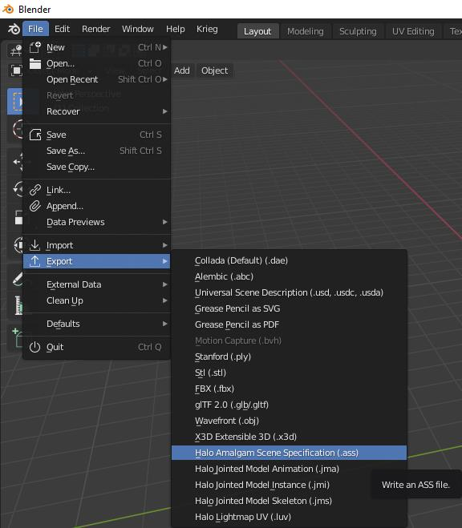

An export menu should appear on your screen after clicking `Halo Amalgam Scene Specification (.ass)`. It should look something like this:

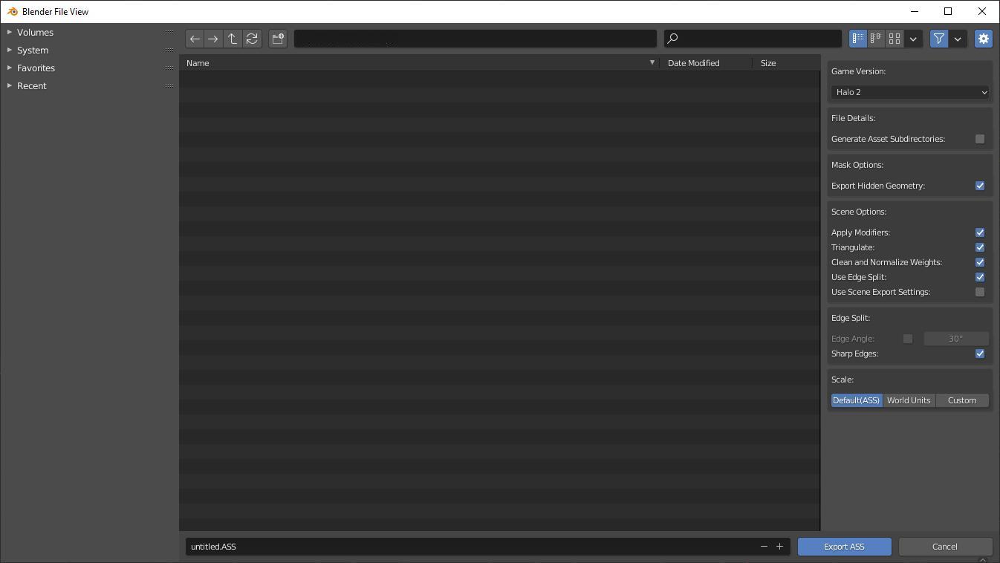

Use the default settings for a proper level export. [Generate asset subdirectories](~exporting#file-details) is optional.

# Selecting your directory
After you have set the settings you've wanted you can start browsing for a directory to dump the files into. The directory we will be choosing will be the following:

`(H2EK Install Path)\data\scenarios\multi`

If you were to export it now with the Blend filename being example, the output filename being example, and `Generate Asset Subdirectories` was enabled then the final output would be this.

`(H2EK Install Path)\data\scenarios\multi\example\structure\example.ASS`

If `Generate Asset Subdirectories` was disabled then it would be

`(H2EK Install Path)\data\scenarios\multi\example.ASS`

Just hit the button labeled `Export ASS` to finish the job.


Now that you've exported your level you can compile the results in tool and see your hard work pay off. Now get out there and make something awesome for you and your friends to criticize until none of you are comfortable showing your work to each other.


# Additional information
Lets break down each of the options found in the menu.

## Game version
The `Game Version` option lets us choose our target game:

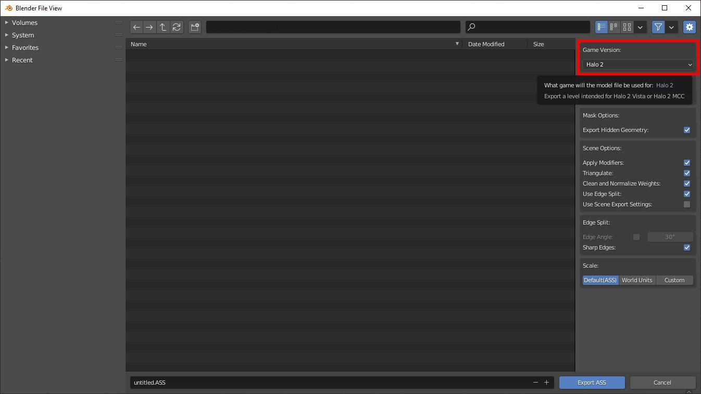

## File details
This menu will let us to set some settings for how the exporter will handle our file:

* Generate Asset Subdirectories - bool: Whether or not we generate the relevant subdirectories wherever we export our file. If this option is checked then the output will become `Output directory + blend filename(folder) + structure(folder) + filename.ASS`. If it is exported to an already existing valid folder setup then it will reuse that directory by replacing the existing ASS no matter what level it is written to. All that matters is that the parent folder name matches the blend filename and that it contains a valid subdirectory such which would be `structure` for level geometry. If this is unchecked then it will just write the ASS as is to wherever the user sets the output to without generating folders.

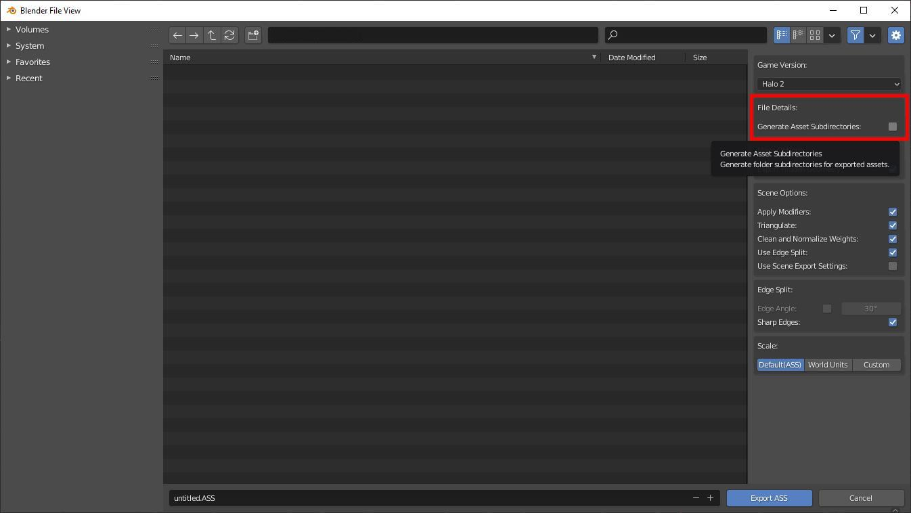

## Mask options
These options will allow you to exclude or include specific geometry from your scene in the final export. Let's go over the options now:

* Export Hidden Geometry - bool: Whether or not we export geometry that is hidden from the viewport. Nodes are exported regardless of visibility but any other geo in the scene will be excluded from the final ASS if hidden and this box is unchecked.

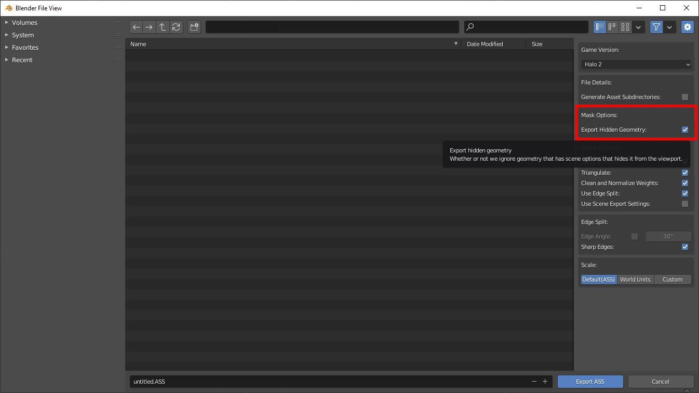

## Scene options
These options are mostly intended to help you automate how you want to handle geometry on export and the resulting files:

* Apply Modifiers - bool: Whether or not we apply modifiers that exist on the object on export. This option does not affect the geometry in the scene permanently so it's a great way to add a mirror modifier to your scene and exporting it without permanently applying it to your object.
* Triangulate - bool: Whether or not we triangulate faces in our geometry on export. This option does not affect the geometry in your scene permanently.
* Clean and Normalize Weights - bool: Whether or not we remove vertex groups that have a weight value of 0.0 and ensure that all vertex groups add up to 1.0.
* Use Edge Split - bool: Whether or not we automatically add an edge split modifier to all objects in the scene before export. While the modifier addition is permanent, the results from the modifier aren't and only affect the exported ASS.	
* Use Scene Export Settings - bool: Use the saved settings from the Blend file scene menu instead of the defaults for the export menu. Handy if you have a specific set of settings you don' want to have to apply each time you export.	

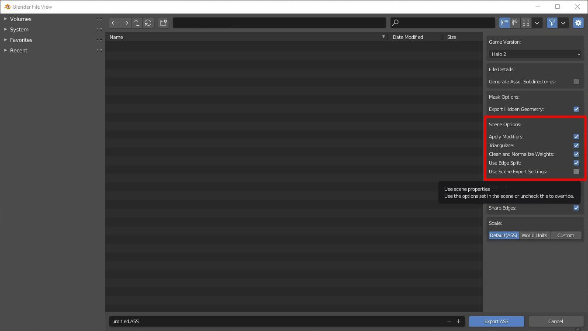

## Edge split
This box will only appear if the user has enabled `Edge Split` in `Scene Options`. See the following link to get documentation on what the settings here do:

[Edge Split Blender Docs](https://docs.blender.org/manual/en/latest/modeling/modifiers/generate/edge_split.html)

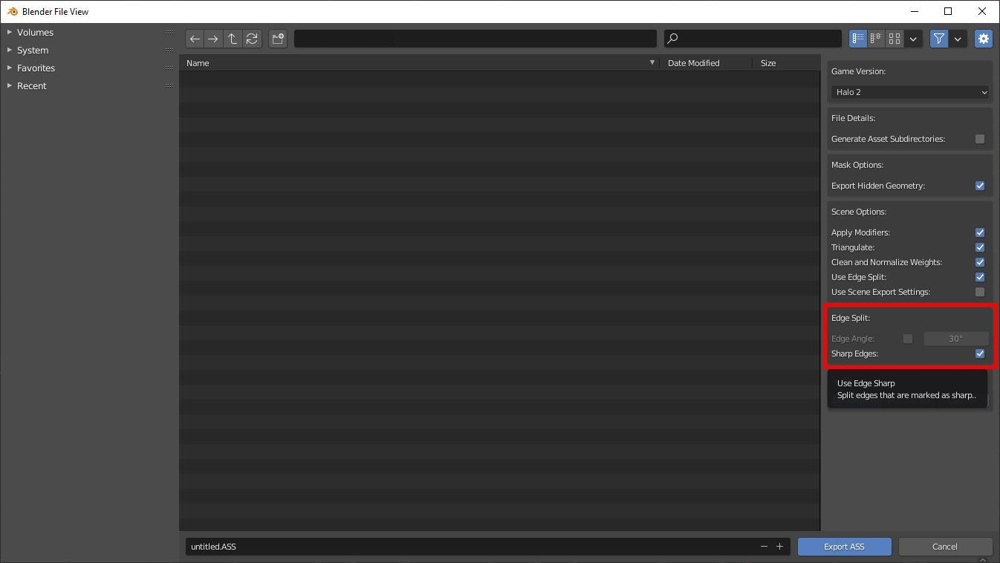

## Scale
This box will let you scale your geometry on export. This setting does not permanently affect your scene. Your choices are as follows:

* Default(ASS) - int: Export position values for object are 1:1 with Blender. No modifications here.
* World Units - int: Export position values are multiplied by 100 units.
* Custom - int: Export position values are multiplied by a custom value.

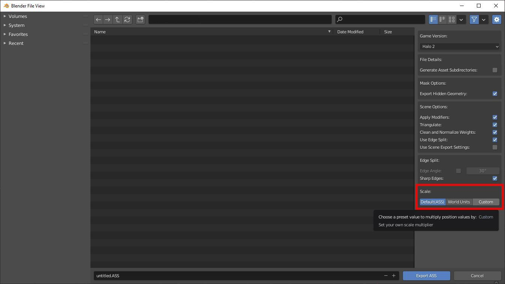

# Scene settings
Now that we've gone over the settings in the export menu lets go over the scene settings menu that can be used with the `Use Scene Export Settings` option. You can find the scene settings menu by navigating to the following section of the blender menu as seen in this image:

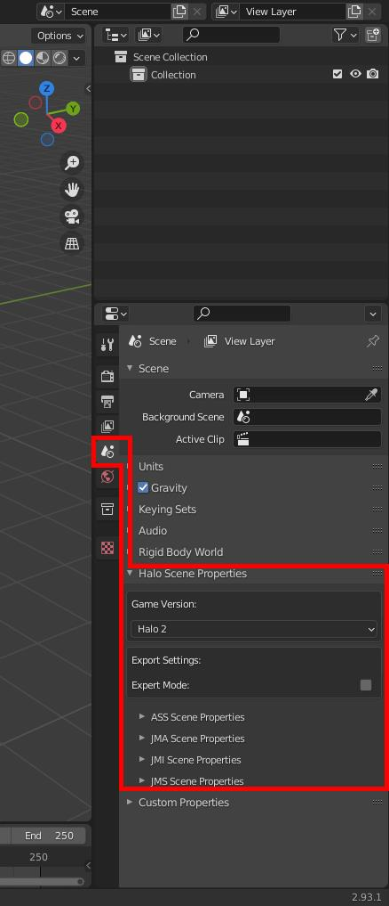

Let's go over some of the settings here real quick.

## Scene game version
While the options in the export menus and the filetype setting menus controls what game the file is written for, this option controls what settings you see throughout `Blender`. The toolset adds some features to certain places in `Blender` to aid with exporting for certain titles such as a hinge type for `Halo 2` physics constraints.:

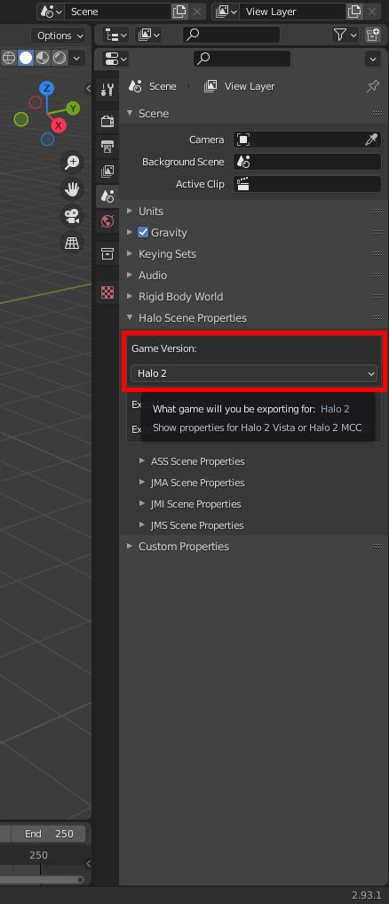

## Export settings
This box only has a single option. 

* Expert Mode - bool: The export mode bool here controls whether or not you see advanced settings in the toolset. Currently this only affects whether or not you see version control for exported files. If this is left disabled then files use latest by default.
		
We will be leaving this as is.

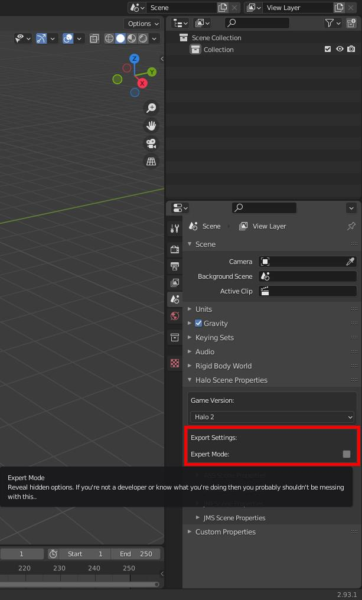

## ASS settings
Now lets open the ASS settings dropdown to reveal the settings used for the exporter. Set any settings you want used each time you export and make sure to have `Use as Default Export Settings`. You can turn this off or on in the export menu as well by checking `Use Scene Export Settings` enabled. Any settings you have in your scene settings will be saved to the blend file. See the [Additional Information section](~exporting#additional-information) for details on what each option does. They are the exact same.

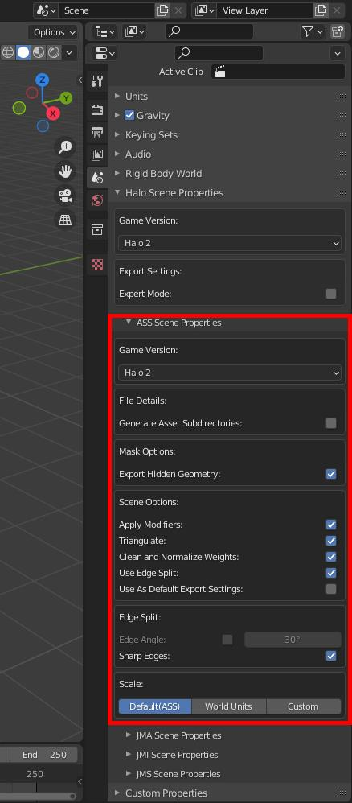
