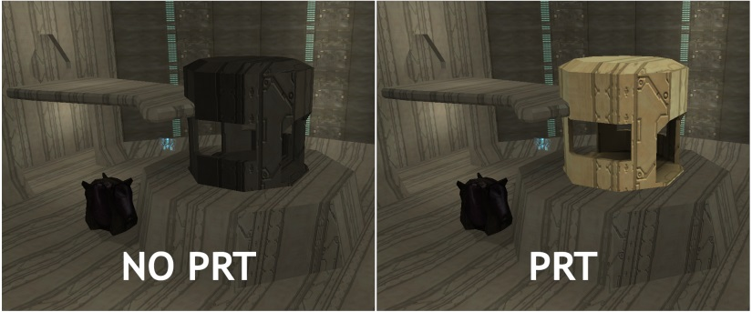

PRT or [Precomputed Radiance Transfer](https://learn.microsoft.com/en-us/windows/win32/direct3d9/precomputed-radiance-transfer) is a method of achieving more complex lighting by storing precomputed lighting information. Halo 2 originally did not support this feature due to the application required to run the PRT simulation not being included, but this has changed as of the latest Digsite update. This guide will cover some of the basic rules and information required to be able to generate a valid PRT render_model.

To begin, please download the prt_sim.exe from [this GitHub repo](https://github.com/digsite/prt_sim). This Github is where issues with the application and additional updates will be created. Place the .exe at the root of your H2EK directory next to Tool, Sapien, and Guerilla. It's as simple as that! To run PRT you simply need to set the PRT arg in the render command to true. For example:

`tool render [accurate?] [run-prt?]`  
`tool render false true`

The above command has the PRT arg set to true so the processed JMS will generate PRT data. The render_model will also need to have PRT specific shader templates referenced in order to function. Ensure the shaders you have assigned to your mesh are using either `prt_simple`, `prt_simple_lm_emissive`, `prt_scarab`, or `prt_lightmap`.

Shader templates `prt_simple` and `prt_simple_lm_emissive` should be good from here but the last 2 will require one additional step for the model. Once the model is imported and your PRT shaders are set up run the following command to generate the required data:

`lightmap-rendermodel <render-model>`  
`lightmap-rendermodel "digsite\scenarios\objects\solo\moonbase\sentinel_elevator\sentinel_elevator"`

This command will take the local tag path to a render_model tag file without extension and complete the final step required so that your PRT mesh renders in-game. If you wish to run the PRT simulation on an already existing render_model you can do this with the following command:

`prt-simulation <render-model>`  
`prt-simulation "digsite\scenarios\objects\solo\moonbase\sentinel_elevator\sentinel_elevator"`

This command also takes the local tag path to a render_model tag file without extension and will run the PRT simulation without reimporting the mesh from the JMS file.

The final step for PRT to work on a level is to place some required points in our level for reflections. Open Sapien and go down the following folder path in the hierarchy window:

`Mission -> Structure Data -> Spherical Harmonic Lighting -> Lighting Points`

We want the lighting points folder at the given path. You want to place points in the main places your PRT enabled object will be at such as the start and ends of an elevator ride. Once you've placed all your points you will need to run the lightmaps or lightprobes command on your level to generate the required data from these points. Failing to do so will mean that any PRT objects you create will be a shade of green instead of their intended color. Tool should mention building HDR cubemaps when running lightmaps.

You can use the following command to only run lightprobes on the points you set previously:

`lightprobes <scenario> <bsp-name> <quality-setting>`  
`tool lightprobes "scenarios\solo\01b_spacestation\01b_spacestation" "01_bsp_2" high`

And that's it! You should be able to fully import PRT enabled objects at this point. A couple of requirements you should be aware of below:

- The first requirement of a PRT mesh is that it is rigid boned at most. Halo 2 PRT does not have support for meshes that have skin deformation. An object like Masterchief can't have PRT but an object like the Phantom can. Think of the rules you would use to build a collision model - collision models at most can be rigid boned and that also applies to our PRT meshes.

- The second requirement is that the JMS file has no permutations as PRT models can not have multiple permutations in their model. LODs and regions are fine but not multiple permutations.

- The third requirement is that you must have no overlapping faces. This may be a problem if the model has LODs so for multiple LODs to be brought in fine you will need to export each LOD as a separate JMS file.