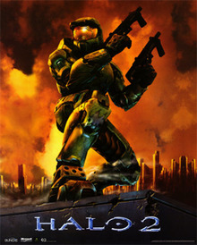

<figure>
  
  <figcaption>
    
Halo 2's box art

  </figcaption>
</figure>

**Halo 2** is the second installment of the Halo game series and sequel to [Halo 1][h1]. It was created by [Bungie][bungie] and initially released on the original Xbox in 2004 by publisher/owner [Microsoft][]. In 2007, the game was released for Windows PC and Mac via different studios.

Halo 2 uses Bungie's proprietary [Blam!][engine] engine, which also formed the basis of later games in the series.

## Xbox (Bungie, 2004)
Sometimes called **h2x**, this is the classic first release of Halo 2 for the original Xbox. Multiplayer had support for LAN multiplayer along with online play through Xbox Live. 

## Halo 2 Vista (Hired Gun, 2007)
This edition is the classic port of Halo 2 to Windows PC by developer [Hired Gun][hired-gun] and publisher [Microsoft Game Studios][microsoft]. While there still are some port discrepancies when compared to the original source, it is no where near as bad as the Halo 1 PC port. Official servers for the game went down in July 2015. Any users looking to play Halo 2 Vista online will require community solutions.

The game received a total of three patches for the base game, the dedicated server binary, and the editing kit. The latest version is `1.00.00.11122`

### Modding
There are several tools and mods for the base game or external programs that users can grab to enhance their experience. Examples include:

* [Halo 2 Vista Editing Kit][h2v-ek] - The official editing suite released for Halo 2 Vista. Largely worked on by [Pi Studios][pi-studios]. This editing kit only officially supports creating a few tag types. 
* [Assembly][assembly] - A cache editing tool for various titles in the Halo series. Users can use this tool to make permanent edits to cache files and poke changes in real time. While not traditional workflow for map creation, it is a powerful tool that can be used to create interesting experiences. 
* [Jointed Model Blender Toolset][jointed-model-blender-toolset] - A collection of tools for Blender that can be used to export the intermediate files used by the Halo 2 Editing Kit. 
* [Project Cartographer][cartographer] - A popular mod for the Halo 2 Vista title which restores online play and adds additional features.

Like Halo 1, Halo 2's [tags][] play a large role in modding.

## MCC (PC and Xbox One, 343 Industries, 2014-2021)
Halo: The Master Chief collection (MCC) is actively maintained by [343 Industries][343i] for both PC and Xbox One. It brings the Halo series under a single [Game as a Service][gaas], including unified matchmaking and progression experiences. The PC port uses [Unreal Engine][unreal] as a menu and input layer over the respective engines of each included Halo game.

In 2014, Halo 2 Anniversary was released for Xbox One as part of the Halo: The Master Chief Collection. Often called **H2A** by the community. It was developed by [343 Industries][343i] and [Saber Interactive][saber] as a remaster of the original Halo 2, and is derived from the Halo 2 Vista port. This edition contains the secondary _Saber3D_ engine for its remastered graphics mode.

### Modding
There are several tools and mods for the base game or external programs that users can grab to enhance their experience. Examples include:

* [Halo 2 Anniversary Editing Kit][h2a-ek] - The official editing suite released for Halo 2 Anniversary.
* [Assembly][assembly] - A cache editing tool for various titles in the Halo series. Users can use this tool to make permanent edits to cache files and poke changes in real time. While not traditional workflow for map creation, it is a powerful tool that can be used to create interesting experiences. 
* [Jointed Model Blender Toolset][jointed-model-blender-toolset] - A collection of tools for Blender that can be used to export the intermediate files used by the Halo 2 Editing Kit. 

Like Halo 1, Halo 2's [tags][] play a large role in modding.

[bungie]: https://en.wikipedia.org/wiki/Bungie
[microsoft]: https://en.wikipedia.org/wiki/Xbox_Game_Studios
[hired-gun]: https://en.wikipedia.org/wiki/Xbox_Game_Studios
[pi-studios]: https://en.wikipedia.org/wiki/Pi_Studios
[saber]: https://en.wikipedia.org/wiki/Saber_Interactive
[343i]: https://en.wikipedia.org/wiki/343_Industries
[gaas]: https://en.wikipedia.org/wiki/Games_as_a_service
[unreal]: https://en.wikipedia.org/wiki/Unreal_Engine
[cartographer]: https://www.cartographer.online/
