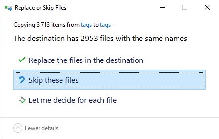
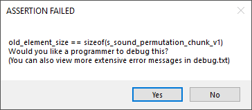

```.alert
After downloading the Halo 2 Editing Kit, please read `README_MODDING.txt`. You **must** extract **both** `tags.zip` and `data.zip` to the root of the mod tools folder.
```

The **Halo 2 Editing Kit (H2-EK)** or **Halo 2 Mod Tools** is the official suite of modding tools for Halo 2 MCC released by 343i. The tools are based off the internal tools used by Bungie and then 343i with some usability and stability improvements ported over from the [H2V-EK][], although not nearly as cut down as that suite.

Unlike the [H1A-EK][] you ***do*** need to own [Halo 2: Anniversary on Steam][steam_purchase] to gain access to the toolkit.

# Getting started


0. Ensure you own [Halo 2: Anniversary on Steam][steam_purchase], tools are only accessible if you own the Steam version.
1. [Download the tools using Steam](steam://run/1613450), you might need to [install Steam](https://store.steampowered.com/about/) first.
2. Follow the on screen prompts to download the tools.
3. Once the tools are done downloading you can find them in your library in the tools section.
4. Right click the entry for the mod tools, select the "Manage" context menu entry then select the "Browse local files" subentry.
5. Read `README_MODDING.txt` and follow any further instructions contained within it. Extract **both** `tags.zip` and `data.zip` to the root of the mod tools folder.
6. (Optional) Check out the [guides hub][guides] to learn more about modding or install a launcher like [Osoyoos][] if you don't like using the command line.

# What's changed?
## General changes from stock H2V tools
* Tools are not stripped down, you can create models, animations, different types of textures, sounds and more!
* FBX support was ported over from [H1A tools][h1a-ek], the legacy export tools were not included.
* The tools now use the modern [DX11](https://en.wikipedia.org/wiki/DirectX#DirectX_11) graphics API instead of the obsolete [D3D9](https://en.wikipedia.org/wiki/DirectX#DirectX_9) API. this should result in better performance and support on modern systems.
* A standalone build similar in function to H1A standalone.
* All tools are still 32-bit but they are now large address aware (LAA). This allows them to use up to 4 GiB of virtual memory (exact limit depends on your system) instead of 2, this along with fixed memory leaks should help avoid out of memory issues.
* The tags, data, and maps directories can now be set when running all tools. See [custom content paths][using-custom-content-paths] for more info. This makes it easier to work with different tag sets.
* Better overall stability.
* Pathfinding can now be generated.

## Content
All [tags][] used in H2C are included meaning tag extraction is no longer required. Script files and some [CSV][] and [XLS][] files used for AI dialogue and damage are also included. You can open the CSV and XLS files in any modern spreadsheet editor.

## Sapien
* AI functionality in [Sapien][h2-sapien].
* Tags will be reloaded by Sapien if they are changed on disk (also applies to the new standalone build).
* Windows can now be automatically re-arranged using the *Window* menu (works similarly Guerilla or H2Codez Sapien).
* You can generate new pathfinding on-the-fly.
* You can split off mission resources.
* Sapien incorrectly running with hardware T&L disabled was fixed. This should result in a massive performance improvement especially on modern systems ([Windows 10 version ≥ 1607][msdn_d3dcreate])

## Guerilla
* You can create and edit all tag types in [Guerilla][h2-guerilla].
- Features for refactoring tag paths (find referring tags, move tag, copy tag, etc).
- The original bungie-era about dialog is used.
- Some erratum in tag definitions was fixed or marked comment.
- Preferences are now saved to the `prefs` directory instead of registry.
- Names were added for some tag blocks.
- Any string width confusion errors that [H2Codez][] fixed should not be an issue as H2 Guerilla is based off a branch that was never internationalized.
- `Do not use` fields were hidden from view as they should not be used.
- File selection dialogues were upgraded to use Vista+ dialogues (Like H1A Guerilla and H2Codez enhanced H2V Guerilla)

## Tool
- All the commands are now included along with a few new commands for FBX support.
- A *`tag_release`* build (`tool_fast.exe`) was included alongside the typical *`tag_test`* builds.
- Optional argument support was ported from [H1A tool][h1a-tool].

## Changes from H2Codez enhanced H2V-EK
The tools include many improvements over an [H2Codez][] enhanced H2V-EK, most notably:

* Render models can be created without using the BSP conversion method or other third-party tools.
* Sounds can be imported directly instead of using the CE upgrade pipeline.
* Tag reloading is fully functional.
* Fully functional player simulation.
* Better overall stability.

# Transferring tags from H2V
If you have existing H2V tags they should largely work in MCC. Some tags will not work due to graphical changes and the like.
Steps for transferring:
1. Ensure MCC stock tags are extracted to the target path for the new MCC tagset.

2. Copy over your old H2V tags to the target path, ensure that you skip any files that already exist (don't overwrite MCC tags).
3. Most scenarios should just work at this point but you might want to remove any invalid tags that might cause issues down the line, open up [Guerilla][h2-guerilla] select any tag in the explorer bar and click "find referent tags", it should start trying to build a *tag dependency database* which forces it to load all tags one-by-one. If at any point this crashes check `debug.txt` to see which tag is causing issues, delete that tag and repeat the process till it stops crashing.

```.alert

If the UI stops responding that doesn't mean it has crashed, this is just an issue with the dialog, let it run in the background, it should either close, show an error message or complete successfully evenetually.

Remember it needs to load all your tags which can take quite some time.
```

H2 MCC tags can't currently be downgraded to work in H2V so consider this a one way upgrade. Follow best practices and keep a backup of your old files.

# Known issues

* Resource sharing is currently not supported.
* Guerilla uses red text and greyed out folders for all tags - this doesn't mean there is something wrong with your tags it's just a graphical issue.
* PRT simulation tool is not included - avoid tool commands that require it, they will not function properly.
* Tag moving in Guerilla has some dependencies on old source control code because of this you need to manually move the tag after it fixes the references.

[csv]: https://en.wikipedia.org/wiki/Comma-separated_values
[xls]: https://en.wikipedia.org/wiki/Microsoft_Excel_file_format
[msdn_d3dcreate]: https://docs.microsoft.com/en-us/windows/win32/direct3d9/d3dcreate
[steam_purchase]: https://store.steampowered.com/app/1064270
