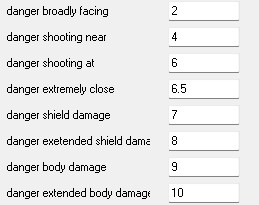
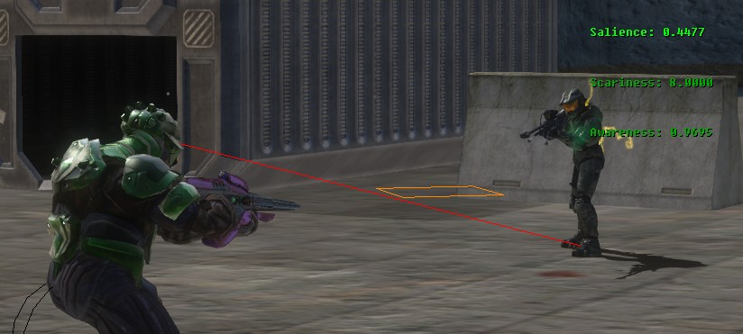

In the Halo franchise, AI units have been referred to as [actors (H1)](~actor) or [characters (H3)](~character), this is intentional on Bungie's end as the AI are not just static units for the player to mow down, but instead active participants in the gameplay and story.

Each and every AI unit contains their own individual knowledge model of the world, they store information such as the 3 senses (visual, audio, touch) and almost never cheat, using this information they create their own view of the world and it's entities. They then use the world info to process decisions, such as who to shoot, where to move to to find a target, what's a good spot for cover against this specific target and so on and so forth, information is also handled by each AI in accordance with relevance.

In accordance with Bungie's design, AI are designed to accomendate the immediate short-term gameplay loop, able to move and shoot and act and emote to keep the player engaged for short periods of time with zero developer influence, however for longer periods of time the designers used systems to guide the AI to give the illusion of intelligence and further purpose. These systems would take the form of the AI orders systems in [Halo: Combat Evolved](~h1) and [Halo 2](~h2), and the [objective](~objectives) system found in [Halo 3](~h3), [ODST](~h3odst) and [Halo: Reach](~hr).

# Behavior

AI in Halo 3 utilize 2 tags to function, the [character](~) tag and the [style](~) tag, these 2 tags are not-optional. The Style tag represents the toggle for each individual behavior itself within the code, allowing the user to choose what behaviors the AI the AI is allowed to do, such as covering, berserking, grenading, using equipement, cloaking and many more behaviors.

Style tags are assigned in the character tag, think of the character tag as the brain for the AI itself, defining values on how to interpret behaviors, such as "When should I cover?" and "How long should I cover" compared to the style tag which is just "Am I allowed to use cover behavior at all?".

Because of this setup, you can create distinct and unique behavior sets for all types of units, for example: brutes in vanilla have the retreat behavior disabled in the their style tag.

AI also feature "acting" behavior, this allows the level designer to specify the AI to perform animation loops that are purely cosmetic, such as eating or peeing, AI will also sometimes play a reload animation when they hide behind cover.

# Vocalization

AI in halo have the ability to vocalize and emote based on actions performed, via the [ai_dialogue_globals](~) tag and it's assosiated source files you can assign certain animations or voice lines to play based on AI actions, such as calling and throwing a grenade, reporting a fallen ally, announcing the entrance of the arbiter and raising your fist in anger, ect ect.

# Perception

AI in Halo, outside of scripting and specific task flags, do not have the ability to see through walls, they must be able to actually see their targets or hear them, AI hearing and visual specifics are set in the [character](~) tag as well as in [projectile](~) and [weapon](~) weapon tags for firing and detonation/impact sound levels.

Sound levels in as defined by tags like [weapons](~weapon) and [projectiles](~projectile) act as a sort of bounds that fall within the hearing distance value in the [character](~) tag, for example an AI with a hearing range of 20 WU will hear a "medium" sound at ~9 WU, but if the hearing range was increased to 40 WU, the AI would instead be able to hear a "medium" sound out to ~18 WU, this topic needs further research as results are not entirely 1 to 1 reproducable and factors such as the direction the AI is facing and their alertness may play a part.

AI sharing a squad will update squadmates about the location of hostiles, sometimes even without dialogue. Things that can/will cause a target location update:
- Seeing a target directly
- hearing a target fire a non-silent weapon
- hearing a projectile detonate (like grenades), this can sometimes be traced back to the target who threw them with the _[sense_target](~style)_ flag, otherwise update target to the detonation point of the projectile itself
- An ally shoots at a target, even if we have no line of sight on this target
- Taking damage, even if we have no line of sight from who did the damage to us, unless it's a grenade; that requires _[sense_target](~style)_, this is not limited to squads or tasks
- An ally taking damage within hearing distance, including death.
- Entering search mode
- Prediction of target hiding can allow some updates based on predicting where the target may go when hiding, usually for only a few moments after losing contact when in search mode, requires _[sense_target](~style)_

AI also have the ability to track multiple items or targets at once, it appears the limits are as follows:
- Each task can track up to 20 props at once
- Each AI unit can track up to 20 props at once
- Each AI unit can track up to 4 targets at once

Props appear to consist of vehicles, units, grenades and projectiles. Say you had an encounter with 2 dummy bipeds and 2 empty turrets, and then you spawned in two squads of two units each, each in a different task, then you would end up with 8 props, 16 prop references and 8 target tracks.

# Leadership

Within an AI squad, the game will attempt to assign a leader unit, this is determined by the AI with the highest leadership value, this value is assigned in the [character](~) tag.

If multiple AI share the highest leadership value and there are subordinates in the squad then the highest treat each other as *peers*, if a squad lacks any leaders due to all AI sharing the same leadership value, then no leadership will be available for that squad. Leadership is filled at the squad level and the task level, if two squads enter the same task they will default to the highest ranking unit among both squads.

# Navigation

AI use a level-specific navmesh to move around the environment, this is set up via the tab in sapien to "generate all pathfinding data" based on your [pathfinding](~) setup, various hints and obstacles are dynamic and AI will attempt navigation to reach their destination or target, if an AI does not have pathfinding it will have a yellow triangle over their head.

# Danger and scariness

Scariness is calculated by taking the scare value of the AI's biped and adding the scariness of the weapon they are holding, and then comparing it against their targets biped/character and their held weapon. 

Should the resulting scariness favor the other party by a specified value in the [character](~) tag then certain AI behaviors may be triggered, such as fleeing for grunts or other behaviors like covering. 

Danger is a set of values defined in the [globals](~) with preset actions that return a value, the AI can then use these values to determine actions such as fleeing, covering or evading.

AI will not register a danger value increase from silently fired projectiles, even if they are modeled and passing less than a WU away, the AI will only register increased danger if they hear the projectile being fired.

# Combat status and alertness

AI in Halo 3 have levels of status that determine their action set and what they are currently doing or are going to do, we call these combat status' and there are 9 levels.

AI set to the player team will never fall below combat status 3, otherwise the lowest possible is determined by the global AI style tags for bunkering, assaulting and normal, these 3 styles are applied per task in [AI objectves](~objectives#tasks).

| Status | Description
|-------|----------
| 0 | Braindead, asleep
| 1 | idle
| 2 | Active but not in combat
| 3 | Active but no current targets (as far as the AI knows)
| 4 | Searching for a target, AI is in search behavior and will search last known position of a target
| 5 | Location of enemy known (unsure about this versus 6, also may apply if allies know where the enemy is but not this unit)
| 6 | Location of enemy certain, usually the first status an AI drops to when they lose line-of-sight on a target, will quickly decay and drop to status 4
| 7 | Direct line-of-sight on a target
| 8 | Target has direct line-of-sight on this AI (and the AI is aware of the target) and/or AI is within 12 world units of the target
| 9 | This AI is taking fire from a target or is within 2 world units to the target

# Organization

AI are spawned in as part of a squad, which is then composed of fireteams, each fireteam itself is composed of indivudal starting positions for each AI in it. Squads can then be organized into squad groups for the purposes of objective/script management, however sqauds themselves are the main entity used in gameplay and within scripting and objective purposes.

# Combat

When an AI enters combat their reaction time and if they can fire their weapon at this range is determined value values in the [character](~) tag, should the AI perform a dodge, be stunned, hard pinged or engage in a movement hint of some type, their accuracy bounds and firing pattern will be reset to their initial values. 

Based on certain scenarios the AI can engage in many behaviors to aide them in battle and appearing lifelike, this can include action such as a drawn out wide-spanning search for a hidden target, lobbing a grenade at cover where an enemy is suspected, suppressing fire on cover where a target was just seen entering, shooting dead bodies, checking on dead allies and giving each other orders (such as throwing grenades or starting a search with the ordered AI). 

An AI without a valid [objective and/or valid task](~objectives) or a set default [zone](~pathfinding#zones) will have a green triangle over their head.

# Limitations

AI cannot move while throwing grenades, but they can throw a grenade and then initiate a leap and finish throwing the grenade while airborne. 

AI cannot see through transparent materials, like glass or shield walls.

AI do not consume ammo, thus will never need to reload magazine based weapons, however they can overheat weapons using heat and weapons that drain battery while an overcharge is held will drain for AI and eventually leave the AI with a useless weapon.

AI cannot melee while moving, outside of the movement the animation itself provides.

AI cannot shoot or melee while jumping (jumppack brute leaps are a type of jump).

Information such as location of enemies is not passed between squads, even if they are right next to each other, however that information will be passed along if the squads share a task together.

AI under normal circumstances do not use the melee damage assigned in [weapon](~) tags, instead they use the melee [damage](~damage_effect) assigned in the AI's [biped](~)